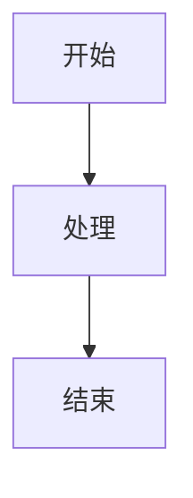
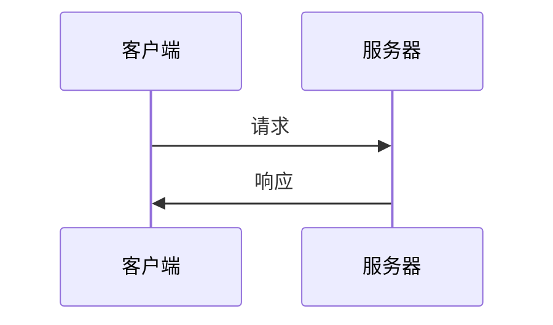
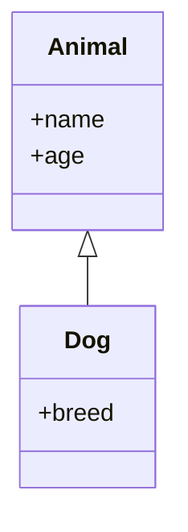

# AI 个人笔记站点

这是一个基于 Node.js 构建的静态博客系统，支持 Markdown 转 HTML，使用 Pandoc 工具实现本地博客静态预览。所有内容均由 AI 协助生成，包含各种技术主题的深度解析文档。

## 📖 目录
- [项目特点](#-项目特点)
- [项目结构](#-项目结构)
- [快速开始](#-快速开始)
- [技术实现](#-技术实现)
- [Pandoc 安装与使用](#-pandoc-安装与使用)
- [Markdown 格式规范](#-markdown-格式规范)
- [部署方式](#-部署方式)
- [重要提醒](#️-重要提醒)

## 🌟 项目特点

- **静态博客生成器**：完全静态化，无需服务器支持
- **Markdown 支持**：轻松将 Markdown 文档转换为精美的 HTML 页面
- **Pandoc 驱动**：使用 Pandoc 工具进行 Markdown 转换，功能更强大
- **零依赖部署**：不依赖任何第三方服务，可直接在本地浏览器中预览
- **响应式设计**：适配各种设备屏幕尺寸
- **搜索功能**：内置实时搜索，快速定位技术笔记
- **分页浏览**：支持文章分页，提升浏览体验
- **SEO 友好**：自动生成 sitemap.xml，便于搜索引擎收录
- **时间归档**：按时间顺序组织和展示所有文章
- **目录导航**：Markdown 文章自动生成侧边目录大纲
- **宽屏适配**：Markdown 生成的文章页面采用宽屏设计，提升阅读体验

## 📁 项目结构

```
.
├── index.html          # 站点主页（信息流布局）
├── overview.html       # 文章概览页面
├── markdown/           # Markdown 源文件（按月份组织）
│   ├── 2025-08/        # 2025年8月文档
│   ├── 2025-09/        # 2025年9月文档
│   └── ...             # 其他月份
├── docs/               # 生成的 HTML 文档（网站展示用）
│   ├── 2025-08/        # 2025年8月生成的HTML
│   ├── 2025-09/        # 2025年9月生成的HTML
│   └── ...             # 其他月份
├── html/               # 原始 HTML 文档
├── img/                # 图片资源
├── src/                # 构建脚本目录
│   ├── generate_index_with_dates.js  # 主页生成脚本
│   ├── generate_overview.js          # 概览页生成脚本
│   ├── generate_sitemap.js           # Sitemap生成脚本
│   ├── convert_md_to_html_pandoc.js  # Markdown转HTML脚本
│   ├── convert_html_to_md.js         # HTML转Markdown脚本
│   ├── new_markdown.js               # 创建新Markdown文章脚本
│   ├── new_html.js                   # 创建新HTML文章脚本
│   └── ...                           # 其他辅助脚本
```

## 🚀 快速开始

### 编辑文档
1. 在 `markdown/YYYY-MM/` 目录下创建或编辑 `.md` 文件
2. 运行构建命令：`npm run build`
3. 打开 `index.html` 查看更新结果

### 构建命令
```bash
# 完整构建（推荐）
npm run build

# 或者分步执行
npm run convert-md-pandoc  # 使用 Pandoc 将 Markdown 转换为 HTML
npm run generate-index     # 生成主页索引
npm run generate-all       # 生成所有页面（主页+概览页+sitemap）

# 创建新文章
npm run new-md "文章标题"   # 创建新的 Markdown 文章
npm run new-html "文章标题" # 创建新的 HTML 文章
```

## 🛠 技术实现

本项目采用纯前端技术栈实现，通过 Node.js 脚本处理文档生成和页面构建：

1. **文档处理**：
   - Markdown 文件按月份分类存储在 `markdown/` 目录
   - 通过 Pandoc 工具将 Markdown 文件转换为 HTML，存储在 `docs/` 目录
   - HTML 文件保留原始格式，直接展示在站点中

2. **页面生成**：
   - `generate_index_with_dates.js`：生成主页，包含所有文章的摘要和分类
   - `generate_overview.js`：生成按时间排序的文章概览页面
   - `generate_sitemap.js`：生成搜索引擎友好的 sitemap.xml 文件

3. **文章创建**：
   - `new_markdown.js`：创建新的 Markdown 文章，自动按年月分类
   - `new_html.js`：创建新的 HTML 文章

4. **前端特性**：
   - 响应式设计，适配移动端和桌面端
   - 实时搜索功能，支持标题和内容搜索
   - 分页浏览，每页显示15篇文章
   - 返回顶部按钮，提升用户体验
   - 文章分类标识（Markdown 文档/HTML 文档）

## 📦 Pandoc 安装与使用

本项目使用 Pandoc 进行 Markdown 到 HTML 的转换，相比传统的 JavaScript 库，Pandoc 提供了更强大和标准的 Markdown 解析功能。

### 安装 Pandoc

#### Windows
1. 访问 [Pandoc 官方下载页面](https://pandoc.org/installing.html)
2. 下载 Windows 版本的安装包
3. 运行安装程序，按照提示完成安装
4. 将 Pandoc 添加到系统 PATH 环境变量中

#### macOS
使用 Homebrew 安装：
```bash
brew install pandoc
```

#### Linux (Ubuntu/Debian)
```bash
sudo apt-get install pandoc
```

### 验证安装
安装完成后，在命令行中运行以下命令验证：
```bash
pandoc --version
```

如果显示版本信息，说明安装成功。

### Pandoc 在本项目中的使用
本项目通过 `convert_md_to_html_pandoc.js` 脚本调用 Pandoc 命令行工具：
```bash
pandoc "markdown_file.md" -f markdown -t html --mathjax --highlight-style=tango
```

该命令将 Markdown 文件转换为 HTML，并支持数学公式和代码高亮。

## 📝 Markdown 格式规范

```markdown
# 文档标题

文档内容...

## 章节标题

- 列表项1
- 列表项2

代码示例：
```python
def hello():
    print("Hello, World!")
```

| 表头1 | 表头2 |
|-------|-------|
| 内容1 | 内容2 |

## Mermaid 图表支持

本项目支持使用 Mermaid 语法创建各种图表：

### 流程图


### 序列图


### 类图

```

## 🌐 部署方式

这是一个纯静态网站，可以部署到任何支持静态文件托管的服务：
- GitHub Pages
- Netlify
- Vercel
- 本地文件系统直接打开

只需上传整个项目目录即可，无需额外配置。

## ⚠️ 重要提醒

本项目中的技术内容大多由 AI 协助生成，准确性未经严格验证，仅供参考学习使用。在实际项目中应用时，请务必进行充分验证。