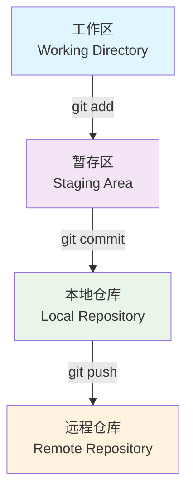

# Git 深度报告：从入门到协同开发的完全指南

---

#### **Git 三大核心区域概念图**



## 目录
1. [什么是 Git？为什么它如此重要？](#一什么是-git为什么它如此重要)
2. [核心概念：理解 Git 的三大区域](#二核心概念理解-git-的三大区域)
3. [单人开发工作流：从零开始](#三单人开发工作流从零开始)
4. [远程仓库与协作基础](#四远程仓库与协作基础)
5. [分支管理：Git 的精髓](#五分支管理git-的精髓)
6. [多人协同高级工作流](#六多人协同高级工作流)
7. [代码回滚：Git 的“后悔药”](#七代码回滚git-的后悔药)
8. [高级配置与 `.gitignore`](#八高级配置与-gitignore)
9. [资深开发者进阶技巧](#九资深开发者进阶技巧)
10. [总结](#十总结)

---

## 一、什么是 Git？为什么它如此重要？

**Git** 是一个开源的**分布式版本控制系统 (Distributed Version Control System, DVCS)**。由 Linus Torvalds（Linux 内核的创建者）于 2005 年开发，旨在高效、快速地处理从小型到非常大的项目版本管理。

**用途与重要性：**
- **版本控制：** 记录文件和项目的每一次变更。你可以随时查看历史记录，回退到任何一个历史版本。
- **协同工作：** 是现代软件开发团队协作的基石。允许多人同时在同一个项目上工作，而不会互相干扰。
- **数据安全：** 分布式特性意味着每个开发者的电脑上都有一个完整的项目仓库备份。即使中央服务器损坏，项目也不会丢失。
- **强大的分支能力：** 鼓励开发者创建分支来开发新功能或修复 Bug，完成后再安全地合并回主线，极大地提高了开发效率和代码质量。

## 二、核心概念：理解 Git 的三大区域

要精通 Git，必须理解这三个核心区域，它们是所有操作的基础：

1.  **工作区 (Working Directory)：** 你在电脑上能看到的项目目录，是你直接编辑和修改文件的地方。
2.  **暂存区 (Staging Area / Index)：** 一个特殊的文件，它保存了下次将要提交的文件列表信息。可以把它想象成一个“购物车”，你把工作区里修改好的商品（文件）放进去，准备一次性结账（提交）。
3.  **本地仓库 (Local Repository)：** 位于你的电脑上，存放了项目所有版本历史记录的地方。当你执行 `git commit` 时，暂存区的内容就会被永久快照到这里。


---

## 三、单人开发工作流：从零开始

### 1. 初始化与配置

#### 初始化一个新仓库
在你项目的根目录下执行：
```bash
git init
```
这会创建一个名为 `.git` 的隐藏子目录，即你的本地仓库。

#### 配置提交人信息
首次使用 Git 必须配置你的身份，这个信息会附加到你的每一次提交上。
```bash
# 配置全局用户名
git config --global user.name "Your Name"

# 配置全局邮箱
git config --global user.email "your_email@example.com"
```

### 2. 基础三部曲：`add` 与 `commit`

这是 Git 最核心的操作循环。

1.  **在工作区修改文件。**

2.  **将修改的文件添加到暂存区 (`add`)**
    ```bash
    # 添加单个文件
    git add <文件名>

    # 添加所有已修改和新创建的文件
    git add .
    ```

3.  **将暂存区的内容提交到本地仓库 (`commit`)**
    ```bash
    git commit -m "这里是本次提交的描述信息"
    ```
    `-m` 参数允许你直接在命令行提供提交信息。没有 `-m` 会打开一个文本编辑器让你输入。

### 3. 查看状态与历史

#### 查看仓库状态
```bash
git status
```
这是最常用的命令，它会告诉你哪些文件被修改了、哪些在暂存区、哪些还没有被 Git 追踪。

#### 查看提交历史
```bash
# 查看详细历史
git log

# 查看简化的单行历史
git log --oneline

# 查看带分支图形的历史
git log --graph --oneline --all
```

---

## 四、远程仓库与协作基础

### 1. 本地仓库 vs 远程仓库
- **本地仓库 (Local Repository)：** 就是你电脑上的 `.git` 目录。
- **远程仓库 (Remote Repository)：** 托管在网络服务器上的项目仓库，例如 GitHub、GitLab 或 Gitee。它是团队成员共享代码和同步进度的中心。

### 2. 关联远程仓库
假设你已经在 GitHub 上创建了一个空仓库。
```bash
# 添加一个名为 origin 的远程仓库（origin 是一个通用的别名）
git remote add origin <远程仓库的URL>
```
URL 可能是 HTTPS 或 SSH 格式，如 `https://github.com/user/repo.git`。

### 3. 推送与拉取

#### 推送 (Push)
将本地仓库的提交推送到远程仓库。
```bash
# 将 main 分支推送到 origin 远程仓库
git push origin main
```
`-u` 参数可以建立本地分支与远程分支的关联，后续推送可以直接使用 `git push`。
```bash
git push -u origin main
```

#### 拉取 (Pull)
从远程仓库获取最新版本并与本地分支合并。
```bash
git pull origin main
```
> [!NOTE]
> **`git pull` 的本质** 其实是两个命令的组合：
> 1. `git fetch`: 从远程仓库下载最新的历史记录，但**不**与你本地的代码合并。
> 2. `git merge`: 将 `fetch` 下来的远程分支合并到你当前的本地分支。

---

## 五、分支管理：Git 的精髓

### 1. 为什么需要分支？
分支允许你在一个独立的环境中开发新功能或修复问题，而不会影响到主分支（通常是 `main` 或 `master`）的稳定性。开发完成后，再将分支合并回去。

### 2. 创建与切换分支

```bash
# 查看所有本地分支
git branch

# 创建一个名为 feature-login 的新分支
git branch feature-login

# 切换到新分支
git switch feature-login
# 或者使用旧命令: git checkout feature-login

# 创建并立即切换到新分支（常用）
git switch -c new-feature
# 或者使用旧命令: git checkout -b new-feature
```

### 3. 合并分支
当你完成了 `feature-login` 分支的开发，需要将其合并回 `main` 分支。

1.  首先，切换回 `main` 分支。
    ```bash
    git switch main
    ```
2.  执行合并命令。
    ```bash
    git merge feature-login
    ```

### 4. 追踪远程分支
当你 `push` 一个新分支到远程时，或需要与同事在同一个远程分支上工作时，需要建立本地分支与远程分支的追踪关系。

```bash
# 在推送时建立追踪关系
git push -u origin my-feature

# 为一个已存在的本地分支设置上游（远程）分支
git branch --set-upstream-to=origin/feature-branch my-local-branch
```
设置后，使用 `git pull` 和 `git push` 时就无需指定远程仓库和分支名。

---

## 六、多人协同高级工作流

### 1. 协同开发分支策略
一个常见且稳健的策略是 **Git Flow** 的简化版：
- `main` 分支：永远保持稳定、可随时发布的状态。只接受来自 `develop` 或 `hotfix` 分支的合并。
- `develop` 分支：开发主干。所有新功能分支都从这里创建。
- `feature/*` 分支：用于开发新功能。例如 `feature/user-auth`。开发完成后合并回 `develop`。
- `release/*` 分支：准备发布新版本时，从 `develop` 创建。用于测试和修复小问题。
- `hotfix/*` 分支：线上版本出现紧急 Bug 时，从 `main` 创建。修复后同时合并回 `main` 和 `develop`。

### 2. 精准操作：挑选提交 (Cherry-pick)
如果你只想将另一个分支的**某一个或几个特定提交**合并到当前分支，而不是整个分支，可以使用 `cherry-pick`。

```bash
# 假设你在 main 分支，想从 develop 分支挑选一个 commit
# 首先获取那个 commit 的哈希值（例如 a1b2c3d）
git cherry-pick a1b2c3d
```

### 3. GitHub 流程：Fork, Fetch, Pull Request (PR)

这是参与开源项目或大型企业项目的标准流程。

1.  **Fork**：
    在 GitHub 页面上，点击 "Fork" 按钮。这会在你自己的 GitHub 账户下创建一个项目的完整副本。

2.  **Clone**：
    将**你 Fork 的仓库**克隆到本地。
    ```bash
    git clone https://github.com/your-username/project.git
    ```

3.  **关联上游仓库 (Upstream)**：
    为了能同步原仓库的更新，需要添加它为一个新的远程仓库，通常命名为 `upstream`。
    ```bash
    git remote add upstream https://github.com/original-owner/project.git
    ```

4.  **Fetch & Sync**：
    在开始开发新功能前，先从 `upstream` 获取最新代码并同步到你的本地 `main` 分支。
    ```bash
    git fetch upstream
    git switch main
    git merge upstream/main
    ```

5.  **创建功能分支并开发**：
    ```bash
    git switch -c my-new-feature
    # ... 进行代码修改、add、commit ...
    ```

6.  **Push 到你自己的 Fork 仓库**：
    ```bash
    git push -u origin my-new-feature
    ```

7.  **创建 Pull Request (PR)**：
    回到你 Fork 的 GitHub 仓库页面，你会看到一个提示，点击 "Compare & pull request"。填写说明，描述你的修改，然后提交 PR。项目维护者会审查你的代码，如果没问题就会合并到原项目中。

---

## 七、代码回滚：Git 的“后悔药”

### 1. 撤销工作区/暂存区的修改

#### 撤销工作区的修改
如果你修改了一个文件但还没 `add`，想撤销所有修改：
```bash
# 撤销单个文件的修改
git restore <文件名>
```

#### 从暂存区撤回到工作区 (Unstage)
如果你 `git add` 了一个文件，但后来发现加错了，想把它从暂存区拿出来：
```bash
git restore --staged <文件名>
```

### 2. 撤销提交 (`reset` vs. `revert`)

#### 撤回上次提交 (保留修改)
如果你刚刚的 `commit` 有问题，想撤销它，但保留代码修改在工作区。
```bash
git reset --soft HEAD~1
```
`HEAD~1` 表示倒数第一个提交。现在你的代码还在，可以修改后重新 `commit`。

#### 回退到指定提交
> [!WARNING]
> `git reset` 会改写历史。如果提交已经被推送到远程，**强烈不推荐**使用 `git reset`，因为它会给其他协作者带来麻烦。

-   `git reset --hard <commit-hash>`：**危险！** 彻底回退到指定版本，该版本之后的所有提交和代码修改都会丢失。
-   `git revert <commit-hash>`：**安全！** 创建一个**新的提交**，其内容与你想要撤销的提交**完全相反**。它不改写历史，只是在历史的顶端追加一次“反向操作”，是团队协作中推荐的回滚方式。

---

## 八、高级配置与 `.gitignore`

### 1. `.gitignore`：忽略文件
在项目根目录创建一个名为 `.gitignore` 的文件，列出你不想让 Git 追踪的文件或目录模式。

**示例 `.gitignore` 文件：**
```
# 忽略所有 .log 文件
*.log

# 忽略 node_modules 目录
/node_modules/

# 忽略 IDE 配置文件
.idea/
.vscode/

# 忽略编译产物
/dist/
/build/
```

### 2. 处理已追踪的文件

#### 将已 add 的文件移出暂存区并忽略
```bash
# 1. 从暂存区移除，但保留在工作区
git rm --cached <文件名>

# 2. 将文件名添加到 .gitignore 文件中
echo "<文件名>" >> .gitignore

# 3. 提交 .gitignore 的变更
git add .gitignore
git commit -m "Ignore <文件名>"
```

#### 将已 push 的文件从 Git 删除，但本地保留
如果你不小心把一个敏感文件（如配置文件）推送到了远程，需要从 Git 历史中移除它，但保留本地文件。
```bash
# 1. 从 Git 仓库中删除该文件（本地文件会保留）
git rm --cached path/to/your/file.conf

# 2. 将该文件路径添加到 .gitignore
echo "path/to/your/file.conf" >> .gitignore

# 3. 提交这次删除和忽略的操作
git commit -m "Remove sensitive file from tracking"

# 4. 推送到远程
git push origin main
```
> [!IMPORTANT]
> 这只是从未来的提交中移除了该文件。如果需要从**整个 Git 历史**中彻底清除敏感信息，需要使用 `git filter-branch` 或 `BFG Repo-Cleaner` 等更高级的工具。

### 3. 全局配置

#### 忽略文件大小写
在 Windows 和 macOS 上，文件名默认不区分大小写，这可能导致问题。建议设置为 `false`。
```bash
git config --global core.ignorecase false
```

#### 处理换行符 (CRLF)
为了避免 Windows (`CRLF`) 和 Linux/macOS (`LF`) 之间的换行符问题，推荐配置：
```bash
# Windows 用户
git config --global core.autocrlf true
# Linux/macOS 用户
git config --global core.autocrlf input
```

#### 文件大小限制
Git 本身不适合管理大文件（如视频、设计稿）。对于这种情况，应该使用 **Git Large File Storage (LFS)**。
1.  安装 `git-lfs`。
2.  在仓库中启用 LFS 并指定要追踪的大文件类型：
    ```bash
    git lfs install
    git lfs track "*.psd"
    git add .gitattributes
    ```

---

## 九、资深开发者进阶技巧

### 1. `git rebase`：变基 - 更整洁的历史线
`rebase` 是 `merge` 的替代方案。它会将你的分支上的提交**一个个地应用**到目标分支的最新提交之上，形成一条**线性的提交历史**，非常整洁。

```bash
# 假设你在 feature 分支，想把它 rebase 到 main
git switch feature
git rebase main
```
> [!WARNING]
> **黄金法则：** 永远不要对已经推送到公共远程仓库的分支执行 `rebase`，因为它会改写历史。

**交互式变基 (`git rebase -i`)** 是一个神器，可以用来：
- 合并多个提交 (squash)
- 修改提交信息 (reword)
- 删除某个提交 (drop)
- 调整提交顺序

### 2. `git stash`：临时储藏工作
当你正在开发一个功能，突然需要切换到另一个分支修复紧急 Bug，但又不想提交当前未完成的工作时，`stash` 就派上用场了。
```bash
# 保存当前工作区和暂存区的修改
git stash

# ... 切换分支修复 Bug，然后切回来 ...

# 恢复之前储藏的工作
git stash pop
```

### 3. `git tag`：里程碑与版本发布
当项目达到一个重要阶段（如发布 `v1.0`），你可以打一个标签来标记这个里程碑。
```bash
# 创建一个轻量标签
git tag v1.0

# 创建一个带附注的标签（推荐）
git tag -a v1.0 -m "Release version 1.0"

# 将标签推送到远程仓库
git push origin --tags
```

### 4. `git diff`：精准比较差异
- `git diff`: 查看**工作区**和**暂存区**的差异。
- `git diff --staged`: 查看**暂存区**和**本地仓库 (最新提交)** 的差异。
- `git diff <分支1> <分支2>`: 查看两个分支之间的差异。

---

## 十、总结
Git 功能强大且深邃，但掌握了以上核心概念和命令，你就能自信地应对绝大多数个人开发和团队协作场景。关键在于理解其设计哲学——特别是三大区域和分支模型——并不断在实践中应用。记住，几乎所有操作都是可恢复的，大胆地去使用它吧！


---

### 补充章节：高级标签操作 - 覆盖远程标签

当你打了一个标签并推送到远程后，发现这个标签打错了提交点（例如，本应打在最新的 `commit` 上，却打在了前一个 `commit`），你需要移动这个标签。这个过程本质上就是**覆盖远程标签**。

#### 推荐的操作步骤（安全第一）

这种方法分步进行，逻辑清晰，是团队协作中的首选，因为它能减少其他成员的困惑。

**第一步：在本地更新（移动）标签**

首先，你需要删除本地的旧标签，然后在正确的提交点上重新创建它。

```bash
# 1. 删除本地的旧标签（例如 v1.0）
git tag -d v1.0

# 2. 确保你当前在最新的提交上（如果不是，先 git switch 到对应分支）
#    然后，在当前最新的提交 (HEAD) 上重新创建同名标签
git tag v1.0
```

**第二步：删除远程仓库的标签**

直接推送无法覆盖远程标签，你需要先显式地删除远程的同名标签。

```bash
# 使用 --delete 参数删除远程 origin 上的 v1.0 标签
git push --delete origin v1.0
```
执行后，远程仓库的 `v1.0` 标签就被删除了。

**第三步：推送更新后的本地标签**

现在远程没有这个标签了，你可以把本地更新过的正确标签推送上去。

```bash
# 推送新的 v1.0 标签到远程
git push origin v1.0
```

至此，你已经安全地完成了远程标签的覆盖。

---

#### 一种更直接（但风险更高）的方法：强制推送

Git 提供了一个 `--force` (或 `-f`) 选项，可以让你跳过删除远程标签的步骤，直接强制覆盖。

**第一步：同样是先在本地更新（移动）标签**

```bash
git tag -d v1.0
git tag v1.0
```

**第二步：使用 `--force` 强制推送标签**

```bash
# 使用 --force 选项强制推送，覆盖远程同名标签
git push origin v1.0 --force
```
或者使用更明确的 `refspec` 语法进行强制推送，效果相同：
```bash
git push origin refs/tags/v1.0 -f
```

这个命令会告诉远程服务器：“我知道远程已经有一个 `v1.0` 标签了，但我就是要用我本地的这个版本覆盖它。”

---

> [!WARNING]
> **⚠️ 极其重要的风险警告与团队协作最佳实践**
>
> **为什么强制覆盖远程标签是危险的？**
>
> 1.  **破坏不可变性原则**：标签的设计初衷是作为一个**永久性的、不可变的**指针，指向项目历史中的一个特定时刻（如一个版本发布）。移动标签违背了这个原则。
> 2.  **造成团队成员困惑**：如果你的同事已经拉取了旧的 `v1.0` 标签，他们的本地 `v1.0` 将指向一个与远程不同的提交。这会导致构建错误、部署错误，并且非常难以排查。
> 3.  **破坏 CI/CD 流程**：很多自动化构建和部署系统是基于 Git 标签触发的。一个被移动的标签可能会导致构建系统无法正确识别版本变更，或者重复构建。
>
> **最佳实践：**
>
> -   **优先选择创建新标签**：如果 `v1.0` 标签打错了，最好的做法不是移动它，而是创建一个新的、修正后的标签，例如 `v1.0.1`。这是语义化版本（Semantic Versioning）的标准做法，也是最安全、最清晰的方式。
> -   **仅在万不得已时移动标签**：只有在你**刚刚**推送了错误的标签，并且**确信还没有任何团队成员或自动化系统拉取**了这个标签时，才可以考虑移动它。
> -   **充分沟通**：如果你必须移动一个已被共享的标签，**必须**通知所有团队成员。并告知他们需要执行以下命令来同步你更改后的标签：
    ```bash
    # 从远程强制更新所有标签
    git pull origin --tags -f
    ```
    否则，他们的本地旧标签将不会自动更新。

**总结：** 虽然技术上可以覆盖远程标签，但在团队协作中，这通常被认为是一个不良实践。**除非情况特殊且已充分沟通，否则请坚持创建新的版本标签。**

---

### 补充章节：强制推送与本地同步远程

在日常开发中，我们可能会遇到需要强制推送覆盖远程分支或本地放弃所有提交与远程保持一致的情况。以下是相关操作方法：

#### 1. Git 强制推送覆盖远程分支

有时候我们需要用本地的提交历史强制覆盖远程分支，这通常在以下场景中使用：
- 本地执行了交互式变基（rebase -i）修改了提交历史
- 本地执行了提交重置（reset）回退了多个提交
- 需要用本地版本完全替换远程分支

```bash
# 强制推送当前分支到远程同名分支
git push --force origin <branch-name>

# 更安全的强制推送（如果远程分支有其他人推送的提交，则推送失败）
git push --force-with-lease origin <branch-name>
```

> [!WARNING]
> **强制推送的风险**
> 
> 1. **丢失他人工作**：如果其他开发者已经基于被覆盖的提交进行了开发，他们的工作可能会丢失
> 2. **破坏协作流程**：会改写远程分支的历史，影响团队其他成员
> 3. **引起冲突**：其他开发者下次推送时可能会遇到问题
> 
> **最佳实践：**
> - 仅在确保没有其他人在该分支上工作时使用
> - 优先使用 `--force-with-lease` 而不是 `--force`，它更安全
> - 在强制推送前与团队成员沟通
> - 主要用于个人功能分支，避免在主分支（如 main/master）上强制推送

#### 2. 本地放弃所有提交与远程保持一致

当你本地的提交历史与远程不一致，需要完全放弃本地所有更改并同步到远程最新状态时：

```bash
# 方法一：获取远程最新状态并重置本地分支
git fetch origin
git reset --hard origin/<branch-name>

# 方法二：拉取远程分支强制覆盖本地
git pull --force

# 方法三：如果本地有未提交的更改也需要丢弃
git clean -fd  # 删除未追踪的文件和目录
git fetch origin
git reset --hard origin/<branch-name>
```

> [!NOTE]
> **参数说明**
> 
> - `--hard`：重置工作区、暂存区和本地分支指针到指定状态
> - `--force`：强制执行，忽略一些安全检查
> - `git clean -fd`：
>   - `-f`：强制删除
>   - `-d`：删除目录