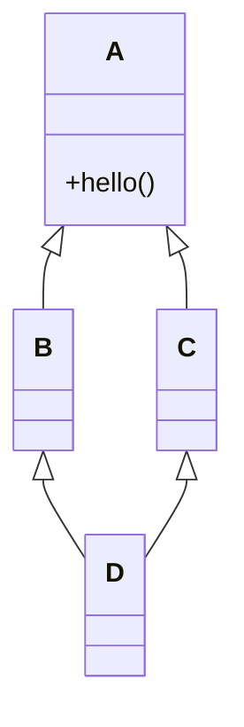
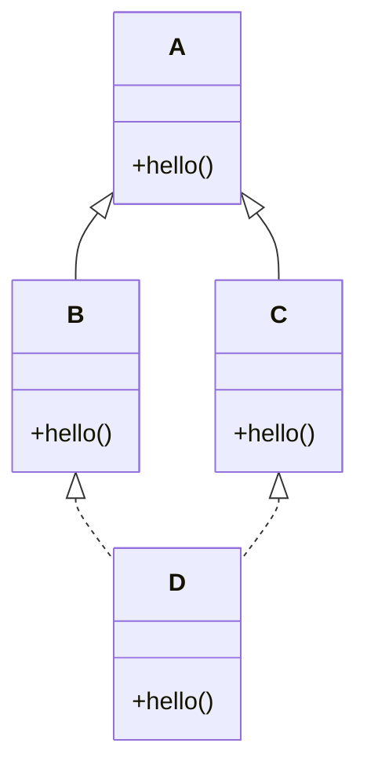
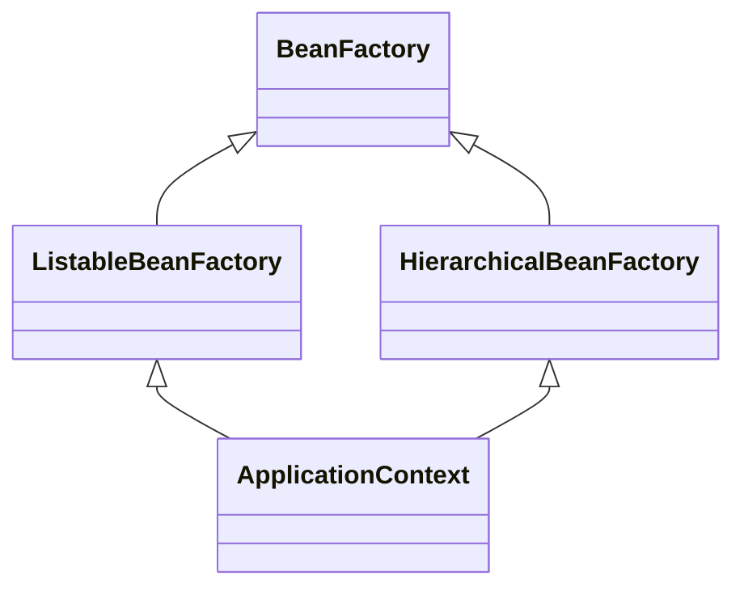

# 深度剖析：Java 中的多继承与菱形问题

> **摘要**：
> 在面向对象编程中，多继承常常带来二义性和复杂性，最典型的问题就是“菱形继承”。
> 本文将从 C++ 的多继承问题谈起，深入剖析 Java 为什么禁止类的多继承、接口如何优雅地支持多继承，并结合 Spring 框架中的 `ApplicationContext` 接口做实战分析。
> 读完后，你将彻底理解 Java 的继承设计哲学。

---

## 📑 目录

1. [继承与多继承的基本概念](#继承与多继承的基本概念)
2. [什么是菱形继承问题](#什么是菱形继承问题)
3. [Java 为什么禁止类的多继承](#java-为什么禁止类的多继承)
4. [接口的多继承与默认方法](#接口的多继承与默认方法)
5. [如何在 Java 中避免菱形问题](#如何在-java-中避免菱形问题)
6. [Spring 框架中的实战案例](#spring-框架中的实战案例)
7. [总结](#总结)
8. [延伸阅读](#延伸阅读)

---

## 继承与多继承的基本概念

* **继承**：一个类（子类）可以继承另一个类（父类）的属性和方法。
* **多继承**：一个类可以同时继承多个父类。

在 **C++** 中，多继承是允许的；而在 **Java** 中，类只允许单继承，但接口可以多继承。

---

## 什么是菱形继承问题

先看一个 **C++ 风格** 的例子：

```cpp
class A {
public:
    void hello() { cout << "Hello from A"; }
};

class B : public A {};
class C : public A {};
class D : public B, public C {};
```

继承关系示意图：



⚠️ 问题：

* `D` 通过 `B` 和 `C` 继承了 **两份 `A`**。
* 当调用 `D.hello()` 时，编译器不知道该调用哪一个 `A.hello()`。
* 这就是 **菱形继承问题（Diamond Problem）**：多继承带来的**二义性和重复继承**。

---

## Java 为什么禁止类的多继承

在 Java 中，**类只允许单继承**：

```java
class A {}
class B extends A {}
class C extends A {}

// class D extends B, C {} // ❌ 编译错误
```

这样，`D` 无法同时继承 `B` 和 `C`，避免了 C++ 中的菱形问题。

**Java 设计者的考虑**：

1. 避免二义性（简化语义）。
2. 减少复杂性（不用考虑多份父类拷贝）。
3. 保持代码清晰（推荐接口和组合）。

---

## 接口的多继承与默认方法

虽然类不能多继承，但 **接口可以多继承**。

### 示例代码

```java
interface A {
    default void hello() {
        System.out.println("Hello from A");
    }
}

interface B extends A {
    @Override
    default void hello() {
        System.out.println("Hello from B");
    }
}

interface C extends A {
    @Override
    default void hello() {
        System.out.println("Hello from C");
    }
}

class D implements B, C {
    @Override
    public void hello() {
        B.super.hello(); // 必须显式选择
    }
}
```

继承关系示意图：



👉 Java 要求 `D` **显式指定调用哪一个父接口的方法**，从而避免了菱形问题带来的二义性。

---

## 如何在 Java 中避免菱形问题

### 1. 接口 + 默认方法

通过 `default` 方法，让实现类来选择调用的父接口实现。

### 2. 组合优于继承

使用组合（has-a）代替继承（is-a）：

```java
class D {
    private B b = new B();
    private C c = new C();

    void helloFromB() { b.hello(); }
    void helloFromC() { c.hello(); }
}
```

### 3. 抽象类统一继承路径

使用抽象类来保证继承链的单一性，避免多份祖先类。

---

## Spring 框架中的实战案例

在 **Spring** 框架中，很多核心接口都体现了 Java 接口多继承的特性。
一个典型的例子就是 `ApplicationContext`：

```java
public interface ApplicationContext 
        extends EnvironmentCapable, 
                ListableBeanFactory, 
                HierarchicalBeanFactory, 
                MessageSource, 
                ApplicationEventPublisher, 
                ResourcePatternResolver {
    // ...
}
```

### 🧐 继承关系

* `ApplicationContext` 继承了 **6 个接口**。
* 其中，`ListableBeanFactory` 和 `HierarchicalBeanFactory` 都继承自 `BeanFactory`。
* 这就天然形成了 **菱形继承结构**。

可视化关系图：



### ⚡ 为什么不会有菱形问题？

因为在 **Java 接口继承** 的规则下：

1. 接口 **只定义方法签名**（以及 JDK8 之后的 `default` 方法）。
2. 如果多个父接口提供了相同的默认方法，**必须由实现类（如 `AnnotationConfigApplicationContext`）来显式解决冲突**。

因此，即使有菱形结构，Java 也能保证不会出现二义性。

---

## 总结

* **C++**：支持多继承，但容易出现菱形继承问题，需要虚拟继承来解决。
* **Java**：禁止类的多继承，避免了二义性。
* **接口**：允许多继承，但必须在实现类中解决冲突。
* **Spring 框架**：`ApplicationContext` 等核心接口就是典型的接口多继承案例，但通过 Java 规则避免了菱形问题。
* **开发实践**：推荐使用 **接口 + 组合**，保持继承体系清晰。

---

## 延伸阅读

* [Java 官方文档：接口（Interfaces）](https://docs.oracle.com/javase/tutorial/java/IandI/createinterface.html)
* 《Effective Java》第三版：第 18 条 —— 接口优于抽象类
* Spring Framework 源码：`ApplicationContext` 接口层级结构
* [C++ 菱形继承与虚拟继承](https://en.cppreference.com/w/cpp/language/derived_class)

---

📌 **一句话记忆**：

> Java 用 **类单继承 + 接口多继承** 的方式，巧妙避开了菱形陷阱，并在 Spring 等框架中得到了优雅的应用。

---
