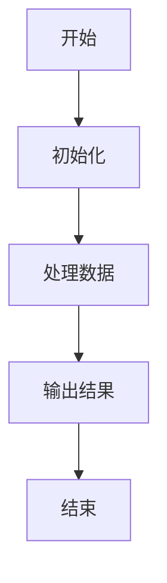
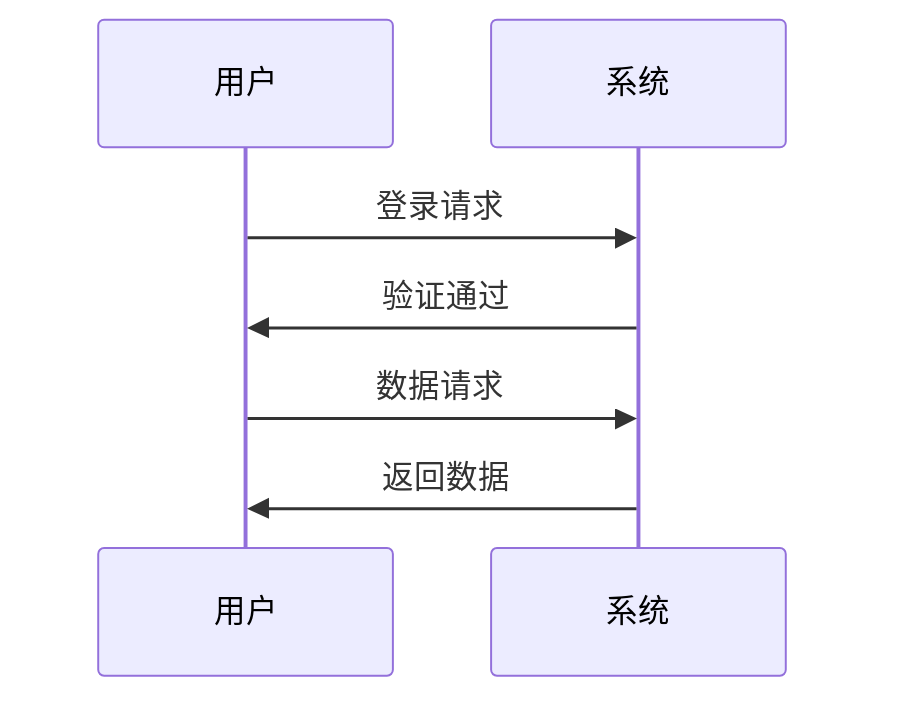
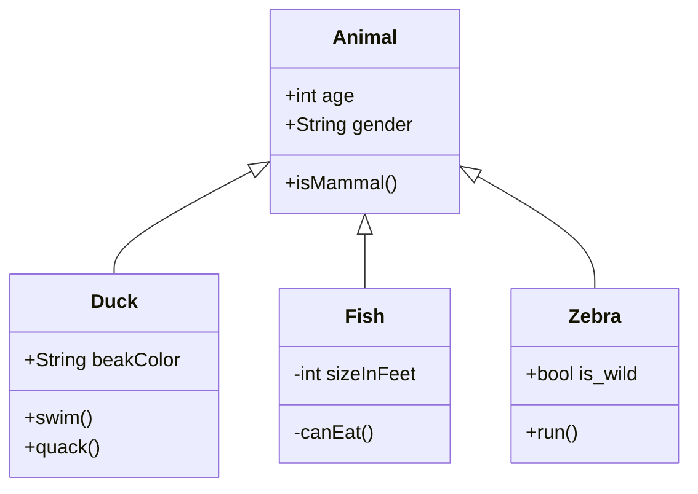
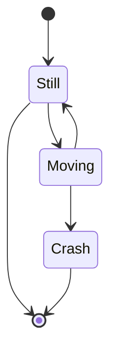
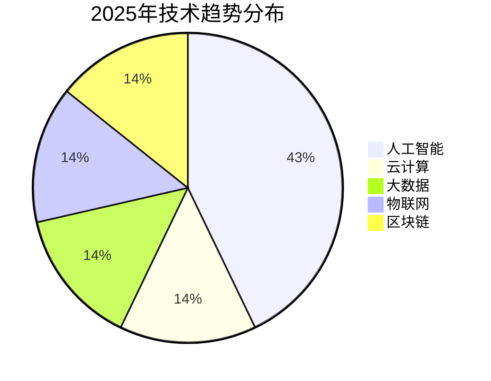
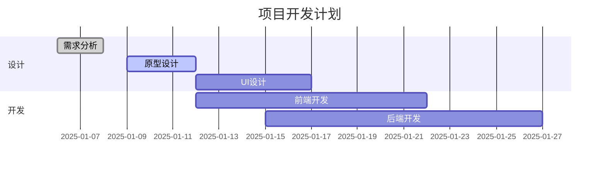
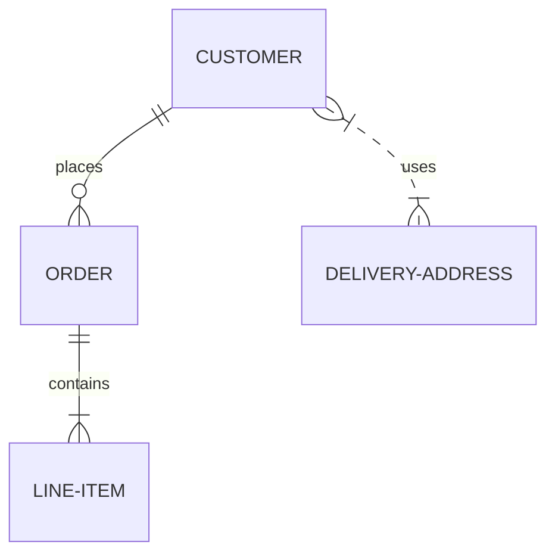
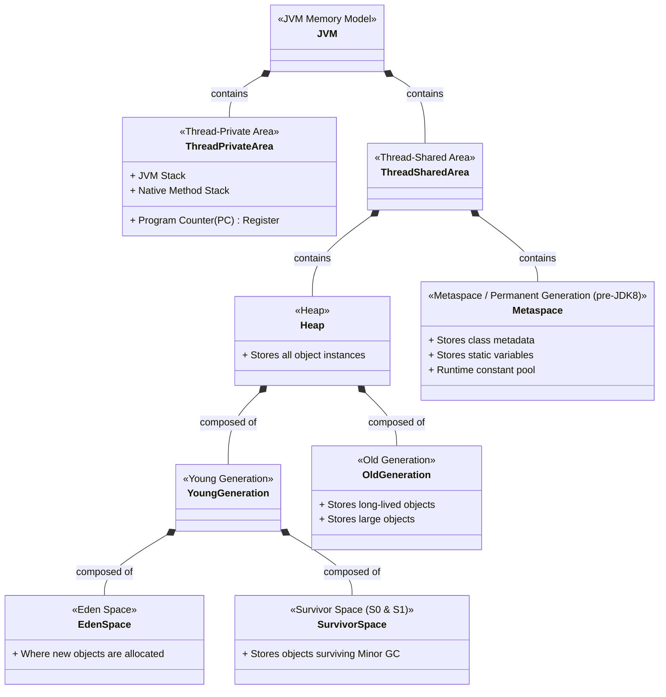
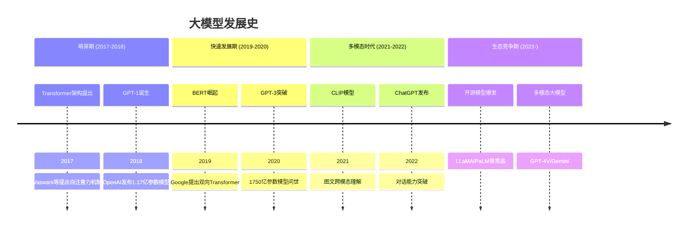

# Mermaid 图表测试

这是一个测试 Mermaid 图表功能的示例文档。

## 流程图示例

```mermaid
graph TD
    A[开始] --> B[初始化]
    B --> C[处理数据]
    C --> D[输出结果]
    D --> E[结束]
```

## 序列图示例

```mermaid
sequenceDiagram
    participant 用户
    participant 系统
    用户->>系统: 登录请求
    系统->>用户: 验证通过
    用户->>系统: 数据请求
    系统->>用户: 返回数据
```

## 类图示例

```mermaid
classDiagram
    Animal <|-- Duck
    Animal <|-- Fish
    Animal <|-- Zebra
    Animal : +int age
    Animal : +String gender
    Animal: +isMammal()
    
    class Duck{
        +String beakColor
        +swim()
        +quack()
    }
    
    class Fish{
        -int sizeInFeet
        -canEat()
    }
    
    class Zebra{
        +bool is_wild
        +run()
    }
```

## 状态图示例

```mermaid
stateDiagram-v2
    [*] --> Still
    Still --> [*]
    
    Still --> Moving
    Moving --> Still
    Moving --> Crash
    Crash --> [*]
```

## 饼图示例

```mermaid
pie title 2025年技术趋势分布
    "人工智能" : 42.86
    "云计算" : 14.29
    "大数据" : 14.29
    "物联网" : 14.29
    "区块链" : 14.29
```

## 甘特图示例

```mermaid
gantt
    title 项目开发计划
    dateFormat  YYYY-MM-DD
    section 设计
    需求分析           :done,    des1, 2025-01-06,2025-01-08
    原型设计           :active,  des2, 2025-01-09, 3d
    UI设计            :         des3, after des2, 5d
    section 开发
    前端开发           :2025-01-12, 10d
    后端开发           :2025-01-15, 12d
```

## 实体关系图示例

```mermaid
erDiagram
    CUSTOMER ||--o{ ORDER : places
    ORDER ||--|{ LINE-ITEM : contains
    CUSTOMER }|..|{ DELIVERY-ADDRESS : uses
```

## spring框架核心组件UML类图

```mermaid
classDiagram
    direction TB

    %% --- 顶层结构 ---
    class JVM {
        <<JVM Memory Model>>
    }

    class ThreadPrivateArea {
        <<Thread-Private Area>>
        + Program Counter (PC) Register
        + JVM Stack
        + Native Method Stack
    }

    class ThreadSharedArea {
        <<Thread-Shared Area>>
    }

    JVM *-- ThreadPrivateArea : contains
    JVM *-- ThreadSharedArea : contains

    %% --- 线程共享区分解 ---
    class Heap {
        <<Heap>>
        + Stores all object instances
    }

    class Metaspace {
        <<Metaspace / Permanent Generation (pre-JDK8)>>
        + Stores class metadata
        + Stores static variables
        + Runtime constant pool
    }

    ThreadSharedArea *-- Heap : contains
    ThreadSharedArea *-- Metaspace : contains

    %% --- 堆内存分解 ---
    class YoungGeneration {
        <<Young Generation>>
    }

    class OldGeneration {
        <<Old Generation>>
        + Stores long-lived objects
        + Stores large objects
    }

    Heap *-- YoungGeneration : composed of
    Heap *-- OldGeneration : composed of

    %% --- 年轻代分解 ---
    class EdenSpace {
        <<Eden Space>>
        + Where new objects are allocated
    }

    class SurvivorSpace {
        <<Survivor Space (S0 & S1)>>
        + Stores objects surviving Minor GC
    }

    YoungGeneration *-- EdenSpace : composed of
    YoungGeneration *-- SurvivorSpace : composed of
```

```mermaid
timeline
    title 大模型发展史
    section 萌芽期 (2017-2018)
        Transformer架构提出 : 2017: Vaswani等提出自注意力机制
        GPT-1诞生 : 2018: OpenAI发布1.17亿参数模型
    section 快速发展期 (2019-2020)
        BERT崛起 : 2019: Google提出双向Transformer
        GPT-3突破 : 2020: 1750亿参数模型问世
    section 多模态时代 (2021-2022)
        CLIP模型 : 2021: 图文跨模态理解
        ChatGPT发布 : 2022: 对话能力突破
    section 生态竞争期 (2023-)
        开源模型爆发 : LLaMA/PaLM等竞品
        多模态大模型 : GPT-4V/Gemini
```