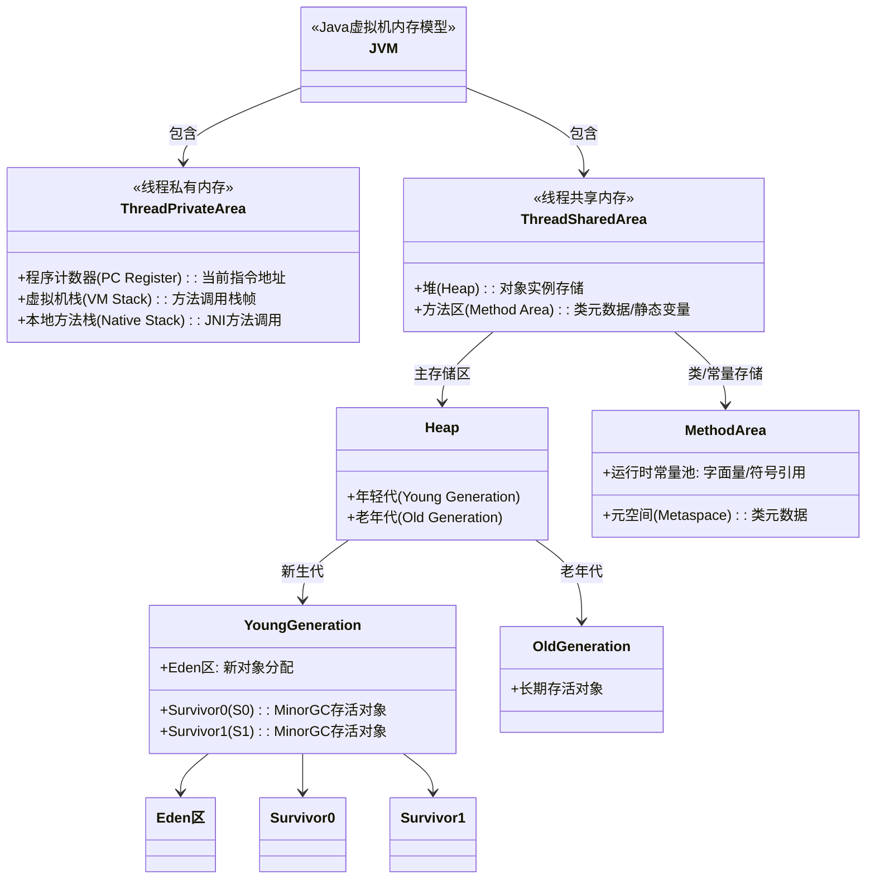

# 测试文档

这是一个测试文档，用于验证 Markdown 到 HTML 的转换功能。

## 功能特性

- 支持标题转换
- 支持列表
- 支持代码块
- 支持表格
- 支持引用

## 代码示例

```java
public class HelloWorld {
    public static void main(String[] args) {
        System.out.println("Hello, World!");
    }
}
```

## 表格示例

| 功能 | 状态 |
|------|------|
| 标题转换 | ✅ |
| 列表转换 | ✅ |
| 代码块 | ✅ |
| 表格 | ✅ |

> 这是一个引用块，用于显示重要信息。

更新时间: 2025年8月15日

## mermaid 示例

