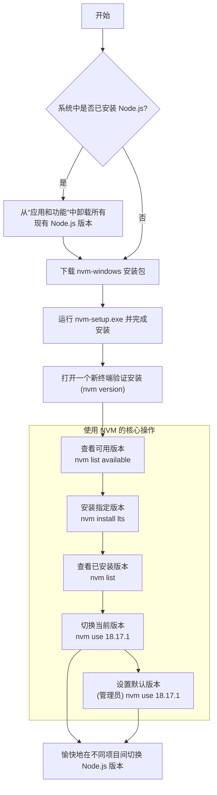

# 告别版本混乱：Windows 上使用 NVM 高效管理 Node.js 环境

作为一名前端或 Node.js 开发者，你是否遇到过这样的场景：项目 A 需要最新的 Node.js 20 LTS 版本，而一个旧项目 B 却必须在 Node.js 16 的环境下才能运行？手动卸载、重装不同版本的 Node.js 不仅效率低下，还容易因环境变量混乱而导致各种奇怪的错误。

幸运的是，我们有 NVM (Node Version Manager)。它允许你在同一台机器上轻松安装、切换和管理多个 Node.js 版本。本文将为你详细介绍 Windows 平台下的 `nvm-windows` 的安装和使用方法，让你彻底告别版本管理的烦恼。

### 核心流程一览

在开始之前，让我们通过一个流程图来快速了解整个过程：从环境准备到日常使用。



---

### 第一步：清理战场 —— 卸载现有的 Node.js

这是最重要也是最容易被忽略的一步。为了避免 `nvm-windows` 和系统中已有的 Node.js 发生冲突，我们必须在安装前将其彻底卸载。

1.  打开 Windows 的 **设置** → **应用** → **应用和功能**。
2.  在列表中搜索并找到 “Node.js”。
3.  点击它，选择 **卸载**，并根据提示完成卸载过程。
4.  **（可选但推荐）** 检查并删除用户目录下的 `npm` 和 `npm-cache` 文件夹，它们通常位于 `C:\Users\<你的用户名>\AppData\Roaming` 目录下。

确保环境干净是后续所有步骤顺利进行的前提。

### 第二步：下载与安装 nvm-windows

与 macOS/Linux 上的 NVM 不同，Windows 平台的 NVM 是一个由 Corey Butler 独立开发和维护的项目。

1.  **访问发布页面**：打开 `nvm-windows` 的官方 [GitHub Releases 页面](https://github.com/coreybutler/nvm-windows/releases)。
2.  **下载安装包**：在最新版本中，找到并下载 `nvm-setup.zip` 文件。
3.  **解压并安装**：
    *   解压下载的 `.zip` 文件。
    *   双击运行 `nvm-setup.exe`。
    *   安装向导会让你选择 NVM 的安装路径和 Node.js 的符号链接路径。**强烈建议保持默认设置**，除非你明确知道为什么要修改它们。一路点击“下一步”即可完成安装。

### 第三步：验证安装是否成功

安装程序会自动配置好环境变量。为了让这些变量生效，你需要**重新打开一个新的命令行终端**（如 PowerShell, CMD, 或 Windows Terminal）。

在新的终端窗口中，输入以下命令：

```
nvm version
```

如果屏幕上成功打印出了 `nvm-windows` 的版本号（例如 `1.1.11`），那么恭喜你，安装成功！如果提示命令未找到，请尝试重启电脑。

### 第四步：NVM 核心命令与日常使用

现在，你已经掌握了管理 Node.js 版本的“神器”。以下是日常开发中最常用的几个命令。

#### 1. 查看与安装 Node.js 版本

首先，查看一下有哪些版本可以安装：

```bash
# 列出所有可供在线安装的版本
nvm list available
```

然后，根据你的需要安装一个或多个版本。

```bash
# 安装最新的 LTS (长期支持) 版本
nvm install lts

# 安装一个指定的版本，例如 18.17.1
nvm install 18.17.1

# 也可以只指定主版本号，nvm 会自动安装该系列最新的稳定版
nvm install 16
```

#### 2. 查看与切换本地版本

安装了多个版本后，如何查看和切换呢？

```bash
# 列出所有已经安装在本地的版本
nvm list
```

你会看到一个列表，当前正在使用的版本前面会有一个星号 `*`。

要为当前项目切换到一个不同的版本，使用 `use` 命令：

```bash
# 切换到 18.17.1 版本
nvm use 18.17.1
```

执行后，你可以立即通过 `node -v` 和 `npm -v` 来验证版本是否已成功切换。

**请注意**：`nvm use` 命令的效果**仅限于当前的终端窗口**。

#### 3. 设置全局默认版本

如果你希望每次打开新终端时都自动使用某个特定版本，你需要将其设置为默认版本。

这个操作需要修改系统级的符号链接，因此必须**以管理员身份**打开你的命令行终端，然后执行 `use` 命令：

```bash
# (在管理员终端中运行)
nvm use 18.17.1
```

这样，`18.17.1` 就成为了你系统中的默认 Node.js 版本。

### 常用命令速查表

| 功能 | 命令 |
| :--- | :--- |
| **显示 nvm 版本** | `nvm version` |
| **列出所有可安装版本** | `nvm list available` |
| **安装最新 LTS 版本** | `nvm install lts` |
| **安装指定版本** | `nvm install <version>` |
| **列出所有本地已安装版本**| `nvm list` |
| **切换当前窗口的版本** | `nvm use <version>` |
| **设置全局默认版本** | (以管理员身份运行) `nvm use <version>` |
| **卸载一个已安装版本** | `nvm uninstall <version>` |

### 结语

通过 `nvm-windows`，你可以告别过去那种为了兼容不同项目而反复折腾 Node.js 环境的日子。它提供了一个干净、独立且灵活的版本管理方案，让你的 Windows 开发环境更加专业和高效。现在就开始享受在不同版本间丝滑切换的乐趣吧！