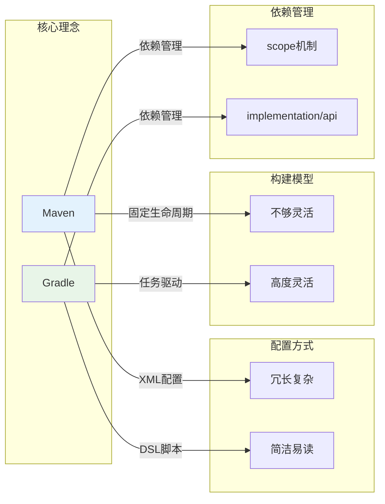

### **Gradle vs. Maven: 终极对决，为什么 Spring 也选择了它？**

#### **Gradle vs Maven 核心差异对比图**



在 Java 的世界里，构建工具是项目的基石。多年来，Apache Maven 以其强大的依赖管理和标准化的生命周期，稳坐头把交椅。然而，一个更年轻、更灵活、更高效的挑战者——Gradle——正以前所未有的势头崛起，甚至赢得了像 Spring、Android 这样的顶级项目的青睐。

这篇文章将带你深入了解 Gradle，将它与 Maven 进行全方位的“终极对决”，并告诉你为什么 Spring 会做出迁移的决定。最后，我们会通过实战，看看如何用这两种工具创建一个全新的 Spring Boot 项目。

#### **核心理念：一张图看懂 Gradle 和 Maven**

*   **Maven**: **“约定优于配置” (Convention over Configuration)**。它像一本严格的指导手册，为项目提供了标准化的目录结构、构建生命周期和插件绑定。你只需要遵守规则，就能轻松构建项目。它的核心是 **XML**。
*   **Gradle**: **“用代码构建一切” (Build by Code)**。它是一个更灵活的工具集，将构建过程视为一个由任务（Tasks）组成的有向无环图（DAG）。你可以用编程语言（Groovy 或 Kotlin）来描述和定制任何你能想到的构建逻辑。它的核心是 **DSL (领域特定语言)**。

#### **全方位对决：Gradle vs. Maven**

| 特性 | Maven | Gradle | 优胜者 & 原因 |
| :--- | :--- | :--- | :--- |
| **配置文件** | `pom.xml` | `build.gradle` (Groovy) 或 `build.gradle.kts` (Kotlin) | **Gradle**。XML 极其冗长，而 Gradle 的 DSL 脚本非常简洁、易读。一个 50 行的 `build.gradle` 文件可能需要 200 行 `pom.xml` 来实现相同的功能。 |
| **配置语言** | **XML**：声明式，结构清晰，但非常啰嗦，缺乏逻辑处理能力。 | **Groovy / Kotlin DSL**：命令式，像写代码一样配置构建。支持条件、循环、函数等，极其灵活。 | **Gradle**。编程语言的灵活性完胜静态的 XML，尤其是在处理复杂逻辑时。 |
| **依赖管理** | `<dependencies>` 块，通过 `<scope>` (compile, test, provided) 管理。 | `dependencies {}` 块，提供更细粒度的配置，如 `implementation`, `api`, `testImplementation`。 | **Gradle**。`implementation` 能够隐藏传递性依赖，避免依赖泄漏，加快编译速度，这是 Maven 无法做到的。 |
| **构建生命周期** | **固定生命周期**：`validate` -> `compile` -> `test` -> `package` -> `install` -> `deploy`。阶段是线性的，插件只能绑定到这些阶段上。 | **任务驱动**：一切皆为任务（Task）。任务之间可以定义依赖关系，形成一个有向无环图（DAG）。生命周期只是预定义的一系列任务。 | **Gradle**。任务驱动的模型更加灵活和直观，你可以轻松创建、扩展或替换任何任务，而不受固定生命周期的束缚。 |
| **性能** | 较慢。每次构建都会执行完整的生命周期阶段。 | **极快**。得益于三大法宝：**增量构建**（只构建变化的部分）、**构建缓存**（重用之前构建的输出）和 **Gradle 守护进程**（一个常驻内存的后台进程，避免每次都启动 JVM）。 | **Gradle**。在大型多模块项目中，Gradle 的性能优势是压倒性的，构建速度可能是 Maven 的数倍甚至数十倍。 |
| **灵活性与定制** | 较低。复杂的构建逻辑需要编写自定义的 Maven 插件（用 Java），门槛高。 | **极高**。可以直接在 `build.gradle` 文件中编写 Groovy 或 Kotlin 代码来实现任何自定义逻辑，无需创建单独的插件。 | **Gradle**。无与伦比的灵活性是 Gradle 最大的王牌。 |
| **社区与生态** | 极其成熟。拥有海量的插件、文档和社区支持，几乎所有问题都能找到答案。 | 发展迅速。社区非常活跃，尤其是在 Android 和现代后端开发领域。主流 IDE 支持已非常完善。 | **Maven**。在历史积淀和资源广度上，Maven 依然领先。但 Gradle 正在快速追赶。 |

#### **优缺点总结**

**Gradle 的优点:**
*   **极致性能**：增量构建和缓存机制让构建速度飞快。
*   **超高灵活性**：代码化的构建脚本可以实现任何你想要的逻辑。
*   **简洁易读**：DSL 语法远比 XML 清爽。
*   **现代依赖管理**：`implementation` 提供了更好的依赖隔离。

**Gradle 的缺点:**
*   **学习曲线**：需要理解 Groovy/Kotlin DSL 和其任务模型，入门门槛比 Maven 稍高。
*   **自由的代价**：过度的灵活性可能导致构建脚本变得混乱和难以维护（“Build script from hell”）。

**Maven 的优点:**
*   **标准化**：严格的约定让任何熟悉 Maven 的人都能快速上手一个新项目。
*   **生态成熟**：资源、插件和文档极其丰富。
*   **简单可靠**：对于标准化的项目，Maven 的配置非常简单，不易出错。

**Maven 的缺点:**
*   **冗长**：XML 配置非常啰嗦。
*   **僵化**：固定的生命周期难以应对复杂的构建需求。
*   **性能瓶颈**：在大型项目中，构建速度较慢。

#### **案例分析：为什么 Spring Framework 最终选择了 Gradle？**

Spring 是一个拥有数十个子模块的巨型项目，其构建过程极其复杂。他们在早期使用 Ant，后来迁移到 Maven，最终在 2012 年左右全面转向 Gradle。原因正是我们上面分析的 Gradle 的核心优势：

1.  **管理复杂的多模块构建**：Gradle 的脚本化配置让定义模块间的复杂依赖关系、执行特定的子模块构建任务变得异常简单，而这在 Maven 的父子 POM 继承模型中会变得非常笨拙。
2.  **极致的性能需求**：对于 Spring 团队来说，每天都要进行无数次构建。Gradle 的增量构建和缓存能力，将原本可能需要数十分钟的完整构建缩短到几分钟甚至几十秒，极大地提升了开发效率。
3.  **高度的定制化需求**：Spring 的构建需要处理很多特殊任务，比如生成特殊的文档、打包特定的发行版、运行复杂的测试套件等。这些在 Gradle 中可以通过编写简单的脚本任务实现，但在 Maven 中则需要开发和维护复杂的自定义插件。

#### **实战：用 Maven 和 Gradle 创建 Spring Boot 项目**

现在，让我们通过最流行的 **Spring Initializr** (`start.spring.io`) 来创建项目，直观感受一下二者的不同。

1.  **访问 `start.spring.io`**。
2.  **选择依赖**：我们选择 `Spring Web` 作为示例。

##### **如果你选择 Maven**

1.  **项目类型**：选择 **Maven**。
2.  **填写元数据**：Group, Artifact 等。
3.  **生成并下载**：解压后，你会看到核心配置文件 `pom.xml`。

   ```xml
   <!-- pom.xml (关键部分) -->
   <parent>
       <groupId>org.springframework.boot</groupId>
       <artifactId>spring-boot-starter-parent</artifactId>
       <version>3.x.x</version>
   </parent>

   <dependencies>
       <dependency>
           <groupId>org.springframework.boot</groupId>
           <artifactId>spring-boot-starter-web</artifactId>
       </dependency>
       <dependency>
           <groupId>org.springframework.boot</groupId>
           <artifactId>spring-boot-starter-test</artifactId>
           <scope>test</scope>
       </dependency>
   </dependencies>

   <build>
       <plugins>
           <plugin>
               <groupId>org.springframework.boot</groupId>
               <artifactId>spring-boot-maven-plugin</artifactId>
           </plugin>
       </plugins>
   </build>
   ```

4.  **如何运行？**
   在项目根目录下打开终端，运行：
   ```sh
   mvn spring-boot:run
   ```

##### **如果你选择 Gradle**

1.  **项目类型**：选择 **Gradle - Groovy** (或 Kotlin)。
2.  **填写元数据**：Group, Artifact 等。
3.  **生成并下载**：解压后，你会看到核心配置文件 `build.gradle`。

   ```groovy
   // build.gradle (关键部分)
   plugins {
       id 'java'
       id 'org.springframework.boot' version '3.x.x'
       id 'io.spring.dependency-management' version '1.1.x'
   }

   repositories {
       mavenCentral()
   }

   dependencies {
       implementation 'org.springframework.boot:spring-boot-starter-web'
       testImplementation 'org.springframework.boot:spring-boot-starter-test'
   }

   tasks.named('test') {
       useJUnitPlatform()
   }
   ```
   **看到了吗？同样的功能，代码行数少了将近一半，而且更像代码，不是吗？**

4.  **如何运行？**
   在项目根目录下打开终端，运行：
   ```sh
   # Windows
   .\gradlew.bat bootRun

   # Linux / macOS
   ./gradlew bootRun
   ```

#### **结论：我应该选择谁？**

*   **选择 Maven，如果**：
    *   你是一个 Java 新手，希望从一个标准化的、规则明确的工具开始。
    *   你的项目是比较常规的 Web 应用或库，没有复杂的构建需求。
    *   你所在的团队非常看重“约定”和“标准化”，希望限制构建过程的“自由度”。

*   **选择 Gradle，如果**：
    *   你追求极致的构建性能，尤其是在大型、多模块项目中。
    *   你的项目有复杂的、非标准的构建需求，需要高度定制化。
    *   你和你的团队更喜欢用代码（而不是 XML）来管理和定义构建过程，欣赏其简洁性和灵活性。
    *   你正在开发 Android 应用（Gradle 是官方指定工具）。

总而言之，Maven 是一个久经考验、稳定可靠的“老兵”，而 Gradle 则是一个更现代化、更强大、更灵活的“未来战士”。对于新项目，尤其是那些可能变得复杂的项目，**我强烈建议你尝试一下 Gradle**，它所带来的效率和灵活性提升，绝对会让你物有所值。