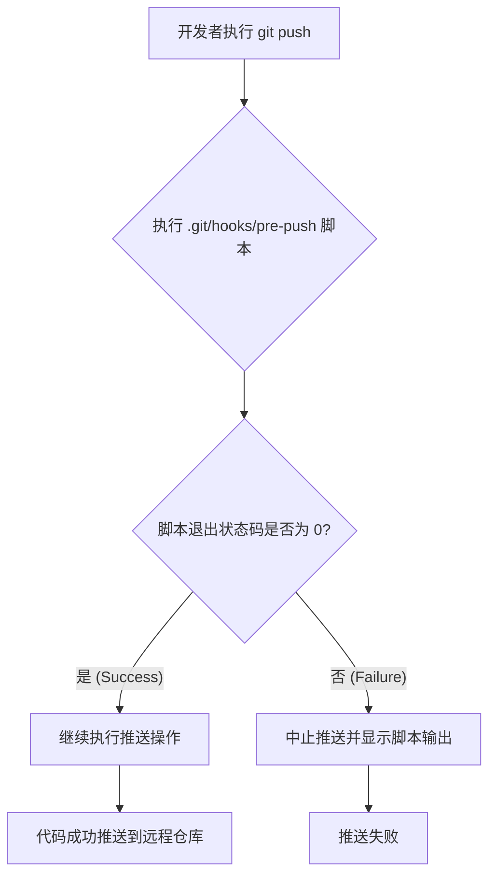
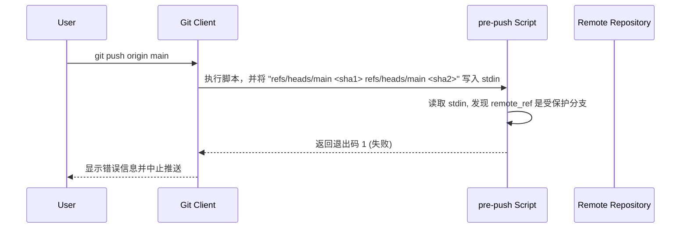

# 自动化代码质量守护：利用 Git pre-push Hook 提升效率

### 开头摘要

本文深入探讨了如何利用 Git 的 `pre-push` hook，在代码被推送到远程仓库前自动执行命令（如代码检查、单元测试）。文章将从基本概念、底层原理到结合 `Husky` 等工具的实战案例，全面解析其工作机制与价值。本文适合希望通过自动化手段提升代码质量、规范团队协作流程的开发者阅读。

### 目录
*   [1. 核心概念：Git Hooks 是什么？](#1-核心概念git-hooks-是什么)
    *   [1.1. 概念解释](#11-概念解释)
    *   [1.2. 示例代码：激活你的第一个 Hook](#12-示例代码激活你的第一个-hook)
    *   [1.3. Mermaid 流程图：Hook 在 Git 工作流中的位置](#13-mermaid-流程图hook-在-git-工作流中的位置)
    *   [1.4. 问题分析：常见误区与陷阱](#14-问题分析常见误区与陷阱)
    *   [1.5. 应用场景](#15-应用场景)
*   [2. 深入 `pre-push`：参数与实践](#2-深入-pre-push参数与实践)
    *   [2.1. 概念解释：`pre-push` 的独特之处](#21-概念解释pre-push-的独特之处)
    *   [2.2. 示例代码：读取 `stdin` 实现智能判断](#22-示例代码读取-stdin-实现智能判断)
    *   [2.3. Mermaid 时序图：`pre-push` 交互过程](#23-mermaid-时序图pre-push-交互过程)
    *   [2.4. 问题分析：边界情况处理](#24-问题分析边界情况处理)
    *   [2.5. 应用场景](#25-应用场景)
*   [3. Hook 管理工具对比：原生 vs. Husky vs. pre-commit](#3-hook-管理工具对比原生-vs-husky-vs-pre-commit)
*   [4. 实战案例：在 Node.js 项目中集成 Husky + ESLint + Jest](#4-实战案例在-nodejs-项目中集成-husky--eslint--jest)
*   [5. 总结](#5-总结)
*   [6. 延伸阅读](#6-延伸阅读)
*   [7. 一句话记忆](#7-一句话记忆)

---

### 1. 核心概念：Git Hooks 是什么？

#### 1.1. 概念解释

**Git Hooks**（钩子）是 Git 在执行特定事件（如 `commit`, `push`, `merge` 等）时自动触发执行的脚本。 它们是 Git 工作流自动化的核心机制，允许开发者在关键节点插入自定义逻辑。

*   **存储位置**：每个 Git 仓库的 `.git/hooks` 目录下都存放着钩子脚本。初始化仓库时，Git 会生成一系列以 `.sample` 结尾的示例脚本。
*   **本地性**：**这是最重要的特性之一**。`.git` 目录本身不被 Git 版本控制系统追踪，因此 `.git/hooks` 目录下的脚本**不会**随着 `git push` 同步到远程仓库，也不会在 `git clone` 时被复制。每个团队成员都需要在本地配置自己的钩子。
*   **分类**：钩子分为客户端（Client-Side）和服务端（Server-Side）两类。本文关注的 `pre-push` 属于客户端钩子，它在开发者的本地机器上运行。

#### 1.2. 示例代码：激活你的第一个 Hook

要激活一个钩子，只需移除 `.sample` 后缀并赋予其可执行权限。

**Shell 脚本示例 (`.git/hooks/pre-push`)**:
```sh
#!/bin/sh

# 这是一个最简单的 pre-push 钩子
# 它会在每次 git push 前打印一条消息

echo "====== [Pre-push Hook] Triggered! About to push code... ======"

# 脚本必须以状态码 0 退出，才能让 push 继续
# 如果以非 0 状态码退出，push 操作将被中止
exit 0```
**激活步骤**:
```bash
# 1. 进入你的项目根目录
cd your-project

# 2. 复制并重命名示例文件
# cp .git/hooks/pre-push.sample .git/hooks/pre-push

# 3. 如果是新建文件，写入以上脚本内容
# nano .git/hooks/pre-push

# 4. 赋予脚本可执行权限 (非常关键的一步！)
chmod +x .git/hooks/pre-push
```
现在，当你执行 `git push` 时，终端会首先打印出 "====== [Pre-push Hook] Triggered! About to push code... ======"，然后才开始真正的推送过程。

#### 1.3. Mermaid 流程图：Hook 在 Git 工作流中的位置



#### 1.4. 问题分析：常见误区与陷阱

*   **误区：钩子可以团队共享**
    如前所述，`.git/hooks` 不受版本控制，无法直接共享。这是 Git 的设计哲学，旨在防止仓库贡献者在不知情的情况下执行他人仓库中的潜在恶意代码。团队共享需要借助第三方工具（见第 3 节）。
*   **陷阱 1：脚本没有可执行权限**
    `chmod +x` 是最容易被忽略但最致命的一步。如果脚本没有执行权限，Git 会静默地跳过它，不会有任何提示。
*   **陷阱 2：脚本的 Shebang 不正确**
    脚本的第一行 `#!/bin/sh` 或 `#!/bin/bash` 确保了系统使用正确的解释器来执行脚本。在 Windows 环境下，可能需要配置为 `#!/bin/sh` 并使用 Git Bash 或 WSL 来保证兼容性。

#### 1.5. 应用场景

`pre-push` hook 是代码进入共享仓库前的最后一道“质量门”，适合执行那些在本地提交（commit）时不一定需要但推送前必须通过的检查。
*   **运行单元测试/集成测试**：确保推送的代码不会破坏现有功能。
*   **代码风格和质量检查 (Linting)**：强制团队遵循统一的编码规范。
*   **编译或构建检查**：确认项目可以成功构建，避免将无法运行的代码推送到 CI/CD 系统。
*   **敏感信息扫描**：防止意外泄露 API 密钥、密码等凭证。

---

### 2. 深入 `pre-push`：参数与实践

#### 2.1. 概念解释：`pre-push` 的独特之处

与其他钩子不同，`pre-push` 能通过**标准输入（stdin）**获取关于推送的详细信息。这使得它可以实现非常精细的控制。

`pre-push` 脚本从 `stdin` 接收一系列行，每行格式如下：
`<local_ref> <local_sha1> <remote_ref> <remote_sha1>`

*   `<local_ref>`: 本地引用的完整名称 (e.g., `refs/heads/feature/new-login`)。
*   `<local_sha1>`: 本地引用指向的 commit SHA-1 值。
*   `<remote_ref>`: 远程引用的完整名称 (e.g., `refs/heads/feature/new-login`)。
*   `<remote_sha1>`: 远程引用当前指向的 commit SHA-1 值。

#### 2.2. 示例代码：读取 `stdin` 实现智能判断

这个 Python 脚本演示了如何解析 `stdin` 来阻止对 `main` 分支的直接推送。

**Python 脚本示例 (`.git/hooks/pre-push`)**:
```python
#!/usr/bin/env python3
import sys
import os

# 定义受保护的分支
PROTECTED_BRANCH = "refs/heads/main"

has_error = False

# 从标准输入读取所有行
for line in sys.stdin:
    try:
        local_ref, local_sha, remote_ref, remote_sha = line.strip().split()

        # 检查是否正在尝试推送到受保护的分支
        if remote_ref == PROTECTED_BRANCH:
            print("\033[1;31mERROR: Direct push to the 'main' branch is forbidden!\033[0m", file=sys.stderr)
            print("Please use a pull request.", file=sys.stderr)
            has_error = True
            
    except ValueError:
        # 忽略空行或其他格式不正确的行
        continue

if has_error:
    sys.exit(1) # 以非 0 状态码退出，中止 push

sys.exit(0)
```
**别忘了** `chmod +x .git/hooks/pre-push`。

#### 2.3. Mermaid 时序图：`pre-push` 交互过程



#### 2.4. 问题分析：边界情况处理

*   **新建分支推送**：当推送一个全新的分支时，`<remote_sha1>` 将是一串 `0` (`000000...`)。
*   **删除远程分支**：当执行 `git push origin --delete <branch>` 时，`<local_ref>` 将是 `(delete)`，`<local_sha1>` 将是一串 `0`。
*   **一次推送多个分支**：`stdin` 会包含多行数据，你的脚本必须能循环处理所有行，而不是只读第一行。

#### 2.5. 应用场景

*   **分支保护**：禁止向 `main`、`develop` 等关键分支直接推送代码。
*   **条件化测试**：只有当推送到 `staging` 或 `release` 分支时，才触发耗时较长的端到端测试。
*   **版本号检查**：在推送 `tag` 之前，检查 `package.json` 或 `pom.xml` 中的版本号是否已更新。

---

### 3. Hook 管理工具对比：原生 vs. Husky vs. pre-commit

| 特性 / 工具 | 原生方式 (`.git/hooks`) | Husky (Node.js 生态) | pre-commit (Python 生态) |
| :--- | :--- | :--- | :--- |
| **团队共享** | 否，需手动分发和设置 | 是，通过 `package.json` 和 `.husky/` 目录共享配置 | 是，通过 `.pre-commit-config.yaml` 共享配置 |
| **安装** | 无需安装 | `npm install husky --save-dev` | `pip install pre-commit` |
| **配置** | 直接编写 Shell/Python 等脚本 | 在 `package.json` 或 `.husky/` 目录下配置命令 | 在 `.pre-commit-config.yaml` 中声明钩子和仓库 |
| **跨平台** | 依赖于脚本语言和环境 (Shell 在 Windows 上可能需要额外配置) | 良好，利用 Node.js 环境 | 优秀，Python 本身跨平台 |
| **生态系统** | 无 | 非常适合 JavaScript/TypeScript 项目，与 npm/yarn 深度集成 | 语言无关，支持多种语言的 linter 和 formatter |
| **优点** | 零依赖，简单直接 | 自动化安装，对前端开发者极其友好 | 强大的多语言支持和插件化管理 |
| **缺点** | 难以团队协作和管理 | 强依赖 Node.js 工具链 | 需要团队成员安装 Python 和 pre-commit |

---

### 4. 实战案例：在 Node.js 项目中集成 Husky + ESLint + Jest

这是目前前端和 Node.js 项目中最流行的实践。

**步骤 1：安装依赖**
```bash
# 安装 Husky、ESLint (代码检查)、Jest (测试框架)
npm install husky eslint jest --save-dev```

**步骤 2：启用 Husky**
```bash
# 激活 husky，这会创建 .husky/ 目录
npx husky install

# 将 husky install 添加到 npm postinstall 脚本，以便新成员 clone 后自动安装
npm set-script prepare "husky install"
```

**步骤 3：添加 pre-push hook**
```bash
# 创建一个 pre-push 钩子文件，其中包含要执行的命令
npx husky add .husky/pre-push "npm run lint && npm run test"
```
这条命令会创建 `.husky/pre-push` 文件，内容如下：
```sh
#!/usr/bin/env sh
. "$(dirname -- "$0")/_/husky.sh"

npm run lint && npm run test
```

**步骤 4：在 `package.json` 中定义脚本**
确保你的 `package.json` 包含 `lint` 和 `test` 脚本：
```json
{
  "scripts": {
    "test": "jest",
    "lint": "eslint .",
    "prepare": "husky install"
  }
}
```

**工作流程**:
1.  开发者执行 `git push`。
2.  Husky 触发 `.husky/pre-push` 脚本。
3.  脚本依次执行 `npm run lint` 和 `npm run test`。
4.  如果 `lint` 或 `test` 中任何一个命令失败（以非 0 状态码退出），整个脚本就会失败，`git push` 操作被中止。
5.  只有当所有检查都通过时，推送才会继续。

---

### 5. 总结

*   **核心价值**：Git Hooks 提供了一个在 Git 事件关键节点执行自定义逻辑的强大机制，`pre-push` 是守护远程仓库代码质量的最后一道防线。
*   **关键操作**：`pre-push` 脚本通过**退出状态码**（0 表示成功，非 0 表示失败）来控制推送是否继续。
*   **高级功能**：通过读取**标准输入 (stdin)**，`pre-push` 可以获取推送的详细上下文（如分支名、commit ID），实现精细化控制。
*   **团队协作**：原生的 Git Hooks 不利于团队共享。**Husky** 或 **pre-commit** 等工具是实现团队级别钩子策略的事实标准。

---

### 6. 延伸阅读

*   [Git 官方文档：Customizing Git - Git Hooks](https://git-scm.com/book/en/v2/Customizing-Git-Git-Hooks)
*   [Husky 官方文档](https://typicode.github.io/husky/)
*   [pre-commit 框架官方网站](https://pre-commit.com/)
*   [Atlassian Git Hooks 教程](https://www.atlassian.com/git/tutorials/git-hooks)

---

### 7. 一句话记忆

**用 `pre-push` hook 作为代码仓库的“门卫”，在代码离库前完成最终的自动化安检。**