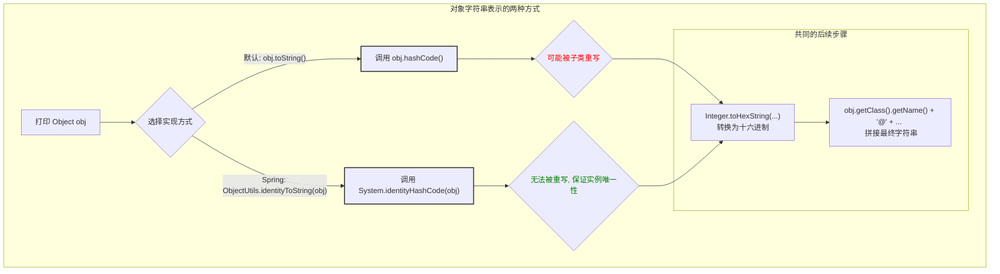

## 揭秘 Spring 中的 `@` 符号：`ClassName@HashCode` 字符串的由来

作为 Spring 开发者，你一定对下面这种输出格式非常熟悉：

```
org.springframework.context.annotation.AnnotationConfigApplicationContext@1e643faf
```

当我们尝试打印一个 Spring 容器（`ApplicationContext`）或其他 Spring 管理的 Bean 时，经常会看到这种由 `类全限定名` + `@` + `十六进制字符串` 组成的输出。

很多初学者可能会疑惑：`1e643faf` 是什么？是我在哪里配置的 ID 吗？为什么每次运行程序，这个值都不一样？

今天，我们就来追根溯源，彻底搞清楚这个字符串的由来以及它背后体现的框架设计思想。

### 最初的猜想：是 `Object.toString()` 吗？

Java 程序员的直觉会告诉我们，这看起来非常像 `java.lang.Object` 类的默认 `toString()` 方法的输出。让我们回顾一下 `Object.toString()` 的经典实现：

```java
public String toString() {
    return getClass().getName() + "@" + Integer.toHexString(hashCode());
}
```

这个实现和我们在 Spring 中看到的输出格式几乎一模一样！它由 **类名** 和 **对象的哈希码（hashCode）的十六进制表示** 组成。

那么，Spring 是直接使用了这个默认方法吗？答案是：**不完全是，但更进了一步。**

### 深入源码：Spring 的 `ObjectUtils` 工具类

通过分析 Spring 的源码，我们会发现，很多 Spring 内部组件在需要打印对象标识时，会使用一个名为 `ObjectUtils` 的工具类。这个类中有一个关键方法 `identityToString()`。

这正是我们文章开头用户提问的那段源码：

```java
// 位于 org.springframework.util.ObjectUtils 类中

public static String identityToString(@Nullable Object obj) {
    if (obj == null) {
        return "";
    }
    return obj.getClass().getName() + "@" + getIdentityHexString(obj);
}

public static String getIdentityHexString(Object obj) {
    return Integer.toHexString(System.identityHashCode(obj));
}
```

可以看到，`identityToString` 的结构与 `Object.toString()` 非常相似，但它在获取哈希码时，并没有直接调用 `obj.hashCode()`，而是调用了 `System.identityHashCode(obj)`。

**这一个微小但至关重要的区别，正是 Spring 框架严谨性的体现。**

### 核心解惑：`hashCode()` vs `System.identityHashCode()`

要理解 Spring 的良苦用心，我们必须弄清楚这两个方法的本质区别。

#### `obj.hashCode()`

*   **可被重写 (Overridable)**：任何类都可以重写 `hashCode()` 方法。
*   **关注“逻辑相等”**：它的设计初衷是为了配合 `equals()` 方法，服务于 `HashMap`、`HashSet` 等集合。约定要求：如果两个对象 `equals()` 相等，那么它们的 `hashCode()` 必须相等。
*   **示例**：两个内容同为 "hello" 的 `String` 对象，即使是内存中两个独立的实例，它们的 `hashCode()` 值也一定是相同的。

#### `System.identityHashCode(obj)`

*   **不可重写**：这是一个静态方法，其行为无法被任何类修改。
*   **关注“实例身份”**：它无视任何类对 `hashCode()` 的重写，返回的是对象最“原始”的哈希码，这个值通常根据对象的内存地址计算得出。可以理解为它返回的是 `Object.hashCode()` 未被重写时的那个版本的值。
*   **保证唯一性**：只要两个引用指向的不是内存中的同一个对象实例，那么 `System.identityHashCode()` 返回的值就几乎肯定是不同的。

### 使用 Mermaid 图来理解流程

下面这张图清晰地展示了默认 `toString()` 和 Spring `identityToString()` 在生成哈希码时的不同路径。



### 为什么 Spring 要这样做？

答案是：**为了日志记录和调试的明确性与可靠性。**

在复杂的应用程序中，我们经常需要通过日志来追踪对象的行为。想象一下，如果有一个自定义类，它为了业务逻辑重写了 `hashCode()` 和 `equals()` 方法。

```java
public class MyConfig {
    private String name;
    // ... equals() 和 hashCode() 都基于 name 属性实现
}

MyConfig config1 = new MyConfig("prod");
MyConfig config2 = new MyConfig("prod"); 
```

此时，`config1` 和 `config2` 是内存中两个完全不同的实例。

*   如果使用 `config1.hashCode()` 和 `config2.hashCode()`，你会得到**相同的值**。在日志中，你将无法区分 `MyConfig@xxxx` 到底指的是 `config1` 还是 `config2`。
*   如果使用 `System.identityHashCode(config1)` 和 `System.identityHashCode(config2)`，你会得到**不同的值**。在日志中，你可以清晰地追踪每一个独立实例的生命周期，极大地提升了调试效率。

Spring 作为一个基础框架，必须保证其日志和内部状态的输出是绝对清晰、无歧义的。通过 `System.identityHashCode()`，Spring 确保了它打印出的对象标识符反映的是对象在内存中的**物理身份**，而非其**逻辑内容**。

### 总结

下次当你在控制台或日志文件中看到 `ClassName@HashCode` 这样的字符串时，你可以自信地知道：

1.  它**不是一个配置的 ID**，而是对象的内存标识符。
2.  它是由 Spring 的 `ObjectUtils.identityToString()` 方法生成的，而非 Java 默认的 `Object.toString()`。
3.  `@` 后面的十六进制串是通过 `System.identityHashCode()` 计算得来的，这保证了每个不同的对象实例都有一个唯一的标识，是框架为了**调试和日志的严谨性**而做出的精心设计。

这个小小的细节，恰恰体现了 Spring 框架在设计上的深思熟虑和对开发者体验的极致追求。