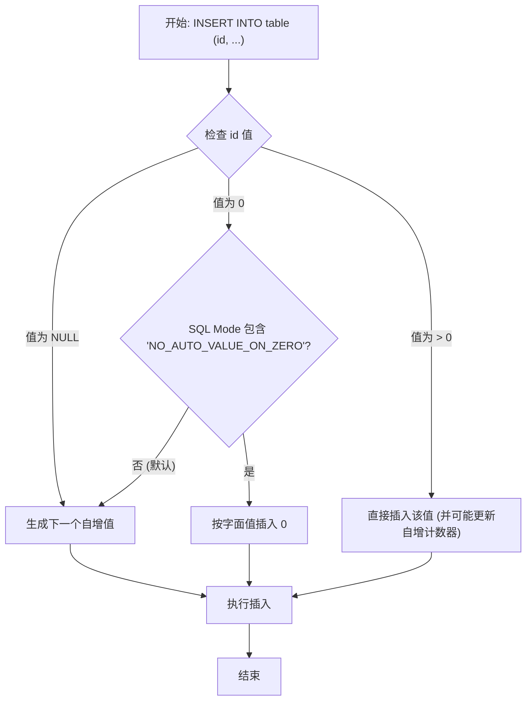

# 深入解析 MySQL：为何 INSERT 自增主键 `0` 会变成自增值？

### 开头摘要

本文深入探讨了在 MySQL 中向 `AUTO_INCREMENT` 主键列插入 `0` 时，该值会被替换为下一个自增值的底层机制。文章将详细解析其背后的设计哲学、`sql_mode` 的关键作用，并提供实战案例。本文适合对 MySQL 数据库行为有好奇心、希望避免常见错误的后端开发者和数据库管理员（DBA）阅读。

### 目录
*   [1. 核心概念：`AUTO_INCREMENT` 与 `0` 的“特殊约定”](#1-核心概念auto_increment-与-0-的特殊约定)
    *   [1.1. 什么是 AUTO_INCREMENT？](#11-什么是-auto_increment)
    *   [1.2. `INSERT` `0` 为何会触发自增？](#12-insert-0-为何会触发自增)
*   [2. 幕后推手：`NO_AUTO_VALUE_ON_ZERO` SQL Mode](#2-幕后推手no_auto_value_on_zero-sql-mode)
    *   [2.1. 概念解释](#21-概念解释)
    *   [2.2. 示例代码：模式切换下的行为差异](#22-示例代码模式切换下的行为差异)
    *   [2.3. Mermaid 流程图：决策路径可视化](#23-mermaid-流程图决策路径可视化)
    *   [2.4. 问题分析与常见误区](#24-问题分析与常见误区)
    *   [2.5. 应用场景](#25-应用场景)
*   [3. 跨数据库行为对比](#3-跨数据库行为对比)
*   [4. 实战案例：在 MyBatis 中获取真实的自增 ID](#4-实战案例在-mybatis-中获取真实的自增-id)
*   [5. 总结](#5-总结)
*   [6. 延伸阅读](#6-延伸阅读)
*   [7. 一句话记忆](#7-一句话记忆)

---

### 1. 核心概念：`AUTO_INCREMENT` 与 `0` 的“特殊约定”

#### 1.1. 什么是 AUTO_INCREMENT？

在 MySQL 中，`AUTO_INCREMENT` 是一种列属性，通常用于主键列，为新插入的行自动生成唯一的整数标识。 它的主要目的是确保数据行的唯一性，简化了在插入数据时手动管理主键值的复杂性。默认情况下，自增值从 1 开始，每次插入新记录时加 1。

**设计动机**：该设计的核心动机是为了提供一个简单、高效的主键生成策略。在分布式或高并发系统中，依赖应用层生成唯一 ID 可能会引入延迟和复杂性，而数据库层面的自增机制则能很好地解决这一问题。

#### 1.2. `INSERT` `0` 为何会触发自增？

在 MySQL 的默认行为中，向 `AUTO_INCREMENT` 列插入 `0` 或 `NULL` 都会被解释为“请求下一个可用的自增值”。 这种看似不寻常的行为其实是一种便利性的设计。

**历史与设计哲学**：早期，这被视为一种“魔术值”（Magic Value），用于简化插入操作。开发者无需先查询当前最大 ID 再加 1，而是可以直接提供 `NULL` 或 `0` 作为占位符来触发序列。 这种约定简化了客户端代码，尤其是在不关心具体主键值、只关心成功插入的场景下。

---

### 2. 幕后推手：`NO_AUTO_VALUE_ON_ZERO` SQL Mode

这种“魔术行为”并非一成不变，它由一个关键的服务器变量 `sql_mode` 控制。

#### 2.1. 概念解释

`NO_AUTO_VALUE_ON_ZERO` 是 MySQL `sql_mode` 的一个可选值。
*   **默认情况**：此模式**未**开启。此时，`INSERT` `0` 到自增列会被替换为下一个序列值。
*   **开启后**：当 `sql_mode` 包含 `NO_AUTO_VALUE_ON_ZERO` 时，`INSERT` `0` 将不再触发自增，而是**按字面意义将 `0` 存入该列**。 只有 `INSERT` `NULL` 才会继续触发自增。

这个模式的设计动机是为了提供更大的灵活性，并解决一个重要的数据迁移问题。例如，使用 `mysqldump` 导出的数据如果包含了值为 `0` 的自增主键，在导入到新服务器时，若不开启此模式，`0` 会被新的自增值替换，导致数据不一致。因此，`mysqldump` 生成的脚本会自动包含启用 `NO_AUTO_VALUE_ON_ZERO` 的语句，以确保数据能被原样恢复。

#### 2.2. 示例代码：模式切换下的行为差异

我们使用 Python 和 `mysql-connector-python` 库来演示这一差异。

**准备环境**:
```sql
CREATE TABLE users (
    id INT UNSIGNED AUTO_INCREMENT PRIMARY KEY,
    name VARCHAR(50)
) ENGINE=InnoDB;
```

**Python 示例代码**:
```python
import mysql.connector

def run_insert_demo(config, sql_mode=None):
    cnx = mysql.connector.connect(**config)
    cursor = cnx.cursor()
    
    if sql_mode is not None:
        print(f"\n--- 设置 SQL Mode: {sql_mode} ---")
        cursor.execute(f"SET SESSION sql_mode = '{sql_mode}'")
    else:
        print("\n--- 使用默认 SQL Mode ---")
        cursor.execute("SET SESSION sql_mode = 'STRICT_TRANS_TABLES,NO_ENGINE_SUBSTITUTION'") # 一个常见的默认值

    # 清空表
    cursor.execute("TRUNCATE TABLE users")
    
    # 尝试插入 0
    print("尝试插入 (0, 'Alice')...")
    cursor.execute("INSERT INTO users (id, name) VALUES (0, 'Alice')")
    inserted_id_0 = cursor.lastrowid
    print(f"插入后获取的 ID: {inserted_id_0}")

    # 尝试插入 NULL
    print("尝试插入 (NULL, 'Bob')...")
    cursor.execute("INSERT INTO users (id, name) VALUES (NULL, 'Bob')")
    inserted_id_null = cursor.lastrowid
    print(f"插入后获取的 ID: {inserted_id_null}")
    
    # 查询结果
    cursor.execute("SELECT id, name FROM users")
    print("当前表内数据:")
    for (id, name) in cursor:
        print(f"  ID: {id}, Name: {name}")
    
    cnx.commit()
    cursor.close()
    cnx.close()

# --- 主程序 ---
db_config = {
    'user': 'root',
    'password': 'your_password',
    'host': '127.0.0.1',
    'database': 'test_db'
}

# 场景1: 默认模式
run_insert_demo(db_config, sql_mode="")

# 场景2: 开启 NO_AUTO_VALUE_ON_ZERO
run_insert_demo(db_config, sql_mode="NO_AUTO_VALUE_ON_ZERO")
```

**预期输出**:
```
--- 使用默认 SQL Mode ---
尝试插入 (0, 'Alice')...
插入后获取的 ID: 1
尝试插入 (NULL, 'Bob')...
插入后获取的 ID: 2
当前表内数据:
  ID: 1, Name: Alice
  ID: 2, Name: Bob

--- 设置 SQL Mode: NO_AUTO_VALUE_ON_ZERO ---
尝试插入 (0, 'Alice')...
插入后获取的 ID: 0
尝试插入 (NULL, 'Bob')...
插入后获取的 ID: 1
当前表内数据:
  ID: 0, Name: Alice
  ID: 1, Name: Bob
```

#### 2.3. Mermaid 流程图：决策路径可视化

下图清晰地展示了 MySQL 在处理 `AUTO_INCREMENT` 列插入时的内部逻辑。



#### 2.4. 问题分析与常见误区

*   **误区 1：`0` 是一个非法的主键值**
    `0` 是一个完全合法的整数，可以作为主键值。 只是在 MySQL 的特定默认配置下，它被赋予了特殊含义。在需要表示“根节点”或“系统默认条目”时，使用 `0` 作为主键是一种可能的设计选择。
*   **陷阱 2：环境不一致导致的行为差异**
    开发环境和生产环境的 `sql_mode` 不一致是导致 bug 的常见原因。代码在开发库（默认 `sql_mode`）上运行正常，但在生产库（启用了 `NO_AUTO_VALUE_ON_ZERO`）上可能就会因为插入了字面值 `0` 而导致主键冲突或业务逻辑错误。
*   **边界情况：主键类型与耗尽**
    如果主键列是无符号的（`UNSIGNED`），则可以存储 `0`。如果是有符号的，并且插入了负值，该负值会被直接存入，但不会影响自增序列。 当 `AUTO_INCREMENT` 值达到其数据类型的上限时，再次插入会产生主键冲突错误。

#### 2.5. 应用场景

*   **依赖默认行为的场景**：
    大多数常规的业务开发，应用层不关心主键的具体值，只需要数据库保证其唯一性即可。此时，通过传递 `0` 或 `NULL` 来获取新 ID 是最便捷的方式。
*   **需要插入字面值 `0` 的场景**：
    1.  **数据迁移**：如前所述，从其他系统或备份中恢复数据时，需要确保主键值 `0` 被原样保留。
    2.  **特殊实体表示**：在某些业务模型中，ID `0` 可能被用来代表一个特殊的、唯一的实体，例如系统的“匿名用户”或配置的“根节点”。

---

### 3. 跨数据库行为对比

| 数据库系统 | `IDENTITY` / `SERIAL` 列插入 `0` 的行为 | 备注 |
| :--- | :--- | :--- |
| **MySQL (默认)** | 触发自增，生成下一个序列值。 | 行为可通过 `NO_AUTO_VALUE_ON_ZERO` 模式修改。 |
| **PostgreSQL** | 插入字面值 `0`，前提是该值未被占用。不会触发 `SERIAL` 或 `IDENTITY` 序列。 | 序列的触发通常依赖 `DEFAULT` 关键字或完全省略该列。 |
| **SQL Server** | 默认情况下，不允许向 `IDENTITY` 列显式插入值。需要 `SET IDENTITY_INSERT ON;` 后才能插入字面值 `0`。 | 操作更为严格，需要显式声明意图。 |
| **SQLite** | 插入字面值 `0`。 | 如果 `INTEGER PRIMARY KEY` 列被声明，插入 `NULL` 会触发自增。 |

**总结**：MySQL 在处理 `0` 时的默认行为在主流数据库中较为独特，提供了便利性但也可能引入误解。其他数据库系统通常要求更明确的意图来覆盖自动生成的值。

---

### 4. 实战案例：在 MyBatis 中获取真实的自增 ID

在 Java 生态中，MyBatis 是一个流行的数据持久化框架。当与 MySQL 结合使用时，理解 `AUTO_INCREMENT` 的行为至关重要。

假设有一个 `User` 对象和对应的 `UserMapper.xml`。

**User.java**:
```java
public class User {
    private Long id;
    private String name;
    // ... Getters and Setters
}
```

**UserMapper.xml**:
```xml
<mapper namespace="com.example.mapper.UserMapper">
  <insert id="insertUser" parameterType="com.example.model.User"
          useGeneratedKeys="true" keyProperty="id" keyColumn="id">
    INSERT INTO users (id, name) VALUES (#{id}, #{name})
  </insert>
</mapper>
```

**Java Service 层代码**:
```java
@Service
public class UserService {
    @Autowired
    private UserMapper userMapper;

    public void createUser() {
        User user = new User();
        user.setName("Charlie");
        
        // 关键点：即使我们没有设置 id，MyBatis 默认会将其作为 null 传递
        // 如果我们显式地设置 user.setId(0L);
        // user.setId(0L); 

        userMapper.insertUser(user);
        
        // 无论数据库是因为 0 还是 NULL 触发了自增，
        // MyBatis 都会通过 JDBC 的 getGeneratedKeys() 方法
        // 将数据库实际生成的自增 ID 回填到 user 对象的 id 属性中。
        System.out.println("新用户的实际 ID: " + user.getId());
    }
}
```

**分析**：
`useGeneratedKeys="true"` 和 `keyProperty="id"` 这两个属性是关键。 它们告诉 MyBatis 执行 `INSERT` 后，需要通过 JDBC 驱动获取数据库生成的自增键，并将其设置到传入的 `User` 对象的 `id` 属性上。

*   当 `user.id` 为 `null` 或 `0` 时，MySQL 默认会生成一个新的自增 ID（例如 `3`）。
*   JDBC 驱动捕获到这个生成的 ID `3`。
*   MyBatis 将 `3` 回填到 `user` 对象的 `id` 字段。
*   因此，调用 `user.getId()` 会返回 `3`，而不是 `0`。

这个机制屏蔽了数据库底层的细节，让应用层可以可靠地获取到新记录的真实主键，是 ORM 框架在实践中处理自增主键的标准方式。

---

### 5. 总结

*   **核心行为**：默认情况下，MySQL 将向 `AUTO_INCREMENT` 列插入 `0` 或 `NULL` 视为生成新序列值的请求。
*   **控制开关**：`sql_mode` 中的 `NO_AUTO_VALUE_ON_ZERO` 选项可以改变这一行为，使得插入 `0` 变成插入字面值。
*   **设计原因**：默认行为是为提供便利，而 `NO_AUTO_VALUE_ON_ZERO` 则是为了数据迁移的准确性和特定场景的灵活性。
*   **实践建议**：在开发中，应明确团队规范，统一 `sql_mode` 配置，避免因环境差异导致意外。在需要插入字面值 `0` 时，应显式设置会话的 `sql_mode`。
*   **框架集成**：在使用 MyBatis 等框架时，利用 `useGeneratedKeys` 等特性可以可靠地获取数据库生成的真实 ID，而不用关心底层是 `0` 还是 `NULL` 触发的自增。

---

### 6. 延伸阅读

*   [MySQL 官方文档：Using AUTO_INCREMENT](https://dev.mysql.com/doc/refman/8.0/en/example-auto-increment.html)
*   [MySQL 官方文档：Server SQL Modes (`NO_AUTO_VALUE_ON_ZERO`)](https://dev.mysql.com/doc/refman/8.0/en/sql-mode.html#sqlmode_no_auto_value_on_zero)
*   [MyBatis 官方文档：`insert` 元素](https://mybatis.org/mybatis-3/sqlmap-xml.html#insert)

---

### 7. 一句话记忆

**MySQL 中，`0` 默认是触发自增主键的“快捷键”，除非 `NO_AUTO_VALUE_ON_ZERO` 模式告诉它“认真对待 `0`”。**