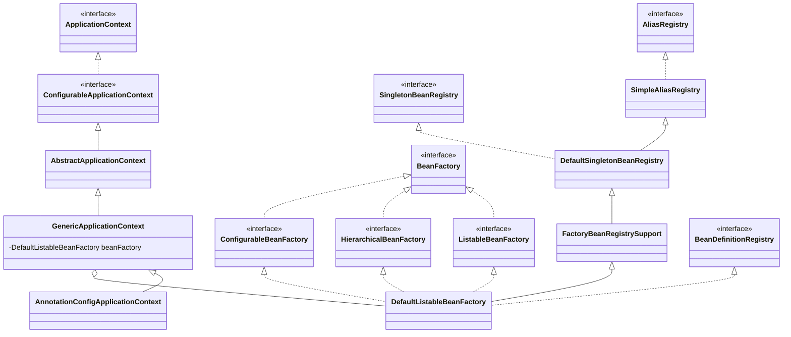

# 从基石到殿堂：深度剖析 Spring AnnotationConfigApplicationContext 的继承体系

当我们写下：

```java
new AnnotationConfigApplicationContext(AppConfig.class);
```

一个功能完备、灵活自如的 IoC 容器就此诞生。

然而，这个看似简单的构造调用背后，隐藏着一套庞大而精妙的设计体系。`AnnotationConfigApplicationContext` 并不是一个孤立的巨物，而是处在 **Spring IoC 容器继承体系的顶端**，它的每一项能力都来自于底层一层层接口与抽象类的积木式叠加。

要理解它，我们需要沿着两条主线溯源：

1. **应用上下文（Context）主线**：提供生命周期管理、事件机制、配置加载等企业级功能。
2. **Bean 注册（Registry）主线**：专注于最核心的 Bean 定义、单例管理和别名解析。

最终，这两条主线在 `GenericApplicationContext` 处汇合，形成我们熟悉的容器。

---

## 宏观鸟瞰：继承体系全貌

下图展现了 `AnnotationConfigApplicationContext` 的完整继承与实现关系。它既揭示了上下文主线的演进脉络，也展示了 Bean 注册主线的层层积累。



---

## 主线一：应用上下文（Context）的成长之路

这条主线赋予容器“全局视野”与“生命周期”，让它超越了单纯的 Bean 工厂，成为一个框架级的运行环境。

1. **`ApplicationContext` (接口)**

   - **定位**：IoC 容器的企业级接口。
   - **能力**：继承自 `BeanFactory`，并扩展了**国际化**、**事件发布**、**资源加载**等功能。

2. **`ConfigurableApplicationContext` (接口)**

   - **定位**：容器的生命周期遥控器。
   - **能力**：定义了 `refresh()` 和 `close()` 方法，标志容器可以被“启动/刷新/销毁”。

3. **`AbstractApplicationContext` (抽象类)**

   - **定位**：骨架基类。
   - **能力**：实现了著名的 `refresh()` 模板方法，涵盖 **12 个启动步骤**，如准备环境、初始化 BeanFactory、注册后置处理器、完成 Bean 实例化等。
   - **关键特性**：采用模板方法模式，将“加载 Bean 定义”留给子类决定。

---

## 主线二：Bean 注册（Registry）的基石

这条主线是幕后功臣，专注于 Bean 的定义与实例管理。它不关心事件、国际化，而是为 IoC 提供核心支撑。

1. **`AliasRegistry` → `SimpleAliasRegistry`**

   - **作用**：别名机制。支持 Bean 拥有多个名称。

2. **`SingletonBeanRegistry` → `DefaultSingletonBeanRegistry`**

   - **作用**：单例池核心。
   - **亮点**：实现了 **三级缓存**（`singletonObjects`、`earlySingletonObjects`、`singletonFactories`），完美解决循环依赖。
   - **附加功能**：负责 Bean 的销毁回调管理。

3. **`FactoryBeanRegistrySupport`**

   - **作用**：支持 `FactoryBean` 特殊语义。
   - **机制**：内部维护 `factoryBeanObjectCache`，缓存由 `FactoryBean` 生成的对象。

4. **`DefaultListableBeanFactory`**

   - **作用**：全能型 Bean 工厂。
   - **特点**：继承了前面所有能力，同时实现 `BeanDefinitionRegistry`，因此既能注册 Bean 定义，又能管理单例实例。
   - **地位**：Spring 默认的 BeanFactory 实现，是容器的“心脏”。

---

## 最终交汇：GenericApplicationContext

`GenericApplicationContext` 是上下文主线与注册主线的汇合点：

- **继承自 `AbstractApplicationContext`** → 拥有完整生命周期和应用上下文功能。
- **组合 `DefaultListableBeanFactory`** → 获得底层 Bean 定义注册、别名、单例管理和 FactoryBean 支持。
- **实现 `BeanDefinitionRegistry`** → 开放动态注册 Bean 的编程接口。

它是一个“空白画布”，可以通过 API 灵活注册 Bean 定义，为更高层容器提供无限扩展空间。

---

## 殿堂顶点：AnnotationConfigApplicationContext

终于，主角登场。

- **继承关系**：`public class AnnotationConfigApplicationContext extends GenericApplicationContext implements AnnotationConfigRegistry`
- **核心能力**：

  1. 内部持有 **`AnnotatedBeanDefinitionReader`**（解析 `@Configuration`、`@Bean`）。
  2. 内部持有 **`ClassPathBeanDefinitionScanner`**（扫描 `@Component`、`@Service` 等注解）。
  3. 提供简洁的 API：

     - `register(Class...)` → 注册配置类。
     - `scan(String...)` → 包扫描，自动发现 Bean。

换句话说：它把“如何把注解配置转化为 BeanDefinition”这一层复杂性完全封装起来，让开发者仅需调用简单方法，即可启动一个企业级容器。

---

## 结语：层次化的优雅

`AnnotationConfigApplicationContext` 的强大并非来自臃肿，而是来自 **分层设计 + 关注点分离**：

- **底层** → 别名管理、单例池、FactoryBean 支持（`DefaultSingletonBeanRegistry` 及其家族）。
- **中层** → 生命周期管理、资源与事件机制（`AbstractApplicationContext`）。
- **顶层** → 注解驱动的便捷入口（`AnnotationConfigApplicationContext`）。

这座从基石到殿堂的架构，不仅保障了 Spring 的稳定性和灵活性，也使它能随着时代演进不断生长。

下次当你写下 `new AnnotationConfigApplicationContext(...)` 时，不妨想一想：你调用的，并不是一个单独的类，而是一整套 **精密架构的化身**。

---

要不要我再帮你加一张 **流程图（容器启动 refresh() 的 12 步）**，作为呼应，能让整篇文章更有“落地感”？
