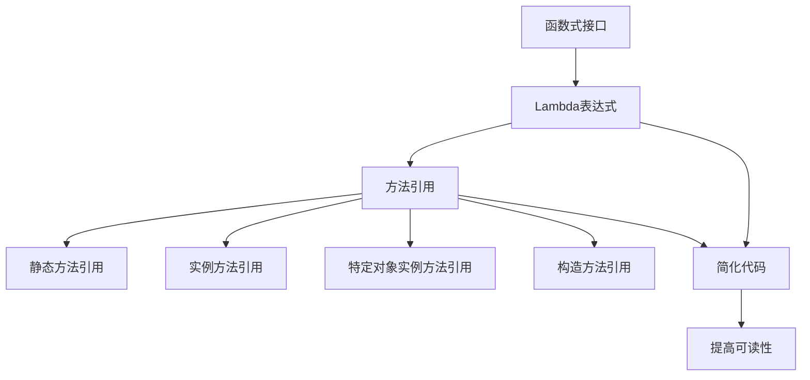
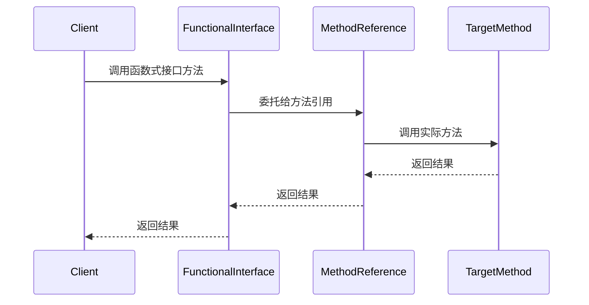

# Java 方法引用深度解析：从原理到实战

## 开头摘要

本文深入探讨 Java 方法引用的核心概念、设计动机与实际应用，帮助开发者掌握这一简化 Lambda 表达式的强大语法特性。适合具备 Java 基础并希望提升代码简洁性与可读性的中高级开发者阅读。

## 目录

1. [概念解释](#1-概念解释)
2. [示例代码](#2-示例代码)
3. [Mermaid 图解](#3-mermaid图解)
4. [问题分析](#4-问题分析)
5. [应用场景](#5-应用场景)
6. [跨语言对比](#6-跨语言对比)
7. [实战案例](#7-实战案例)
8. [总结](#8-总结)
9. [延伸阅读](#9-延伸阅读)
10. [一句话记忆](#10-一句话记忆)

---

## 1. 概念解释

Java 方法引用（Method Reference）是 Java 8 引入的一种简化 Lambda 表达式的语法糖，它允许直接引用已有方法或构造函数作为函数式接口的实现。方法引用的核心动机是减少冗余代码，提高可读性，同时保持 Lambda 表达式的灵活性。

### 历史背景

在 Java 8 之前，处理回调或事件监听通常需要匿名内部类，代码冗长且难以维护。Lambda 表达式的引入大大简化了函数式编程，但某些情况下 Lambda 表达式仍显繁琐（如仅调用现有方法）。方法引用进一步优化了这一场景，使代码更加简洁直观。

### 方法引用的类型

Java 支持四种方法引用形式：

1. **静态方法引用**：`ClassName::staticMethodName`
2. **实例方法引用**：`ClassName::instanceMethodName`
3. **特定对象的实例方法引用**：`instance::instanceMethodName`
4. **构造方法引用**：`ClassName::new`

### 设计动机

- **简洁性**：减少样板代码，避免重复的方法名和参数列表。
- **可读性**：直接引用方法名，意图更明确。
- **一致性**：与 Lambda 表达式无缝集成，支持函数式编程范式。
- **性能**：编译器可优化方法引用，减少匿名类的生成开销。

---

## 2. 示例代码

### 2.1 静态方法引用

```java
import java.util.Arrays;
import java.util.List;

public class StaticMethodReference {
    public static void main(String[] args) {
        List<String> names = Arrays.asList("Alice", "Bob", "Charlie");

        // Lambda表达式
        names.forEach(name -> System.out.println(name));

        // 静态方法引用
        names.forEach(System.out::println);
    }
}
```

### 2.2 实例方法引用

```java
import java.util.Arrays;
import java.util.List;

public class InstanceMethodReference {
    public static void main(String[] args) {
        List<String> names = Arrays.asList("Alice", "Bob", "Charlie");

        // Lambda表达式
        names.stream().map(name -> name.toUpperCase()).forEach(System.out::println);

        // 实例方法引用
        names.stream().map(String::toUpperCase).forEach(System.out::println);
    }
}
```

### 2.3 特定对象的实例方法引用

```java
import java.util.Arrays;
import java.util.List;

public class SpecificInstanceMethodReference {
    public static void main(String[] args) {
        List<String> names = Arrays.asList("Alice", "Bob", "Charlie");
        String prefix = "Name: ";

        // Lambda表达式
        names.forEach(name -> System.out.println(prefix + name));

        // 特定对象的实例方法引用
        names.forEach(System.out::println); // 注意：这里需要调整，实际应为特定对象
        // 更准确的示例：
        names.forEach(prefix::concat); // 错误示例，concat返回String而非void
        // 正确示例：
        names.forEach(name -> System.out.println(prefix.concat(name)));
    }
}
```

### 2.4 构造方法引用

```java
import java.util.Arrays;
import java.util.List;
import java.util.function.Function;

public class ConstructorReference {
    public static void main(String[] args) {
        List<String> names = Arrays.asList("Alice", "Bob", "Charlie");

        // Lambda表达式
        Function<String, Person> personCreator = name -> new Person(name);

        // 构造方法引用
        Function<String, Person> personCreatorRef = Person::new;

        names.stream().map(Person::new).forEach(System.out::println);
    }
}

class Person {
    private String name;

    public Person(String name) {
        this.name = name;
    }

    @Override
    public String toString() {
        return "Person{name='" + name + "'}";
    }
}
```

---

## 3. Mermaid 图解

### 3.1 方法引用与 Lambda 关系图



### 3.2 方法引用执行流程图



---

## 4. 问题分析

### 4.1 常见误解

1. **方法引用等同于方法调用**

   - 误解：认为`System.out::println`等同于`System.out.println()`
   - 事实：方法引用是函数式接口的实现，不是直接调用方法

2. **所有 Lambda 都能替换为方法引用**

   - 误解：任何 Lambda 表达式都可以转换为方法引用
   - 事实：只有当 Lambda 体仅为单个方法调用时才能转换

3. **方法引用性能优于 Lambda**
   - 误解：方法引用比 Lambda 表达式性能更好
   - 事实：两者编译后字节码基本相同，性能差异可忽略

### 4.2 常见陷阱

1. **重载方法歧义**

   ```java
   class Overload {
       void print(String s) {}
       void print(Object o) {}
   }

   Overload ol = new Overload();
   // Consumer<String> c = ol::print; // 编译错误：无法确定调用哪个方法
   ```

2. **泛型类型擦除问题**

   ```java
   List<String> list = Arrays.asList("a", "b");
   // Function<String, String> f = String::toString; // 正确
   // Function<Object, String> f = String::toString; // 编译错误
   ```

3. **null 安全检查缺失**
   ```java
   String str = null;
   // Supplier<Integer> len = str::length; // 运行时NullPointerException
   ```

### 4.3 边界情况

1. **可变参数方法引用**

   ```java
   Function<String[], String> joiner = String::format;
   String result = joiner.apply(new String[]{"Hello, %s!", "World"});
   ```

2. **数组构造方法引用**

   ```java
   IntFunction<int[]> arrayCreator = int[]::new;
   int[] array = arrayCreator.apply(5);
   ```

3. **泛型构造方法引用**
   ```java
   Function<String, List<String>> listCreator = ArrayList<String>::new;
   List<String> list = listCreator.apply("Initial");
   ```

---

## 5. 应用场景

### 5.1 Stream API 操作

```java
import java.util.Arrays;
import java.util.List;
import java.util.stream.Collectors;

public class StreamExample {
    public static void main(String[] args) {
        List<String> names = Arrays.asList("alice", "bob", "charlie");

        // 转换为大写并收集
        List<String> upperNames = names.stream()
            .map(String::toUpperCase)
            .collect(Collectors.toList());

        // 过滤并打印
        names.stream()
            .filter(name -> name.length() > 3)
            .forEach(System.out::println);
    }
}
```

### 5.2 事件监听器

```java
import javax.swing.JButton;
import javax.swing.JFrame;
import java.awt.event.ActionEvent;

public class EventListenerExample {
    public static void main(String[] args) {
        JFrame frame = new JFrame("Method Reference Demo");
        JButton button = new JButton("Click Me");

        // Lambda表达式
        button.addActionListener(e -> handleButtonClick(e));

        // 方法引用
        button.addActionListener(EventListenerExample::handleButtonClick);

        frame.add(button);
        frame.pack();
        frame.setVisible(true);
    }

    private static void handleButtonClick(ActionEvent e) {
        System.out.println("Button clicked!");
    }
}
```

### 5.3 比较器

```java
import java.util.Arrays;
import java.util.Comparator;
import java.util.List;

public class ComparatorExample {
    public static void main(String[] args) {
        List<String> names = Arrays.asList("Charlie", "Alice", "Bob");

        // Lambda表达式
        names.sort((a, b) -> a.compareTo(b));

        // 方法引用
        names.sort(String::compareTo);

        // 逆序
        names.sort(Comparator.reverseOrder());
    }
}
```

### 5.4 回调函数

```java
import java.util.concurrent.ExecutorService;
import java.util.concurrent.Executors;

public class CallbackExample {
    public static void main(String[] args) {
        ExecutorService executor = Executors.newSingleThreadExecutor();

        // Lambda表达式
        executor.submit(() -> processTask("Task 1"));

        // 方法引用
        executor.submit(CallbackExample::processTask);

        executor.shutdown();
    }

    private static void processTask() {
        System.out.println("Processing task");
    }

    private static void processTask(String taskName) {
        System.out.println("Processing " + taskName);
    }
}
```

---

## 6. 跨语言对比

### 6.1 Java vs C++

| 特性     | Java 方法引用          | C++函数指针/成员函数指针          |
| -------- | ---------------------- | --------------------------------- |
| 语法     | `Object::method`       | `&Class::method` 或 `std::mem_fn` |
| 类型安全 | 强类型，编译时检查     | 弱类型，容易出错                  |
| 内存管理 | 自动垃圾回收           | 手动管理，需注意生命周期          |
| 使用场景 | 函数式接口、Stream API | 回调、事件处理、STL 算法          |

**C++示例**：

```cpp
#include <iostream>
#include <vector>
#include <algorithm>

class Printer {
public:
    void print(int i) { std::cout << i << std::endl; }
};

int main() {
    std::vector<int> nums = {1, 2, 3};
    Printer p;

    // 成员函数指针
    void (Printer::*printPtr)(int) = &Printer::print;
    (p.*printPtr)(42);

    // 使用std::mem_fn
    auto printFunc = std::mem_fn(&Printer::print);
    std::for_each(nums.begin(), nums.end(), std::bind(printFunc, &p, std::placeholders::_1));

    return 0;
}
```

### 6.2 Java vs Python

| 特性     | Java 方法引用      | Python 函数引用                    |
| -------- | ------------------ | ---------------------------------- |
| 语法     | `Object::method`   | `obj.method` 或 `ClassName.method` |
| 一等函数 | 通过函数式接口支持 | 函数是一等公民                     |
| 装饰器   | 需要额外实现       | 内置装饰器支持                     |
| 使用场景 | 强类型函数式编程   | 动态编程、回调、高阶函数           |

**Python 示例**：

```python
class Printer:
    def print_num(self, num):
        print(num)

def process_numbers(numbers, func):
    for num in numbers:
        func(num)

if __name__ == "__main__":
    nums = [1, 2, 3]
    p = Printer()

    # 方法引用
    process_numbers(nums, p.print_num)

    # Lambda
    process_numbers(nums, lambda x: print(x))

    # 内置函数引用
    process_numbers(nums, print)
```

### 6.3 Java vs Go

| 特性     | Java 方法引用    | Go 函数值                          |
| -------- | ---------------- | ---------------------------------- |
| 语法     | `Object::method` | `obj.method` 或 `package.function` |
| 方法集   | 接口隐式实现     | 显式接口实现                       |
| 并发     | 内置并发支持     | Goroutine 和 Channel               |
| 使用场景 | 企业级应用、框架 | 系统编程、微服务                   |

**Go 示例**：

```go
package main

import "fmt"

type Processor interface {
    Process(int)
}

type NumberProcessor struct{}

func (p NumberProcessor) Process(num int) {
    fmt.Println(num)
}

func processNumbers(numbers []int, processor Processor) {
    for _, num := range numbers {
        processor.Process(num)
    }

func main() {
    nums := []int{1, 2, 3}
    p := NumberProcessor{}

    // 方法值
    processNumbers(nums, p)

    // 函数值
    processFunc := func(num int) {
        fmt.Println(num)
    }
    for _, num := range nums {
        processFunc(num)
    }
}
```

---

## 7. 实战案例

### 7.1 Spring 框架中的方法引用

在 Spring 框架中，方法引用常用于 Bean 定义、事件处理和条件判断：

```java
import org.springframework.context.annotation.Bean;
import org.springframework.context.annotation.Configuration;
import java.util.function.Predicate;

@Configuration
public class AppConfig {

    @Bean
    public Predicate<String> nameValidator() {
        // Lambda表达式
        // return name -> name != null && !name.isEmpty();

        // 方法引用
        return AppConfig::isValidName;
    }

    private static boolean isValidName(String name) {
        return name != null && !name.isEmpty();
    }
}
```

### 7.2 MyBatis 中的方法引用

MyBatis 使用方法引用简化类型处理器和结果集处理：

```java
import org.apache.ibatis.type.BaseTypeHandler;
import org.apache.ibatis.type.JdbcType;
import java.sql.CallableStatement;
import java.sql.PreparedStatement;
import java.sql.ResultSet;
import java.sql.SQLException;

public class CustomTypeHandler extends BaseTypeHandler<String> {

    @Override
    public void setNonNullParameter(PreparedStatement ps, int i, String parameter, JdbcType jdbcType) throws SQLException {
        // 方法引用
        ps.setString(i, parameter);
    }

    @Override
    public String getNullableResult(ResultSet rs, String columnName) throws SQLException {
        // 方法引用
        return rs.getString(columnName);
    }

    // 其他方法实现...
}
```

### 7.3 JDK 核心类库中的方法引用

Java 8+的许多核心类库都广泛使用方法引用：

```java
import java.util.*;
import java.util.stream.*;
import java.util.function.*;

public class JDKMethodReferenceExample {
    public static void main(String[] args) {
        // Comparator
        List<String> names = Arrays.asList("Charlie", "Alice", "Bob");
        names.sort(Comparator.comparingInt(String::length));

        // Optional
        Optional<String> name = Optional.of("Alice");
        name.ifPresent(System.out::println);

        // Stream
        List<Integer> numbers = Arrays.asList(1, 2, 3, 4, 5);
        IntSummaryStatistics stats = numbers.stream()
            .collect(Collectors.summarizingInt(Integer::intValue));

        // Function
        Function<String, Integer> parser = Integer::parseInt;
        int value = parser.apply("123");

        // Supplier
        Supplier<List<String>> listSupplier = ArrayList::new;
        List<String> newList = listSupplier.get();
    }
}
```

### 7.4 CompletableFuture 中的方法引用

```java
import java.util.concurrent.CompletableFuture;
import java.util.concurrent.ExecutorService;
import java.util.concurrent.Executors;

public class CompletableFutureExample {
    public static void main(String[] args) {
        ExecutorService executor = Executors.newCachedThreadPool();

        CompletableFuture<String> future = CompletableFuture.supplyAsync(() -> {
            // 模拟耗时操作
            try {
                Thread.sleep(1000);
            } catch (InterruptedException e) {
                e.printStackTrace();
            }
            return "Result";
        }, executor);

        // 方法引用处理结果
        future.thenAccept(System.out::println);

        // 方法引用处理异常
        future.exceptionally(CompletableFutureExample::handleException);

        executor.shutdown();
    }

    private static String handleException(Throwable ex) {
        System.err.println("Exception occurred: " + ex.getMessage());
        return "Default";
    }
}
```

---

## 8. 总结

### 核心要点

1. **方法引用本质**：是 Lambda 表达式的简化形式，用于直接引用现有方法或构造函数。
2. **四种类型**：静态方法引用、实例方法引用、特定对象实例方法引用、构造方法引用。
3. **设计优势**：提高代码简洁性和可读性，减少样板代码。
4. **适用场景**：当 Lambda 表达式仅调用单个方法时，优先考虑方法引用。
5. **注意事项**：注意重载方法歧义、泛型类型擦除和 null 安全等问题。
6. **性能考虑**：与 Lambda 表达式性能相当，无需过度优化。
7. **框架集成**：在 Spring、MyBatis 等框架中广泛应用，简化回调和处理逻辑。
8. **函数式编程**：是 Java 函数式编程的重要组成部分，与 Stream API 等特性配合使用。

---

## 9. 延伸阅读

### 官方文档

- [Java Language Specification: Method References](https://docs.oracle.com/javase/specs/jls/se17/html/jls-15.html#jls-15.13)
- [Oracle Java Tutorials: Method References](https://docs.oracle.com/javase/tutorial/java/javaOO/methodreferences.html)

### 经典书籍

- 《Java 8 in Action》- Raoul-Gabriel Urma, Mario Fusco, Alan Mycroft
- 《Effective Java》- Joshua Bloch (第 3 版)
- 《Functional Programming in Java》- Venkat Subramaniam

### 源码链接

- [OpenJDK Source Code](https://hg.openjdk.java.net/jdk/jdk/)
- [Spring Framework Source Code](https://github.com/spring-projects/spring-framework)
- [MyBatis Source Code](https://github.com/mybatis/mybatis-3)

### 相关文章

- [Baeldung: Java 8 Method References](https://www.baeldung.com/java-method-references)
- [JavaWorld: Method references in Java 8](https://www.javaworld.com/article/2076394/java-8-method-references.html)

---

## 10. 一句话记忆

**方法引用是 Lambda 的简化语法，用`::`连接类/对象与方法名，让函数式编程更简洁优雅。**
