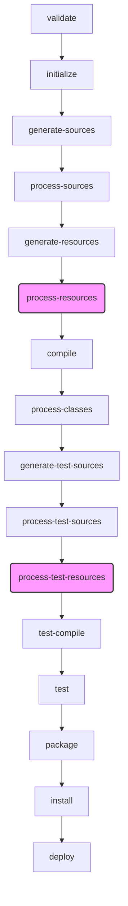

# 深入 Maven 核心：全面解析资源处理（Resource Handling）机制

## 开头摘要

本文深入剖析了 Apache Maven 的核心功能之一——资源处理。我们将探讨 Maven 如何管理、过滤和打包项目中的非代码资源，以及如何利用这一机制实现多环境配置的自动化管理。本文适合希望深入理解 Maven 构建原理、优化项目构建流程的 Java 开发者，以及期望解决在日常开发中遇到的资源配置问题的工程师。

## 目录

*   [1. 核心概念：什么是 Maven 资源？](#1-核心概念什么是-maven-资源)
*   [2. 背后机理：资源处理的生命周期](#2-背后机理资源处理的生命周期)
*   [3. 核心功能：资源过滤（Resource Filtering）](#3-核心功能资源过滤resource-filtering)
*   [4. 高级技巧：多环境配置与 Profiles](#4-高级技巧多环境配置与-profiles)
*   [5. 常见问题与陷阱分析](#5-常见问题与陷阱分析)
*   [6. 实战案例：Spring Boot 中的资源处理](#6-实战案例spring-boot-中的资源处理)
*   [7. 与其他构建工具对比](#7-与其他构建工具对比)
*   [8. 总结](#8-总结)
*   [9. 延伸阅读](#9-延伸阅读)
*   [10. 一句话记忆](#10-一句话记忆)

## 1. 核心概念：什么是 Maven 资源？

在 Maven 的世界里，“资源”（Resources）是指项目中那些不被编译的静态文件。这些文件是应用程序运行时所需要的，例如配置文件（`.properties`, `.xml`）、国际化文件、静态网页内容（HTML, CSS, JS）、图片等。

**设计动机**：将代码与配置分离是软件工程的最佳实践之一。Maven 通过约定优于配置（Convention over Configuration）的原则，标准化了资源文件的存放位置，使得构建过程更加清晰和可预测。默认情况下，Maven 会在以下两个位置查找资源：

*   `src/main/resources`：存放主应用所需的资源文件。
*   `src/test/resources`：存放测试代码所需的资源文件。

在构建过程中，`maven-resources-plugin` 会负责将这些目录下的文件复制到指定的输出目录，通常是 `target/classes` 和 `target/test-classes`，以便它们能被打包到最终的构件（如 JAR 或 WAR）中或在测试时被类加载器找到。

### **示例代码：标准的 Maven 目录结构**

```bash
my-app
|-- pom.xml
`-- src
    |-- main
    |   |-- java
    |   |   `-- com
    |   |       `-- example
    |   |           `-- App.java
    |   `-- resources
    |       |-- application.properties
    |       `-- log4j2.xml
    `-- test
        |-- java
        |   `-- com
        |       `-- example
        |           `-- AppTest.java
        `-- resources
            `-- test-data.csv
```

在这个结构中，`application.properties` 和 `log4j2.xml` 就是主资源，而 `test-data.csv` 是测试资源。

## 2. 背后机理：资源处理的生命周期

Maven 的资源处理不是一个孤立的动作，它深度集成在 Maven 的默认构建生命周期（Default Lifecycle）中。核心工作由 `maven-resources-plugin` 完成，它默认绑定到生命周期的特定阶段。

*   **`process-resources` 阶段**：`resources:resources` 目标（goal）会在此阶段执行，负责处理主资源（`src/main/resources`）。
*   **`process-test-resources` 阶段**：`resources:testResources` 目标会在此阶段执行，负责处理测试资源（`src/test/resources`）。

这意味着，当你执行 `mvn compile` 命令时，Maven 会首先执行 `process-resources` 阶段，将资源文件复制到 `target/classes`，然后才执行 `compile` 阶段编译 Java 代码。

### **Mermaid 流程图：资源处理在构建中的位置**



上图清晰地展示了 `process-resources` 和 `process-test-resources` 在 `compile` 和 `test-compile` 之前执行，确保了编译和测试时资源文件的可用性。

## 3. 核心功能：资源过滤（Resource Filtering）

资源过滤是 Maven 资源处理中最强大、最实用的功能。它允许你在资源文件中使用占位符（`${...}`），并在构建时将这些占位符替换为 `pom.xml` 中定义的值、系统属性或外部属性文件中的值。

**设计动机**：在实际项目中，很多配置项（如数据库连接、API 地址）在不同环境（开发、测试、生产）中是不同的。资源过滤提供了一种优雅的方式来管理这些差异，而无需为每个环境维护一套完全独立的配置文件。

### **示例代码：启用资源过滤**

1.  **在 `pom.xml` 中定义属性并启用过滤：**

    ```xml
    <project>
        ...
        <properties>
            <project.build.sourceEncoding>UTF-8</project.build.sourceEncoding>
            <database.url>jdbc:mysql://localhost:3306/dev_db</database.url>
            <database.username>dev_user</database.username>
        </properties>

        <build>
            <resources>
                <resource>
                    <directory>src/main/resources</directory>
                    <filtering>true</filtering> <!-- 启用过滤 -->
                </resource>
            </resources>
        </build>
        ...
    </project>
    ```

2.  **在资源文件中使用占位符：**
    `src/main/resources/config.properties`

    ```properties
    db.url=${database.url}
    db.username=${database.username}
    app.version=${project.version}
    ```

当执行 `mvn process-resources` 或之后的任何构建阶段时，`target/classes/config.properties` 文件的内容将被替换为：

```properties
db.url=jdbc:mysql://localhost:3306/dev_db
db.username=dev_user
app.version=1.0.0-SNAPSHOT
```

### **问题分析：资源过滤的常见误区**

*   **误区一：所有文件都会被过滤**：默认情况下，启用过滤后，`maven-resources-plugin` 会尝试过滤指定目录下的所有文本文件。但它会智能地跳过二进制文件（如图片、字体文件），以防文件损坏。 如果需要更精细的控制，应使用 `<includes>` 和 `<excludes>` 标签。
*   **误区二：默认开启过滤**：资源过滤默认是关闭的 (`<filtering>false</filtering>`)，必须显式开启。 这是为了防止无意中替换了文件中恰好符合 `${...}` 格式的字符串。
*   **误区三：占位符分隔符混淆**：Maven 默认的占位符是 `${...}`。虽然可以自定义，但不推荐这样做，以免破坏通用性和可读性。

## 4. 高级技巧：多环境配置与 Profiles

将资源过滤与 Maven Profiles 结合使用，是实现多环境自动化构建的“杀手锏”。Profiles 允许你定义多组构建配置，并在构建时通过命令行参数激活其中一组。

**设计动机**：为开发、测试、生产等不同环境提供一套自动化的、可靠的配置切换机制，避免手动修改配置文件带来的风险。

### **示例代码：使用 Profiles 管理多环境配置**

```xml
<project>
    ...
    <profiles>
        <!-- 开发环境 (默认激活) -->
        <profile>
            <id>dev</id>
            <activation>
                <activeByDefault>true</activeByDefault>
            </activation>
            <properties>
                <db.url>jdbc:mysql://dev-host:3306/my_db</db.url>
                <db.user>dev_user</db.user>
                <db.pass>dev_password</db.pass>
            </properties>
        </profile>

        <!-- 生产环境 -->
        <profile>
            <id>prod</id>
            <properties>
                <db.url>jdbc:mysql://prod-host:3306/my_db</db.url>
                <db.user>prod_user</db.user>
                <db.pass>prod_password</db.pass>
            </properties>
        </profile>
    </profiles>

    <build>
        <resources>
            <resource>
                <directory>src/main/resources</directory>
                <filtering>true</filtering>
            </resource>
        </resources>
    </build>
    ...
</project>
```

现在，你可以通过不同的命令来为特定环境打包：

*   **构建开发环境包**：`mvn clean package` (因为 `dev` profile 默认激活)
*   **构建生产环境包**：`mvn clean package -P prod`

构建 `prod` 包时，资源文件中的 `${db.url}` 将被替换为生产环境的数据库地址。

### **Mermaid 类图：Profiles 与 Properties 的关系**

```mermaid
classDiagram
    class pom.xml {
        +properties
        +profiles
        +build
    }
    class Profile {
        +id
        +activation
        +properties
    }
    class Resource {
        +directory
        +filtering
    }
    pom.xml *-- "1..*" Profile
    pom.xml o-- "1" build
    build *-- "1..*" Resource

    class Placeholder {
        <<file>>
        content: "db.url=${db.url}"
    }
    Profile ..> Placeholder : provides values for
    pom.xml ..> Placeholder : provides values for

```

## 5. 常见问题与陷阱分析

1.  **文件编码问题**：如果资源文件包含非 ASCII 字符，错误的编码可能导致乱码。务必在 `pom.xml` 的 `<properties>` 中统一指定项目编码。
    ```xml
    <properties>
        <project.build.sourceEncoding>UTF-8</project.build.sourceEncoding>
    </properties>
    ```

2.  **意外过滤二进制文件**：当一个二进制文件（如 `docx`）恰好包含了 `${...}` 格式的字节序列时，错误的过滤配置可能损坏该文件。最佳实践是明确指定哪些文件需要过滤，而其他文件直接复制。

    ```xml
    <build>
        <resources>
            <!-- 只过滤 properties 和 xml 文件 -->
            <resource>
                <directory>src/main/resources</directory>
                <filtering>true</filtering>
                <includes>
                    <include>**/*.properties</include>
                    <include>**/*.xml</include>
                </includes>
            </resource>
            <!-- 复制其他所有文件，不过滤 -->
            <resource>
                <directory>src/main/resources</directory>
                <filtering>false</filtering>
                <excludes>
                    <exclude>**/*.properties</exclude>
                    <exclude>**/*.xml</exclude>
                </excludes>
            </resource>
        </resources>
    </build>
    ```

3.  **IDE 与 Maven 构建不一致**：有时在 IDE（如 IntelliJ IDEA, Eclipse）中运行正常，但通过 `mvn` 命令构建却失败。这通常是由于 IDE 的构建机制与 Maven 的生命周期不完全一致。请确保 IDE 的项目设置正确代理了 Maven 的构建过程，并始终以 Maven 命令行的构建结果为准。

## 6. 实战案例：Spring Boot 中的资源处理

Spring Boot 项目严重依赖于其强大的自动配置机制，而 `application.properties` 或 `application.yml` 是这一机制的核心。Maven 的资源处理在其中扮演了关键角色。

`spring-boot-starter-parent` POM 已经为我们预置了合理的资源处理配置。它默认启用了对 `application.properties` 和 `application.yml` 的资源过滤，包括特定 profile 的文件（如 `application-dev.properties`）。

### **Spring Boot 如何利用 Maven Profiles**

Spring Boot 的 Profile 概念与 Maven 的 Profile 概念可以完美结合。

1.  **Maven Profile**：在构建时（Compile Time）决定哪些配置值被打包进最终的构件中。
2.  **Spring Profile**：在运行时（Runtime）决定应用程序的哪些 Bean 和配置被激活。

一个常见的实践是：使用 Maven Profile 来设置 Spring 的激活 Profile。

**示例 `pom.xml`**
```xml
<profiles>
    <profile>
        <id>dev</id>
        <activation><activeByDefault>true</activeByDefault></activation>
        <properties>
            <spring.profiles.active>dev</spring.profiles.active>
        </properties>
    </profile>
    <profile>
        <id>prod</id>
        <properties>
            <spring.profiles.active>prod</spring.profiles.active>
        </properties>
    </profile>
</profiles>
```

**`application.properties`**
```properties
spring.profiles.active=@spring.profiles.active@
```
*注意：Spring Boot 推荐使用 `@...@` 作为占位符，以避免与 Maven 的 `${...}` 冲突。需要在 `maven-resources-plugin` 中配置。*

当使用 `mvn package -P prod` 打包后，生成的 `application.properties` 文件会包含 `spring.profiles.active=prod`，从而在应用启动时自动激活 Spring 的 `prod` profile。

## 7. 与其他构建工具对比

*   **Maven vs. Gradle**
    *   **配置方式**：Maven 使用 XML，结构严谨但略显冗长。Gradle 使用 Groovy 或 Kotlin DSL，更灵活、代码更简洁。
    *   **资源处理**：两者都支持资源复制和过滤。Gradle 的 `processResources` 任务提供了更灵活的编程式配置能力，可以直接在构建脚本中用代码处理文件内容，而 Maven 主要依赖于插件的声明式配置。
    *   **性能**：Gradle 通常在增量构建和缓存方面表现更优。

## 8. 总结

*   **核心机制**：Maven 通过 `maven-resources-plugin` 在构建生命周期的 `process-resources` 阶段处理非代码资源。
*   **默认约定**：主资源位于 `src/main/resources`，测试资源位于 `src/test/resources`。
*   **关键功能**：资源过滤（Resource Filtering）允许在构建时动态替换配置文件中的占位符，是实现环境配置管理的核心。
*   **最佳实践**：结合 Profiles，可以为不同环境（开发、测试、生产）创建可移植、自动化的构建流程。
*   **常见陷阱**：需注意文件编码、二进制文件过滤和 IDE 与命令行构建的差异。

## 9. 延伸阅读

*   [Apache Maven Resources Plugin 官方文档](https://maven.apache.org/plugins/maven-resources-plugin/)
*   [Maven: The Complete Reference - Chapter 9: Properties and Resource Filtering](https://books.sonatype.com/mvnref-book/reference/resource-filtering-sect-properties.html)
*   [Spring Boot 官方文档 - Maven Plugin](https://docs.spring.io/spring-boot/docs/current/maven-plugin/reference/htmlsingle/)

## 10. 一句话记忆

**通过在构建时过滤资源文件，Maven 将环境特定的配置从代码中解耦，实现了“一次构建，到处部署”的灵活性。**