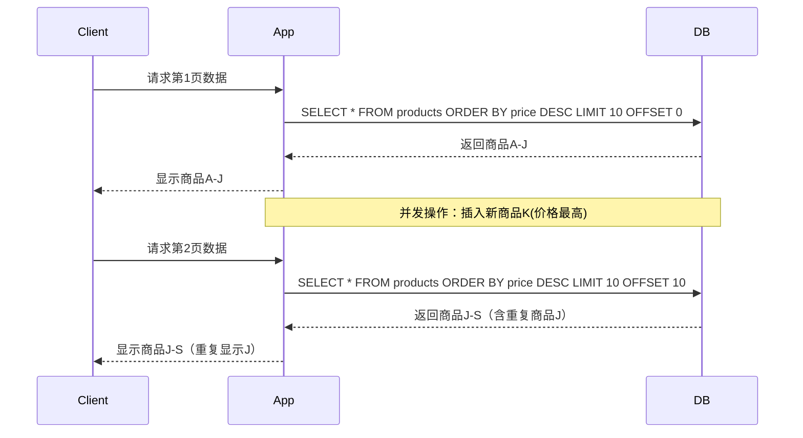
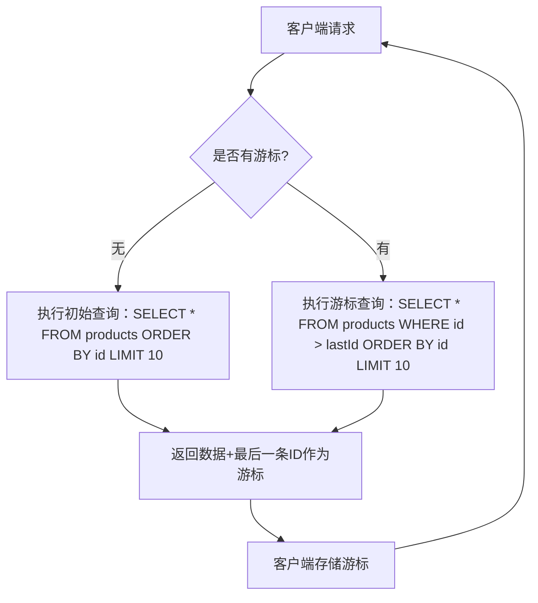

# 数据库分页不稳定：成因、误区与解决方案

## 开头摘要
本文深入剖析数据库分页查询中的不稳定现象，揭示其技术根源并提供实用解决方案，帮助开发者构建健壮的分页功能。适合后端开发人员、数据库管理员及对数据一致性有高要求的系统架构师。

## 目录
- [1. 概念解释](#1-概念解释)
- [2. 示例代码](#2-示例代码)
- [3. Mermaid图](#3-mermaid图)
- [4. 问题分析](#4-问题分析)
- [5. 应用场景](#5-应用场景)
- [6. 跨语言或跨框架对比](#6-跨语言或跨框架对比)
- [7. 实战案例](#7-实战案例)
- [8. 总结](#8-总结)
- [9. 延伸阅读](#9-延伸阅读)
- [10. 一句话记忆](#10-一句话记忆)

---

## 1. 概念解释
数据库分页不稳定是指在使用传统`LIMIT offset, size`方式进行分页查询时，由于数据在两次查询间发生变化（增删改），导致后续分页结果出现数据重复或遗漏的现象。这种不稳定性在动态数据环境中尤为突出。

**历史背景**：传统分页方式源于静态数据时代的设计，当时数据变动较少。随着Web应用的发展，实时数据交互成为常态，这种分页方式的缺陷逐渐暴露。核心问题在于`OFFSET`的语义是"跳过前N条记录"，而非"从某个位置开始"，当记录顺序因数据变动而改变时，就会导致分页错位。

**技术本质**：分页不稳定源于三个关键因素：
1. **数据变动**：两次分页查询间发生DML操作
2. **非原子性**：分页操作非原子事务，无法保证数据快照一致性
3. **OFFSET语义缺陷**：基于物理位置的分页在逻辑数据变动时失效

---

## 2. 示例代码
以下通过Java和MySQL演示分页不稳定场景：

```java
// 实体类
public class Product {
    private Long id;
    private String name;
    private BigDecimal price;
    // getters & setters
}

// 不稳定分页实现
public List<Product> unstablePagination(int page, int size) {
    int offset = (page - 1) * size;
    String sql = "SELECT * FROM products ORDER BY price DESC LIMIT ? OFFSET ?";
    
    return jdbcTemplate.query(sql, 
        new Object[]{size, offset},
        (rs, rowNum) -> new Product(
            rs.getLong("id"),
            rs.getString("name"),
            rs.getBigDecimal("price")
        ));
}

// 模拟数据变动导致的不稳定
public void demonstrateInstability() {
    // 第一页查询（价格降序）
    List<Product> page1 = unstablePagination(1, 10);
    
    // 在两次查询间插入新数据
    jdbcTemplate.update(
        "INSERT INTO products(name, price) VALUES('New Product', 999.99)");
    
    // 第二页查询
    List<Product> page2 = unstablePagination(2, 10);
    
    // 问题：page2可能包含page1已显示的数据（因新插入高价商品改变了排序）
}
```

**关键问题**：当新插入的商品价格高于第一页所有商品时，会导致原第一页的部分商品被挤到第二页，造成数据重复显示。

---

## 3. Mermaid图
### 分页不稳定流程图


### 游标分页解决方案


---

## 4. 问题分析
### 常见误解
1. **事务能解决问题**：  
   误解：使用事务可以保证分页稳定性  
   实际：事务只能保证单次查询的一致性，无法解决两次查询间的数据变动问题

2. **ORDER BY足够**：  
   误解：只要添加ORDER BY就能避免问题  
   实际：ORDER BY只保证单次查询的顺序，无法阻止数据变动导致的分页错位

3. **缓存可解决**：  
   误解：缓存分页结果能避免不稳定  
   实际：缓存会引入数据延迟问题，且在高并发场景下缓存失效策略复杂

### 技术陷阱
1. **深度分页性能陷阱**：  
   `OFFSET 1000000`会导致数据库扫描大量无用数据，性能急剧下降

2. **排序字段不唯一**：  
   当排序字段存在重复值时，分页边界可能出现不确定行为

3. **删除操作影响**：  
   分页查询间删除数据可能导致返回行数少于预期

### 边界情况
- **空结果集**：当分页查询结果为空时，客户端应正确处理
- **数据不足**：请求页数超过实际数据量时的处理
- **排序字段变更**：运行时修改排序字段导致的分页混乱

---

## 5. 应用场景
### 高频变动数据场景
1. **实时订单系统**：新订单持续插入，价格排序分页易出现重复
2. **社交媒体动态**：用户发布新内容导致时间线分页错位
3. **物联网数据流**：传感器数据持续写入，时间分页不稳定

### 大数据量场景
1. **日志分析系统**：百万级日志分页查询，OFFSET性能极差
2. **电商商品列表**：商品信息频繁更新，价格排序分页不稳定
3. **金融交易记录**：高频交易数据分页展示易出现重复或遗漏

### 解决方案选择
| 场景 | 传统分页 | 游标分页 | 覆盖索引 | 预计算分页 |
|------|----------|----------|----------|------------|
| 静态数据 | ✓ | ✓ | ✓ | ✓ |
| 低频变动 | ⚠️ | ✓ | ✓ | ✓ |
| 高频变动 | ✗ | ✓ | ⚠️ | ✓ |
| 随机访问 | ✓ | ✗ | ✓ | ✓ |
| 深度分页 | ✗ | ✓ | ⚠️ | ✓ |

---

## 6. 跨语言或跨框架对比
### Java生态
**Spring Data JPA**：
```java
// 传统分页（不稳定）
Page<Product> findByPriceGreaterThan(BigDecimal price, Pageable pageable);

// 游标分页实现
@Query("SELECT p FROM Product p WHERE p.id > :lastId ORDER BY p.id")
List<Product> findNextPage(@Param("lastId") Long lastId, Pageable pageable);
```

**MyBatis**：
```xml
<!-- 传统分页 -->
<select id="selectByPage" resultType="Product">
    SELECT * FROM products ORDER BY price DESC 
    LIMIT #{size} OFFSET #{offset}
</select>

<!-- 游标分页 -->
<select id="selectByCursor" resultType="Product">
    SELECT * FROM products 
    WHERE id > #{lastId} 
    ORDER BY id 
    LIMIT #{size}
</select>
```

### Python生态
**Django ORM**：
```python
# 传统分页（不稳定）
def get_unstable_page(page_number):
    return Product.objects.order_by('-price').all()[
        (page_number-1)*10 : page_number*10
    ]

# 游标分页
def get_stable_page(last_id=None):
    queryset = Product.objects.order_by('id')
    if last_id:
        queryset = queryset.filter(id__gt=last_id)
    return queryset[:10]
```

**SQLAlchemy**：
```python
# 传统分页
def unstable_pagination(session, page, size):
    return session.query(Product)\
        .order_by(Product.price.desc())\
        .offset((page-1)*size)\
        .limit(size)\
        .all()

# 游标分页
def stable_pagination(session, last_id, size):
    query = session.query(Product).order_by(Product.id)
    if last_id:
        query = query.filter(Product.id > last_id)
    return query.limit(size).all()
```

### Go生态
**GORM**：
```go
// 传统分页（不稳定）
func UnstablePagination(db *gorm.DB, page, size int) []Product {
    var products []Product
    db.Order("price desc").Offset((page-1)*size).Limit(size).Find(&products)
    return products
}

// 游标分页
func StablePagination(db *gorm.DB, lastID uint, size int) []Product {
    var products []Product
    query := db.Order("id").Limit(size)
    if lastID > 0 {
        query = query.Where("id > ?", lastID)
    }
    query.Find(&products)
    return products
}
```

### 对比总结
| 特性 | Java生态 | Python生态 | Go生态 |
|------|----------|------------|--------|
| 传统分页支持 | 完善 | 完善 | 完善 |
| 游标分页支持 | 需自定义 | 需自定义 | 需自定义 |
| 框架集成度 | 高（Spring Data） | 中（Django） | 中（GORM） |
| 性能优化 | 覆盖索引支持 | 覆盖索引支持 | 覆盖索引支持 |
| 学习曲线 | 中等 | 低 | 中等 |

---

## 7. 实战案例
### Spring Boot + MyBatis实现游标分页

**数据库表结构**：
```sql
CREATE TABLE products (
    id BIGINT AUTO_INCREMENT PRIMARY KEY,
    name VARCHAR(100) NOT NULL,
    price DECIMAL(10,2) NOT NULL,
    create_time DATETIME DEFAULT CURRENT_TIMESTAMP,
    INDEX idx_price (price),
    INDEX idx_id (id)
);
```

**Mapper接口**：
```java
public interface ProductMapper {
    // 游标分页查询
    @Select("SELECT * FROM products WHERE id > #{lastId} ORDER BY id LIMIT #{size}")
    List<Product> selectByCursor(@Param("lastId") Long lastId, @Param("size") int size);
    
    // 获取总记录数（用于显示总页数）
    @Select("SELECT COUNT(*) FROM products")
    long countTotal();
}
```

**服务层实现**：
```java
@Service
public class ProductService {
    @Autowired
    private ProductMapper productMapper;
    
    public PageResult<Product> getProductsByCursor(Long lastId, int size) {
        List<Product> products = productMapper.selectByCursor(lastId, size);
        Long newLastId = products.isEmpty() ? null : 
            products.get(products.size() - 1).getId();
        
        return new PageResult<>(
            products,
            newLastId,
            productMapper.countTotal()
        );
    }
}

// 分页结果封装
@Data
@AllArgsConstructor
public class PageResult<T> {
    private List<T> data;
    private Long nextCursor;
    private long total;
}
```

**控制器实现**：
```java
@RestController
@RequestMapping("/api/products")
public class ProductController {
    @Autowired
    private ProductService productService;
    
    @GetMapping
    public ResponseEntity<PageResult<Product>> getProducts(
            @RequestParam(required = false) Long cursor,
            @RequestParam(defaultValue = "10") int size) {
        
        PageResult<Product> result = productService.getProductsByCursor(cursor, size);
        return ResponseEntity.ok(result);
    }
}
```

**前端调用示例**：
```javascript
// 初始加载
async function loadProducts() {
    const response = await fetch('/api/products?size=10');
    const result = await response.json();
    displayProducts(result.data);
    saveCursor(result.nextCursor);
}

// 加载下一页
async function loadNextPage() {
    const cursor = getSavedCursor();
    if (!cursor) return;
    
    const response = await fetch(`/api/products?cursor=${cursor}&size=10`);
    const result = await response.json();
    displayProducts(result.data);
    saveCursor(result.nextCursor);
}
```

**优化点**：
1. 使用覆盖索引优化查询性能
2. 添加缓存层减少数据库压力
3. 实现游标加密防止客户端篡改
4. 添加分页大小限制防止恶意请求

---

## 8. 总结
- **核心问题**：传统`LIMIT offset`分页在数据变动时会导致重复或遗漏数据
- **根本原因**：OFFSET基于物理位置而非逻辑标识，数据变动导致记录顺序改变
- **主要场景**：高频数据变动、深度分页、实时数据展示
- **解决方案**：
  - 游标分页（推荐）：基于唯一有序列（如自增ID）的分页
  - 覆盖索引：优化排序和分页性能
  - 预计算分页：适合静态或低频变动数据
- **最佳实践**：
  - 优先使用游标分页替代传统分页
  - 为排序字段创建合适索引
  - 避免深度分页（OFFSET过大）
  - 考虑业务场景选择合适方案
- **注意事项**：
  - 游标分页不支持随机跳页
  - 需处理游标失效边界情况
  - 大数据量时注意内存消耗

---

## 9. 延伸阅读
### 官方文档
- [MySQL 8.0: LIMIT Clause](https://dev.mysql.com/doc/refman/8.0/en/select.html)
- [PostgreSQL: LIMIT and OFFSET](https://www.postgresql.org/docs/current/queries-limit.html)
- [Oracle: row limiting clause](https://docs.oracle.com/en/database/oracle/oracle-database/19/sqlrf/SELECT.html#GUID-CFA006CA-6FF1-4972-821E-6996142A51C6__BABDGFIC)

### 经典书籍
- 《高性能MySQL》第6章：查询性能优化
- 《SQL权威指南》第13章：高级查询技术
- 《数据库系统概念》第15章：事务管理

### 技术文章
- [Pagination Done Right the PostgreSQL Way](https://www.citusdata.com/blog/2018/08/29/pagination-done-right-postgresql/)
- [Cursor-based Pagination](https://relay.dev/graphql/connections.htm)
- [Deep Pagination: The Wrong Way and The Right Way](https://use-the-index-luke.com/no-offset)

### 源码参考
- [Spring Data: Pagination](https://github.com/spring-projects/spring-data-commons)
- [MyBatis: PaginationInterceptor](https://github.com/mybatis/mybatis-3)
- [Django: Paginator](https://github.com/django/django)

---

## 10. 一句话记忆
**游标分页替OFFSET，数据变动不惊慌。**