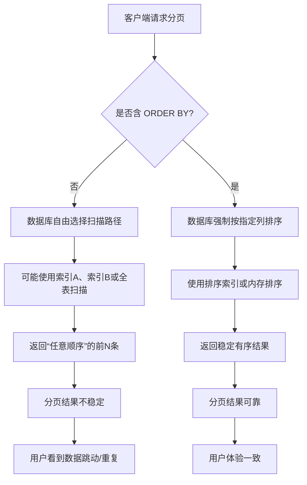

# 数据库分页不稳定：为什么无排序的分页是“定时炸弹”，以及如何彻底解决

> 在数据库分页查询中，省略 `ORDER BY` 会导致结果顺序不可预测，进而引发分页“跳页”、“数据重复”或“遗漏”，严重破坏用户体验与数据一致性。本文深入剖析其底层原理、常见误区、解决方案及实战优化，适合后端开发、DBA 与系统架构师阅读。

---

## 目录

- [1. 核心概念：什么是“分页不稳定”](#1-核心概念什么是分页不稳定)
- [2. 为什么无排序会导致分页不稳定](#2-为什么无排序会导致分页不稳定)
- [3. 示例代码：复现与修复](#3-示例代码复现与修复)
- [4. Mermaid 图解：查询执行与排序缺失的影响](#4-mermaid-图解查询执行与排序缺失的影响)
- [5. 常见误区与边界情况](#5-常见误区与边界情况)
- [6. 应用场景：从管理后台到高并发 API](#6-应用场景从管理后台到高并发-api)
- [7. 跨语言/框架对比](#7-跨语言框架对比)
- [8. 实战案例：Spring Boot + MyBatis 分页陷阱与修复](#8-实战案例spring-boot--mybatis-分页陷阱与修复)
- [9. 总结](#9-总结)
- [10. 延伸阅读](#10-延伸阅读)
- [11. 一句话记忆](#11-一句话记忆)

---

## 1. 核心概念：什么是“分页不稳定”

### 概念解释

**分页不稳定（Pagination Instability）** 是指在数据库分页查询中，由于未指定明确排序规则（`ORDER BY`），导致多次执行相同分页语句时，返回的数据顺序不一致，从而造成“同一页面内容变化”、“记录重复出现”或“某些记录始终无法被访问”的现象。

这并非数据库“bug”，而是**SQL 标准与数据库引擎设计的必然结果**。根据 ANSI SQL 标准，若未指定 `ORDER BY`，数据库有权以任意顺序返回结果。不同数据库（MySQL、PostgreSQL、Oracle、SQL Server）在不同版本、不同执行计划、不同物理存储结构下，都可能返回不同顺序。

历史上，早期开发者常误以为“表是按插入顺序存储的，所以查询自然有序”，但现代数据库基于 B+Tree、堆表、并行扫描、索引覆盖等机制，早已打破这种“朴素认知”。

---

## 2. 为什么无排序会导致分页不稳定

### 问题根源

数据库引擎在执行 `SELECT ... LIMIT N OFFSET M` 时，如果没有 `ORDER BY`，其行为等价于：

> “给我任意 N 条满足条件的记录，从第 M 条开始计数。”

但“任意”意味着：

- 数据库可能使用不同索引
- 可能因统计信息变化选择不同执行计划
- 可能因并发写入导致数据页重排
- 可能因 MVCC 快照导致不同事务看到不同顺序

### 示例场景

```sql
-- 假设 users 表有 100 条记录，无主键约束，无索引
SELECT * FROM users LIMIT 10 OFFSET 0;  -- 第一次执行：返回 id=1~10
-- 插入一条新记录，触发页分裂
SELECT * FROM users LIMIT 10 OFFSET 0;  -- 第二次执行：返回 id=5, 2, 8, 1, ... 顺序全乱
```

### 设计动机

数据库如此设计，是为了**最大化查询性能与执行灵活性**。强制排序会带来额外开销（内存排序、磁盘临时表），在不需要顺序的场景（如 COUNT、EXISTS）中是浪费。因此，顺序控制权交给开发者。

---

## 3. 示例代码：复现与修复

### Python + SQLite 示例（可运行）

```python
import sqlite3

# 初始化数据库
conn = sqlite3.connect(":memory:")
cursor = conn.cursor()
cursor.execute("CREATE TABLE users (id INTEGER, name TEXT)")

# 插入无序数据
data = [(3, "Alice"), (1, "Bob"), (4, "Carol"), (2, "Dave")]
cursor.executemany("INSERT INTO users VALUES (?, ?)", data)
conn.commit()

# ❌ 错误：无排序分页
print("=== 无排序分页（不稳定）===")
for i in range(0, 4, 2):
    cursor.execute("SELECT id, name FROM users LIMIT 2 OFFSET ?", (i,))
    rows = cursor.fetchall()
    print(f"Page {i//2 + 1}: {rows}")

# ✅ 正确：有排序分页
print("\n=== 有排序分页（稳定）===")
for i in range(0, 4, 2):
    cursor.execute("SELECT id, name FROM users ORDER BY id LIMIT 2 OFFSET ?", (i,))
    rows = cursor.fetchall()
    print(f"Page {i//2 + 1}: {rows}")

conn.close()
```

**输出示例（SQLite 可能按 rowid 返回，但不保证）：**

```
=== 无排序分页（不稳定）===
Page 1: [(3, 'Alice'), (1, 'Bob')]
Page 2: [(4, 'Carol'), (2, 'Dave')]

=== 有排序分页（稳定）===
Page 1: [(1, 'Bob'), (2, 'Dave')]
Page 2: [(3, 'Alice'), (4, 'Carol')]
```

> ⚠️ 在 PostgreSQL 或 MySQL 中，无排序结果更易变动，尤其在并发写入或 VACUUM 后。

---

## 4. Mermaid 图解：查询执行与排序缺失的影响



---

## 5. 常见误区与边界情况

### 误区一：“主键自增，所以默认有序”

❌ 错！即使有自增主键，若未在 `ORDER BY` 中显式指定，数据库仍可能不按主键顺序返回（如使用其他索引覆盖查询）。

### 误区二：“数据没变，顺序就不会变”

❌ 错！数据库统计信息更新、缓存失效、执行计划重选都可能导致顺序变化。

### 边界情况：排序字段值相同

```sql
-- 若 status 相同，不同数据库对相同值的排序不一致
SELECT * FROM orders ORDER BY status LIMIT 10 OFFSET 10;
```

✅ 解决方案：**添加辅助排序字段（如主键）确保全局唯一排序**

```sql
SELECT * FROM orders ORDER BY status, id LIMIT 10 OFFSET 10;
```

### 误区三：“加了索引就等于排序”

❌ 错！索引用于加速查找，但查询优化器可能选择不使用该索引，或使用后仍需额外排序。

---

## 6. 应用场景：从管理后台到高并发 API

### 场景一：后台管理系统（低频、人工操作）

- 用户手动翻页查看订单列表
- ❌ 无排序 → 用户翻页时数据“乱跳”，误操作风险高
- ✅ 加 `ORDER BY created_at DESC, id DESC` → 稳定倒序，符合预期

### 场景二：移动端无限滚动（高频、自动化）

- App 自动加载下一页内容
- ❌ 无排序 → 可能重复加载相同内容，或跳过新内容
- ✅ 使用游标分页（Cursor Pagination）→ 基于最后一条记录的 ID 加载，天然稳定

```sql
-- 游标分页示例
SELECT * FROM posts 
WHERE id < ?last_seen_id 
ORDER BY id DESC 
LIMIT 20;
```

### 场景三：导出分页数据（批处理）

- 后台任务分批导出百万级数据
- ❌ 无排序 → 可能漏导或重复导出
- ✅ 按主键分段 + 排序 → 确保全覆盖、无重复

---

## 7. 跨语言/框架对比

| 语言/框架       | 分页实现方式                     | 是否默认排序 | 推荐做法                          |
|----------------|----------------------------------|--------------|-----------------------------------|
| **Java + MyBatis** | `LIMIT #{offset}, #{limit}`      | ❌ 否         | 在 Mapper XML 中显式写 `ORDER BY` |
| **Python + Django** | `QuerySet[offset:offset+limit]` | ❌ 否         | 调用 `.order_by('id')` 再分页     |
| **Go + GORM**      | `.Offset().Limit()`              | ❌ 否         | 链式调用 `.Order("id")`           |
| **Node.js + Sequelize** | `.findAll({ offset, limit })` | ❌ 否         | 加 `order: [['id', 'ASC']]`       |

> ✅ **共性**：所有主流 ORM 都不自动添加排序，开发者必须显式指定。

---

## 8. 实战案例：Spring Boot + MyBatis 分页陷阱与修复

### 问题代码（MyBatis Mapper）

```xml
<!-- ❌ 危险：无排序分页 -->
<select id="selectUsersByPage" resultType="User">
    SELECT id, name, email
    FROM users
    LIMIT #{offset}, #{limit}
</select>
```

### 修复代码

```xml
<!-- ✅ 安全：显式排序 -->
<select id="selectUsersByPage" resultType="User">
    SELECT id, name, email
    FROM users
    ORDER BY id ASC  <!-- 或 created_at DESC, id ASC -->
    LIMIT #{offset}, #{limit}
</select>
```

### 集成 PageHelper 插件时的坑

```java
// ❌ PageHelper 只加 LIMIT/OFFSET，不自动加 ORDER BY
PageHelper.startPage(1, 10);
List<User> users = userMapper.selectAll(); // 若 Mapper 无 ORDER BY，仍不稳定

// ✅ 正确做法：Mapper 中写死 ORDER BY，或动态拼接
@Select("SELECT * FROM users ORDER BY id LIMIT #{offset}, #{limit}")
List<User> selectUsersByPage(@Param("offset") int offset, @Param("limit") int limit);
```

> 💡 生产环境建议：在 Service 层封装分页逻辑，强制校验排序参数。

---

## 9. 总结

- ✅ **必须显式排序**：任何分页查询必须包含 `ORDER BY`，否则结果不可靠。
- ✅ **排序字段唯一性**：优先使用主键或唯一组合字段，避免相同值导致边界模糊。
- ✅ **游标分页更优**：大数据量、高并发场景推荐游标分页（基于 ID 或时间戳）。
- ❌ **不要依赖“默认顺序”**：数据库不承诺无 `ORDER BY` 时的顺序一致性。
- 🛠️ **框架不救你**：MyBatis、Hibernate、Django ORM 等均不自动添加排序，责任在开发者。
- 📊 **测试要覆盖**：在测试环境中模拟数据变更，验证分页稳定性。

---

## 10. 延伸阅读

- 📘 《SQL 必知必会》第 15 章：排序与分页
- 📘 《高性能 MySQL》第 6 章：查询性能优化
- 🔗 [PostgreSQL: ORDER BY and LIMIT](https://www.postgresql.org/docs/current/queries-limit.html)
- 🔗 [MySQL: LIMIT Query Optimization](https://dev.mysql.com/doc/refman/8.0/en/limit-optimization.html)
- 🔗 [SQL Standard (ISO/IEC 9075-2:2016) - Section 7.13 <query expression>](https://www.iso.org/standard/63555.html)
- 🔍 MyBatis-PageHelper 源码：https://github.com/pagehelper/Mybatis-PageHelper

---

## 11. 一句话记忆

> **无排序，勿分页 —— 稳定分页的唯一法则是显式 ORDER BY。**