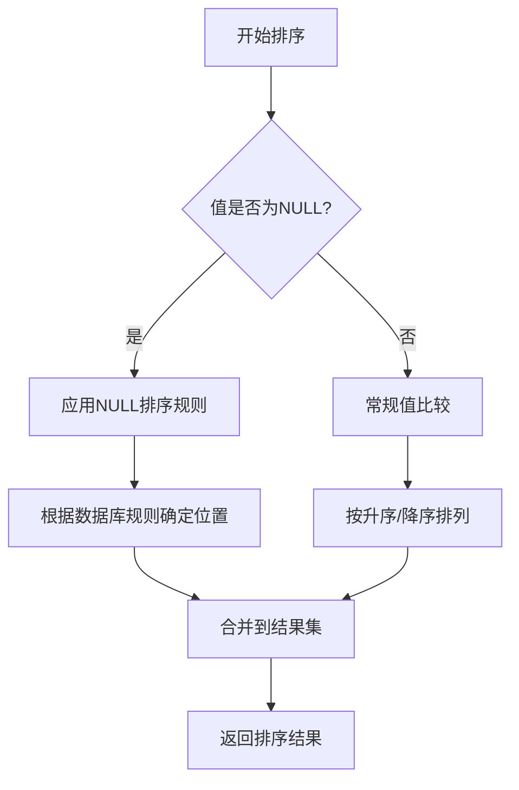
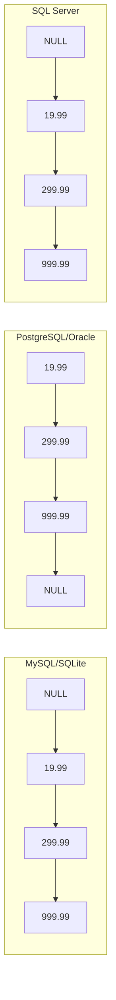
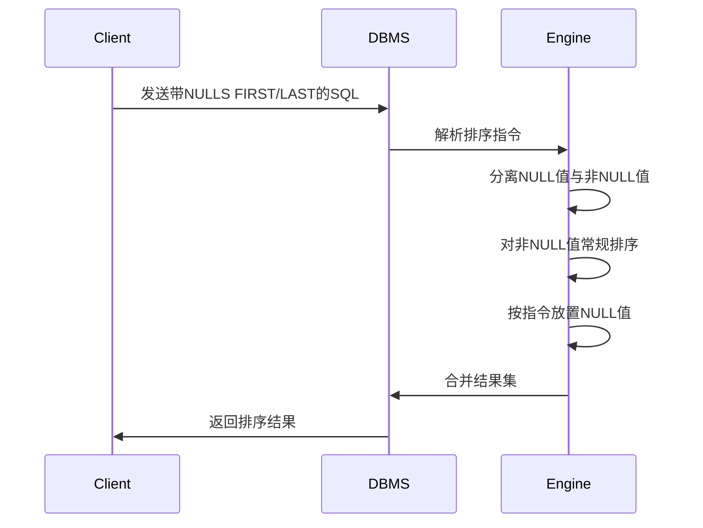
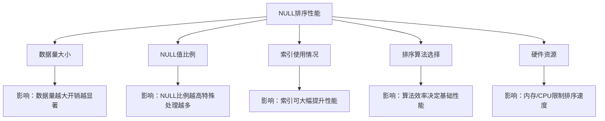
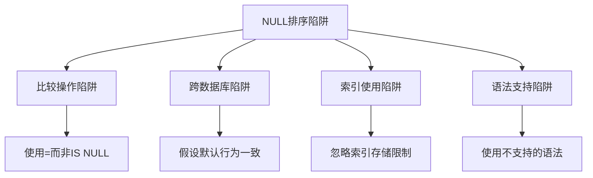
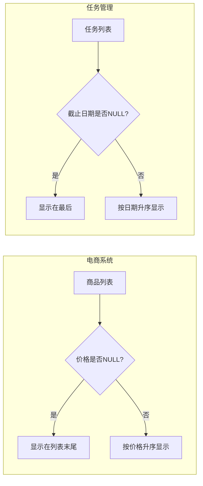
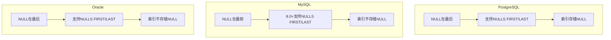
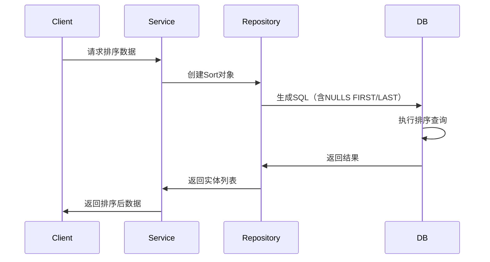

# 数据库排序中的NULL值处理：规则、陷阱与实践

## 开头摘要

本文深入探讨数据库排序中NULL值的处理机制，解释不同数据库系统的NULL排序规则及其设计动机，帮助开发者避免常见陷阱并掌握控制NULL排序位置的方法。适合数据库开发者、后端工程师及需要处理复杂数据查询的技术人员。

## 目录

1. [NULL值在排序中的基本概念](#null值在排序中的基本概念)
2. [不同数据库系统的NULL排序规则](#不同数据库系统的null排序规则)
3. [控制NULL排序位置：NULLS FIRST/LAST](#控制null排序位置nulls-firstlast)
4. [NULL排序的性能影响](#null排序的性能影响)
5. [常见误区与陷阱](#常见误区与陷阱)
6. [实际应用场景](#实际应用场景)
7. [跨数据库系统对比](#跨数据库系统对比)
8. [实战案例：Spring Data JPA中的NULL排序](#实战案例spring-data-jpa中的null排序)
9. [总结](#总结)
10. [延伸阅读](#延伸阅读)
11. [一句话记忆](#一句话记忆)

---

## NULL值在排序中的基本概念

在关系数据库中，NULL表示缺失或未知值，而非空字符串或零。当进行排序操作时，NULL值的处理方式与其他值有本质区别，因为NULL无法与常规值进行直接比较。

SQL标准将NULL定义为三值逻辑（TRUE、FALSE、UNKNOWN）的一部分，任何与NULL的比较操作都会返回UNKNOWN而非TRUE或FALSE。这种设计源于数据库理论中对未知值的处理需求，确保数据完整性。

### 示例代码

```sql
-- 创建测试表
CREATE TABLE products (
    id INT PRIMARY KEY,
    name VARCHAR(50),
    price DECIMAL(10,2)
);

-- 插入测试数据（包含NULL值）
INSERT INTO products VALUES 
(1, 'Laptop', 999.99),
(2, 'Mouse', 19.99),
(3, 'Keyboard', NULL),
(4, 'Monitor', 299.99),
(5, 'Webcam', NULL);

-- 默认升序排序
SELECT * FROM products ORDER BY price;
```

### Mermaid图：NULL值在排序中的逻辑流程



### 问题分析

1. **NULL不可比较性**：NULL = NULL 返回UNKNOWN而非TRUE，导致无法直接比较
2. **排序位置不确定性**：不同数据库系统对NULL的默认排序位置不同
3. **索引影响**：包含NULL的列在索引排序时可能产生非预期结果

### 应用场景

当处理可能包含缺失值的数据集时，如产品价格、用户评分、完成日期等，理解NULL排序规则至关重要，特别是在生成报表、分页查询和数据导出等场景。

---

## 不同数据库系统的NULL排序规则

不同数据库系统对NULL值的默认排序位置有不同实现，这源于历史设计决策和对SQL标准的解释差异。

### 概念解释

SQL标准并未规定NULL的默认排序位置，导致各数据库系统采用不同策略：
- **Oracle、PostgreSQL**：NULL值视为最大值，升序时排在最后
- **MySQL、SQLite**：NULL值视为最小值，升序时排在最前
- **SQL Server**：NULL值视为最小值，但可通过设置更改
- **DB2**：NULL值视为最大值

这种差异主要源于数据库系统对"未知值"的哲学理解不同——是将其视为"无限大"还是"无限小"。

### 示例代码

```sql
-- MySQL默认行为（NULL在最前）
SELECT * FROM products ORDER BY price ASC;

-- PostgreSQL默认行为（NULL在最后）
SELECT * FROM products ORDER BY price ASC;
```

### Mermaid图：不同数据库NULL排序规则对比



### 问题分析

1. **跨数据库兼容性问题**：同一SQL在不同数据库可能产生不同排序结果
2. **默认行为不一致**：开发者容易假设所有数据库行为相同
3. **迁移风险**：从一种数据库迁移到另一种时，排序结果可能意外改变

### 应用场景

在多数据库环境或需要跨数据库部署的应用中，必须明确处理NULL排序规则差异，特别是在需要统一排序结果的报表系统或数据分析平台。

---

## 控制NULL排序位置：NULLS FIRST/LAST

为解决NULL排序位置的不确定性，SQL标准引入了`NULLS FIRST`和`NULLS LAST`语法，允许显式控制NULL在排序结果中的位置。

### 概念解释

- `NULLS FIRST`：将NULL值排在结果集的最前面
- `NULLS LAST`：将NULL值排在结果集的最后面

这些语法提供了对NULL排序位置的精确控制，使开发者能够根据业务需求决定NULL值的展示位置，而不受数据库默认行为的影响。

### 示例代码

```sql
-- 强制NULL排在最前（升序）
SELECT * FROM products ORDER BY price ASC NULLS FIRST;

-- 强制NULL排在最后（降序）
SELECT * FROM products ORDER BY price DESC NULLS LAST;

-- 复合排序中的NULL控制
SELECT * FROM products 
ORDER BY 
    price DESC NULLS LAST,
    name ASC NULLS FIRST;
```

### Mermaid图：NULLS FIRST/LAST执行流程



### 问题分析

1. **语法支持差异**：并非所有数据库都支持NULLS FIRST/LAST（如MySQL 8.0前不支持）
2. **性能开销**：显式控制NULL位置可能增加排序操作复杂度
3. **索引利用**：某些情况下可能无法使用索引优化排序

### 应用场景

1. **报表生成**：将缺失数据（NULL）集中显示在报表顶部或底部
2. **分页查询**：确保分页一致性，避免NULL值在不同页间跳跃
3. **数据导出**：控制NULL值在导出文件中的位置，便于后续处理

---

## NULL排序的性能影响

NULL值的处理方式会对数据库排序性能产生显著影响，特别是在大数据集和复杂查询场景中。

### 概念解释

NULL排序性能影响主要源于：
1. **特殊处理路径**：数据库需要为NULL值开辟单独的处理逻辑
2. **索引结构**：包含NULL的列在B树索引中的存储方式不同
3. **排序算法**：需要额外比较步骤处理NULL值

大多数数据库系统使用修改后的排序算法（如快速排序的变种）来高效处理NULL值，但相比纯非NULL值排序仍有一定开销。

### 示例代码

```sql
-- 创建索引观察性能差异
CREATE INDEX idx_products_price ON products(price);

-- 分析执行计划（MySQL）
EXPLAIN SELECT * FROM products ORDER BY price;

-- 分析执行计划（PostgreSQL）
EXPLAIN ANALYZE SELECT * FROM products ORDER BY price NULLS LAST;
```

### Mermaid图：NULL排序性能影响因素



### 问题分析

1. **索引利用限制**：某些数据库在NULLS FIRST/LAST时无法使用索引
2. **内存消耗**：处理大量NULL值可能增加排序内存需求
3. **CPU开销**：额外的NULL检查增加CPU周期消耗

### 应用场景

在性能敏感场景（如高频交易系统、实时分析平台）中，需要特别关注NULL排序性能影响：
1. **优化建议**：对频繁排序的列考虑使用NOT NULL约束
2. **替代方案**：使用默认值（如0或-1）替代NULL
3. **监控重点**：关注包含NULL的排序操作执行时间

---

## 常见误区与陷阱

开发者在使用NULL值排序时常陷入一些认知误区，导致非预期的查询结果或性能问题。

### 概念解释

1. **误区一：NULL等于空字符串或零**
   - 实际：NULL表示未知值，与空字符串('')或数字0有本质区别
   - 后果：错误使用`WHERE price = ''`或`WHERE price = 0`查找NULL值

2. **误区二：所有数据库NULL排序行为相同**
   - 实际：各数据库默认行为差异显著
   - 后果：跨数据库应用出现排序结果不一致

3. **误区三：NULL值会自动使用索引**
   - 实际：多数数据库索引不存储NULL值（除PostgreSQL等）
   - 后果：包含NULL的排序可能无法利用索引优化

4. **误区四：NULLS FIRST/LAST总是可用**
   - 实际：MySQL 8.0前不支持此语法
   - 后果：在旧版本MySQL中无法显式控制NULL位置

### 示例代码

```sql
-- 错误：试图用=比较NULL
SELECT * FROM products WHERE price = NULL;  -- 返回空结果

-- 正确：使用IS NULL
SELECT * FROM products WHERE price IS NULL;

-- 错误：假设所有数据库行为相同
-- 在MySQL中：NULL排在最前
-- 在PostgreSQL中：NULL排在最后

-- MySQL 5.7中模拟NULLS LAST的替代方案
SELECT * FROM products 
ORDER BY 
    IF(price IS NULL, 1, 0), 
    price;
```

### Mermaid图：NULL排序常见陷阱



### 问题分析

1. **数据完整性风险**：错误处理NULL可能导致数据遗漏或重复
2. **性能隐患**：不当的NULL处理可能导致全表扫描
3. **维护困难**：依赖特定数据库行为的代码难以移植

### 应用场景

在以下场景中需特别注意NULL排序陷阱：
1. **数据迁移项目**：不同数据库间迁移时需重新验证排序结果
2. **多租户系统**：支持多种数据库后端时需统一NULL处理
3. **报表系统**：确保NULL值在报表中的位置符合业务预期

---

## 实际应用场景

NULL值排序在真实业务场景中有广泛应用，理解这些场景有助于更好地设计数据库查询。

### 概念解释

1. **电商系统**：商品价格NULL值处理
   - 需求：将未定价商品（NULL）显示在列表最后
   - 实现：`ORDER BY price ASC NULLS LAST`

2. **任务管理系统**：截止日期排序
   - 需求：将无截止日期的任务（NULL）显示在最后
   - 实现：`ORDER BY due_date ASC NULLS LAST`

3. **用户评分系统**：NULL值表示未评分
   - 需求：将未评分项目显示在已评分项目之后
   - 实现：`ORDER BY rating DESC NULLS LAST`

4. **库存管理**：库存数量NULL值处理
   - 需求：将库存未知（NULL）的商品优先显示
   - 实现：`ORDER BY quantity ASC NULLS FIRST`

### 示例代码

```sql
-- 电商系统：未定价商品排在最后
SELECT product_id, name, price 
FROM products 
ORDER BY price ASC NULLS LAST;

-- 任务管理：无截止日期任务排在最后
SELECT task_id, title, due_date 
FROM tasks 
ORDER BY due_date ASC NULLS LAST;

-- 用户评分：未评分项目排在最后
SELECT item_id, name, avg_rating 
FROM items 
ORDER BY avg_rating DESC NULLS LAST;

-- 库存管理：库存未知商品优先显示
SELECT item_id, name, stock_quantity 
FROM inventory 
ORDER BY stock_quantity ASC NULLS FIRST;
```

### Mermaid图：NULL排序业务场景流程



### 问题分析

1. **业务规则复杂性**：不同场景对NULL位置需求不同
2. **用户体验考虑**：NULL位置影响信息呈现逻辑
3. **数据一致性**：需确保NULL值使用符合业务定义

### 应用场景

在以下业务场景中NULL排序尤为重要：
1. **数据仪表盘**：控制缺失数据的显示位置
2. **搜索结果排序**：处理缺失信息对排名的影响
3. **数据导出**：确保NULL值在导出文件中的位置符合预期

---

## 跨数据库系统对比

不同数据库系统在NULL值排序处理上存在显著差异，了解这些差异对开发跨数据库应用至关重要。

### 概念解释

| 数据库系统 | 默认升序NULL位置 | NULLS FIRST/LAST支持 | 索引存储NULL | 替代语法 |
|------------|------------------|----------------------|--------------|----------|
| PostgreSQL | 最后 | 完全支持 | 存储 | 无 |
| MySQL 8.0+ | 最前 | 完全支持 | 不存储 | 无 |
| MySQL <8.0 | 最前 | 不支持 | 不存储 | IF/COALESCE |
| Oracle | 最后 | 完全支持 | 不存储 | 无 |
| SQL Server | 最前 | 完全支持 | 可配置 | 无 |
| SQLite | 最前 | 不支持 | 不存储 | CASE WHEN |

### 示例代码

```sql
-- PostgreSQL（标准实现）
SELECT * FROM products ORDER BY price ASC NULLS LAST;

-- MySQL 8.0+（标准实现）
SELECT * FROM products ORDER BY price ASC NULLS LAST;

-- MySQL <8.0（替代方案）
SELECT * FROM products 
ORDER BY IF(price IS NULL, 1, 0), price ASC;

-- Oracle（标准实现）
SELECT * FROM products ORDER BY price ASC NULLS LAST;

-- SQL Server（标准实现）
SELECT * FROM products ORDER BY price ASC NULLS LAST;

-- SQLite（替代方案）
SELECT * FROM products 
ORDER BY 
    CASE WHEN price IS NULL THEN 1 ELSE 0 END,
    price ASC;
```

### Mermaid图：跨数据库NULL处理差异



### 问题分析

1. **兼容性挑战**：同一SQL在不同数据库可能产生不同结果
2. **迁移成本**：从一种数据库迁移到另一种时需修改排序逻辑
3. **ORM限制**：某些ORM框架可能无法完全抽象数据库差异

### 应用场景

在以下场景中需特别关注跨数据库差异：
1. **多数据库支持的应用**：需在应用层统一NULL处理逻辑
2. **数据库迁移项目**：需重新验证所有排序查询结果
3. **开源项目开发**：需提供适配多种数据库的解决方案

---

## 实战案例：Spring Data JPA中的NULL排序

在Java生态系统中，Spring Data JPA提供了处理NULL排序的优雅方式，同时屏蔽了底层数据库差异。

### 概念解释

Spring Data JPA通过`@Query`注解和`Sort`对象支持NULL排序控制：
1. **原生SQL查询**：直接使用数据库特定语法
2. **JPQL查询**：使用标准JPQL语法（部分支持NULLS FIRST/LAST）
3. **方法名查询**：通过`OrderByNullsFirst`或`OrderByNullsLast`关键字
4. **动态排序**：使用`Sort`对象在运行时指定排序规则

### 示例代码

```java
// 实体类
@Entity
public class Product {
    @Id
    private Long id;
    private String name;
    private BigDecimal price;
    // getters and setters
}

// Repository接口
public interface ProductRepository extends JpaRepository<Product, Long> {
    
    // 使用JPQL（部分数据库支持）
    @Query("SELECT p FROM Product p ORDER BY p.price ASC NULLS LAST")
    List<Product> findAllOrderByPriceNullsLast();
    
    // 使用原生SQL
    @Query(value = "SELECT * FROM products ORDER BY price ASC NULLS LAST", 
           nativeQuery = true)
    List<Product> findAllOrderByPriceNative();
    
    // 方法名查询（Spring Data JPA 2.0+）
    List<Product> findAllByOrderByPriceAscNullsLast();
}

// 服务层动态排序
@Service
public class ProductService {
    @Autowired
    private ProductRepository repository;
    
    public List<Product> getProductsSortedByPrice(boolean nullsLast) {
        Sort sort = Sort.by("price").ascending();
        if (nullsLast) {
            // 需要数据库支持或自定义实现
            sort = sort.and(Sort.by(
                new Sort.Order(Sort.Direction.ASC, "price")
                    .with(Sort.NullHandling.NULLS_LAST)
            ));
        }
        return repository.findAll(sort);
    }
}
```

### Mermaid图：Spring Data JPA NULL排序处理流程



### 问题分析

1. **JPQL限制**：标准JPQL对NULLS FIRST/LAST支持有限
2. **数据库依赖**：原生SQL查询降低了可移植性
3. **版本兼容性**：Spring Data不同版本对NULL排序支持程度不同

### 应用场景

在Spring Boot应用中，以下场景特别适合使用JPA的NULL排序功能：
1. **REST API排序**：根据请求参数动态控制NULL位置
2. **数据导出服务**：确保导出文件中NULL值位置一致
3. **多租户平台**：适配不同租户的数据库后端

---

## 总结

1. **NULL本质**：NULL表示未知值，不能与常规值直接比较，遵循三值逻辑
2. **默认行为差异**：不同数据库系统对NULL的默认排序位置不同（MySQL/SQLite在最前，PostgreSQL/Oracle在最后）
3. **显式控制**：使用`NULLS FIRST`和`NULLS LAST`语法可精确控制NULL排序位置
4. **性能考虑**：NULL排序可能影响查询性能，特别是在大数据集上
5. **常见陷阱**：避免使用`=`比较NULL，注意跨数据库行为差异，理解索引限制
6. **实践建议**：在多数据库环境中使用显式NULL排序控制，考虑使用默认值替代NULL
7. **框架支持**：Spring Data JPA等ORM框架提供了处理NULL排序的抽象机制

---

## 延伸阅读

1. **官方文档**
   - [PostgreSQL: NULL Sorting](https://www.postgresql.org/docs/current/queries-order.html)
   - [MySQL: Handling of NULL Values](https://dev.mysql.com/doc/refman/8.0/en/working-with-null.html)
   - [Oracle: NULL Sorting](https://docs.oracle.com/en/database/oracle/oracle-database/19/sqlrf/SELECT.html#GUID-CFA0063B-B5B9-43A4-881C-0B9C8E9A3F6E)

2. **经典书籍**
   - 《SQL权威指南》（SQL: The Complete Reference）- 第5章：NULL值处理
   - 《数据库系统概念》（Database System Concepts）- 第4章：SQL高级特性

3. **技术文章**
   - [NULLs in SQL: A Comprehensive Guide](https://www.sqlshack.com/working-with-sql-null-values/)
   - [Sorting NULL Values in Various Databases](https://modern-sql.com/use-case/sort-nulls)

4. **源码参考**
   - [Spring Data JPA Sort源码](https://github.com/spring-projects/spring-data-jpa)
   - [PostgreSQL排序实现](https://github.com/postgres/postgres/tree/master/src/backend/executor)

---

## 一句话记忆

**NULL排序无标准，显式控制NULLS FIRST/LAST是王道，跨数据库一致性的关键。**