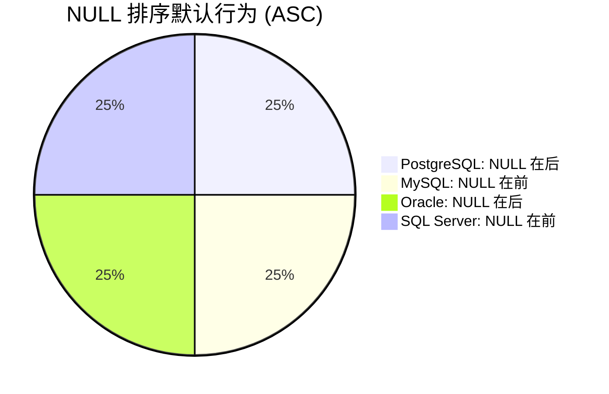
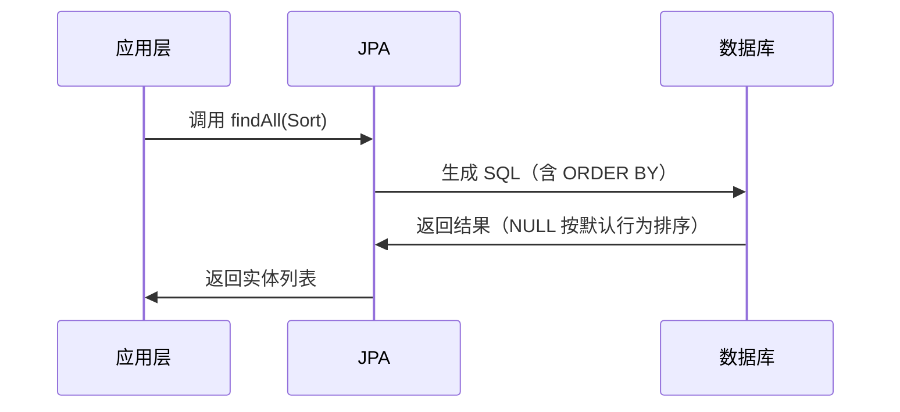

# 数据库排序中的 NULL 值：深入解析与实战指南

## 摘要
本文深入探讨数据库排序中 `NULL` 值的处理机制，揭示不同数据库系统的默认行为差异及背后的设计哲学。通过示例代码、可视化图表和实战案例，帮助开发者理解 `NULL` 排序的原理、陷阱及优化方法，适合数据库管理员、后端工程师及 SQL 使用者。

## 目录
- [1. 核心概念：NULL 与排序的哲学](#1-核心概念null-与排序的哲学)
- [2. 数据库实现差异与底层逻辑](#2-数据库实现差异与底层逻辑)
- [3. 跨语言/框架的排序实现对比](#3-跨语言框架的排序实现对比)
- [4. 实战案例：Spring Data JPA 中的排序控制](#4-实战案例spring-data-jpa-中的排序控制)
- [5. 常见陷阱与解决方案](#5-常见陷阱与解决方案)
- [6. 总结](#6-总结)
- [延伸阅读](#延伸阅读)
- [一句话记忆](#一句话记忆)

---

## 1. 核心概念：NULL 与排序的哲学

### 概念解释
在关系型数据库中，`NULL` 表示**缺失或未定义的数据**，而非零值或空字符串。排序时，`NULL` 的归属成为关键问题：
- **历史背景**：SQL 标准未强制规定 `NULL` 排序行为，导致不同数据库实现差异。
- **设计动机**：`NULL` 应视为“未知”，因此无法与其他值比较大小（如 `NULL > 1` 返回 `UNKNOWN`）。

### 示例代码
```sql
-- 创建测试表
CREATE TABLE employees (
    id INT PRIMARY KEY,
    name VARCHAR(50),
    salary DECIMAL(10,2)
);
INSERT INTO employees VALUES 
(1, 'Alice', 5000),
(2, 'Bob', NULL),
(3, 'Charlie', 7000);

-- 默认排序（NULL 行为因数据库而异）
SELECT * FROM employees ORDER BY salary ASC;
```

### Mermaid 图：NULL 排序逻辑
```mermaid
graph TD
    A[排序请求] --> B{列是否包含 NULL?}
    B -- 是 --> C[数据库默认行为]
    C --> D[NULL 在前 (ASC)]
    C --> E[NULL 在后 (ASC)]
    B -- 否 --> F[常规排序]
```

### 问题分析
- **误区**：认为 `NULL` 是“最小值”或“最大值”。
- **边界情况**：`NULL` 与 `NULL` 比较时，结果为 `UNKNOWN`（非 `TRUE` 或 `FALSE`）。

### 应用场景
- 报表生成时需隐藏未填写的字段（将 `NULL` 排至末尾）。
- 数据清洗阶段需优先处理缺失值（将 `NULL` 排至开头）。

---

## 2. 数据库实现差异与底层逻辑

### 概念解释
不同数据库对 `NULL` 的默认排序行为不同：
| 数据库      | `ASC` 默认行为 | `DESC` 默认行为 | 显式控制语法         |
|-------------|----------------|-----------------|----------------------|
| PostgreSQL  | NULL 在后      | NULL 在前       | `NULLS FIRST/LAST`   |
| MySQL       | NULL 在前      | NULL 在后       | `ISNULL()` + `ORDER` |
| Oracle      | NULL 在后      | NULL 在前       | `NULLS FIRST/LAST`   |
| SQL Server  | NULL 在前      | NULL 在后       | 无原生支持，需 `CASE`|

### 示例代码（显式控制）
```sql
-- PostgreSQL/Oracle: 强制 NULL 在前
SELECT * FROM employees ORDER BY salary ASC NULLS FIRST;

-- MySQL: 使用函数控制
SELECT * FROM employees ORDER BY ISNULL(salary), salary ASC;

-- SQL Server: 使用 CASE 表达式
SELECT * FROM employees ORDER BY 
    CASE WHEN salary IS NULL THEN 0 ELSE 1 END, salary ASC;
```

### Mermaid 图：跨数据库行为对比


### 问题分析
- **陷阱**：跨数据库迁移时未显式指定 `NULL` 顺序，导致排序结果不一致。
- **性能**：`CASE` 表达式在 SQL Server 中可能影响索引使用。

### 应用场景
- 多数据库兼容的 ETL 工具需显式指定 `NULL` 顺序。
- 微服务架构中，不同服务使用不同数据库时需统一排序逻辑。

---

## 3. 跨语言/框架的排序实现对比

### 概念解释
应用层排序（如 Java、Python）与数据库排序的 `NULL` 处理差异：
| 语言/框架 | 默认行为       | 显式控制方法                     |
|-----------|----------------|----------------------------------|
| Java      | NULL 抛出异常  | `Comparator.nullsFirst()/Last()` |
| Python    | NULL 视为最小值| `sorted(..., key=lambda x: (x is None, x))` |
| JavaScript| `undefined` 排最后 | `arr.sort((a,b) => (a === undefined) - (b === undefined) || a-b)` |

### 示例代码
```java
// Java: 使用 Comparator 控制 NULL
List<Employee> sorted = employees.stream()
    .sorted(Comparator.nullsFirst(Comparator.comparing(Employee::getSalary)))
    .collect(Collectors.toList());
```

```python
# Python: 元组排序控制 NULL
sorted_employees = sorted(employees, key=lambda x: (x.salary is None, x.salary))
```

### Mermaid 图：Java 与 Python 的 NULL 排序逻辑
```mermaid
flowchart LR
    Java -->|NULL 抛出异常| A[需显式指定 nullsFirst/NullsLast]
    Python -->|NULL 视为最小值| B[需元组排序 (is None, value)]
```

### 问题分析
- **误区**：认为数据库和应用层 `NULL` 排序行为一致。
- **性能**：应用层排序需加载全部数据，大数据量时效率低下。

### 应用场景
- 微服务中，数据库排序后需应用层二次排序（如分页后过滤）。
- 多数据源聚合时，统一 `NULL` 排序逻辑。

---

## 4. 实战案例：Spring Data JPA 中的排序控制

### 概念解释
Spring Data JPA 通过 `Sort` 和 `Order` 类控制排序，但需注意 `NULL` 处理：
- **默认行为**：依赖底层数据库。
- **显式控制**：需使用 `@Query` 自定义 SQL。

### 示例代码
```java
// 方法1: 通过 Sort 对象（依赖数据库默认行为）
Page<Employee> page = employeeRepository.findAll(PageRequest.of(0, 10, Sort.by("salary").ascending()));

// 方法2: 自定义查询（显式控制 NULL）
@Query("SELECT e FROM Employee e ORDER BY CASE WHEN e.salary IS NULL THEN 1 ELSE 0 END, e.salary ASC")
List<Employee> findAllOrderBySalaryNullsFirst();
```

### Mermaid 图：JPA 排序执行流程


### 问题分析
- **陷阱**：未在 `@Query` 中显式处理 `NULL`，导致排序结果与预期不符。
- **性能**：`CASE` 表达式可能阻止索引使用，需添加函数索引。

### 应用场景
- 分页查询中确保 `NULL` 值始终排在最后（提升用户体验）。
- 多字段排序时，对特定字段指定 `NULL` 顺序（如薪资升序，但缺失值排最后）。

---

## 5. 常见陷阱与解决方案

### 陷阱 1：隐式依赖默认行为
- **现象**：代码在 PostgreSQL 上 `NULL` 排最后，迁移到 MySQL 后排最前。
- **解决方案**：始终显式指定 `NULL` 顺序（如 `ORDER BY salary NULLS LAST`）。

### 陷阱 2：应用层与数据库层不一致
- **现象**：数据库排序后，应用层二次排序未处理 `NULL`，导致顺序错乱。
- **解决方案**：在应用层排序时，使用与数据库一致的 `NULL` 策略。

### 陷阱 3：聚合函数中的 `NULL`
- **现象**：`ORDER BY AVG(salary)` 时，`NULL` 值影响平均值计算。
- **解决方案**：使用 `COALESCE` 或 `ISNULL` 处理 `NULL`（如 `ORDER BY AVG(COALESCE(salary, 0))`）。

---

## 6. 总结
- **NULL 本质**：表示“未知”，无法参与比较运算。
- **数据库差异**：PostgreSQL/Oracle 默认 `NULL` 在后，MySQL/SQL Server 默认 `NULL` 在前。
- **显式控制**：优先使用 `NULLS FIRST/LAST`（如 PostgreSQL）或 `CASE` 表达式（如 SQL Server）。
- **应用层协调**：Java 需 `Comparator.nullsFirst()`，Python 需元组排序。
- **框架集成**：Spring Data JPA 需 `@Query` 显式处理 `NULL`。

## 延伸阅读
- [SQL-92 标准文档（NULL 处理）](https://www.contrib.andrew.cmu.edu/~shadow/sql/sql1992.txt)
- [PostgreSQL 官方文档：NULLS FIRST/LAST](https://www.postgresql.org/docs/current/queries-order.html)
- [MySQL 官方文档：ISNULL() 函数](https://dev.mysql.com/doc/refman/8.0/en/working-with-null.html)
- 《SQL 经典实例》第 8 章：排序与分组

## 一句话记忆
**“NULL 是未知值，排序需显式指定顺序，跨库迁移时务必统一行为。”**