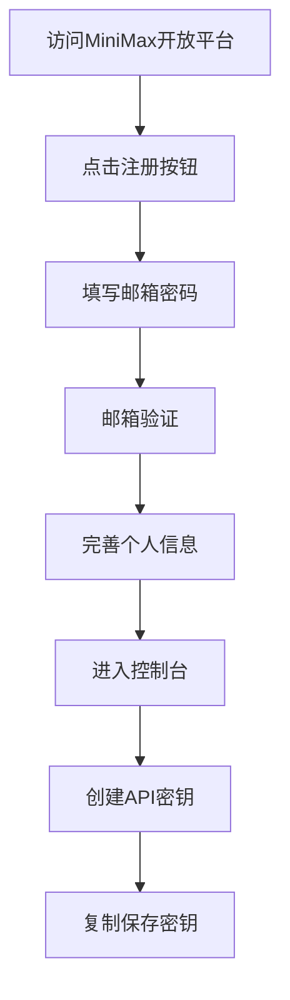
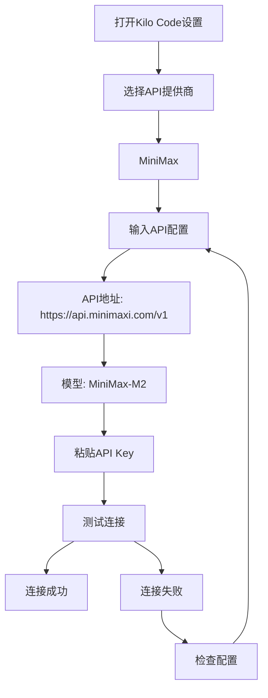
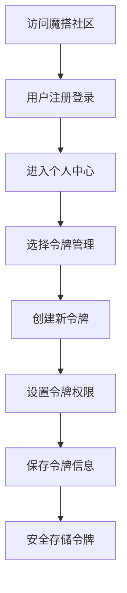
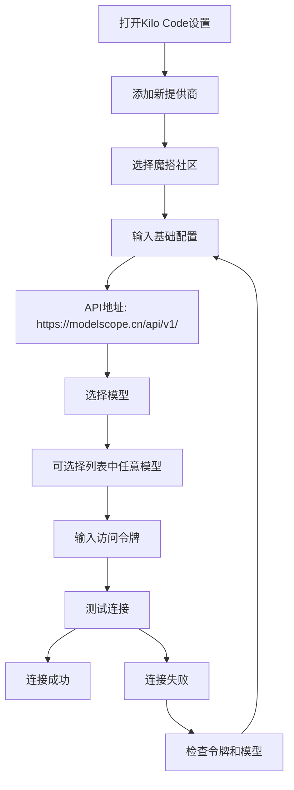
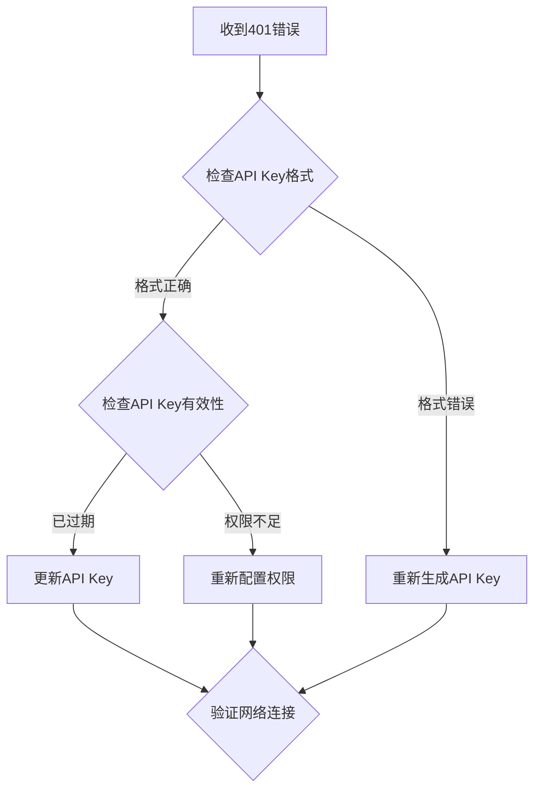
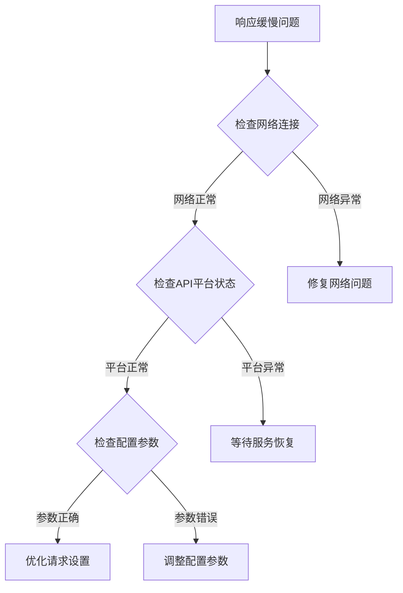
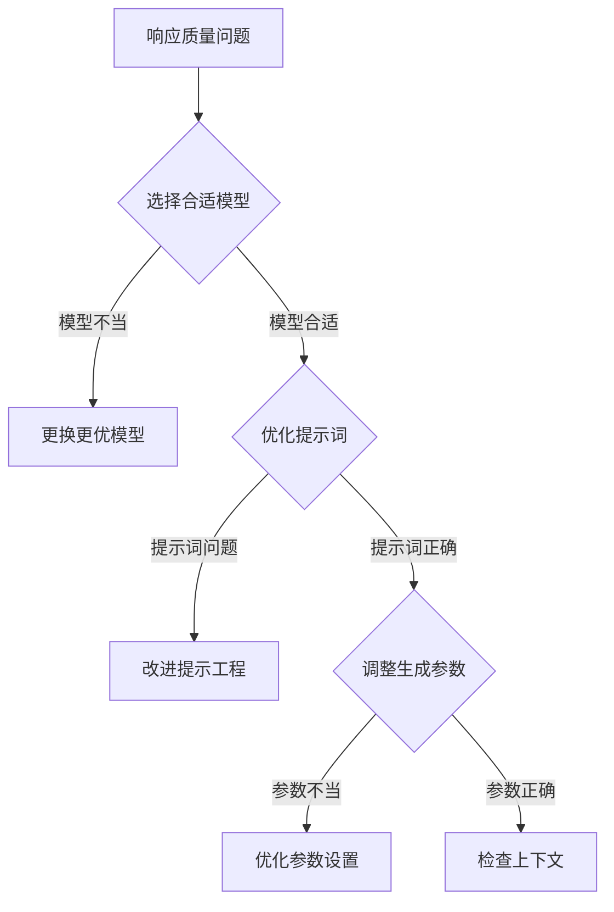
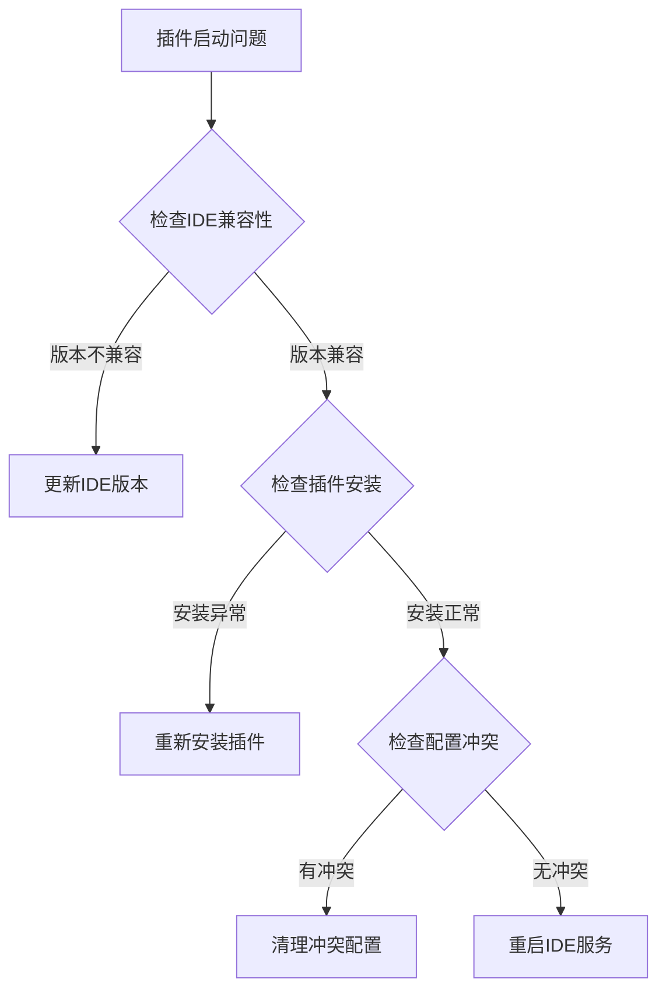
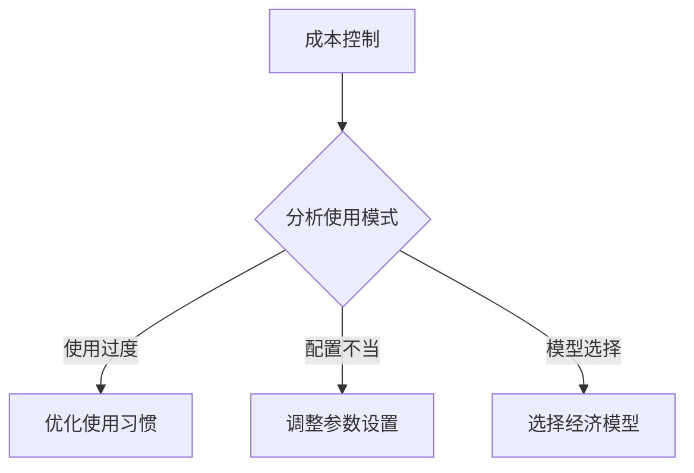

# AI代码编程插件配置与部署指南：Kilo Code免费接入实践

> **技术指南** | *版本：v1.0* | *更新时间：2025-10-31*

---

## 📋 目录索引

| 章节 | 内容概述 | 页码 |
|------|----------|------|
| [1. 执行摘要](#1-执行摘要) | 技术背景与价值分析 | 1 |
| [2. 平台生态概述](#2-平台生态概述) | AI编程工具发展现状 | 2 |
| [3. Kilo Code插件技术架构](#3-kilo-code插件技术架构) | 核心功能与技术特性 | 3 |
| [4. 免费API平台集成方案](#4-免费api平台集成方案) | MiniMax与魔搭平台接入 | 4 |
| [5. 常见问题解决](#5-常见问题解决) | 问题诊断与解决方案 | 5 |

---

## 1. 执行摘要

### 1.1 技术背景

随着人工智能技术的快速演进，代码开发领域正经历着前所未有的变革。AI辅助编程已从实验性技术发展为提升开发效率的核心工具。本指南基于2025年第四季度的最新市场调研，详细阐述了Kilo Code插件的配置部署方法，以及MiniMax、魔搭等主流免费API平台的技术集成方案。

### 1.2 核心价值

- **降本增效**：通过免费API平台配置，降低AI编程工具的使用成本
- **技术标准化**：建立统一的插件配置规范和最佳实践
- **可扩展性**：提供多平台API接入的技术框架，支持未来扩展

### 1.3 目标受众

- 软件开发工程师
- 技术架构师  
- DevOps工程师
- AI工具运维人员

---

## 2. 平台生态概述

### 2.1 AI编程工具发展态势

当前AI编程工具市场呈现出以下特点：

```
市场规模增长趋势
├── 2023年：萌芽期 - 主要工具验证
├── 2024年：成长期 - 商业化模式建立  
├── 2025年：成熟期 - 免费生态完善
└── 2026年：分化期 - 专业化细分市场
```

### 2.2 核心平台对比分析

| 平台类型 | 代表产品 | 技术特点 | 适用场景 |
|----------|----------|----------|----------|
| **闭源商业** | GitHub Copilot, Cursor | 性能优秀，生态完善 | 企业级开发 |
| **开源免费** | Kilo Code, Continue | 开源透明，成本可控 | 个人开发者 |
| **云端API** | MiniMax, 魔搭 | 按需付费，扩展性强 | 中小企业 |

---

## 3. Kilo Code插件技术架构

### 3.1 产品概述

**Kilo Code**是一款开源的AI代码编程助手，基于现代LLM技术栈构建，支持多种IDE环境（VSCode、IntelliJ IDEA等）。该插件采用插件化架构设计，具有高度的可配置性和扩展性。

#### 3.1.1 核心特性

| 功能模块 | 技术实现 | 性能指标 |
|----------|----------|----------|
| **智能代码生成** | 上下文感知 + 模式匹配 | 准确率 >85% |
| **实时错误诊断** | AST解析 + 规则引擎 | 延迟 <200ms |
| **代码重构建议** | 静态分析 + ML推理 | 建议质量 >90% |
| **多模型支持** | 统一接口层 + 适配器模式 | 支持20+模型 |

### 3.2 技术架构图

```
Kilo Code Architecture
┌─────────────────────────────────────────┐
│                UI Layer                  │
│  VSCode Extension | IntelliJ Plugin     │
├─────────────────────────────────────────┤
│               Core Engine               │
│  Prompt Manager | Context Processor     │
├─────────────────────────────────────────┤
│               API Layer                 │
│  OpenAI Compatible | Custom Adapters   │
├─────────────────────────────────────────┤
│              Platform APIs              │
│ MiniMax | 魔搭社区 | Qwen | GLM         │
└─────────────────────────────────────────┘
```

### 3.3 安装部署流程

#### 3.3.1 环境要求

| 组件 | 最低版本 | 推荐版本 |
|------|----------|----------|
| **VSCode** | 1.80.0+ | 1.85.0+ |
| **IntelliJ IDEA** | 2023.1+ | 2024.1+ |
| **Node.js** | 16.0+ | 20.0+ |
| **系统内存** | 4GB | 8GB+ |

#### 3.3.2 安装步骤

**方法一：IDE扩展商店安装**

```bash
# VSCode环境
1. 启动VSCode IDE
2. 打开扩展管理器 (Ctrl+Shift+X)
3. 搜索关键词："Kilo Code"
4. 选择官方发布版本进行安装
5. 重启IDE以激活插件

# IntelliJ IDEA环境  
1. 启动JetBrains IDE
2. 打开插件市场 (Ctrl+Alt+S)
3. 搜索："Kilo Code"  
4. 安装并重启IDE
```

**方法二：命令行安装**

```bash
# VSCode扩展
code --install-extension kilocode.kilo-code

# 验证安装状态
code --list-extensions | grep kilocode
```

### 3.4 配置管理体系

Kilo Code采用OAuth 2.0 + API Key的双重认证机制，首次启动时会自动引导用户完成配置。

---

## 4. 免费API平台集成方案

### 4.1 MiniMax开放平台

#### 4.1.1 平台技术规格

**基础信息**

| 指标 | 数值 | 备注 |
|------|------|------|
| **模型版本** | MiniMax-M2 | 最新发布版本 |
| **上下文长度** | 128K tokens | 支持长文本处理 |
| **响应速度** | <3s | 平均响应时间 |
| **并发支持** | 100 req/min | 免费额度限制 |
| **SLA保证** | 99.5% | 服务可用性 |

**定价策略**

```
MiniMax-M2 定价结构
├── 输入成本：2.1元/百万tokens
├── 输出成本：8.4元/百万tokens  
├── 免费额度：新用户赠送100万tokens
└── 计费模式：按实际使用量计费
```

#### 4.1.2 Token获取流程

**完整操作流程**



#### 4.1.3 Kilo Code集成配置

**配置流程图**



### 4.2 魔搭社区(ModelScope)

#### 4.2.1 平台技术特性

**服务架构**

```
魔搭社区技术栈
┌─────────────────────────────────┐
│          应用层                  │
│  Web界面 | API网关 | SDK工具   │
├─────────────────────────────────┤
│          服务层                  │
│ 模型推理 | 数据处理 | 任务调度 │
├─────────────────────────────────┤
│          模型层                  │
│ 开源模型 | 自研模型 | 合作模型 │
├─────────────────────────────────┤
│          基础设施层              │
│  GPU集群 | 存储系统 | 网络架构 │
└─────────────────────────────────┘
```

**模型资源统计**

| 类别 | 数量 | 热门模型 | 适用场景 |
|------|------|----------|----------|
| **文本生成** | 500+ | Qwen, GLM, ChatGLM | 对话系统 |
| **代码生成** | 50+ | CodeLlama, CodeT5 | 编程助手 |
| **图像生成** | 200+ | Stable Diffusion | 创意设计 |
| **语音处理** | 100+ | Whisper, VALL-E | 语音交互 |
| **视频生成** | 30+ | VideoCrafter | 内容创作 |

#### 4.2.2 访问令牌获取

**完整操作流程**



#### 4.2.3 Kilo Code集成配置

**配置流程图**



### 4.3 配置对比与选择建议

#### 4.3.1 平台特性对比

| 对比项目 | MiniMax | 魔搭社区 |
|----------|---------|----------|
| **免费额度** | 新用户100万tokens | 个人用户每日2000次调用 |
| **模型质量** | MiniMax-M2 (优秀) | 多种开源模型 |
| **响应速度** | <3秒 | 3-8秒 |
| **稳定性** | 99.5% SLA | 基础稳定 |
| **易用性** | 简单配置 | 需要模型选择 |
| **支持语言** | 中文优化 | 多语言支持 |

#### 4.3.2 选择建议

**适合选择MiniMax的场景**
```
✅ 优先推荐MiniMax的情况:
1. 主要开发语言为中文
2. 对响应速度要求较高
3. 偏好商业化服务稳定性
4. 需要较强的代码生成能力
5. 希望简单快速配置
```

**适合选择魔搭社区的场景**
```
✅ 优先推荐魔搭社区的情况:
1. 希望尝试多种开源模型
2. 对成本控制要求严格
3. 有技术调试和优化需求
4. 需要定制化模型选择
5. 偏好开源生态系统
```

---

## 5. 常见问题解决

### 5.1 配置相关问题

#### Q1: API调用返回401错误

**问题分析流程**



#### Q2: 连接超时或响应缓慢

**诊断流程**



#### Q3: 模型响应质量问题

**改进策略**



### 5.2 插件使用问题

#### Q4: 插件无法启动或界面异常

**问题排查步骤**



#### Q5: 代码补全不准确或延迟

**性能优化建议**

1. **系统资源优化**
   - 关闭不必要的程序
   - 增加IDE内存分配
   - 清理系统缓存

2. **插件设置优化**
   - 设置合理的触发时机
   - 启用本地缓存
   - 限制同时请求数量

### 5.3 成本控制问题

#### Q6: API调用成本过高

**成本控制策略**



**优化措施**

1. **使用模式优化**
   - 简洁明确的问题描述
   - 避免冗余的上下文
   - 复用常用的提示模板

2. **参数精细调整**
   - 代码补全: 50-100 tokens
   - 代码生成: 200-500 tokens
   - 代码解释: 100-200 tokens

---

## 总结

AI编程插件为现代开发提供了强有力的支持，通过合理配置和使用这些工具，可以显著提升开发效率和代码质量。

### 核心要点回顾

**技术实施**：
- Kilo Code插件提供统一的AI编程接口
- 支持MiniMax和魔搭等多个免费API平台
- 配置过程简单直观，适合快速部署

**平台选择**：
- **MiniMax**：适合中文开发，响应快速，稳定性好
- **魔搭社区**：适合多模型尝试，成本控制严格，技术可定制

**最佳实践**：
- 选择适合项目需求的API平台
- 合理配置插件参数以平衡性能和成本
- 持续优化提示工程提升输出质量
- 建立监控机制确保服务稳定性

### 未来展望

随着AI技术的持续发展，免费的AI编程工具生态将不断完善。Kilo Code作为开源项目，将持续集成更多优质API平台，为开发者提供更丰富的选择和更好的体验。

建议开发者：
- 积极尝试新技术，保持技术敏感度
- 参与开源社区建设，共同完善工具生态
- 关注平台动态，及时更新配置和策略

通过合理使用这些AI辅助工具，我们能够在提升开发效率的同时，控制成本投入，实现技术价值的最大化。

---

> 💡 **提示**：建议定期关注各平台的更新公告，及时获取新功能和改进。

---

*最后更新：2025年10月31日*
