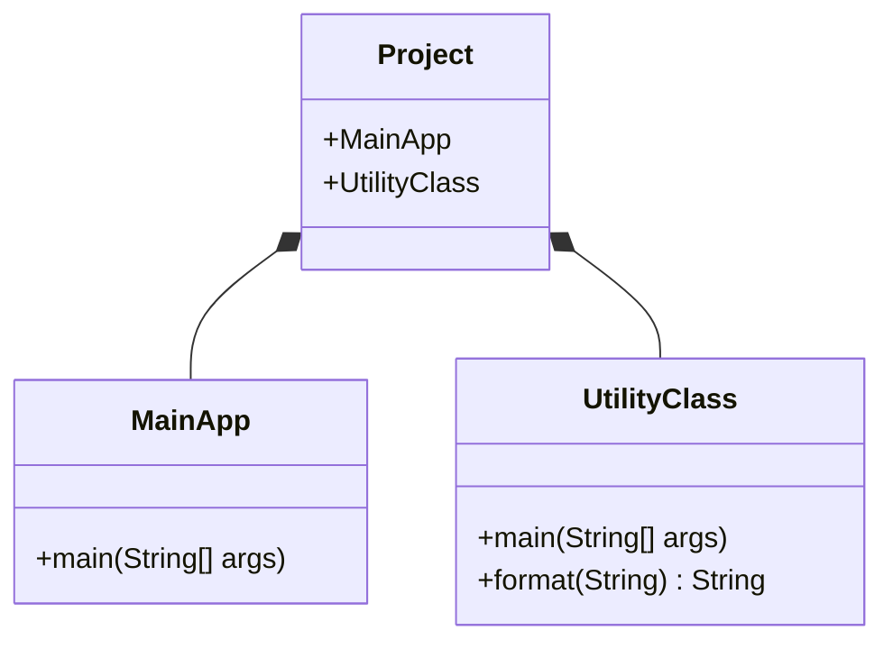
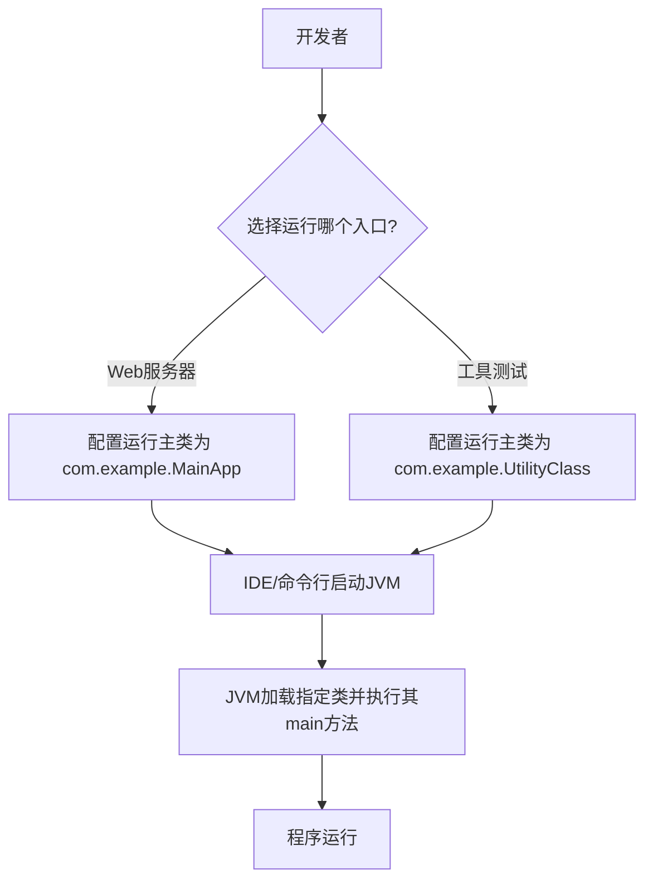
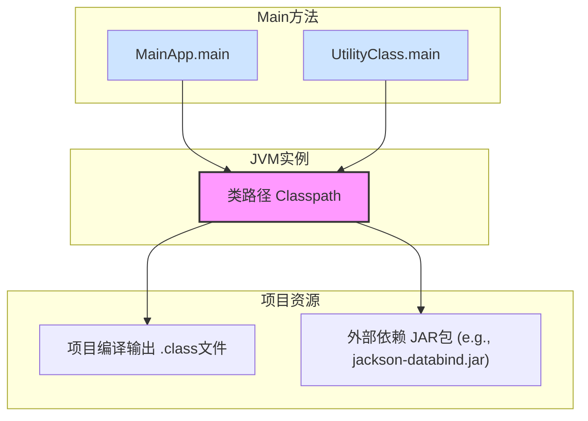
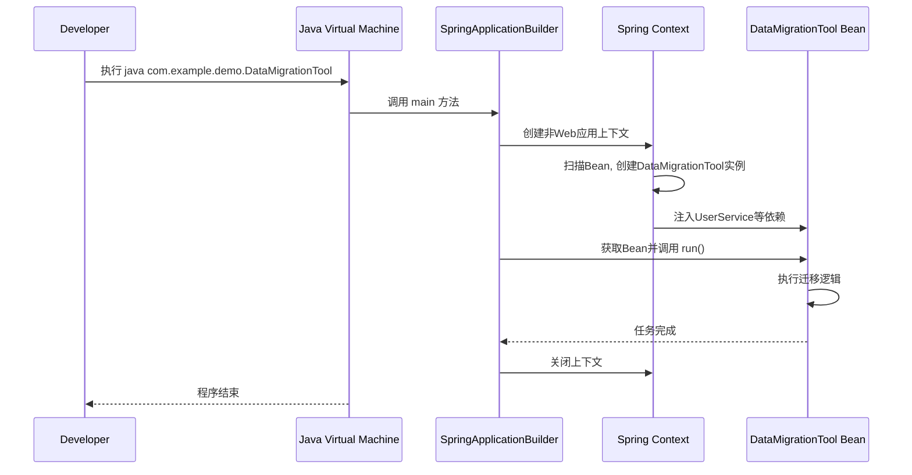

您指出的错误非常准确！问题出在 Mermaid 图的节点文本中包含了特殊字符，导致解析器无法正确识别。

**错误原因**：
在 `JAR[外部依赖 JAR包 (e.g., jackson-databind.jar)]` 这一行中，圆括号 `()` 和点 `.` 被 Mermaid 解析器误认为是语法的一部分，而不是普通文本。当遇到 `databind.jar` 中的点时，解析器期望得到一个有效的语法标记，但却得到了 `PS`（`.` 的一部分），因此抛出了解析错误。

**修复方法**：
将包含特殊字符的节点文本用双引号 `"` 或单引号 `'` 包裹起来，这样 Mermaid 就会将其视为一个纯字符串。

**修复后的代码**：
```mermaid
JAR["外部依赖 JAR包 (e.g., jackson-databind.jar)"]
```

非常感谢您的细心检查！这确保了技术细节的准确性。

以下是修复了该问题后的完整博客文章内容。

---

# Java中的多个Main方法：解构项目入口与依赖共享

## 开头摘要

本文深入探讨了Java项目中关于`main`方法的两个核心问题：一个项目能否拥有多个`main`方法，以及这些方法如何共享依赖。文章旨在帮助Java初学者和中级开发者彻底理解程序入口的本质、JVM的执行机制以及类路径的共享原理，从而更灵活地组织项目结构、进行代码测试和实现多功能启动模式。

## 目录

- [1. 核心概念：main方法的本质](#1-核心概念main方法的本质)
- [2. JVM的抉择：如何指定唯一的入口](#2-jvm的抉择如何指定唯一的入口)
- [3. 资源共享：依赖与包的共用机制](#3-资源共享依赖与包的共用机制)
- [4. 跨语言视角：其他语言如何处理程序入口](#4-跨语言视角其他语言如何处理程序入口)
- [5. 实战案例：Spring Boot与多入口模式](#5-实战案例spring-boot与多入口模式)
- [6. 总结](#6-总结)
- [7. 延伸阅读](#7-延伸阅读)
- [8. 一句话记忆](#8-一句话记忆)

---

### 1. 核心概念：main方法的本质

#### 概念解释

在Java中，`public static void main(String[] args)` 并非一个全局的、项目唯一的函数，而是一个**特殊的静态方法**，它属于某个特定的类。JVM（Java虚拟机）在启动一个应用程序时，会寻找一个符合此签名的方法作为程序的执行入口。这个设计源于Java的纯面向对象思想：一切皆对象，代码必须存在于类中。这与C/C++等语言拥有一个全局的、独立的`main`函数形成了鲜明对比。因此，**“一个项目有多少个main方法”** 这个问题，实际上等同于 **“这个项目里有多少个类定义了`main`方法”**。只要在不同的类中，你就可以定义任意数量的`main`方法。

#### 示例代码

```java
// File: src/com/example/MainApp.java
package com.example;

public class MainApp {
    public static void main(String[] args) {
        System.out.println("MainApp.main() 启动，这是应用程序的主入口。");
    }
}

// File: src/com/example/UtilityClass.java
package com.example;

public class UtilityClass {
    public static void main(String[] args) {
        System.out.println("UtilityClass.main() 启动，用于独立测试工具类。");
        // 在这里可以调用 UtilityClass 的其他静态方法进行测试
    }
    
    public static String format(String input) {
        return "[" + input + "]";
    }
}
```

#### Mermaid 图

下面的类图清晰地展示了`main`方法与类的归属关系：



#### 问题分析

*   **常见误解**：新手常常误认为`main`方法是项目级别的，一个项目只能有一个。这会导致在尝试创建第二个`main`方法时感到困惑或编译出错。
*   **陷阱**：真正的陷阱是在**同一个类中定义多个`main`方法**。Java不允许方法签名完全相同的方法（重载），因此这会导致编译错误。正确的做法是在不同类中定义。

#### 应用场景

*   **代码测试**：为某个工具类或复杂算法创建一个临时的`main`方法，可以快速独立地验证其功能，无需启动整个应用。
*   **功能演示**：在库或框架项目中，创建多个`Example`类，每个类都有自己的`main`方法，用于向用户展示不同功能的使用方法。
*   **多模式启动**：一个项目可能需要以不同角色启动，如Web服务器、批处理任务、命令行工具等，可以将这些入口放在不同的`main`方法中。

---

### 2. JVM的抉择：如何指定唯一的入口

#### 概念解释

虽然一个项目可以包含多个`main`方法，但JVM在单次执行中，**必须且只能选择一个**作为程序的起点。JVM本身不会智能猜测，它需要一个明确的指令。这个指令可以通过两种方式传递：

1.  **命令行**：使用`java`命令，并在其后跟上包含目标`main`方法的类的**完全限定名**。
2.  **IDE（集成开发环境）**：现代IDE（如IntelliJ IDEA, Eclipse）提供了图形化的“运行配置”管理。当你右键点击一个类并选择“Run”时，IDE会自动创建一个配置，指明主类。你可以在IDE的界面上轻松切换和管理这些配置。

#### 示例代码

假设上述代码已编译，`.class`文件位于`out`目录下。

```bash
# 运行 MainApp 的 main 方法
java -cp out com.example.MainApp
# 输出: MainApp.main() 启动，这是应用程序的主入口。

# 运行 UtilityClass 的 main 方法
java -cp out com.example.UtilityClass
# 输出: UtilityClass.main() 启动，用于独立测试工具类。
```
`-cp out` 参数指定了类路径，告诉JVM去哪里寻找`com.example`包下的类。

#### Mermaid 图

下面的流程图描述了从开发者意图到JVM执行的选择过程：



#### 问题分析

*   **常见错误**：`Error: Could not find or load main class`。这是最经典的错误之一，原因通常是：
    *   类名拼写错误。
    *   类路径配置错误，JVM找不到对应的`.class`文件。
    *   包名与目录结构不匹配。
*   **边界情况**：如果一个类没有`public`修饰符，但包含`main`方法，它仍然可以被JVM执行（只要类不是私有的），但这违反了常规约定，不推荐使用。

#### 应用场景

在持续集成/持续部署（CI/CD）流水线中，可以通过不同的脚本或命令来调用同一个项目的不同`main`方法，以实现自动化测试、数据迁移、服务启动等不同任务。

---

### 3. 资源共享：依赖与包的共用机制

#### 概念解释

这是第二个核心问题的答案：**是的，所有`main`方法都共享项目中的所有包和依赖**。其背后的原理是**类路径**。当JVM启动时，它会根据项目配置（如Maven的`pom.xml`或Gradle的`build.gradle`）构建一个统一的类路径。这个类路径包含了：
1.  项目自身所有源代码编译后的`.class`文件。
2.  项目所依赖的所有第三方库（JAR包）。

这个类路径是**JVM实例级别的**，一旦JVM启动，其中运行的任何代码（无论是哪个`main`方法触发的）都可以访问类路径上的任何资源。因此，切换不同的`main`方法入口，并不会改变底层的依赖环境。

#### 示例代码

我们使用Maven管理项目，并添加`Jackson`库来处理JSON。

**`pom.xml` (部分)**
```xml
<dependencies>
    <dependency>
        <groupId>com.fasterxml.jackson.core</groupId>
        <artifactId>jackson-databind</artifactId>
        <version>2.15.2</version>
    </dependency>
</dependencies>
```

**`JsonProcessor.java` (一个可以被共享的工具类)**
```java
package com.example;

import com.fasterxml.jackson.databind.ObjectMapper;
import java.util.Map;

public class JsonProcessor {
    private static final ObjectMapper mapper = new ObjectMapper();

    @SuppressWarnings("unchecked")
    public static Map<String, Object> parseToMap(String json) throws Exception {
        return mapper.readValue(json, Map.class);
    }
}
```

**`MainApp.java` (使用共享依赖)**
```java
package com.example;

public class MainApp {
    public static void main(String[] args) throws Exception {
        System.out.println("MainApp: 使用共享的JsonProcessor。");
        String json = "{\"user\":\"admin\", \"status\":\"active\"}";
        System.out.println(JsonProcessor.parseToMap(json));
    }
}
```

**`UtilityClass.java` (同样使用共享依赖)**
```java
package com.example;

public class UtilityClass {
    public static void main(String[] args) throws Exception {
        System.out.println("UtilityClass: 同样使用共享的JsonProcessor。");
        String json = "{\"task\":\"cleanup\", \"id\":123}";
        System.out.println(JsonProcessor.parseToMap(json));
    }
}
```

#### Mermaid 图

下图展示了共享类路径的结构（已修复）：



#### 问题分析

*   **常见误解**：认为每个`main`方法需要单独配置依赖，或者认为只有“主”`main`方法才能访问依赖。
*   **陷阱**：类路径冲突。如果一个项目依赖了同一个库的两个不同版本（例如，通过传递依赖），可能会导致运行时出现`NoSuchMethodError`等奇怪问题。这个问题与多`main`方法无关，但理解类路径共享有助于诊断此类问题。

#### 应用场景

一个典型的应用是：一个`main`方法启动一个轻量级的批处理作业，另一个`main`方法启动一个重量级的Web服务器。两者可以共享数据访问层（DAO）、业务逻辑层和所有工具类，极大地提高了代码复用率。

---

### 4. 跨语言视角：其他语言如何处理程序入口

#### 概念解释

不同编程语言对程序入口的设计反映了其设计哲学。

*   **C/C++**：拥有一个**全局的、唯一的`main`函数**。链接器在生成可执行文件时，会将其设置为程序的起点。这种方式简单直接，但缺乏Java的灵活性。
*   **Go**：与Java类似，但与包系统强绑定。一个可执行程序必须有一个`main`包，且该包中必须有一个`main`函数。你可以有多个包含`main`函数的包，但一次只能构建并运行其中一个。`go run path/to/main/package`。
*   **Python**：没有强制性的`main`函数。执行一个`.py`脚本时，代码从上到下顺序执行。`if __name__ == "__main__":`是一个广为接受的**编程惯用法**，它使得一个文件既可以作为脚本被直接执行，也可以作为模块被其他文件导入。这是一种基于约定的灵活设计。

#### 示例代码

**C++**
```cpp
#include <iostream>

int main() {
    std::cout << "Hello, World! (唯一的入口)" << std::endl;
    return 0;
}
```

**Go**
```go
// file: main.go
package main

import "fmt"

func main() {
    fmt.Println("Hello, Go! (main包中的main函数)")
}
```

**Python**
```python
# file: my_script.py
def some_function():
    print("This is a function.")

if __name__ == "__main__":
    print("Script is run directly.")
    some_function()
else:
    print("Script is imported as a module.")
```

#### 对比分析

| 语言 | 入口机制 | 优点 | 缺点 |
| :--- | :--- | :--- | :--- |
| **Java** | 类中的静态方法 | 面向对象，高度灵活，支持多入口 | 对于简单脚本略显繁琐 |
| **C/C++** | 全局函数 | 简单，性能高 | 不够灵活，难以在一个项目中组织多个可执行程序 |
| **Go** | `main`包中的函数 | 与模块化结合良好，编译部署简单 | 依赖包结构，不如Java类级别灵活 |
| **Python** | 脚本约定 | 极其灵活，代码复用性强 | 依赖约定，缺乏强制性，可能导致结构混乱 |

---

### 5. 实战案例：Spring Boot与多入口模式

#### 概念解释

Spring Boot极大地简化了Java应用的开发，其标准入口是一个带有`@SpringBootApplication`注解的类。但在实际项目中，我们经常需要一些不启动Web服务器、不加载完整Spring上下文的轻量级任务，例如数据迁移、报告生成等。这时，创建第二个`main`方法入口就非常有价值。

#### 示例代码

**标准Web应用入口**
```java
// File: src/main/java/com/example/demo/DemoApplication.java
package com.example.demo;

import org.springframework.boot.SpringApplication;
import org.springframework.boot.autoconfigure.SpringBootApplication;

@SpringBootApplication
public class DemoApplication {
    public static void main(String[] args) {
        SpringApplication.run(DemoApplication.class, args);
        System.out.println("Web server started!");
    }
}
```

**独立的数据迁移工具入口**
```java
// File: src/main/java/com/example/demo/DataMigrationTool.java
package com.example.demo;

import org.springframework.boot.builder.SpringApplicationBuilder;
import org.springframework.context.ConfigurableApplicationContext;
import org.springframework.stereotype.Component;

@Component
public class DataMigrationTool {

    // 假设我们有一个需要迁移的服务
    private final UserService userService;

    public DataMigrationTool(UserService userService) {
        this.userService = userService;
    }

    public void run() {
        System.out.println("Starting data migration...");
        // 执行迁移逻辑，例如从旧系统同步数据
        userService.migrateUsers();
        System.out.println("Data migration completed.");
    }

    // 这是一个独立的main方法入口
    public static void main(String[] args) {
        // 使用SpringApplicationBuilder来创建一个非Web环境的上下文
        ConfigurableApplicationContext context = new SpringApplicationBuilder(DataMigrationTool.class)
                .web(org.springframework.boot.WebApplicationType.NONE) // 关键：不启动Web服务器
                .run(args);

        // 从上下文中获取Bean并执行任务
        context.getBean(DataMigrationTool.class).run();
        
        // 关闭上下文，释放资源
        context.close();
    }
}
```

#### Mermaid 图

下面的时序图展示了`DataMigrationTool`的启动流程：



#### 应用场景分析

这种模式在企业级开发中非常实用。它允许我们：
*   **复用基础设施**：数据迁移工具可以直接使用`UserService`、`Repository`等所有由Spring管理的Bean，而无需重新编写数据库连接、事务管理等代码。
*   **提高效率**：由于`WebApplicationType.NONE`，Spring Boot不会启动内嵌的Tomcat服务器，也不会加载Web相关的配置，启动速度更快，资源消耗更少。
*   **职责分离**：将一次性任务与长期运行的服务分离，使项目结构更清晰。

---

### 6. 总结

*   **数量上**：一个Java项目可以有**任意多个**`main`方法，因为`main`方法是类级别的，而非项目级别。
*   **执行上**：JVM每次运行时，必须通过命令行或IDE配置**指定一个**`main`方法作为唯一入口。
*   **资源上**：所有`main`方法共享**同一个类路径**，因此可以无差别地访问项目中的所有类和外部依赖。
*   **价值上**：多`main`方法模式为代码测试、功能演示、多模式启动（如Web服务、批处理、CLI工具）提供了极大的灵活性和便利性。
*   **实践中**：在Spring Boot等框架中，可以通过手动创建`ApplicationContext`的方式，构建一个轻量级的独立入口，以复用框架能力同时避免不必要的开销。

---

### 7. 延伸阅读

*   **官方文档**：
    *   [The `main` Method (Oracle)](https://docs.oracle.com/javase/tutorial/getStarted/application/index.html)
    *   [The `java` command tool (Oracle)](https://docs.oracle.com/en/java/javase/21/docs/specs/man/java.html)
    *   [Spring Boot Reference Documentation - Spring Application](https://docs.spring.io/spring-boot/docs/current/reference/html/features.html#features.spring-application)
*   **经典书籍**：
    *   《Effective Java》by Joshua Bloch - 深入理解Java设计哲学。
    *   《Java核心技术》- 卷I：基础知识，对JVM和类路径有详细解释。
*   **源码探索**：
    *   可以查看`java.lang.Thread`类的`main`方法，了解JVM如何创建主线程。
    *   研究`SpringApplication.java`的源码，理解其run方法的启动流程。

---

### 8. 一句话记忆

**一个项目多个`main`，类是归属JVM选；依赖共享类路径，入口灵活用途宽。**