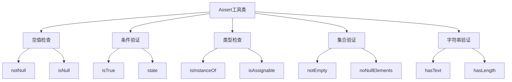

# Spring Assert 工具类完全指南：编写健壮代码的必备利器

## 开头摘要

在 Spring 应用开发中，参数校验和状态检查是保证代码健壮性的关键环节。Spring 框架提供的`Assert`工具类通过简洁而强大的断言机制，让开发者能够用最少的代码实现最有效的参数验证。本文将深入解析 Assert 工具类的设计原理、核心方法和使用场景，帮助你掌握这一提升代码质量的重要工具。

## 目录

- #assert 工具类概述
- #核心方法详解
- #实际应用场景
- #最佳实践与注意事项
- #总结

## Assert 工具类概述

`org.springframework.util.Assert`是 Spring 框架核心模块(`spring-core`)中的一个**断言工具类**，完全由静态方法组成，专门用于进行参数校验和状态检查。Assert 遵循"**快速失败**"(Fail-Fast)原则，当条件不满足时立即抛出异常，避免程序在错误状态下继续执行。

### 设计理念与核心价值

Assert 工具类的设计基于几个关键理念：

1. **代码简洁性**：将繁琐的 if-else 校验简化为一行方法调用
2. **早期错误检测**：在问题发生的最早阶段暴露错误，降低调试难度
3. **自文档化代码**：方法名直接表达校验意图，提高代码可读性
4. **统一异常处理**：提供一致的异常类型和错误消息格式

与传统的参数校验方式相比，Assert 能够将**5-10 行的校验代码压缩为 1-2 行**，同时提供更清晰的错误信息和更一致的异常处理机制。

## 核心方法详解

### 基础空值检查

空值检查是 Assert 工具类最常用的功能，提供了多层次的空值验证：

```java
// 对象非空检查
User user = userService.findById(userId);
Assert.notNull(user, "用户不存在，ID: " + userId);

// 字符串非空检查（包含空白字符检查）
Assert.hasText(username, "用户名不能为空或空白字符串");

// 集合非空检查
Assert.notEmpty(orderList, "订单列表不能为空");
```

**方法对比分析**：

- `notNull()`：仅检查对象是否为 null
- `hasText()`：检查字符串非 null、非空且包含非空白字符
- `notEmpty()`：检查集合/数组非 null 且至少包含一个元素

### 条件验证与状态检查

对于业务逻辑中的条件验证，Assert 提供了专门的方法：

```java
// 布尔条件验证
public void withdraw(double amount) {
    Assert.isTrue(amount > 0, "取款金额必须大于0");
    Assert.isTrue(balance >= amount, "余额不足");

    // 执行取款逻辑
}

// 状态检查（使用IllegalStateException）
public void submitOrder() {
    boolean valid = validateOrder(order);
    Assert.state(valid, "订单状态不合法，无法提交");
}
```

**异常类型区别**：

- `isTrue()`：抛出`IllegalArgumentException`，适用于参数校验
- `state()`：抛出`IllegalStateException`，适用于状态检查

### 类型与赋值关系验证

在框架开发和复杂业务逻辑中，经常需要验证类型关系：

```java
// 类型实例检查
Assert.isInstanceOf(User.class, object, "参数必须是User类型");

// 类型赋值兼容性检查
Assert.isAssignable(Collection.class, list.getClass(),
    "参数必须可赋值给Collection接口");

// 数组元素非空检查
String[] names = {"Alice", "Bob", null};
Assert.noNullElements(names, "数组中不能包含null元素");
```

下面是 Assert 工具类核心方法的功能分类图：



## 实际应用场景

### 服务层参数校验

在 Service 层方法中，使用 Assert 进行前置参数校验可以大幅提高代码的健壮性：

```java
@Service
public class OrderService {

    @Autowired
    private UserRepository userRepository;

    @Autowired
    private ProductRepository productRepository;

    public Order createOrder(Long userId, List<OrderItem> items) {
        // 参数基础校验
        Assert.notNull(userId, "用户ID不能为空");
        Assert.notEmpty(items, "订单项不能为空");

        // 业务逻辑校验
        User user = userRepository.findById(userId);
        Assert.notNull(user, "用户不存在，ID: " + userId);
        Assert.isTrue(user.isActive(), "用户账户已被禁用");

        for (OrderItem item : items) {
            Assert.notNull(item.getProductId(), "商品ID不能为空");
            Assert.isTrue(item.getQuantity() > 0, "商品数量必须大于0");

            Product product = productRepository.findById(item.getProductId());
            Assert.notNull(product, "商品不存在，ID: " + item.getProductId());
            Assert.isTrue(product.getStock() >= item.getQuantity(),
                "商品库存不足: " + product.getName());
        }

        // 创建订单逻辑
        return orderRepository.save(new Order(user, items));
    }
}
```

### 控制器层请求验证

在 Spring MVC 控制器中，Assert 可以用于验证请求参数的合法性：

```java
@RestController
@RequestMapping("/api/users")
public class UserController {

    @PostMapping
    public ResponseEntity<UserDTO> createUser(@RequestBody @Valid UserDTO userDTO) {
        // DTO基础验证（JSR-303已通过，补充业务验证）
        Assert.notNull(userDTO, "用户数据不能为空");
        Assert.hasText(userDTO.getEmail(), "邮箱不能为空");

        // 业务规则验证
        Assert.isTrue(isValidEmail(userDTO.getEmail()), "邮箱格式不正确");
        Assert.isTrue(userDTO.getAge() >= 18, "用户必须年满18岁");

        User user = userService.createUser(userDTO);
        return ResponseEntity.ok(UserDTO.fromEntity(user));
    }

    @PutMapping("/{userId}/status")
    public ResponseEntity<Void> updateUserStatus(
            @PathVariable Long userId,
            @RequestParam String status) {

        Assert.notNull(userId, "用户ID不能为空");
        Assert.hasText(status, "状态不能为空");
        Assert.isTrue(Arrays.asList("ACTIVE", "INACTIVE").contains(status),
            "状态值不合法");

        userService.updateStatus(userId, status);
        return ResponseEntity.ok().build();
    }
}
```

### 自定义断言扩展

对于特定的业务需求，可以基于 Assert 扩展自定义的断言方法：

```java
/**
 * 业务断言工具类
 */
public abstract class BusinessAssert extends Assert {

    public static void isValidPhoneNumber(String phone) {
        hasText(phone, "手机号不能为空");
        isTrue(phone.matches("^1[3-9]\\d{9}$"), "手机号格式不正确");
    }

    public static void isValidIdCard(String idCard) {
        hasText(idCard, "身份证号不能为空");
        isTrue(idCard.matches("^\\d{17}[\\dXx]$"), "身份证号格式不正确");
    }

    public static void isPositiveNumber(Number number, String message) {
        notNull(number, message);
        isTrue(number.doubleValue() > 0, message);
    }

    public static void isInRange(int value, int min, int max, String message) {
        isTrue(value >= min && value <= max, message);
    }
}

// 使用示例
public class PaymentService {
    public void processPayment(PaymentRequest request) {
        BusinessAssert.isValidPhoneNumber(request.getPhone());
        BusinessAssert.isPositiveNumber(request.getAmount(), "支付金额必须大于0");

        // 支付处理逻辑
    }
}
```

## 最佳实践与注意事项

### 性能优化策略

虽然 Assert 方法本身很轻量，但在高性能场景下仍需注意优化：

```java
// 不推荐：在循环内部使用Assert
public void processBatch(List<Order> orders) {
    for (Order order : orders) {
        Assert.notNull(order, "订单不能为null"); // 每次循环都执行校验
        // 处理逻辑
    }
}

// 推荐：循环外部统一校验
public void processBatch(List<Order> orders) {
    Assert.notEmpty(orders, "订单列表不能为空");

    for (Order order : orders) {
        if (order == null) continue; // 使用轻量级判断
        // 处理逻辑
    }
}

// 生产环境特定优化
public class ProductionSafeValidator {
    private static final boolean IS_PRODUCTION =
        "prod".equals(System.getProperty("spring.profiles.active"));

    public static void notNull(Object object, String message) {
        if (IS_PRODUCTION) {
            if (object == null) {
                log.error("参数校验失败: {}", message);
                throw new BusinessException("参数错误");
            }
        } else {
            Assert.notNull(object, message);
        }
    }
}
```

### 异常处理与错误信息

合理的错误信息设计可以大幅提升调试效率：

```java
// 不推荐：模糊的错误信息
Assert.notNull(user, "参数错误");

// 推荐：具体的错误信息
Assert.notNull(user, "用户对象不能为null，当前用户ID: " + userId);

// 推荐：包含上下文信息的错误消息
public void transfer(Long fromAccount, Long toAccount, BigDecimal amount) {
    Assert.notNull(fromAccount, "转出账户不能为空");
    Assert.notNull(toAccount, "转入账户不能为空");
    Assert.isTrue(!fromAccount.equals(toAccount),
        "转出账户和转入账户不能相同: " + fromAccount);
    Assert.notNull(amount, "转账金额不能为空");
    Assert.isTrue(amount.compareTo(BigDecimal.ZERO) > 0,
        "转账金额必须大于0，当前金额: " + amount);

    // 转账逻辑
}
```

### 与校验框架的协同使用

Assert 与 JSR-303 校验框架（如 Hibernate Validator）可以很好地协同工作：

```java
@Data
public class UserDTO {
    @NotBlank(message = "用户名不能为空")
    @Size(min = 2, max = 20, message = "用户名长度2-20个字符")
    private String username;

    @Email(message = "邮箱格式不正确")
    private String email;

    @Min(value = 18, message = "年龄必须大于18岁")
    private Integer age;
}

@RestController
public class UserController {

    @PostMapping("/users")
    public ResponseEntity<?> createUser(@RequestBody @Valid UserDTO userDTO) {
        // JSR-303校验通过后，进行业务逻辑校验
        Assert.isTrue(isUsernameAvailable(userDTO.getUsername()),
            "用户名已存在: " + userDTO.getUsername());
        Assert.isTrue(userDTO.getAge() >= 18, "用户必须年满18岁");

        User user = userService.createUser(userDTO);
        return ResponseEntity.ok(user);
    }
}
```

## 总结

Spring Assert 工具类是一个设计精巧且极其实用的参数校验工具，通过系统学习和实践可以得出以下核心结论：

### 核心价值

1. **开发效率显著提升**：将繁琐的参数校验代码从多行简化为单行方法调用
2. **代码质量大幅改善**：统一的校验逻辑和异常处理机制，提高代码一致性
3. **错误早期暴露**：遵循快速失败原则，在问题发生的最早阶段进行拦截
4. **代码自文档化**：直观的方法名使代码校验意图更加清晰

### 适用场景推荐

- **服务层参数校验**：业务方法开始处的参数合法性验证
- **控制器补充校验**：在 JSR-303 校验基础上补充业务规则验证
- **框架开发**：在框架内部进行关键参数和状态检查
- **测试断言**：单元测试中的条件验证（结合测试框架）

### 使用注意事项

1. **性能考量**：避免在高频循环内部使用，生产环境可考虑特定优化
2. **错误信息质量**：提供具体、包含上下文的错误消息，方便调试定位
3. **与校验框架分工**：基础格式校验用 JSR-303，业务规则校验用 Assert
4. **异常处理策略**：区分参数异常(IllegalArgumentException)和状态异常(IllegalStateException)

Assert 工具类作为 Spring 开发者工具箱中的重要组成部分，合理运用可以显著提升代码的健壮性和可维护性，是编写高质量 Java 应用的必备技能。

## 延伸阅读

1. https://docs.spring.io/spring-framework/docs/current/javadoc-api/org/springframework/util/Assert.html
2. Spring 源码：`org.springframework.util.Assert`
3. https://docs.jboss.org/hibernate/validator/8.0/reference/en-US/html_single/

## 一句话记忆

Spring Assert 是参数校验的利器，用一行代码替代繁琐的 if-else 判断，让参数校验既简洁又健壮。
