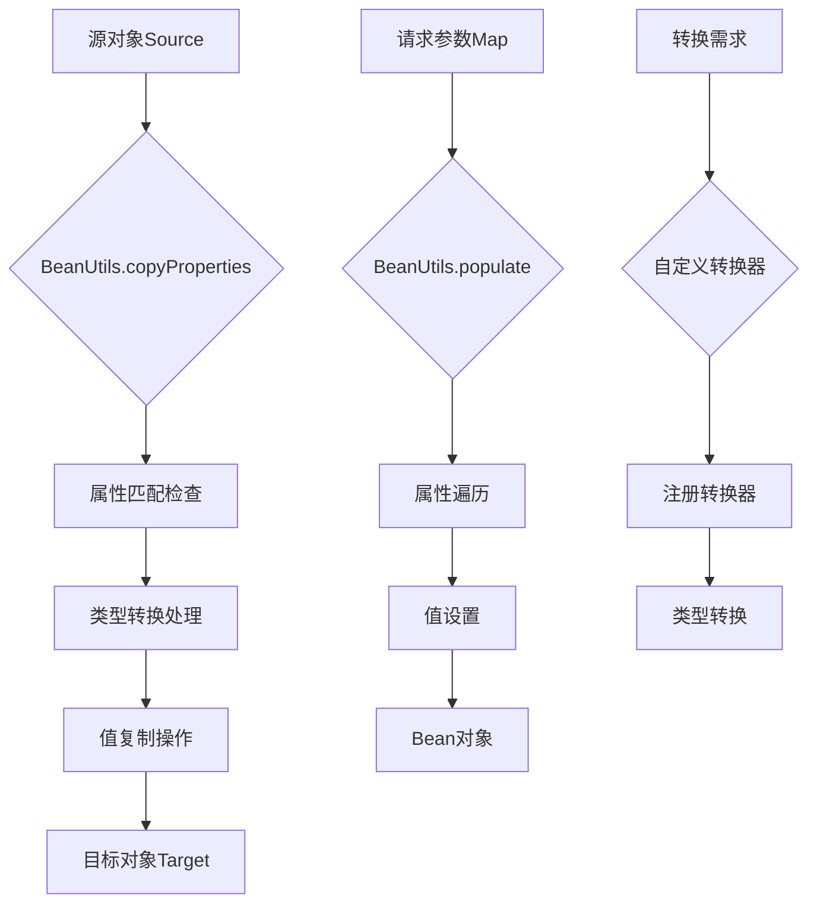

# Spring BeanUtils完全指南：优雅实现JavaBean属性复制与映射

## 开头摘要

在Java企业级开发中，对象之间的属性复制是极其常见的操作。Spring框架提供的`BeanUtils`工具类通过反射机制简化了这一过程，大幅提升了开发效率。本文将深入解析Spring BeanUtils的设计原理、核心方法和实际应用场景，帮助你掌握这一重要工具的使用技巧。

## 目录

- #beanutils工具类概述
- #核心方法与使用详解
- #实际应用场景分析
- #性能优化与最佳实践
- #总结

## BeanUtils工具类概述

Spring BeanUtils是Spring框架核心模块(`spring-beans`)中的实用工具类，专门用于简化JavaBean操作。与Apache Commons BeanUtils相比，Spring版本具有**更高的性能**和**更好的类型安全性**，同时与Spring生态系统无缝集成。

该类基于Java反射机制实现，主要解决以下核心问题：
1. **减少样板代码**：避免手动编写大量的getter/setter调用
2. **类型自动转换**：支持基本数据类型和常用对象类型的自动转换
3. **空值安全处理**：妥善处理null值，避免NullPointerException

### 与Apache Commons BeanUtils的对比

| 特性 | Spring BeanUtils | Apache Commons BeanUtils |
|------|------------------|--------------------------|
| 性能 | 更优（反射优化） | 相对较低 |
| 依赖 | 无额外依赖（Spring核心包含） | 需要单独引入 |
| 类型安全 | 更好的类型检查 | 相对宽松 |
| 功能范围 | 专注于核心功能 | 功能更全面 |

## 核心方法与使用详解

### 属性复制：copyProperties()

`copyProperties()`是BeanUtils中最常用的方法，用于将源对象的属性值复制到目标对象：

```java
// 基本属性复制示例
public class UserDTO {
    private String name;
    private Integer age;
    // getter和setter方法
}

public class UserEntity {
    private String name;
    private int age;
    // getter和setter方法
}

// 使用BeanUtils进行属性复制
UserEntity entity = new UserEntity();
entity.setName("张三");
entity.setAge(25);

UserDTO dto = new UserDTO();
BeanUtils.copyProperties(entity, dto);

System.out.println(dto.getName()); // 输出"张三"
System.out.println(dto.getAge());  // 输出25
```

**关键特性**：
- **自动类型转换**：支持基本类型与包装类型的自动转换（如int ↔ Integer）
- **同名属性匹配**：只复制属性名相同的字段，忽略名称不匹配的属性
- **浅拷贝机制**：对于引用类型属性，复制的是引用而非对象本身

### 高级复制功能

```java
// 忽略特定属性复制
BeanUtils.copyProperties(source, target, "id", "createTime");

// 使用PropertyDescriptor进行精细控制
PropertyDescriptor[] descriptors = BeanUtils.getPropertyDescriptors(UserEntity.class);
for (PropertyDescriptor descriptor : descriptors) {
    if ("password".equals(descriptor.getName())) {
        continue; // 跳过密码字段
    }
    // 自定义复制逻辑
}
```

### 对象实例化与属性访问

```java
// 动态创建对象实例
UserEntity user = BeanUtils.instantiateClass(UserEntity.class);

// 获取属性描述符
PropertyDescriptor nameDescriptor = BeanUtils.getPropertyDescriptor(UserEntity.class, "name");
Method readMethod = nameDescriptor.getReadMethod(); // 获取getter方法
Method writeMethod = nameDescriptor.getWriteMethod(); // 获取setter方法
```

下面是BeanUtils的核心方法分类及其在实际应用中的流转过程：



## 实际应用场景分析

### DTO与Entity转换

在分层架构中，BeanUtils常用于DTO(Data Transfer Object)与Entity之间的转换：

```java
@Service
public class UserService {
    
    @Autowired
    private UserRepository userRepository;
    
    public UserDTO getUserById(Long id) {
        UserEntity entity = userRepository.findById(id)
            .orElseThrow(() -> new RuntimeException("用户不存在"));
        
        UserDTO dto = new UserDTO();
        BeanUtils.copyProperties(entity, dto);
        
        // 处理特殊字段转换
        dto.setFormattedCreateTime(formatDate(entity.getCreateTime()));
        
        return dto;
    }
    
    public UserEntity createUser(UserDTO userDTO) {
        UserEntity entity = new UserEntity();
        BeanUtils.copyProperties(userDTO, entity);
        
        // 设置系统自动生成的字段
        entity.setCreateTime(new Date());
        entity.setStatus(1);
        
        return userRepository.save(entity);
    }
}
```

### Web层数据绑定

在Spring MVC中，BeanUtils可以简化请求参数到对象模型的绑定：

```java
@RestController
public class UserController {
    
    @PostMapping("/users")
    public ResponseEntity<String> createUser(@RequestBody UserForm form) {
        // 表单验证
        if (!StringUtils.hasText(form.getUsername())) {
            return ResponseEntity.badRequest().body("用户名不能为空");
        }
        
        // 表单对象转换为Entity
        UserEntity entity = new UserEntity();
        BeanUtils.copyProperties(form, entity);
        
        userService.save(entity);
        return ResponseEntity.ok("用户创建成功");
    }
    
    @GetMapping("/users/{id}")
    public UserDTO getUser(@PathVariable Long id) {
        UserEntity entity = userService.findById(id);
        UserDTO dto = new UserDTO();
        BeanUtils.copyProperties(entity, dto);
        return dto;
    }
}
```

### Map与Object转换

BeanUtils支持Map与JavaBean之间的相互转换，这在动态数据处理场景中非常有用：

```java
// Map转Object
public UserEntity mapToUser(Map<String, Object> userMap) {
    UserEntity user = new UserEntity();
    BeanUtils.copyProperties(user, userMap);
    return user;
}

// Object转Map
public Map<String, Object> userToMap(UserEntity user) {
    Map<String, Object> map = new HashMap<>();
    PropertyDescriptor[] descriptors = BeanUtils.getPropertyDescriptors(UserEntity.class);
    
    for (PropertyDescriptor descriptor : descriptors) {
        if (!"class".equals(descriptor.getName())) {
            try {
                Method readMethod = descriptor.getReadMethod();
                Object value = readMethod.invoke(user);
                map.put(descriptor.getName(), value);
            } catch (Exception e) {
                // 处理异常
            }
        }
    }
    return map;
}
```

## 性能优化与最佳实践

### 性能考量

虽然BeanUtils使用方便，但在高性能场景下需要注意：

1. **反射开销**：反射操作比直接方法调用慢10-100倍
2. **批量处理优化**：对于大量对象转换，考虑使用更高效的方案

```java
// 高性能替代方案：使用MapStruct
@Mapper
public interface UserMapper {
    UserMapper INSTANCE = Mappers.getMapper(UserMapper.class);
    
    UserDTO entityToDto(UserEntity entity);
    UserEntity dtoToEntity(UserDTO dto);
    
    // 批量转换
    List<UserDTO> entitiesToDtos(List<UserEntity> entities);
}

// 使用示例
List<UserDTO> dtos = UserMapper.INSTANCE.entitiesToDtos(userEntities);
```

### 异常处理最佳实践

```java
public class SafeBeanUtils {
    
    public static void copyPropertiesSafely(Object source, Object target) {
        if (source == null || target == null) {
            throw new IllegalArgumentException("源对象和目标对象不能为null");
        }
        
        try {
            BeanUtils.copyProperties(source, target);
        } catch (Exception e) {
            log.error("属性复制失败: source={}, target={}", 
                     source.getClass().getSimpleName(), 
                     target.getClass().getSimpleName(), e);
            throw new RuntimeException("对象转换失败", e);
        }
    }
    
    // 带忽略字段的安全复制
    public static void copyPropertiesIgnore(Object source, Object target, String... ignoreProperties) {
        if (source == null || target == null) {
            return;
        }
        
        try {
            // 手动实现忽略逻辑或使用Spring的BeanWrapper
            BeanWrapper sourceWrapper = new BeanWrapperImpl(source);
            BeanWrapper targetWrapper = new BeanWrapperImpl(target);
            
            PropertyDescriptor[] descriptors = BeanUtils.getPropertyDescriptors(source.getClass());
            for (PropertyDescriptor descriptor : descriptors) {
                String propertyName = descriptor.getName();
                
                if (shouldIgnore(propertyName, ignoreProperties)) {
                    continue;
                }
                
                if (targetWrapper.isWritableProperty(propertyName) && 
                    sourceWrapper.isReadableProperty(propertyName)) {
                    Object value = sourceWrapper.getPropertyValue(propertyName);
                    targetWrapper.setPropertyValue(propertyName, value);
                }
            }
        } catch (Exception e) {
            log.error("安全属性复制失败", e);
        }
    }
    
    private static boolean shouldIgnore(String propertyName, String[] ignoreProperties) {
        return Arrays.stream(ignoreProperties)
                     .anyMatch(propertyName::equals);
    }
}
```

### 自定义类型转换器

对于复杂类型转换，可以注册自定义转换器：

```java
@Component
public class CustomConverter implements Converter<String, LocalDateTime> {
    
    private static final DateTimeFormatter FORMATTER = 
        DateTimeFormatter.ofPattern("yyyy-MM-dd HH:mm:ss");
    
    @Override
    public LocalDateTime convert(String source) {
        if (!StringUtils.hasText(source)) {
            return null;
        }
        return LocalDateTime.parse(source, FORMATTER);
    }
}

// 注册转换器
@Configuration
public class ConverterConfig {
    
    @Autowired
    private CustomConverter customConverter;
    
    @PostConstruct
    public void registerConverters() {
        ConversionService conversionService = new DefaultConversionService();
        // 注册自定义转换器
        ((DefaultConversionService) conversionService).addConverter(customConverter);
    }
}
```

## 总结

Spring BeanUtils是一个功能强大且实用的工具类，通过合理使用可以显著提升开发效率。以下是关键要点总结：

### 核心价值
1. **简化开发**：大幅减少属性复制的样板代码
2. **类型安全**：提供良好的类型检查和转换机制
3. **框架集成**：与Spring生态系统完美契合

### 使用建议
1. **适用场景**：适合CRUD操作、DTO转换、表单绑定等常规业务场景
2. **性能敏感场景**：考虑使用MapStruct等编译时映射工具
3. **复杂转换**：结合自定义转换器处理特殊类型转换需求

### 注意事项
- 理解**浅拷贝**特性，对于嵌套对象需要特别处理
- 注意**异常处理**，确保代码的健壮性
- 在**高性能要求**的场景下评估替代方案

BeanUtils作为Spring开发者工具箱中的重要工具，合理运用可以让代码更加简洁优雅，但也需要根据具体场景做出合适的技术选型。

## 延伸阅读
1. https://docs.spring.io/spring-framework/docs/current/javadoc-api/org/springframework/beans/BeanUtils.html
2. https://commons.apache.org/proper/commons-beanutils/
3. https://mapstruct.org/

## 一句话记忆
Spring BeanUtils通过反射机制实现对象属性复制，让DTO转换和数据绑定变得简单高效，是Spring开发者必备的工具类之一。