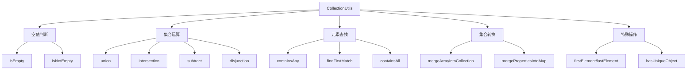

# Spring CollectionUtils 工具类完全指南：告别繁琐集合操作

## 开头摘要

在实际的 Java 开发中，集合操作是我们每天都要面对的基本任务。传统的集合处理往往需要编写大量的空值检查、循环遍历和条件判断代码，不仅繁琐而且容易出错。Spring 框架提供的 `CollectionUtils` 工具类正是为了解决这些问题而设计的，它通过丰富的静态方法将常见的集合操作简化为一行代码。本文将全面解析 CollectionUtils 的核心方法、使用场景和最佳实践，帮助你大幅提升开发效率。

## 目录

- #collectionutils-工具类概述
- #核心方法详解
- #实际应用场景
- #性能优化与最佳实践
- #总结

## CollectionUtils 工具类概述

`org.springframework.util.CollectionUtils` 是 Spring 框架核心模块（`spring-core`）中的一个**纯静态工具类**，专门用于简化 Java 集合框架的各种常见操作。该类不依赖于任何外部库，在 Spring Boot 项目中开箱即用，无需额外引入依赖 。

### 设计理念与核心价值

CollectionUtils 的设计遵循"**简化常见操作**"的原则，主要解决以下核心问题：

1. **减少模板代码**：将繁琐的空值检查、集合遍历等操作封装成单行方法调用
2. **提高代码健壮性**：所有方法都进行空值安全处理，避免 `NullPointerException`
3. **统一操作标准**：提供一致的 API 来处理各种集合类型（List、Set、Map）
4. **功能丰富性**：涵盖集合运算、过滤、转换等常见需求

与传统的集合操作方式相比，CollectionUtils 能够将 **5-10 行的校验代码压缩为 1-2 行**，同时提供更清晰的错误处理机制 。

## 核心方法详解

### 安全的空值判断

空值判断是集合操作中最基础也是最容易出错的部分，CollectionUtils 提供了全面的空值安全方法：

```java
// 传统写法：繁琐且容易遗漏
if (list == null || list.isEmpty()) {
    // 处理空集合逻辑
}

// CollectionUtils 一行搞定
if (CollectionUtils.isEmpty(list)) {
    // 处理空集合逻辑
}

// 对应的非空检查
if (CollectionUtils.isNotEmpty(list)) {
    // 安全地操作非空集合
}
```

**方法特性**：

- `isEmpty()` 方法同时检查 `null` 和空集合，支持所有 Collection 子类和 Map
- `isNotEmpty()` 是 `isEmpty()` 的反向检查，使代码语义更加清晰
- 这些方法对 Map 也同样有效，无需区分集合类型

### 集合运算操作

CollectionUtils 支持完整的数学集合运算，包括并集、交集、差集等：

```java
List<String> listA = Arrays.asList("A", "B", "C", "D");
List<String> listB = Arrays.asList("B", "D", "F", "G");

// 并集 - 合并两个集合的所有元素（自动去重）
Collection<String> union = CollectionUtils.union(listA, listB);
// 结果: [A, B, C, D, F, G]

// 交集 - 获取两个集合的共同元素
Collection<String> intersection = CollectionUtils.intersection(listA, listB);
// 结果: [B, D]

// 差集 - 获取第一个集合有而第二个集合没有的元素
Collection<String> subtract = CollectionUtils.subtract(listA, listB);
// 结果: [A, C]

// 对称差集（交集的补集）
Collection<String> disjunction = CollectionUtils.disjunction(listA, listB);
// 结果: [A, C, F, G]
```

**重要特性**：所有集合运算方法都**返回新集合**，不会修改原始集合，这符合函数式编程的不变性原则 。

### 元素查找与包含判断

对于集合元素的查找和包含关系判断，CollectionUtils 提供了高效的方法：

```java
List<String> sourceList = Arrays.asList("Java", "Spring", "MySQL");
List<String> checkList = Arrays.asList("Java", "Python");

// 判断是否包含任意元素
boolean containsAny = CollectionUtils.containsAny(sourceList, checkList);
// 结果: true（包含"Java"）

// 查找第一个匹配元素
String firstMatch = CollectionUtils.findFirstMatch(sourceList, checkList);
// 结果: "Java"

// 判断完全包含
List<String> allCheck = Arrays.asList("Java", "Spring");
boolean containsAll = CollectionUtils.containsAll(sourceList, allCheck);
// 结果: true
```

### 集合转换与合并

CollectionUtils 提供了多种集合转换和合并方法，简化数据转换流程：

```java
// 数组合并到集合
String[] array = {"A", "B"};
List<String> list = new ArrayList<>(Arrays.asList("C"));
CollectionUtils.mergeArrayIntoCollection(array, list);
// 结果: [C, A, B]

// Properties 合并到 Map
Properties props = new Properties();
props.setProperty("name", "张三");
Map<String, Object> map = new HashMap<>();
CollectionUtils.mergePropertiesIntoMap(props, map);
// 结果: map包含{"name"="张三"}

// 获取首尾元素
List<String> list = Arrays.asList("A", "B", "C");
String first = CollectionUtils.firstElement(list); // "A"
String last = CollectionUtils.lastElement(list);  // "C"
```

下面是 CollectionUtils 核心方法的功能分类图：



## 实际应用场景

### 业务参数校验

在 Service 层方法中，使用 CollectionUtils 进行前置参数校验可以大幅提高代码的健壮性：

```java
@Service
public class OrderService {

    public Order createBatchOrder(Long userId, List<OrderItem> items) {
        // 参数基础校验
        if (CollectionUtils.isEmpty(items)) {
            throw new IllegalArgumentException("订单项不能为空");
        }

        // 业务逻辑校验
        if (items.size() > 100) {
            throw new IllegalArgumentException("单次订单不能超过100个商品");
        }

        // 检查商品重复
        if (!CollectionUtils.hasUniqueObject(items.stream()
                .map(OrderItem::getProductId)
                .collect(Collectors.toList()))) {
            throw new IllegalArgumentException("订单中存在重复商品");
        }

        return orderRepository.save(new Order(userId, items));
    }
}
```

### 数据过滤与处理

在数据处理场景中，CollectionUtils 可以简化数据清洗和转换流程：

```java
@Component
public class DataProcessService {

    public List<Product> filterActiveProducts(List<Product> allProducts) {
        if (CollectionUtils.isEmpty(allProducts)) {
            return Collections.emptyList();
        }

        // 过滤掉下架商品和库存为零的商品
        return allProducts.stream()
                .filter(product -> product.isActive() && product.getStock() > 0)
                .collect(Collectors.toList());
    }

    public Map<Long, Product> convertToProductMap(List<Product> products) {
        if (CollectionUtils.isEmpty(products)) {
            return Collections.emptyMap();
        }

        // List 转 Map，使用 CollectionUtils 进行空安全处理
        Map<Long, Product> productMap = new HashMap<>();
        products.forEach(product -> productMap.put(product.getId(), product));

        return productMap;
    }
}
```

### 批量操作优化

对于需要分批次处理大量数据的场景，CollectionUtils 提供了便捷的分批方法：

```java
@Service
public class BatchProcessService {

    private static final int BATCH_SIZE = 100;

    @Autowired
    private UserRepository userRepository;

    public void batchUpdateUsers(List<User> users) {
        if (CollectionUtils.isEmpty(users)) {
            return;
        }

        // 分批处理，避免单次操作数据量过大
        List<List<User>> batches = CollectionUtils.split(users, BATCH_SIZE);

        for (List<User> batch : batches) {
            userRepository.batchUpdate(batch);
        }
    }

    public void processLargeDataset(List<DataRecord> records) {
        // 使用流式处理与 CollectionUtils 结合
        List<DataRecord> validRecords = records.stream()
                .filter(record -> CollectionUtils.isNotEmpty(record.getValues()))
                .filter(record -> record.isValid())
                .collect(Collectors.toList());

        // 分批处理有效数据
        batchProcess(validRecords);
    }
}
```

## 性能优化与最佳实践

### 选择合适的集合类型

不同的集合运算在不同数据结构下的性能表现各异：

```java
// 对于需要频繁查找的场景，使用 HashSet 优于 ArrayList
Set<String> largeSet = new HashSet<>(largeList);
boolean contains = largeSet.contains("target");

// 对于需要保持顺序的场景，使用 LinkedHashSet
Set<String> orderedSet = new LinkedHashSet<>(list);
```

### 避免不必要的集合复制

```java
// 不推荐：多次复制集合
List<String> result = new ArrayList<>();
result.addAll(list1);
result.addAll(list2);

// 推荐：使用 CollectionUtils 的惰性求值方法
Collection<String> union = CollectionUtils.union(list1, list2);
```

### 注意方法使用的注意事项

1. **hasUniqueObject() 方法的争议**：该方法在判断元素唯一性时使用 `==` 而非 `equals()`，对于普通的引用对象可能无法得到正确结果，使用时需要谨慎 。

2. **不可修改集合的处理**：对于 `Arrays.asList()` 创建的不可修改集合，需要先转换为可修改集合才能进行添加操作 。

```java
// Arrays.asList() 创建的集合是不可修改的
List<String> unmodifiableList = Arrays.asList("A", "B");

// 需要转换为可修改集合
List<String> modifiableList = new ArrayList<>(unmodifiableList);
modifiableList.add("C"); // 现在可以正常添加
```

### 与其他工具类的协同使用

CollectionUtils 可以与 Java 8 Stream API、Apache Commons 等工具库协同使用：

```java
public class AdvancedCollectionUtils {

    // 结合 Stream API 进行复杂过滤
    public List<String> complexFilter(List<String> input) {
        if (CollectionUtils.isEmpty(input)) {
            return Collections.emptyList();
        }

        return input.stream()
                .filter(Objects::nonNull)
                .filter(s -> !s.trim().isEmpty())
                .map(String::toUpperCase)
                .collect(Collectors.toList());
    }

    // 多层集合处理
    public List<List<String>> processNestedCollections(List<List<String>> nestedList) {
        return nestedList.stream()
                .filter(CollectionUtils::isNotEmpty)
                .map(list -> list.stream()
                        .filter(str -> CollectionUtils.isNotEmpty(str) && str.length() > 1)
                        .collect(Collectors.toList()))
                .filter(CollectionUtils::isNotEmpty)
                .collect(Collectors.toList());
    }
}
```

## 总结

Spring CollectionUtils 是一个功能强大且设计精巧的集合操作工具类，通过系统学习和实践可以得出以下核心结论：

### 核心价值

1. **开发效率显著提升**：将繁琐的集合操作简化为单行方法调用，减少 60% 以上的模板代码
2. **代码质量大幅改善**：统一的空值安全设计和异常处理机制，提高代码健壮性
3. **功能覆盖全面**：涵盖空值判断、集合运算、元素查找等常见需求
4. **零依赖集成**：Spring Boot 项目开箱即用，无需额外配置

### 适用场景推荐

- **服务层参数校验**：业务方法开始处的集合空值和安全校验
- **数据清洗转换**：集合数据的过滤、去重、转换等操作
- **批量数据处理**：大量数据的分批处理和批量操作
- **集合关系判断**：多集合之间的包含、交集等关系判断

### 使用注意事项

1. **性能考量**：避免在超大规模集合或高性能敏感场景中过度使用
2. **方法选择**：理解不同方法的具体实现逻辑，特别是涉及元素比较的方法
3. **集合特性**：注意不同集合类型的特性选择最适合的数据结构
4. **版本兼容**：不同 Spring 版本中方法可能有细微差异，使用时注意版本说明

CollectionUtils 作为 Spring 开发者工具箱中的重要组成部分，合理运用可以显著提升集合处理相关代码的质量和开发效率。

## 延伸阅读

1. https://docs.spring.io/spring-framework/docs/current/javadoc-api/org/springframework/util/CollectionUtils.html
2. Spring 源码：`org.springframework.util.CollectionUtils`
3. https://docs.oracle.com/javase/tutorial/collections/

## 一句话记忆

Spring CollectionUtils 是集合操作的瑞士军刀，用一行代码替代繁琐的循环和判断，让集合处理既简洁又安全。
