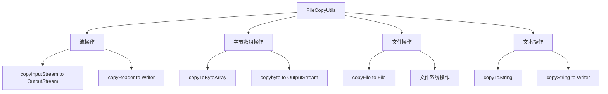

# Spring FileCopyUtils 完全指南：文件操作的终极利器

## 开头摘要

在 Java 开发中，文件操作是每个程序员都会遇到的常见任务，但传统的 I/O 流操作代码繁琐且容易出错。Spring 框架提供的 `FileCopyUtils` 工具类通过封装复杂的流操作逻辑，让文件复制、流转换等操作变得简单高效。本文将全面解析 FileCopyUtils 的设计原理、核心方法和实际应用场景，帮助你大幅提升文件处理效率。

## 目录

- #filecopyutils-工具类概述
- #核心方法详解
- #实际应用场景
- #性能优化与最佳实践
- #总结

## FileCopyUtils 工具类概述

`org.springframework.util.FileCopyUtils` 是 Spring 框架核心模块中的一个**文件操作工具类**，专门用于简化 Java I/O 编程中的常见操作。该类完全由静态方法组成，基于标准的 Java I/O API 构建，但提供了更简洁、更安全的封装。

### 设计理念与优势

FileCopyUtils 的设计遵循"简化复杂操作"的原则，具有以下显著优势：

1. **代码简洁化**：将繁琐的流操作封装成一行方法调用，减少 80% 的模板代码
2. **空值安全性**：所有方法都进行空值检查，避免 NullPointerException
3. **资源管理优化**：内部使用 4096 字节的缓冲区，平衡内存使用和性能
4. **异常处理统一**：统一抛出 IOException，简化错误处理逻辑
5. **零依赖集成**：Spring Boot 项目开箱即用，无需额外配置

### 与相关工具类对比

| 特性       | Spring FileCopyUtils | Apache Commons IO | JDK Files 类 |
| ---------- | -------------------- | ----------------- | ------------ |
| 依赖程度   | 仅需 Spring Core     | 需额外依赖        | JDK 内置     |
| API 简洁性 | 非常简洁             | 简洁              | 相对繁琐     |
| 功能范围   | 专注于核心文件操作   | 功能全面          | 基础文件操作 |
| 性能表现   | 优化良好             | 良好              | 原生性能     |

## 核心方法详解

### 流拷贝操作

`copy(InputStream in, OutputStream out)` 是 FileCopyUtils 最核心的方法，用于处理流之间的数据复制：

```java
// 基础流拷贝示例
try (InputStream in = new FileInputStream("source.txt");
     OutputStream out = new FileOutputStream("target.txt")) {
    FileCopyUtils.copy(in, out);
} catch (IOException e) {
    e.printStackTrace();
}

// 网络流到文件流的复制
URL url = new URL("http://example.com/file.pdf");
try (InputStream webStream = url.openStream();
     FileOutputStream fileStream = new FileOutputStream("local.pdf")) {
    FileCopyUtils.copy(webStream, fileStream);
}
```

**关键技术点**：

- 内部使用 4096 字节缓冲区，避免频繁的底层 I/O 调用
- 支持所有类型的 InputStream 和 OutputStream 实现
- **不会自动关闭流**，需要手动管理资源

### 字节数组转换

FileCopyUtils 提供了便捷的字节数组转换方法，特别适合处理内存数据：

```java
// 文件到字节数组的转换
File sourceFile = new File("document.pdf");
byte[] fileData = FileCopyUtils.copyToByteArray(sourceFile);

// 字节数组到文件的转换
byte[] imageData = getImageDataFromDatabase();
File outputFile = new File("image.jpg");
FileCopyUtils.copy(imageData, outputFile);

// 流到字节数组的转换（适合小文件）
try (InputStream stream = getInputStream()) {
    byte[] streamData = FileCopyUtils.copyToByteArray(stream);
}
```

**重要提醒**：`copyToByteArray` 方法会将所有数据加载到内存，**不适合大文件处理**。

### 文件直接复制

对于简单的文件到文件复制，FileCopyUtils 提供了直接的方法：

```java
// 单文件复制
File source = new File("original.txt");
File destination = new File("copy.txt");
FileCopyUtils.copy(source, destination);

// 文件复制与重命名
File original = new File("/path/to/source.docx");
File renamed = new File("/path/to/backup.docx");
FileCopyUtils.copy(original, renamed);
```

### 文本内容处理

对于文本文件，FileCopyUtils 提供了字符级操作方法，支持编码处理：

```java
// 读取文本文件内容
try (Reader reader = new FileReader("text.txt", StandardCharsets.UTF_8)) {
    String content = FileCopyUtils.copyToString(reader);
    System.out.println("文件内容: " + content);
}

// 写入文本内容到文件
String textContent = "Hello, Spring FileCopyUtils!";
try (Writer writer = new FileWriter("output.txt", StandardCharsets.UTF_8)) {
    FileCopyUtils.copy(textContent, writer);
}
```

**编码处理建议**：始终明确指定字符编码，避免使用默认编码导致的乱码问题。

下面是 FileCopyUtils 核心方法的功能分类图：



## 实际应用场景

### Web 文件上传处理

在 Spring MVC 中处理文件上传时，FileCopyUtils 可以大幅简化代码：

```java
@RestController
@RequestMapping("/api/files")
public class FileUploadController {

    @PostMapping("/upload")
    public ResponseEntity<String> uploadFile(@RequestParam("file") MultipartFile file) {
        if (file.isEmpty()) {
            return ResponseEntity.badRequest().body("文件不能为空");
        }

        try {
            // 安全处理文件名
            String filename = StringUtils.cleanPath(file.getOriginalFilename());
            Path filePath = Paths.get("uploads", filename);

            // 使用 FileCopyUtils 保存上传文件
            try (InputStream in = file.getInputStream();
                 OutputStream out = Files.newOutputStream(filePath)) {
                FileCopyUtils.copy(in, out);
            }

            return ResponseEntity.ok("文件上传成功: " + filename);
        } catch (IOException e) {
            return ResponseEntity.status(500)
                .body("上传失败: " + e.getMessage());
        }
    }

    @GetMapping("/download/{filename}")
    public void downloadFile(@PathVariable String filename,
                           HttpServletResponse response) {
        try {
            Path filePath = Paths.get("uploads", filename);
            File file = filePath.toFile();

            if (!file.exists()) {
                response.setStatus(HttpServletResponse.SC_NOT_FOUND);
                return;
            }

            // 设置响应头
            response.setContentType("application/octet-stream");
            response.setHeader("Content-Disposition",
                "attachment; filename=\"" + filename + "\"");
            response.setContentLength((int) file.length());

            // 使用 FileCopyUtils 输出文件内容
            try (InputStream in = new FileInputStream(file)) {
                FileCopyUtils.copy(in, response.getOutputStream());
            }
        } catch (IOException e) {
            response.setStatus(HttpServletResponse.SC_INTERNAL_SERVER_ERROR);
        }
    }
}
```

### 配置文件处理

在 Spring 应用启动时，FileCopyUtils 可以用于配置文件的加载和处理：

```java
@Component
public class ConfigFileLoader {

    @Value("classpath:config/app-config.json")
    private Resource configResource;

    @PostConstruct
    public void loadConfiguration() {
        try {
            // 读取配置文件内容
            String configContent = FileCopyUtils.copyToString(
                new InputStreamReader(configResource.getInputStream(),
                    StandardCharsets.UTF_8));

            // 解析 JSON 配置
            JsonNode configNode = new ObjectMapper().readTree(configContent);
            processConfiguration(configNode);
        } catch (IOException e) {
            throw new RuntimeException("配置文件加载失败", e);
        }
    }

    public void saveConfiguration(String configPath, String newConfig) {
        try (Writer writer = new FileWriter(configPath, StandardCharsets.UTF_8)) {
            FileCopyUtils.copy(newConfig, writer);
        } catch (IOException e) {
            throw new RuntimeException("配置文件保存失败", e);
        }
    }
}
```

### 数据库 BLOB 数据处理

处理数据库中的二进制大对象时，FileCopyUtils 提供了便捷的转换方法：

```java
@Repository
public class BlobDataRepository {

    public void saveBlobToFile(Long recordId, String filePath) {
        byte[] blobData = jdbcTemplate.queryForObject(
            "SELECT file_data FROM blobs WHERE id = ?",
            byte[].class, recordId);

        if (blobData != null) {
            try (OutputStream out = new FileOutputStream(filePath)) {
                FileCopyUtils.copy(blobData, out);
            } catch (IOException e) {
                throw new RuntimeException("BLOB 数据导出失败", e);
            }
        }
    }

    public void storeFileToBlob(String filePath, Long recordId) {
        try {
            byte[] fileData = FileCopyUtils.copyToByteArray(new File(filePath));
            jdbcTemplate.update(
                "UPDATE blobs SET file_data = ? WHERE id = ?",
                fileData, recordId);
        } catch (IOException e) {
            throw new RuntimeException("文件数据导入 BLOB 失败", e);
        }
    }
}
```

## 性能优化与最佳实践

### 资源管理策略

正确的资源管理是使用 FileCopyUtils 的关键：

```java
// 推荐：使用 try-with-resources 自动管理资源
public void safeFileCopy(File source, File destination) {
    try (InputStream in = new FileInputStream(source);
         OutputStream out = new FileOutputStream(destination)) {
        FileCopyUtils.copy(in, out);
    } catch (IOException e) {
        log.error("文件复制失败: {} -> {}", source, destination, e);
    }
}

// 不推荐：手动管理资源（容易遗漏关闭操作）
public void unsafeFileCopy(File source, File destination) {
    try {
        InputStream in = new FileInputStream(source);
        OutputStream out = new FileOutputStream(destination);
        FileCopyUtils.copy(in, out); // 可能忘记关闭流！
    } catch (IOException e) {
        // 异常处理
    }
}
```

### 大文件处理策略

对于大文件操作，需要采用特殊策略避免内存溢出：

```java
@Service
public class LargeFileProcessor {

    private static final int BUFFER_SIZE = 8192; // 8KB 缓冲区

    public void processLargeFile(File inputFile, File outputFile) {
        // 对于特大文件，使用缓冲流分块处理
        try (BufferedInputStream bis = new BufferedInputStream(
                new FileInputStream(inputFile), BUFFER_SIZE);
             BufferedOutputStream bos = new BufferedOutputStream(
                new FileOutputStream(outputFile), BUFFER_SIZE)) {

            FileCopyUtils.copy(bis, bos);
        } catch (IOException e) {
            throw new RuntimeException("大文件处理失败", e);
        }
    }

    public void processLargeFileInChunks(File inputFile, File outputFile,
                                       int chunkSize) throws IOException {
        try (RandomAccessFile rafIn = new RandomAccessFile(inputFile, "r");
             FileOutputStream fos = new FileOutputStream(outputFile)) {

            byte[] buffer = new byte[chunkSize];
            long bytesRemaining = rafIn.length();

            while (bytesRemaining > 0) {
                int bytesToRead = (int) Math.min(buffer.length, bytesRemaining);
                int bytesRead = rafIn.read(buffer, 0, bytesToRead);

                if (bytesRead > 0) {
                    FileCopyUtils.copy(buffer, fos);
                    bytesRemaining -= bytesRead;
                }
            }
        }
    }
}
```

### 错误处理与重试机制

构建健壮的文件操作需要完善的错误处理：

```java
@Component
public class RobustFileOperations {

    private static final int MAX_RETRIES = 3;
    private static final long RETRY_DELAY_MS = 1000;

    public boolean copyFileWithRetry(File source, File destination) {
        int attempt = 0;
        while (attempt < MAX_RETRIES) {
            try {
                FileCopyUtils.copy(source, destination);
                return true;
            } catch (IOException e) {
                attempt++;
                if (attempt >= MAX_RETRIES) {
                    log.error("文件复制失败，已达最大重试次数: {}", source, e);
                    return false;
                }

                log.warn("文件复制失败，第 {} 次重试: {}", attempt, source);
                try {
                    Thread.sleep(RETRY_DELAY_MS * attempt);
                } catch (InterruptedException ie) {
                    Thread.currentThread().interrupt();
                    return false;
                }
            }
        }
        return false;
    }
}
```

## 总结

Spring FileCopyUtils 是一个设计精巧、功能实用的文件操作工具类，通过系统学习可以得出以下核心结论：

### 核心价值

1. **开发效率提升**：将繁琐的 I/O 操作简化为单行方法调用，显著减少代码量
2. **代码质量改善**：统一的错误处理机制和空值安全设计，提高代码健壮性
3. **性能优化**：内部缓冲区管理和优化的流处理逻辑，提供良好的性能表现

### 适用场景推荐

- **Web 应用**：文件上传下载、静态资源处理
- **配置管理**：配置文件读取、模板文件处理
- **数据转换**：数据库 BLOB 字段与文件系统之间的数据转换
- **批处理任务**：定期数据备份、文件格式转换

### 使用注意事项

1. **资源管理**：始终使用 try-with-resources 或确保手动关闭流
2. **大文件处理**：避免使用 `copyToByteArray` 处理大文件，防止内存溢出
3. **编码规范**：文本操作时明确指定字符编码，避免乱码问题
4. **异常处理**：合理处理 IOException，构建健壮的应用逻辑

FileCopyUtils 作为 Spring 框架中的"隐藏瑰宝"，虽然功能专注但实用性极强，合理运用可以显著提升文件处理相关代码的质量和开发效率。

## 延伸阅读

1. https://docs.spring.io/spring-framework/docs/current/javadoc-api/org/springframework/util/FileCopyUtils.html
2. Spring 源码：`org.springframework.util.FileCopyUtils`
3. https://docs.oracle.com/javase/tutorial/essential/io/

## 一句话记忆

FileCopyUtils 是 Spring 提供的文件操作利器，用一行代码替代繁琐的流操作，让文件处理变得简单而高效。
