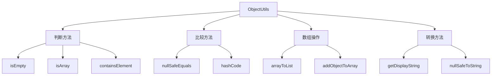

# Spring ObjectUtils工具类完全指南：优雅处理Java对象操作

## 开头摘要

在Spring应用开发中，对象判空、安全比较和默认值处理是日常编程中最常见且繁琐的任务。`org.springframework.util.ObjectUtils`作为Spring框架核心工具类，提供了一系列**空值安全**的静态方法，能显著简化代码并提高健壮性。本文将深入解析ObjectUtils的设计理念、核心方法和使用场景，帮助你编写更优雅的Java代码。

## 目录

- #objectutils工具类概述
- #空值判断方法详解
- #对象比较与哈希计算
- #数组操作工具方法
- #类型转换与序列化
- #实际应用场景
- #总结

## ObjectUtils工具类概述

`ObjectUtils`是Spring框架核心工具类之一，属于`spring-core`模块，从Spring 1.0就开始存在，专门解决**对象操作的通用问题**。该类完全由静态方法组成，主要优势包括：

1. **一站式判空**：支持普通对象、字符串、数组、集合、Map的空值判断，无需区分不同数据类型的判空规则
2. **空值安全**：所有方法都妥善处理`null`值输入，避免`NullPointerException`
3. **零依赖**：Spring Boot项目默认集成，开箱即用
4. **与Spring生态无缝集成**：深度整合Spring的转换服务等核心功能

与其它工具类相比，ObjectUtils的定位更加专注：它不追求功能的大而全，而是提供**简洁、一致**的对象操作API，特别适合Spring技术栈的项目。

## 空值判断方法详解

### 万能空值判断：isEmpty()

`isEmpty()`是ObjectUtils中最常用的方法，它提供统一的空值判断逻辑，支持多种数据类型：

```java
// 字符串判空
String emptyStr = "";
ObjectUtils.isEmpty(emptyStr); // true

// 集合判空
List<String> emptyList = new ArrayList<>();
ObjectUtils.isEmpty(emptyList); // true

// 数组判空
String[] emptyArray = new String[0];
ObjectUtils.isEmpty(emptyArray); // true

// Map判空
Map<String, Object> emptyMap = new HashMap<>();
ObjectUtils.isEmpty(emptyMap); // true

// 普通对象判空
Object nullObj = null;
ObjectUtils.isEmpty(nullObj); // true
```

**实现原理**：`isEmpty()`方法通过实例检查判断不同类型对象的"空"状态：
- 对于`CharSequence`，检查长度是否为0或trim后长度是否为0
- 对于`Collection`，调用`isEmpty()`方法
- 对于数组，检查长度是否为0
- 对于其他对象，仅判断是否为`null`

### 非空判断与默认值处理

```java
// 非空判断（语义更清晰）
String name = "张三";
if (ObjectUtils.nonNull(name)) {
    System.out.println("name不为null");
}

// 默认值处理（替代三目运算符）
String username = null;
String defaultName = ObjectUtils.defaultIfNull(username, "匿名用户");
// 结果为"匿名用户"

// 链式默认值处理
User user = null;
String city = ObjectUtils.defaultIfNull(
    ObjectUtils.defaultIfNull(user, new User()).getAddress(),
    new Address("默认城市")
).getCity();
```

## 对象比较与哈希计算

### 安全对象比较

`nullSafeEquals()`方法提供了空值安全的对象比较能力，有效避免NPE：

```java
String a = "abc";
String b = "abc";
String c = null;

// 传统写法需要判空，否则可能NPE
boolean traditionalEq = (a != null && a.equals(b));

// ObjectUtils写法：自动处理null
ObjectUtils.nullSafeEquals(a, b); // true
ObjectUtils.nullSafeEquals(a, c); // false（a非null，c为null）
ObjectUtils.nullSafeEquals(c, c); // true（两个null相等）
```

**重要提示**：`nullSafeEquals()`底层仍然调用对象的`equals()`方法，因此比较自定义对象时，需要确保正确重写了`equals()`方法。

### 安全哈希计算

`hashCode()`方法提供空值安全的哈希码计算：

```java
String str = "test";
String nullStr = null;

ObjectUtils.hashCode(str); // 返回3556498（test的哈希码）
ObjectUtils.hashCode(nullStr); // 返回0（null的哈希码）

// 在重写hashCode方法时的应用
@Override
public int hashCode() {
    return ObjectUtils.hashCode(name) + 31 * ObjectUtils.hashCode(age);
}
```

## 数组操作工具方法

### 数组判断与操作

ObjectUtils提供多种数组专用的工具方法：

```java
// 判断对象是否为数组
int[] intArr = {1, 2, 3};
String[] strArr = {"a", "b"};
ObjectUtils.isArray(intArr); // true
ObjectUtils.isArray("not array"); // false

// 判断数组是否包含元素
ObjectUtils.containsElement(strArr, "b"); // true
ObjectUtils.containsElement(intArr, 2); // true

// 数组转集合（支持基本类型数组）
List<Integer> list = ObjectUtils.arrayToList(intArr);
// 结果为[1, 2, 3]，自动装箱为Integer

// 向数组添加元素
String[] newArr = ObjectUtils.addObjectToArray(strArr, "c");
// 结果为["a", "b", "c"]
```

### 数组空值安全处理

```java
// 空数组判断
String[] emptyArray = new String[0];
ObjectUtils.isEmpty(emptyArray); // true

// 空值安全的数组转字符串
ObjectUtils.nullSafeToString(strArr); // "[a, b]"
ObjectUtils.nullSafeToString(null); // "null"

// 显示字符串（避免null显示为"null"）
ObjectUtils.getDisplayString(null); // 空字符串
ObjectUtils.getDisplayString(strArr); // "[a, b]"
```

下面是ObjectUtils核心方法的功能分类图，帮助理解各类方法之间的关系：



## 类型转换与序列化

### 对象转换操作

ObjectUtils提供安全的类型转换方法，集成Spring的转换服务：

```java
// 安全类型转换
Object numberStr = "123";
Integer number = ObjectUtils.convertIfNecessary(numberStr, Integer.class);
// 结果为123

// 集合类型转换
List<String> stringList = Arrays.asList("1", "2", "3");
// 转换为Integer数组
Integer[] intArray = ObjectUtils.convertIfNecessary(stringList, Integer[].class);

// 处理null值的字符串表示
ObjectUtils.getDisplayString(null); // 返回空字符串而非"null"
```

### 对象克隆与序列化

```java
// 条件克隆（浅克隆）
User original = new User("张三");
User cloned = ObjectUtils.cloneIfPossible(original);

// 对象序列化与反序列化
byte[] serialized = ObjectUtils.serialize(original);
User deserialized = (User) ObjectUtils.deserialize(serialized);
```

**克隆限制**：`cloneIfPossible()`仅执行**浅克隆**，对于包含可变引用字段的对象，需要自行实现深克隆逻辑。

## 实际应用场景

### Spring MVC参数处理

在Controller中处理可能为空的请求参数：

```java
@RestController
public class UserController {
    
    @GetMapping("/user")
    public User getUser(@RequestParam @Nullable String name) {
        // 参数为null时使用默认值
        String userName = ObjectUtils.defaultIfNull(name, "defaultUser");
        return userService.findUserByName(userName);
    }
    
    @PostMapping("/order")
    public Order createOrder(@RequestParam String orderTime) {
        // 自动类型转换
        LocalDateTime parsedTime = ObjectUtils.convertIfNecessary(
            orderTime, LocalDateTime.class
        );
        return orderService.createOrder(parsedTime);
    }
}
```

### 配置类中的安全处理

在Spring配置类中安全地处理可能为空的配置项：

```java
@Configuration
public class AppConfig {
    
    @Bean
    @ConditionalOnMissingBean
    public DataSource dataSource(
        @Value("${db.url:#{null}}") String url,
        @Value("${db.username:sa}") String username
    ) {
        // 使用默认配置当主配置为空时
        String jdbcUrl = ObjectUtils.defaultIfNull(url, "jdbc:h2:mem:testdb");
        
        HikariDataSource dataSource = new HikariDataSource();
        dataSource.setJdbcUrl(jdbcUrl);
        dataSource.setUsername(username);
        
        return dataSource;
    }
}
```

### 业务逻辑中的判空优化

替换繁琐的多层判空代码：

```java
// 传统写法（繁琐且易漏）
public String getUserCity(User user) {
    if (user != null && user.getAddress() != null) {
        return user.getAddress().getCity();
    }
    return "未知城市";
}

// 使用ObjectUtils的简洁写法
public String getUserCity(User user) {
    if (ObjectUtils.isEmpty(user)) {
        return "未知城市";
    }
    
    Address address = ObjectUtils.defaultIfNull(
        user.getAddress(), new Address("未知城市")
    );
    return ObjectUtils.defaultIfNull(address.getCity(), "未知城市");
}
```

### 集合处理的空值安全

```java
@Service
public class UserService {
    
    public List<String> getUserNames(List<User> users) {
        // 安全处理可能为null的集合
        if (ObjectUtils.isEmpty(users)) {
            return Collections.emptyList();
        }
        
        return users.stream()
            .filter(user -> ObjectUtils.nonNull(user.getName()))
            .map(User::getName)
            .collect(Collectors.toList());
    }
    
    public boolean hasUser(String[] userNames, String targetUser) {
        // 安全检查数组包含关系
        return ObjectUtils.containsElement(userNames, targetUser);
    }
}
```

## 总结

Spring的ObjectUtils工具类是一个功能全面且设计精巧的对象操作工具，通过系统学习可以发现：

### 核心价值

1. **代码简化**：将繁琐的判空、比较逻辑封装成一行方法调用，减少模板代码
2. **健壮性提升**：空值安全设计彻底避免NPE，提高系统稳定性
3. **一致性**：统一的空值处理逻辑，使代码更易理解和维护

### 使用建议

1. **优先选择场景**：在Spring技术栈项目中优先使用ObjectUtils，保持技术栈统一
2. **方法选择原则**：
   - 基础判空使用`isEmpty()`
   - 对象比较使用`nullSafeEquals()`
   - 默认值处理使用`defaultIfNull()`
3. **注意事项**：
   - 确保自定义对象正确重写`equals()`方法以便`nullSafeEquals()`正常工作
   - 理解`isEmpty()`和`isEmptyObject()`的不同适用场景
   - 注意浅克隆的局限性，必要时实现深克隆

### 性能考量

虽然ObjectUtils的方法调用有轻微性能开销，但在大多数业务场景中可忽略不计。对于性能极度敏感的场景，可考虑手动优化，但应优先保证代码可读性和健壮性。

ObjectUtils是Spring开发者工具箱中不可或缺的利器，合理使用可以显著提升开发效率和代码质量。

## 延伸阅读

1. https://docs.spring.io/spring-framework/docs/current/javadoc-api/org/springframework/util/ObjectUtils.html
2. Spring源码：`org.springframework.util.ObjectUtils`
3. https://www.manning.com/books/spring-in-action-sixth-edition - 第6章详细介绍Spring工具类

## 一句话记忆

ObjectUtils是Spring提供的空值安全对象操作工具集，让判空、比较和默认值处理既简洁又健壮。