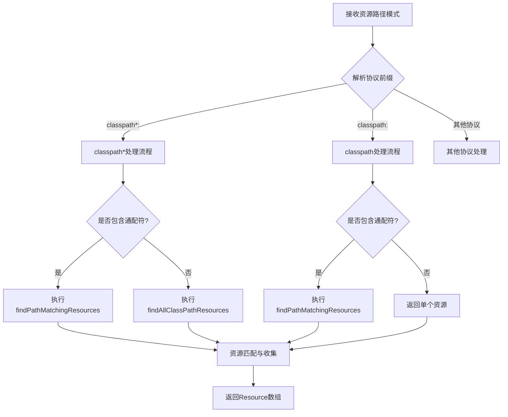

# Spring PathMatchingResourcePatternResolver 完全指南：掌握资源模式匹配的艺术

## 开头摘要

在 Spring 应用开发中，高效地定位和加载资源文件是一个常见且关键的需求。`PathMatchingResourcePatternResolver` 作为 Spring 框架核心的资源模式匹配解析器，通过强大的 Ant 风格路径匹配能力和智能的资源定位机制，大幅简化了复杂环境下的资源查找工作。本文将深入解析这一核心组件的设计原理、使用方法和实际应用场景，帮助开发者充分利用其强大功能。

## 目录

- #pathmatchingresourcepatternresolver-概述
- #核心架构与设计原理
- #路径匹配规则详解
- #实际应用场景
- #性能优化与最佳实践
- #总结

## PathMatchingResourcePatternResolver 概述

`org.springframework.core.io.support.PathMatchingResourcePatternResolver` 是 Spring 框架中用于**解析资源路径模式**的核心工具类，位于 `spring-core` 模块中。该类实现了 `ResourcePatternResolver` 接口，扩展了基本的 `ResourceLoader` 功能，增加了对复杂路径模式匹配的支持。

### 设计目标与核心价值

PathMatchingResourcePatternResolver 主要解决以下核心问题：

1. **统一资源访问接口**：为不同类型资源（文件系统、类路径、JAR 包等）提供一致的访问方式
2. **模式匹配能力**：支持 Ant 风格通配符，实现灵活的资源筛选
3. **多资源加载**：能够一次性加载多个匹配的资源，而不仅是单个资源
4. **环境适应性**：智能适应各种部署环境（本地开发、JAR 包部署、WAR 包部署等）

### 与相关接口的关系

```java
// ResourceLoader 基础接口 - 单资源加载
public interface ResourceLoader {
    Resource getResource(String location);
    ClassLoader getClassLoader();
}

// ResourcePatternResolver 扩展接口 - 多资源模式匹配
public interface ResourcePatternResolver extends ResourceLoader {
    String CLASSPATH_ALL_URL_PREFIX = "classpath*:";
    Resource[] getResources(String locationPattern) throws IOException;
}
```

PathMatchingResourcePatternResolver 是 ResourcePatternResolver 的**默认实现**，提供了完整的模式匹配功能 。

## 核心架构与设计原理

### 类结构与关键组件

PathMatchingResourcePatternResolver 的核心架构围绕几个关键组件构建：

1. **路径匹配器 (PathMatcher)**：默认使用 AntPathMatcher，负责解析通配符模式
2. **资源加载器 (ResourceLoader)**：内部委托的底层资源加载器，默认为 DefaultResourceLoader
3. **协议解析器**：处理不同资源协议（classpath、file、http 等）

### 核心算法流程

当调用 `getResources()` 方法时，解析器遵循一套精细的算法流程：

```java
public Resource[] getResources(String locationPattern) throws IOException {
    // 1. 协议前缀解析
    if (locationPattern.startsWith(CLASSPATH_ALL_URL_PREFIX)) {
        // 处理 classpath*: 前缀
        if (pathMatcher.isPattern(locationPattern.substring(CLASSPATH_ALL_URL_PREFIX.length()))) {
            return findPathMatchingResources(locationPattern);  // 包含通配符
        } else {
            return findAllClassPathResources(locationPattern.substring(CLASSPATH_ALL_URL_PREFIX.length()));  // 无通配符
        }
    } else {
        // 处理其他协议前缀
        int prefixEnd = locationPattern.indexOf(":") + 1;
        if (pathMatcher.isPattern(locationPattern.substring(prefixEnd))) {
            return findPathMatchingResources(locationPattern);  // 包含通配符
        } else {
            return new Resource[] {getResourceLoader().getResource(locationPattern)};  // 无通配符
        }
    }
}
```

此算法首先根据资源路径的前缀（如 `classpath*:` 与 `classpath:`）和是否包含通配符，决定采用哪种具体的资源查找策略 。

### 资源查找的深度解析

对于复杂的模式匹配，解析器采用**分治策略**：

1. **确定根目录**：从模式中提取不包含通配符的最长前缀路径
2. **解析子模式**：剩余部分作为匹配规则
3. **递归查找**：在根目录下递归应用子模式匹配

```java
protected Resource[] findPathMatchingResources(String locationPattern) throws IOException {
    String rootDirPath = determineRootDir(locationPattern);    // 确定根目录
    String subPattern = locationPattern.substring(rootDirPath.length());  // 子匹配模式
    
    // 获取根目录下的所有资源
    Resource[] rootDirResources = getResources(rootDirPath);
    Set<Resource> result = new LinkedHashSet<>(16);
    
    for (Resource rootDirResource : rootDirResources) {
        // 针对不同类型的资源采用不同的查找策略
        if (isJarResource(rootDirResource)) {
            result.addAll(doFindPathMatchingJarResources(rootDirResource, subPattern));
        } else {
            result.addAll(doFindPathMatchingFileResources(rootDirResource, subPattern));
        }
    }
    return result.toArray(new Resource[0]);
}
```

这种方法确保了高效且准确的资源定位 。

下面是 PathMatchingResourcePatternResolver 处理资源请求的核心流程：



## 路径匹配规则详解

### Ant 风格通配符

PathMatchingResourcePatternResolver 支持完整的 Ant 风格通配符，以下是核心通配符及其含义：

| 通配符 | 含义 | 示例 | 匹配示例 |
|--------|------|------|----------|
| `*` | 匹配零个或多个字符（不包含路径分隔符） | `*.xml` | `application.xml`, `context.xml` |
| `**` | 匹配零个或多个目录 | `/**/test.xml` | `/com/test.xml`, `/com/example/test.xml` |
| `?` | 匹配单个字符 | `config?.xml` | `config1.xml`, `configA.xml` |

### 协议前缀详解

不同的协议前缀决定了资源查找的范围和策略：

#### classpath: 与 classpath*: 的区别

`classpath:` 和 `classpath*:` 是两种最常用的协议前缀，它们有重要区别：

- **classpath:** - 仅查找**当前类加载器路径**下的资源，找到第一个匹配项即返回
- **classpath*:** - 查找**所有类加载器路径**下的资源，包括所有 JAR 包中的资源

```java
// 示例1：只查找当前类路径下的配置文件
Resource[] resources1 = resolver.getResources("classpath:config/*.properties");

// 示例2：查找所有类路径（包括JAR包）中的配置文件
Resource[] resources2 = resolver.getResources("classpath*:META-INF/**/*.xml");
```

#### 文件系统协议

```java
// 相对路径（相对于当前工作目录）
Resource resource1 = resolver.getResource("file:config/app.properties");

// 绝对路径
Resource resource2 = resolver.getResource("file:/etc/myapp/config.properties");
```

### 实际匹配示例

以下是一些实用的路径匹配示例：

```java
PathMatchingResourcePatternResolver resolver = new PathMatchingResourcePatternResolver();

// 1. 匹配所有XML配置文件
Resource[] xmlResources = resolver.getResources("classpath*:**/*.xml");

// 2. 匹配特定包下的属性文件
Resource[] propResources = resolver.getResources("classpath*:com/example/**/*.properties");

// 3. 匹配模块化的配置文件
Resource[] moduleResources = resolver.getResources("classpath*:*-context.xml");

// 4. 精确匹配文件名
Resource[] exactResources = resolver.getResources("classpath:application.properties");
```

这些匹配规则在实际项目中极其有用，特别是在需要**动态加载资源**的场景中 。

## 实际应用场景

### Spring 配置加载

在 Spring 应用启动时，PathMatchingResourcePatternResolver 被广泛用于加载配置文件：

```java
@Configuration
public class AppConfig {
    
    @Bean
    public PathMatchingResourcePatternResolver resourceResolver() {
        return new PathMatchingResourcePatternResolver();
    }
    
    @Bean
    public Properties applicationProperties() throws IOException {
        Properties props = new Properties();
        Resource[] resources = resourceResolver().getResources("classpath*:application-*.properties");
        
        for (Resource resource : resources) {
            PropertiesLoaderUtils.fillProperties(props, new EncodedResource(resource, "UTF-8"));
        }
        return props;
    }
}
```

### MyBatis Mapper 文件扫描

在集成 MyBatis 时，使用 PathMatchingResourcePatternResolver 自动扫描 Mapper XML 文件：

```java
@Bean
public SqlSessionFactory sqlSessionFactory(DataSource dataSource) throws Exception {
    SqlSessionFactoryBean sessionFactory = new SqlSessionFactoryBean();
    sessionFactory.setDataSource(dataSource);
    
    PathMatchingResourcePatternResolver resolver = new PathMatchingResourcePatternResolver();
    // 扫描所有Mapper XML文件
    sessionFactory.setMapperLocations(resolver.getResources("classpath*:mapper/**/*.xml"));
    
    return sessionFactory.getObject();
}
```

这种方法确保了无论 Mapper 文件在类路径的哪个位置（项目内或依赖的 JAR 包中），都能被正确加载 。

### 多模块项目资源整合

在大型多模块项目中，经常需要从多个模块中收集资源文件：

```java
@Service
public class ModuleResourceService {
    
    private final PathMatchingResourcePatternResolver resolver = 
        new PathMatchingResourcePatternResolver();
    
    public List<String> loadAllModuleConfigs() {
        List<String> configs = new ArrayList<>();
        try {
            // 从所有模块加载配置文件
            Resource[] resources = resolver.getResources("classpath*:modules/**/config/*.json");
            
            for (Resource resource : resources) {
                String content = FileCopyUtils.copyToString(
                    new InputStreamReader(resource.getInputStream(), StandardCharsets.UTF_8));
                configs.add(content);
            }
        } catch (IOException e) {
            throw new RuntimeException("Failed to load module configs", e);
        }
        return configs;
    }
}
```

### 插件系统资源发现

在实现插件化架构时，PathMatchingResourcePatternResolver 可以用于发现插件资源：

```java
public class PluginManager {
    
    public List<PluginDescriptor> discoverPlugins() {
        List<PluginDescriptor> plugins = new ArrayList<>();
        PathMatchingResourcePatternResolver resolver = new PathMatchingResourcePatternResolver();
        
        try {
            // 查找所有插件描述文件
            Resource[] pluginDescriptors = 
                resolver.getResources("classpath*:META-INF/plugins/*-plugin.xml");
            
            for (Resource descriptor : pluginDescriptors) {
                PluginDescriptor plugin = parsePluginDescriptor(descriptor);
                plugins.add(plugin);
            }
        } catch (IOException e) {
            logger.error("Failed to discover plugins", e);
        }
        return plugins;
    }
}
```

## 性能优化与最佳实践

### 缓存策略

虽然 PathMatchingResourcePatternResolver 本身不提供缓存机制，但在频繁访问的场景中，可以实施缓存策略：

```java
@Component
public class CachedResourceLoader {
    
    private final PathMatchingResourcePatternResolver resolver = 
        new PathMatchingResourcePatternResolver();
    
    private final Map<String, Resource[]> resourceCache = new ConcurrentHashMap<>();
    
    public Resource[] getCachedResources(String pattern) {
        return resourceCache.computeIfAbsent(pattern, key -> {
            try {
                return resolver.getResources(key);
            } catch (IOException e) {
                throw new RuntimeException("Failed to load resources: " + key, e);
            }
        });
    }
    
    // 定期清理缓存的方法
    public void clearCache() {
        resourceCache.clear();
    }
    
    public void removeFromCache(String pattern) {
        resourceCache.remove(pattern);
    }
}
```

### 模式优化建议

1. **精确匹配优先**：尽量使用最具体的模式，减少匹配范围
2. **避免过度使用**：只在必要时使用 `classpath*:`，因为全类路径扫描有性能开销
3. **合理使用通配符**：避免过于宽泛的模式如 `**/*.*`

```java
// 不推荐：过于宽泛，性能差
Resource[] resources1 = resolver.getResources("classpath*:**/*.*");

// 推荐：具体明确，性能好
Resource[] resources2 = resolver.getResources("classpath*:com/example/**/service/*.xml");
```

### 错误处理与健壮性

确保资源加载的健壮性需要适当的错误处理：

```java
public class SafeResourceLoader {
    
    public Optional<Resource[]> loadResourcesSafely(String pattern) {
        PathMatchingResourcePatternResolver resolver = 
            new PathMatchingResourcePatternResolver();
        
        try {
            Resource[] resources = resolver.getResources(pattern);
            return Optional.of(resources);
        } catch (IOException e) {
            logger.warn("Failed to load resources with pattern: {}", pattern, e);
            return Optional.empty();
        }
    }
    
    public List<Resource> loadResourcesWithFallback(String primaryPattern, String fallbackPattern) {
        List<Resource> resources = new ArrayList<>();
        
        // 尝试主模式
        Optional<Resource[]> primaryResult = loadResourcesSafely(primaryPattern);
        primaryResult.ifPresent(primaryResources -> 
            Collections.addAll(resources, primaryResources));
        
        // 如果主模式没有找到资源，使用备用模式
        if (resources.isEmpty()) {
            Optional<Resource[]> fallbackResult = loadResourcesSafely(fallbackPattern);
            fallbackResult.ifPresent(fallbackResources -> 
                Collections.addAll(resources, fallbackResources));
        }
        
        return resources;
    }
}
```

### 自定义扩展

对于特殊需求，可以扩展 PathMatchingResourcePatternResolver：

```java
public class CustomResourcePatternResolver extends PathMatchingResourcePatternResolver {
    
    public CustomResourcePatternResolver() {
        super();
    }
    
    public CustomResourcePatternResolver(ResourceLoader resourceLoader) {
        super(resourceLoader);
    }
    
    @Override
    public Resource[] getResources(String locationPattern) throws IOException {
        // 添加自定义逻辑，如日志记录、监控等
        logger.debug("Loading resources with pattern: {}", locationPattern);
        
        long startTime = System.currentTimeMillis();
        Resource[] resources = super.getResources(locationPattern);
        long duration = System.currentTimeMillis() - startTime;
        
        logger.debug("Loaded {} resources in {} ms", resources.length, duration);
        return resources;
    }
    
    // 添加自定义方法
    public Map<String, List<Resource>> getResourcesGroupedByDirectory(String pattern) 
        throws IOException {
        
        Resource[] resources = getResources(pattern);
        return Arrays.stream(resources)
            .collect(Collectors.groupingBy(resource -> {
                try {
                    String path = resource.getURL().getPath();
                    return path.substring(0, path.lastIndexOf('/'));
                } catch (IOException e) {
                    return "unknown";
                }
            }));
    }
}
```

## 总结

Spring 的 PathMatchingResourcePatternResolver 是一个功能强大且设计精巧的资源解析工具，通过系统学习和实践可以得出以下核心结论：

### 核心价值

1. **简化复杂资源操作**：通过统一的 API 处理各类资源定位需求
2. **强大的模式匹配**：Ant 风格通配符提供灵活的资源筛选能力
3. **全面的协议支持**：支持 classpath、file 等多种资源协议
4. **环境自适应**：智能适应不同部署环境，确保代码的可移植性

### 使用建议

1. **协议选择原则**：
   - 优先使用 `classpath:` 当确定资源位置时
   - 仅在需要跨 JAR 包搜索时使用 `classpath*:`
   - 文件系统资源使用 `file:` 前缀

2. **性能考量**：
   - 避免过于宽泛的通配符模式
   - 对频繁访问的资源实施缓存策略
   - 在应用启动时预加载关键资源

3. **错误处理**：
   - 始终处理 IOException
   - 提供合理的回退机制
   - 记录资源加载日志用于调试

### 适用场景推荐

- **框架开发**：需要动态发现和加载资源的框架
- **模块化系统**：多模块项目的资源整合
- **配置文件管理**：多环境、多版本的配置加载
- **插件系统**：插件资源的自动发现和注册

PathMatchingResourcePatternResolver 作为 Spring 资源抽象体系的核心组件，合理运用可以显著提升项目的灵活性和可维护性。掌握其原理和最佳实践，对于开发高质量的 Spring 应用具有重要意义。

## 延伸阅读

1. https://docs.spring.io/spring-framework/docs/current/reference/html/core.html#resources
2. Spring 源码：`org.springframework.core.io.support.PathMatchingResourcePatternResolver`
3. https://ant.apache.org/manual/dirtasks.html#patterns

## 一句话记忆

PathMatchingResourcePatternResolver 是 Spring 提供的强大资源模式匹配器，通过 Ant 风格通配符和智能协议解析，让复杂资源定位变得简单高效。