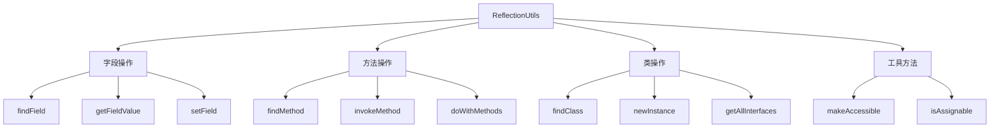

# Spring ReflectionUtils 完全指南：掌握 Java 反射的优雅之道

## 开头摘要

在 Java 开发中，反射机制虽然强大但使用繁琐。Spring 框架提供的 `ReflectionUtils` 工具类通过封装复杂的反射操作，让开发者能够以简洁、安全的方式利用反射能力。本文将深入解析 ReflectionUtils 的设计哲学、核心方法和实际应用场景，帮助你高效地在项目中使用这一强大工具。

## 目录

- #reflectionutils-工具类概述
- #核心方法详解
- #实际应用场景
- #性能优化与最佳实践
- #总结

## ReflectionUtils 工具类概述

`org.springframework.util.ReflectionUtils` 是 Spring 框架核心模块中的一个**反射工具类**，专门用于简化 Java 反射 API 的复杂性。与原生 JDK 反射相比，ReflectionUtils 提供更简洁的 API 和更好的异常处理机制。

该类基于 Java 反射机制构建，主要解决以下核心问题：

1. **减少模板代码**：将繁琐的反射操作封装成一行方法调用
2. **自动访问控制**：自动处理私有方法和字段的访问权限设置
3. **统一的异常处理**：将受检异常转换为运行时异常，简化错误处理

### 设计理念与优势

ReflectionUtils 的设计遵循"约定优于配置"的原则，具有以下显著优势：

- **空值安全**：所有方法都妥善处理 null 值输入
- **继承感知**：字段和方法查找会自动遍历类继承层次
- **性能优化**：内部使用缓存机制提升重复操作的效率
- **Spring 生态集成**：与 Spring 框架的其他组件无缝协作

## 核心方法详解

### 字段操作（Field Operations）

ReflectionUtils 提供了一系列强大的字段操作方法，显著简化了字段的访问和修改：

```java
// 查找字段（支持继承层次）
Field nameField = ReflectionUtils.findField(User.class, "name");
Field typedField = ReflectionUtils.findField(User.class, "age", Integer.class);

// 获取字段值
User user = new User("张三", 25);
String name = (String) ReflectionUtils.getFieldValue(user, "name");

// 设置字段值
ReflectionUtils.setField(user, "name", "李四");

// 处理私有字段的完整流程
Field privateField = ReflectionUtils.findField(User.class, "privateField");
ReflectionUtils.makeAccessible(privateField); // 设置可访问性
Object value = ReflectionUtils.getField(privateField, user);
```

**关键特性**：`findField` 方法会在**整个类继承链**中查找指定字段，包括父类的私有字段（只要访问权限允许）。

### 方法操作（Method Operations）

方法反射是 ReflectionUtils 的另一个核心功能，提供了便捷的方法查找和调用机制：

```java
// 查找方法
Method getNameMethod = ReflectionUtils.findMethod(User.class, "getName");
Method setNameMethod = ReflectionUtils.findMethod(User.class, "setName", String.class);

// 调用方法
ReflectionUtils.invokeMethod(getNameMethod, user);
ReflectionUtils.invokeMethod(setNameMethod, user, "王五");

// 批量处理方法
ReflectionUtils.doWithMethods(User.class, method -> {
    if (method.getName().startsWith("get")) {
        System.out.println("Getter method: " + method.getName());
    }
});

// 处理私有方法
Method privateMethod = ReflectionUtils.findMethod(User.class, "privateMethod");
ReflectionUtils.makeAccessible(privateMethod);
ReflectionUtils.invokeMethod(privateMethod, user);
```

**异常处理**：ReflectionUtils 将 JDK 反射中的受检异常（如 `IllegalAccessException`）包装为 `ReflectionException` 运行时异常，避免了繁琐的 try-catch 代码块。

### 类信息与实例化

除了字段和方法操作，ReflectionUtils 还提供了类级别的高级功能：

```java
// 类信息获取
Class<?> userClass = ReflectionUtils.findClass("com.example.User");
Class<?>[] interfaces = ReflectionUtils.getAllInterfaces(User.class);

// 实例化对象
User user = (User) ReflectionUtils.instantiateClass(User.class.getConstructor(String.class), "张三");
User simpleUser = (User) ReflectionUtils.newInstance(User.class);

// 类型判断
boolean isAssignable = ReflectionUtils.isAssignable(CharSequence.class, String.class);
```

下面是 ReflectionUtils 核心方法的功能分类图，展示了各类方法之间的关联关系：



## 实际应用场景

### Spring 框架内部使用

ReflectionUtils 在 Spring 框架内部有广泛应用，是许多核心功能的基础：

```java
// 1. 依赖注入实现
@Component
public class DependencyInjectionExample {
    @Autowired
    private UserService userService;

    // Spring 内部使用 ReflectionUtils 实现字段注入
    public void injectDependencies() {
        Field[] fields = ReflectionUtils.getAllDeclaredFields(this.getClass());
        for (Field field : fields) {
            if (field.isAnnotationPresent(Autowired.class)) {
                Object bean = applicationContext.getBean(field.getType());
                ReflectionUtils.makeAccessible(field);
                ReflectionUtils.setField(field, this, bean);
            }
        }
    }
}

// 2. AOP 代理实现
public class AopProxyExample {
    public Object invokeMethodOnTarget(Object target, Method method, Object[] args) {
        try {
            // 通过 ReflectionUtils 调用目标方法
            return ReflectionUtils.invokeMethod(method, target, args);
        } catch (Exception e) {
            // 异常处理逻辑
            throw new RuntimeException("方法调用失败", e);
        }
    }
}
```

### 数据映射与转换

在 ORM 框架或数据映射场景中，ReflectionUtils 可以大幅简化对象属性映射代码：

```java
public class ResultSetMapper {

    /**
     * 将 ResultSet 映射到 Java 对象（类似 MyBatis 的功能）
     */
    public static <T> T mapToObject(ResultSet rs, Class<T> clazz) throws SQLException {
        T instance = (T) ReflectionUtils.newInstance(clazz);
        ResultSetMetaData metaData = rs.getMetaData();
        int columnCount = metaData.getColumnCount();

        for (int i = 1; i <= columnCount; i++) {
            String columnName = metaData.getColumnName(i);
            Object value = rs.getObject(i);

            // 将数据库列名转换为 Java 字段名（下划线转驼峰）
            String fieldName = toCamelCase(columnName);

            // 使用 ReflectionUtils 设置字段值
            Field field = ReflectionUtils.findField(clazz, fieldName);
            if (field != null) {
                ReflectionUtils.makeAccessible(field);
                ReflectionUtils.setField(field, instance, convertValue(value, field.getType()));
            }
        }
        return instance;
    }

    private static String toCamelCase(String columnName) {
        // 实现下划线转驼峰逻辑
        return columnName.replaceAll("_(.)", "$1").toLowerCase();
    }
}
```

### 测试与调试工具

在单元测试和调试场景中，ReflectionUtils 可以帮助访问和修改私有状态，便于测试验证：

```java
public class TestingUtilities {

    /**
     * 在测试中访问私有字段进行验证
     */
    public static <T> T getPrivateField(Object target, String fieldName) {
        Field field = ReflectionUtils.findField(target.getClass(), fieldName);
        if (field == null) {
            throw new IllegalArgumentException("字段不存在: " + fieldName);
        }
        ReflectionUtils.makeAccessible(field);
        return (T) ReflectionUtils.getField(field, target);
    }

    /**
     * 在测试中修改私有字段进行场景设置
     */
    public static void setPrivateField(Object target, String fieldName, Object value) {
        Field field = ReflectionUtils.findField(target.getClass(), fieldName);
        if (field == null) {
            throw new IllegalArgumentException("字段不存在: " + fieldName);
        }
        ReflectionUtils.makeAccessible(field);
        ReflectionUtils.setField(field, target, value);
    }

    /**
     * 测试私有方法
     */
    public static Object invokePrivateMethod(Object target, String methodName, Object... args) {
        Class<?>[] paramTypes = Arrays.stream(args)
                .map(Object::getClass)
                .toArray(Class<?>[]::new);

        Method method = ReflectionUtils.findMethod(target.getClass(), methodName, paramTypes);
        if (method == null) {
            throw new IllegalArgumentException("方法不存在: " + methodName);
        }
        ReflectionUtils.makeAccessible(method);
        return ReflectionUtils.invokeMethod(method, target, args);
    }
}
```

### 注解处理器

ReflectionUtils 可以简化注解处理逻辑，特别在框架开发中非常有用：

```java
@Component
public class AnnotationProcessor {

    /**
     * 处理特定注解的方法
     */
    public void processAnnotations(Object target) {
        ReflectionUtils.doWithMethods(target.getClass(), method -> {
            // 处理带有特定注解的方法
            if (method.isAnnotationPresent(EventListener.class)) {
                EventListener annotation = method.getAnnotation(EventListener.class);
                registerEventListener(target, method, annotation);
            }

            // 处理其他业务注解
            if (method.isAnnotationPresent(Scheduled.class)) {
                Scheduled scheduled = method.getAnnotation(Scheduled.class);
                scheduleMethod(target, method, scheduled);
            }
        });
    }

    /**
     * 处理带有特定注解的字段
     */
    public void processFieldAnnotations(Object target) {
        ReflectionUtils.doWithFields(target.getClass(), field -> {
            if (field.isAnnotationPresent(Value.class)) {
                Value valueAnnotation = field.getAnnotation(Value.class);
                String propertyValue = resolvePropertyValue(valueAnnotation.value());
                ReflectionUtils.makeAccessible(field);
                ReflectionUtils.setField(field, target, propertyValue);
            }
        });
    }
}
```

## 性能优化与最佳实践

### 性能优化策略

虽然 ReflectionUtils 提供了便利，但反射操作仍有性能开销，以下策略可以优化性能：

```java
public class OptimizedReflectionUtils {

    // 字段缓存避免重复查找
    private static final Map<Class<?>, Map<String, Field>> FIELD_CACHE = new ConcurrentHashMap<>();
    private static final Map<Class<?>, Map<String, Method>> METHOD_CACHE = new ConcurrentHashMap<>();

    /**
     * 带缓存的字段查找
     */
    public static Field getCachedField(Class<?> clazz, String fieldName) {
        return FIELD_CACHE
                .computeIfAbsent(clazz, k -> new ConcurrentHashMap<>())
                .computeIfAbsent(fieldName, k -> ReflectionUtils.findField(clazz, fieldName));
    }

    /**
     * 带缓存的方法查找
     */
    public static Method getCachedMethod(Class<?> clazz, String methodName, Class<?>... paramTypes) {
        String cacheKey = methodName + Arrays.toString(paramTypes);
        return METHOD_CACHE
                .computeIfAbsent(clazz, k -> new ConcurrentHashMap<>())
                .computeIfAbsent(cacheKey, k -> ReflectionUtils.findMethod(clazz, methodName, paramTypes));
    }

    /**
     * 批量字段操作减少反射调用次数
     */
    public static void copyMatchingFields(Object source, Object target) {
        List<Field> sourceFields = getAllFields(source.getClass());
        List<Field> targetFields = getAllFields(target.getClass());

        Map<String, Field> targetFieldMap = targetFields.stream()
                .collect(Collectors.toMap(Field::getName, field -> field));

        for (Field sourceField : sourceFields) {
            Field targetField = targetFieldMap.get(sourceField.getName());
            if (targetField != null && isAssignable(sourceField.getType(), targetField.getType())) {
                ReflectionUtils.makeAccessible(sourceField);
                ReflectionUtils.makeAccessible(targetField);
                Object value = ReflectionUtils.getField(sourceField, source);
                ReflectionUtils.setField(targetField, target, value);
            }
        }
    }

    private static List<Field> getAllFields(Class<?> clazz) {
        List<Field> fields = new ArrayList<>();
        Class<?> currentClass = clazz;
        while (currentClass != null && currentClass != Object.class) {
            fields.addAll(Arrays.asList(currentClass.getDeclaredFields()));
            currentClass = currentClass.getSuperclass();
        }
        return fields;
    }
}
```

### 安全最佳实践

反射操作需要特别注意安全性，以下实践可以降低风险：

```java
public class SafeReflectionPractices {

    /**
     * 安全的字段访问验证
     */
    public static void safeFieldAccess(Object target, String fieldName, Consumer<Field> operation) {
        // 验证输入参数
        if (target == null || fieldName == null || operation == null) {
            throw new IllegalArgumentException("参数不能为null");
        }

        // 验证字段名格式（防止注入攻击）
        if (!fieldName.matches("[a-zA-Z_$][a-zA-Z\\d_$]*")) {
            throw new IllegalArgumentException("非法字段名: " + fieldName);
        }

        Field field = ReflectionUtils.findField(target.getClass(), fieldName);
        if (field == null) {
            throw new IllegalArgumentException("字段不存在: " + fieldName);
        }

        // 检查字段访问权限（避免修改关键字段）
        if (isSensitiveField(field)) {
            throw new SecurityException("禁止访问敏感字段: " + fieldName);
        }

        try {
            ReflectionUtils.makeAccessible(field);
            operation.accept(field);
        } finally {
            // 清理操作
            resetFieldAccessibility(field);
        }
    }

    private static boolean isSensitiveField(Field field) {
        // 定义敏感字段规则
        String[] sensitivePatterns = {"password", "secret", "key", "token"};
        return Arrays.stream(sensitivePatterns)
                .anyMatch(pattern -> field.getName().toLowerCase().contains(pattern));
    }

    private static void resetFieldAccessibility(Field field) {
        // 恢复字段的原始访问权限
        try {
            field.setAccessible(false);
        } catch (Exception e) {
            // 忽略权限重置异常
        }
    }

    /**
     * 安全的方法调用
     */
    public static Object safeMethodInvoke(Object target, String methodName, Object... args) {
        // 验证方法名
        if (!methodName.matches("[a-zA-Z_$][a-zA-Z\\d_$]*")) {
            throw new IllegalArgumentException("非法方法名: " + methodName);
        }

        Class<?>[] paramTypes = Arrays.stream(args).map(Object::getClass).toArray(Class<?>[]::new);
        Method method = ReflectionUtils.findMethod(target.getClass(), methodName, paramTypes);

        if (method == null) {
            throw new IllegalArgumentException("方法不存在: " + methodName);
        }

        // 检查方法访问权限
        if (isDangerousMethod(method)) {
            throw new SecurityException("禁止调用危险方法: " + methodName);
        }

        ReflectionUtils.makeAccessible(method);
        return ReflectionUtils.invokeMethod(method, target, args);
    }

    private static boolean isDangerousMethod(Method method) {
        // 定义危险方法规则
        String[] dangerousMethods = {"exit", "halt", "shutdown", "destroy"};
        return Arrays.stream(dangerousMethods)
                .anyMatch(dangerous -> method.getName().toLowerCase().contains(dangerous));
    }
}
```

## 总结

Spring ReflectionUtils 是一个功能强大且设计精巧的反射工具类，通过系统学习可以得出以下核心结论：

### 核心价值

1. **开发效率提升**：将繁琐的反射操作简化为一行代码，大幅减少模板代码
2. **代码可读性增强**：清晰的 API 设计使反射逻辑更易理解和维护
3. **异常处理简化**：统一的运行时异常机制避免繁琐的 try-catch 块
4. **框架集成优势**：与 Spring 生态系统完美契合，内部大量使用

### 适用场景建议

- **框架开发**：AOP、依赖注入、事件监听等机制的基础设施
- **数据映射**：ORM 框架、序列化/反序列化工具
- **测试工具**：单元测试中的私有成员访问和验证
- **动态功能**：插件系统、动态配置等需要运行时扩展的场景

### 使用注意事项

1. **性能考量**：在性能敏感场景使用缓存策略，避免重复反射调用
2. **安全限制**：谨慎处理敏感字段和方法，避免安全漏洞
3. **封装破坏**：反射会破坏封装性，应在确实需要动态性时使用
4. **版本兼容**：注意不同 Spring 版本中 API 的细微差异

ReflectionUtils 是 Spring 开发者工具箱中的重要利器，合理运用可以让代码更加灵活和强大，但需要根据具体场景权衡使用。

## 延伸阅读

1. https://docs.spring.io/spring-framework/docs/current/javadoc-api/org/springframework/util/ReflectionUtils.html
2. Spring 源码：`org.springframework.util.ReflectionUtils`
3. https://docs.oracle.com/javase/tutorial/reflect/

## 一句话记忆

ReflectionUtils 是 Spring 提供的反射工具集，让复杂的反射操作变得简单安全，是框架开发和动态编程的利器。
