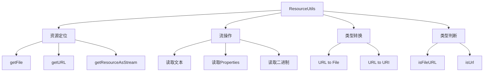

# Spring ResourceUtils：资源读取的终极解决方案

## 开头摘要

在 Spring 应用开发中，资源文件读取是每个开发者都会遇到的基础且关键的任务。无论是加载配置文件、读取模板文件还是访问静态资源，传统的 Java I/O 操作往往需要编写大量模板代码。Spring 框架提供的`ResourceUtils`工具类通过简洁的 API 封装了复杂的资源访问逻辑，让开发者能够用一行代码完成各类资源读取操作。本文将全面解析 ResourceUtils 的设计原理、核心方法和实战技巧，帮助你彻底掌握这一高效工具。

## 目录

- #resourceutils 工具类概述
- #核心方法与使用详解
- #实际应用场景分析
- #常见问题与解决方案
- #总结

## ResourceUtils 工具类概述

`org.springframework.util.ResourceUtils`是 Spring 框架核心模块(`spring-core`)中的一个**资源操作工具类**，专门用于简化各类资源的访问和操作。该类基于 Spring 的 Resource 抽象体系构建，提供了一系列静态方法，能够统一处理类路径资源、文件系统资源和网络资源。

### 设计理念与核心价值

ResourceUtils 的设计遵循"**约定优于配置**"的原则，主要解决以下核心问题：

1. **路径处理标准化**：统一各类资源的路径表示方法，避免手动拼接路径的繁琐和错误
2. **资源访问简化**：封装底层的 I/O 流操作，减少模板代码，提高开发效率
3. **环境适配智能**：自动适应不同运行环境（本地开发、JAR 包部署等）
4. **异常处理统一**：提供一致的错误处理机制，增强代码健壮性

与传统的 Java 资源访问方式相比，ResourceUtils 能够将复杂的 I/O 操作简化为**1-2 行代码**，同时确保资源管理的安全性和可靠性。

## 核心方法与使用详解

### 资源定位与获取

ResourceUtils 支持多种资源定位方式，通过不同的路径前缀来区分资源类型：

```java
// 1. 类路径资源（最常用）
File classpathFile = ResourceUtils.getFile("classpath:config/application.properties");

// 2. 文件系统资源
File localFile = ResourceUtils.getFile("file:/opt/app/config.properties");

// 3. 网络资源
URL webResource = ResourceUtils.getURL("http://example.com/config.json");

// 4. 无前缀路径（自动探测）
File autoDetectFile = ResourceUtils.getFile("config/app.properties");
```

**路径前缀说明**：

- `classpath:`：从类路径（通常是 src/main/resources 目录）加载资源
- `file:`：从文件系统绝对路径加载资源
- 无前缀：先尝试作为文件系统路径，失败后尝试类路径

### 流操作与内容读取

对于需要直接读取资源内容的场景，ResourceUtils 提供了便捷的流操作方法：

```java
// 安全读取资源流（自动关闭）
try (InputStream is = ResourceUtils.getResourceAsStream("classpath:template/email.html")) {
    String content = new String(FileCopyUtils.copyToByteArray(is), StandardCharsets.UTF_8);
    System.out.println("模板内容：" + content);
} catch (IOException e) {
    e.printStackTrace();
}

// 读取Properties配置文件
try (InputStream is = ResourceUtils.getResourceAsStream("classpath:app.properties")) {
    Properties props = PropertiesLoaderUtils.loadProperties(new InputStreamResource(is));
    String appName = props.getProperty("app.name");
} catch (IOException e) {
    e.printStackTrace();
}
```

### URL 与文件转换

ResourceUtils 提供了丰富的 URL 和文件转换方法，方便在不同表示形式之间切换：

```java
// URL与File互转
URL resourceUrl = ResourceUtils.getURL("classpath:data/sample.txt");
File resourceFile = ResourceUtils.getFile(resourceUrl);

// URL与URI互转
URI resourceUri = ResourceUtils.toURI(resourceUrl);

// 路径类型判断
boolean isFileUrl = ResourceUtils.isFileURL("file:/path/to/file");
boolean isValidUrl = ResourceUtils.isUrl("http://example.com");
```

下面是 ResourceUtils 核心方法的功能分类图：



## 实际应用场景分析

### 多环境配置加载

在 Spring Boot 应用中，经常需要根据不同的运行环境加载相应的配置文件。ResourceUtils 可以简化这一过程：

```java
@Component
public class EnvironmentConfigLoader {

    private final Map<String, Properties> configCache = new ConcurrentHashMap<>();

    public Properties loadEnvironmentConfig(String profile) {
        return configCache.computeIfAbsent(profile, key -> {
            String configPath = "classpath:application-" + profile + ".yml";
            try (InputStream is = ResourceUtils.getResourceAsStream(configPath)) {
                if (is == null) {
                    throw new RuntimeException("环境配置文件不存在: " + configPath);
                }

                YamlPropertiesFactoryBean yamlFactory = new YamlPropertiesFactoryBean();
                yamlFactory.setResources(new InputStreamResource(is));
                return yamlFactory.getObject();
            } catch (IOException e) {
                throw new RuntimeException("加载环境配置失败: " + profile, e);
            }
        });
    }

    // 使用示例
    public void initializeApplication() {
        String activeProfile = System.getProperty("spring.profiles.active", "dev");
        Properties config = loadEnvironmentConfig(activeProfile);
        // 应用配置初始化逻辑
    }
}
```

### 外部配置文件管理

当应用需要读取 JAR 包外部的配置文件时（如生产环境部署），ResourceUtils 提供了优雅的解决方案：

```java
@Configuration
public class ExternalConfigManager {

    @Bean
    public Properties externalConfiguration() {
        // 优先加载外部配置
        String[] configPaths = {
            "file:./config/application.properties",      // 当前目录下的config文件夹
            "file:/etc/myapp/application.properties",     // 系统级配置目录
            "classpath:application.properties"           // 默认类路径配置
        };

        for (String path : configPaths) {
            try (InputStream is = ResourceUtils.getResourceAsStream(path)) {
                if (is != null) {
                    Properties props = new Properties();
                    props.load(is);
                    return props;
                }
            } catch (IOException e) {
                // 忽略单个配置文件的读取错误，继续尝试下一个
                System.err.println("无法加载配置文件: " + path);
            }
        }

        throw new IllegalStateException("未找到任何有效的配置文件");
    }
}
```

### 模板文件读取与处理

在邮件发送、报表生成等场景中，经常需要读取 HTML 或文本模板文件：

```java
@Service
public class TemplateService {

    private final Map<String, String> templateCache = new ConcurrentHashMap<>();

    public String getTemplate(String templateName) {
        return templateCache.computeIfAbsent(templateName, key -> {
            String templatePath = "classpath:templates/" + templateName + ".html";
            try (InputStream is = ResourceUtils.getResourceAsStream(templatePath)) {
                byte[] templateBytes = FileCopyUtils.copyToByteArray(is);
                return new String(templateBytes, StandardCharsets.UTF_8);
            } catch (IOException e) {
                throw new RuntimeException("模板文件加载失败: " + templatePath, e);
            }
        });
    }

    public String renderTemplate(String templateName, Map<String, String> variables) {
        String template = getTemplate(templateName);
        String rendered = template;
        for (Map.Entry<String, String> entry : variables.entrySet()) {
            rendered = rendered.replace("{{" + entry.getKey() + "}}", entry.getValue());
        }
        return rendered;
    }
}
```

### 静态资源访问

对于图片、文档等二进制资源的访问，ResourceUtils 同样提供了简洁的 API：

```java
@Component
public class BinaryResourceService {

    public byte[] loadBinaryResource(String resourcePath) {
        try (InputStream is = ResourceUtils.getResourceAsStream(resourcePath)) {
            if (is == null) {
                throw new RuntimeException("资源不存在: " + resourcePath);
            }
            return FileCopyUtils.copyToByteArray(is);
        } catch (IOException e) {
            throw new RuntimeException("资源加载失败: " + resourcePath, e);
        }
    }

    public void saveResourceToFile(String resourcePath, String outputPath) {
        try (InputStream is = ResourceUtils.getResourceAsStream(resourcePath);
             FileOutputStream fos = new FileOutputStream(outputPath)) {
            FileCopyUtils.copy(is, fos);
        } catch (IOException e) {
            throw new RuntimeException("资源保存失败", e);
        }
    }
}
```

## 常见问题与解决方案

### JAR 包部署时的资源访问问题

**问题描述**：当应用打包成 JAR 文件后，使用`ResourceUtils.getFile()`访问类路径资源会抛出`FileNotFoundException`，因为 JAR 包内的资源不是文件系统中的真实文件。

**解决方案**：

```java
// 错误做法（JAR包中会失败）
File file = ResourceUtils.getFile("classpath:config.properties");

// 正确做法：使用流式访问
try (InputStream is = ResourceUtils.getResourceAsStream("classpath:config.properties")) {
    Properties props = new Properties();
    props.load(is);
    // 处理配置
} catch (IOException e) {
    e.printStackTrace();
}

// 或者使用URL方式
URL resourceUrl = ResourceUtils.getURL("classpath:config.properties");
System.out.println("资源URL协议: " + resourceUrl.getProtocol()); // 输出: jar
```

### 路径格式与编码问题

**路径前缀缺失**：忘记添加`classpath:`前缀是常见错误，会导致资源定位失败。

```java
// 错误：可能找不到资源
File file1 = ResourceUtils.getFile("config/app.properties");

// 正确：明确指定类路径
File file2 = ResourceUtils.getFile("classpath:config/app.properties");
```

**编码问题**：读取文本资源时未指定编码会导致乱码。

```java
// 错误：依赖平台默认编码
try (InputStream is = ResourceUtils.getResourceAsStream("classpath:data.txt")) {
    String content = new String(FileCopyUtils.copyToByteArray(is));
}

// 正确：明确指定UTF-8编码
try (InputStream is = ResourceUtils.getResourceAsStream("classpath:data.txt")) {
    String content = new String(FileCopyUtils.copyToByteArray(is), StandardCharsets.UTF_8);
}
```

### 资源缓存与性能优化

对于频繁访问的资源，适当的缓存策略可以显著提升性能：

```java
@Service
public class CachedResourceService {

    private final LoadingCache<String, String> resourceCache =
        CacheBuilder.newBuilder()
            .maximumSize(100)
            .expireAfterAccess(30, TimeUnit.MINUTES)
            .build(new CacheLoader<String, String>() {
                @Override
                public String load(String resourcePath) throws Exception {
                    try (InputStream is = ResourceUtils.getResourceAsStream(resourcePath)) {
                        byte[] bytes = FileCopyUtils.copyToByteArray(is);
                        return new String(bytes, StandardCharsets.UTF_8);
                    }
                }
            });

    public String getResourceContent(String resourcePath) {
        try {
            return resourceCache.get(resourcePath);
        } catch (ExecutionException e) {
            throw new RuntimeException("资源加载失败: " + resourcePath, e.getCause());
        }
    }
}
```

## 总结

Spring ResourceUtils 是一个功能强大且设计精巧的资源操作工具类，通过系统学习和实践可以得出以下核心结论：

### 核心优势

1. **开发效率显著提升**：将繁琐的 I/O 操作简化为 1-2 行代码，减少 80%的模板代码
2. **代码健壮性增强**：统一的异常处理机制和空值安全设计，降低人为错误
3. **环境适应性优秀**：智能适应不同部署环境（本地开发、JAR 包部署等）
4. **Spring 生态无缝集成**：与 Spring 框架的其他组件完美配合，提供一致的开发体验

### 使用建议

1. **优先使用场景**：

   - 读取类路径下的配置文件和模板资源
   - 需要统一处理本地文件和网络资源的场景
   - 快速原型开发和测试环境

2. **注意事项**：

   - JAR 包部署时避免使用`getFile()`方法访问类路径资源
   - 始终明确指定文本资源的字符编码
   - 使用 try-with-resources 确保流正确关闭

3. **性能考量**：
   - 对频繁访问的资源实施缓存策略
   - 大文件处理时使用流式操作避免内存溢出

ResourceUtils 作为 Spring 框架中的"瑞士军刀"，虽然 API 简单但功能实用，合理运用可以大幅提升资源处理相关代码的质量和开发效率。

## 延伸阅读

1. https://docs.spring.io/spring-framework/docs/current/reference/html/core.html#resources
2. Spring 源码：`org.springframework.util.ResourceUtils`
3. https://www.manning.com/books/spring-in-action-sixth-edition - 第 6 章详细介绍 Spring 资源抽象

## 一句话记忆

ResourceUtils 是 Spring 提供的资源读取利器，用`classpath:`前缀一行代码搞定资源定位，让文件读取既简洁又健壮。
