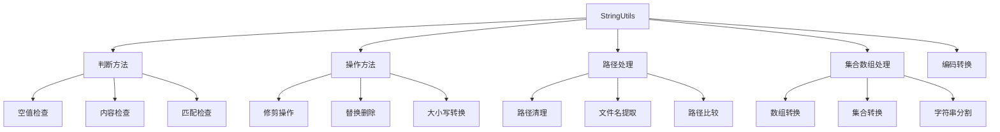

# Spring StringUtils工具类完全指南：从基础到高级用法

## 开头摘要

Spring框架中的`StringUtils`工具类是一个功能强大的字符串处理工具，提供了丰富且**null安全**的字符串操作方法。本文基于源码分析，全面介绍该类所有方法的用途、实现原理和实际应用场景，帮助开发者提升字符串处理效率和代码健壮性。

## 目录

- #核心架构设计理念
- #字符串判断方法全解析
- #字符串操作与处理方法
- #路径与文件处理功能
- #数组与集合转换方法
- #国际化与编码支持
- #实战应用案例
- #总结

## 核心架构设计理念

`org.springframework.util.StringUtils`是Spring框架核心包中的一个**纯静态工具类**，设计遵循"防御性编程"原则。所有方法都精心处理了`null`值输入，在遇到`null`时不会抛出`NullPointerException`，而是返回合理的默认值。

该类采用**轻量级设计**，不依赖外部库，完全基于JDK原生字符串API构建，确保了高性能和低内存开销。与Apache Commons Lang的StringUtils相比，Spring的实现更加简洁，且与Spring生态系统无缝集成。

## 字符串判断方法全解析

### 空值检查三重奏

```java
// 1. 基础空值检查 - 检查null和空字符串
StringUtils.isEmpty(null);      // true
StringUtils.isEmpty("");        // true
StringUtils.isEmpty(" ");       // false
StringUtils.isEmpty("Hello");   // false

// 2. 长度检查 - 检查是否有字符（包括空白字符）
StringUtils.hasLength(null);    // false
StringUtils.hasLength("");      // false
StringUtils.hasLength(" ");     // true
StringUtils.hasLength("Hello"); // true

// 3. 文本内容检查 - 要求包含非空白字符
StringUtils.hasText(null);      // false
StringUtils.hasText("");        // false
StringUtils.hasText(" ");       // false
StringUtils.hasText("Hello");   // true
```

**设计差异**：这三种方法体现了对不同"空"概念的精确定义：`isEmpty`对应Java标准的空值概念；`hasLength`检查是否有字符；`hasText`则要求包含实际可打印内容。

### 内容匹配与检查

```java
// 空白字符检查
StringUtils.containsWhitespace("Hello");       // false
StringUtils.containsWhitespace("Hello World"); // true

// 前缀后缀检查（忽略大小写）
StringUtils.startsWithIgnoreCase("Hello", "he");   // true
StringUtils.endsWithIgnoreCase("Hello", "LO");    // true

// 子串匹配检查
StringUtils.substringMatch("Hello World", 6, "World"); // true

// 单字符匹配
StringUtils.matchesCharacter("A", 'A');  // true
StringUtils.matchesCharacter("AB", 'A'); // false
```

### 计数与出现次数统计

```java
// 统计子串出现次数
StringUtils.countOccurrencesOf("abacaba", "aba");  // 2
StringUtils.countOccurrencesOf("Hello", "l");     // 2
StringUtils.countOccurrencesOf("Hello", "x");     // 0
```

**源码实现分析**：`countOccurrencesOf`方法使用`indexOf`进行循环查找，时间复杂度为O(n)，但避免了正则表达式的性能开销。

## 字符串操作与处理方法

### 修剪与清理操作

```java
// 基本修剪（仅首尾空白）
StringUtils.trimWhitespace("  Hello  ");        // "Hello"

// 全面修剪（包括中间空白）
StringUtils.trimAllWhitespace("  a  b  c  ");   // "abc"

// 定向修剪
StringUtils.trimLeadingWhitespace("  Hello");   // "Hello"
StringUtils.trimTrailingWhitespace("Hello  ");  // "Hello"

// 特定字符修剪
StringUtils.trimLeadingCharacter("aaaHello", 'a');  // "Hello"
StringUtils.trimTrailingCharacter("Helloaaa", 'a');  // "Hello"
```

### 替换与删除操作

```java
// 模式替换
StringUtils.replace("aba", "b", "a");            // "aaa"
StringUtils.replace("Hello World", "World", "Java"); // "Hello Java"

// 删除操作
StringUtils.delete("abcabc", "bc");              // "aa"
StringUtils.deleteAny("Hello World", "HWd");     // "ello orl"
```

**算法优化**：`replace`方法手动实现字符串匹配（未使用正则表达式），避免正则的性能开销，使用StringBuilder拼接结果，减少字符串拼接的性能损耗。

### 大小写转换

```java
// 首字母大小写转换
StringUtils.capitalize("hello");     // "Hello"
StringUtils.uncapitalize("Hello");   // "hello"

// 引用处理
StringUtils.quote("test");           // "'test'"
StringUtils.quoteIfString("test");   // "'test'"
```

下面是StringUtils工具类的核心方法分类及其关系图：



## 路径与文件处理功能

`StringUtils`包含专门处理文件路径的方法，在Web应用和文件操作中非常实用：

```java
// 路径清理和标准化
StringUtils.cleanPath("src/../test/./example.txt"); // "test/example.txt"

// 文件名和扩展名提取
StringUtils.getFilename("path/to/file.txt");        // "file.txt"
StringUtils.getFilenameExtension("file.txt");       // "txt"
StringUtils.stripFilenameExtension("file.txt");     // "file"

// 路径比较和相对路径应用
StringUtils.pathEquals("path/to/file", "path/../path/to/file"); // true
StringUtils.applyRelativePath("D:/base", "subdir/file.txt");   // "D:/base/subdir/file.txt"
```

**安全特性**：`cleanPath`方法会处理路径中的`..`和`.`，防止路径遍历攻击，确保路径安全性。

## 数组与集合转换方法

### 数组字符串处理

```java
// 数组修剪和去重
String[] arr = {" Java ", " Python ", " JavaScript "};
StringUtils.trimArrayElements(arr);                // {"Java", "Python", "JavaScript"}
StringUtils.removeDuplicateStrings({"A", "B", "A"}); // {"A", "B"}

// 数组合并和添加
StringUtils.concatenateStringArrays({"A", "B"}, {"C", "D"}); // {"A", "B", "C", "D"}
StringUtils.addStringToArray({"A", "B"}, "C");              // {"A", "B", "C"}
```

### 集合与字符串转换

```java
List<String> list = Arrays.asList("Java", "Python", "JavaScript");

// 集合转字符串
StringUtils.collectionToCommaDelimitedString(list);     // "Java,Python,JavaScript"
StringUtils.collectionToDelimitedString(list, "|");     // "Java|Python|JavaScript"
StringUtils.collectionToDelimitedString(list, "-", "[", "]"); // "[Java]-[Python]-[JavaScript]"

// 字符串转集合
StringUtils.commaDelimitedListToSet("A,B,C");          // Set包含"A","B","C"
```

### 字符串分割与标记化

```java
// 简单分割
StringUtils.delimitedListToStringArray("A-B-C", "-"); // {"A", "B", "C"}

// 高级标记化（支持修剪和空标记处理）
StringUtils.tokenizeToStringArray(" java, c++, python ", ",", true, true);
// {"java", "c++", "python"}

// 属性分割
String[] props = {"key1=value1", "key2=value2"};
Properties properties = StringUtils.splitArrayElementsIntoProperties(props, "=");
```

## 国际化与编码支持

### Locale和时区处理

```java
// Locale解析
StringUtils.parseLocale("en_US");     // 解析为英语（美国）Locale
StringUtils.parseLocaleString("zh_CN"); // 解析为中文（中国）Locale

// 时区解析
StringUtils.parseTimeZoneString("GMT+8"); // 解析为东八区时区
```

### URI解码

```java
// URL解码
String encoded = "http%3A%2F%2Flocalhost%3A8080%2Fapi";
String decoded = StringUtils.uriDecode(encoded, Charset.forName("UTF-8"));
// 结果: "http://localhost:8080/api"
```

### 字符串截断

```java
// 长文本截断
String longText = "这是一段非常长的文本需要被截断处理";
StringUtils.truncate(longText, 5); // "这是一段非常... (truncated)"
```

## 实战应用案例

### Web请求参数验证

```java
@RestController
public class UserController {

    @PostMapping("/users")
    public ResponseEntity<String> createUser(@RequestBody UserDto user) {
        // 使用StringUtils进行全面的输入验证
        if (!StringUtils.hasText(user.getUsername())) {
            return ResponseEntity.badRequest().body("用户名不能为空");
        }

        if (!StringUtils.hasText(user.getEmail()) || !user.getEmail().contains("@")) {
            return ResponseEntity.badRequest().body("邮箱格式不正确");
        }

        // 安全处理文件名
        String filename = StringUtils.cleanPath(user.getAvatar().getOriginalFilename());
        String extension = StringUtils.getFilenameExtension(filename);

        if (!StringUtils.hasText(extension) ||
            !Arrays.asList("jpg", "png", "gif").contains(extension.toLowerCase())) {
            return ResponseEntity.badRequest().body("不支持的文件格式");
        }

        userService.save(user);
        return ResponseEntity.ok("用户创建成功");
    }
}
```

### 配置文件处理与CORS配置

```java
@Configuration
public class AppConfig {

    @Value("${app.cors.allowed-origins:}")
    private String allowedOrigins;

    @Bean
    public CorsFilter corsFilter() {
        // 安全处理配置值
        if (StringUtils.hasText(allowedOrigins)) {
            String[] origins = StringUtils.trimArrayElements(
                StringUtils.commaDelimitedListToStringArray(allowedOrigins)
            );

            UrlBasedCorsConfigurationSource source = new UrlBasedCorsConfigurationSource();
            CorsConfiguration config = new CorsConfiguration();
            config.setAllowedOrigins(Arrays.asList(origins));
            source.registerCorsConfiguration("/**", config);

            return new CorsFilter(source);
        }

        return null;
    }
}
```

### 数据库查询构建

```java
@Repository
public class ProductRepository {

    public List<Product> searchProducts(String keyword, String category, String sortBy) {
        // 使用StringUtils构建安全动态查询
        StringBuilder queryBuilder = new StringBuilder("SELECT p FROM Product p WHERE 1=1");

        if (StringUtils.hasText(keyword)) {
            queryBuilder.append(" AND (p.name LIKE :keyword OR p.description LIKE :keyword)");
        }

        if (StringUtils.hasText(category)) {
            queryBuilder.append(" AND p.category = :category");
        }

        // 安全处理排序字段
        if (StringUtils.hasText(sortBy) &&
            StringUtils.substringMatch(sortBy, 0, "name|price|createdDate")) {
            queryBuilder.append(" ORDER BY p.").append(sortBy);
        }

        TypedQuery<Product> query = entityManager.createQuery(queryBuilder.toString(), Product.class);

        if (StringUtils.hasText(keyword)) {
            query.setParameter("keyword", "%" + StringUtils.trimAllWhitespace(keyword) + "%");
        }

        if (StringUtils.hasText(category)) {
            query.setParameter("category", category);
        }

        return query.getResultList();
    }
}
```

## 总结

通过完整的源码分析，我们可以看到Spring的`StringUtils`工具类具有以下核心特性和价值：

### 核心优势

1. **全面的null安全性**：所有方法都对null输入做了容错处理，大幅减少NullPointerException
2. **功能完整性**：覆盖了字符串处理的几乎所有常见需求，从基础判断到复杂转换
3. **性能优化**：手动实现核心逻辑，避免正则表达式开销，适合高性能场景
4. **API一致性**：方法命名和行为在整个Spring生态中保持一致，降低学习成本

### 设计哲学

- **防御性编程**：优先考虑边界情况和异常输入，保证代码健壮性
- **实用主义**：方法设计贴近实际开发需求，避免过度设计
- **轻量级**：不引入不必要的依赖，保持代码简洁高效

### 使用建议

1. 在已使用Spring框架的项目中，优先选择Spring StringUtils而非Apache Commons
2. 注意方法的具体语义差异，特别是`hasText`与`hasLength`的区别
3. 在处理用户输入时充分利用其null安全特性
4. 在性能敏感场景可放心使用，大多数方法都经过优化

## 延伸阅读

1. https://docs.spring.io/spring-framework/docs/current/javadoc-api/org/springframework/util/StringUtils.html
2. Spring源码：`org.springframework.util.StringUtils`
3. https://www.manning.com/books/spring-in-action-sixth-edition

## 一句话记忆

Spring StringUtils是一个全面、null安全、高性能的字符串工具集，让字符串处理既简洁又健壮。
