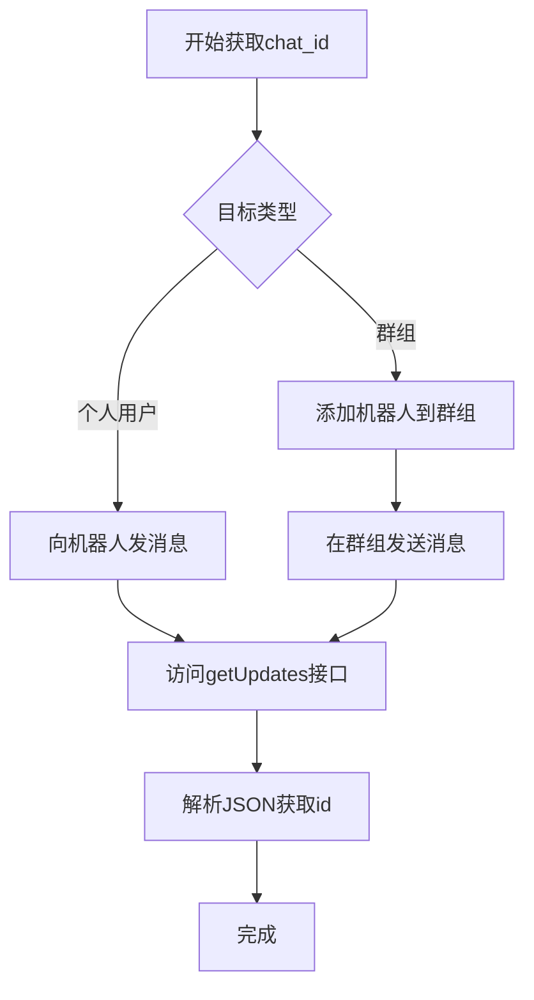

# 使用Shell脚本和cURL命令通过Telegram机器人发送通知消息

## 摘要
本文详细介绍如何使用Shell脚本和cURL命令通过Telegram机器人发送通知消息，涵盖机器人创建、chat_id获取、消息发送及实战应用。适合需要实现服务器监控、自动化通知的开发和运维人员。

## 目录
1. #1-telegram机器人创建与配置
2. #2-获取chat_id
3. #3-curl命令基础
4. #4-shell脚本发送消息
5. #5-高级应用场景
6. #6-常见问题与调试
7. #7-总结

## 1 Telegram机器人创建与配置

Telegram机器人通过BotFather创建，BotFather是Telegram官方的机器人管理工具。创建过程简单且完全免费，只需在Telegram中搜索@BotFather即可开始交互。

**创建流程**：
1. 在Telegram中搜索@BotFather并开启对话
2. 发送`/newbot`命令创建新机器人
3. 按提示设置机器人名称和用户名（必须以bot结尾）
4. 创建成功后，BotFather会提供API Token，格式如`123456789:ABCDEFGHIJKLMNOPQRSTUVWXYZ`

**设计动机**：Telegram机器人提供了一种标准化的API接口，允许开发者通过HTTP请求与平台交互，无需复杂的认证协议。这种设计使得任何能发送HTTP请求的工具都能使用Telegram机器人功能。

**关键要点**：
- Token是机器人的唯一凭证，必须妥善保管
- 机器人用户名必须全局唯一且以"bot"结尾
- 创建后需要先向机器人发送任意消息激活

## 2 获取chat_id

chat_id是消息发送的目标标识，可以是用户ID或群组ID。获取chat_id的方法因目标类型而异。

**个人chat_id获取**：
1. 向机器人发送任意消息
2. 访问`https://api.telegram.org/bot<YourBOTToken>/getUpdates`
3. 在返回的JSON中查找"chat"下的"id"字段

**群组chat_id获取**：
1. 将机器人添加到群组
2. 在群组中发送一条以"/"开头的消息
3. 通过上述getUpdates接口获取，群组chat_id为负数

```bash
# 获取updates示例
curl -s "https://api.telegram.org/bot<YourBOTToken>/getUpdates" | python -m json.tool
```

下面的流程图展示了获取chat_id的完整过程：



**常见误区**：
- 未先向机器人发送消息就直接尝试获取updates，会导致返回空结果
- 群组chat_id为负数，与个人chat_id格式不同
- 需要确保机器人有权限访问群组消息

## 3 cURL命令基础

cURL是一个功能丰富的命令行网络工具，支持多种协议（HTTP、FTP等），是Shell脚本中发送HTTP请求的理想选择。

**关键参数说明**：
- `-X`：指定请求方法（GET、POST等）
- `-d`：发送POST数据
- `-H`：设置请求头
- `-s`：静默模式，减少输出
- `--connect-timeout`：设置连接超时时间
- `--retry`：设置重试次数

**基础消息发送格式**：
```bash
curl -s -X POST "https://api.telegram.org/bot<TOKEN>/sendMessage" \
  -d chat_id="<CHAT_ID>" \
  -d text="Hello World"
```

**设计优势**：cURL支持多种数据格式和认证方式，能够灵活适应不同API需求。其简单的语法和丰富的选项使得在Shell脚本中集成HTTP请求变得简单高效。

## 4 Shell脚本发送消息

### 4.1 基础消息发送

最基本的消息发送脚本只需要几行代码：

```bash
#!/bin/bash

TOKEN="你的机器人TOKEN"
CHAT_ID="你的CHAT_ID"
MESSAGE="这是测试消息"

curl -s -X POST "https://api.telegram.org/bot$TOKEN/sendMessage" \
  -d chat_id="$CHAT_ID" \
  -d text="$MESSAGE"
```

### 4.2 发送服务器日志的实战脚本

以下脚本实现将服务器日志实时传送到Telegram群组的功能：

```bash
#!/bin/bash

# Telegram配置
TOKEN="你的机器人TOKEN"
CHAT_ID="你的群组CHAT_ID"

# 日志文件路径
LOG_DIR="/var/wwwroot/app/storage/logs"
LOG_FILE="$LOG_DIR/laravel.log"

# 切割并发送最新日志
send_log_update() {
  # 获取最近日志
  LATEST_LOG=$(tail -n 10 $LOG_FILE)
  
  # 发送到Telegram
  curl -s -X POST "https://api.telegram.org/bot$TOKEN/sendMessage" \
    -d chat_id="$CHAT_ID" \
    --data-urlencode "text=最新的应用日志：
$LATEST_LOG"
}

# 定时执行（每30秒检查一次）
while true; do
  send_log_update
  sleep 30
done
```

### 4.3 带格式和错误处理的高级脚本

```bash
#!/bin/bash

TOKEN="你的机器人TOKEN"
CHAT_ID="你的CHAT_ID"

send_telegram_message() {
  local message="$1"
  local max_retries=3
  local retry_count=0
  
  while [ $retry_count -lt $max_retries ]; do
    # 发送消息，设置超时避免长时间阻塞
    response=$(curl -s -w "%{http_code}" -X POST \
      --connect-timeout 10 \
      --max-time 20 \
      "https://api.telegram.org/bot$TOKEN/sendMessage" \
      -d chat_id="$CHAT_ID" \
      --data-urlencode "text=$message")
    
    http_code=$(echo "$response" | tail -n1)
    json_response=$(echo "$response" | head -n -1)
    
    if [ "$http_code" -eq 200 ]; then
      echo "消息发送成功"
      return 0
    else
      echo "发送失败，重试中... ($((retry_count+1))/$max_retries)"
      retry_count=$((retry_count+1))
      sleep 2
    fi
  done
  
  echo "错误: 消息发送失败 after $max_retries 次重试"
  return 1
}

# 使用HTML格式发送消息
send_telegram_message "【系统通知】服务器状态监控
<b>时间</b>: $(date)
<b>主机</b>: $(hostname)
<b>负载</b>: $(uptime | awk -F'load average:' '{print $2}')
状态: ✅ 正常"
```

**脚本设计要点**：
- 添加重试机制提高可靠性
- 设置超时避免脚本阻塞
- 支持消息格式（HTML/Markdown）
- 包含错误处理和状态反馈

## 5 高级应用场景

### 5.1 服务器监控通知

将Telegram机器人集成到服务器监控系统中：

```bash
#!/bin/bash

TOKEN="你的机器人TOKEN"
CHAT_ID="你的CHAT_ID"

# 磁盘使用率监控
disk_alert() {
  local usage=$(df / | awk 'END{print $5}' | sed 's/%//')
  if [ $usage -gt 90 ]; then
    curl -s -X POST "https://api.telegram.org/bot$TOKEN/sendMessage" \
      -d chat_id="$CHAT_ID" \
      --data-urlencode "text=⚠️ 磁盘空间警告
服务器: $(hostname)
挂载点: /
使用率: ${usage}%
请及时清理磁盘空间"
  fi
}

# 内存监控
memory_alert() {
  local mem_info=$(free -m | awk 'NR==2{printf "%.2f%%", $3*100/$2}')
  local threshold=90
  local usage=$(echo $mem_info | sed 's/%//')
  
  if (( $(echo "$usage > $threshold" | bc -l) )); then
    curl -s -X POST "https://api.telegram.org/bot$TOKEN/sendMessage" \
      -d chat_id="$CHAT_ID" \
      --data-urlencode "text=⚠️ 内存使用警告
服务器: $(hostname)
使用率: $mem_info
当前阈值: ${threshold}%"
  fi
}

# 定时执行监控
while true; do
  disk_alert
  memory_alert
  sleep 300  # 5分钟检查一次
done
```

### 5.2 日志实时传送优化

针对中提到的服务器负载问题，以下是优化方案：

```bash
#!/bin/bash

# 配置
TOKEN="你的机器人TOKEN"
CHAT_ID="你的CHAT_ID"
LOG_FILE="/var/log/your-app/app.log"
LAST_POSITION_FILE="/tmp/tg_bot_last_position"

# 获取上次读取位置
get_last_position() {
  if [ -f "$LAST_POSITION_FILE" ]; then
    cat "$LAST_POSITION_FILE"
  else
    echo "0"
  fi
}

# 保存当前位置
save_position() {
  echo "$1" > "$LAST_POSITION_FILE"
}

# 发送日志更新
send_log_update() {
  local current_position=$(get_last_position)
  local new_position=$(wc -l < "$LOG_FILE" 2>/dev/null || echo "0")
  
  # 如果有新日志
  if [ "$new_position" -gt "$current_position" ]; then
    local new_lines=$((new_position - current_position))
    
    # 读取新日志（限制行数避免消息过长）
    local new_content=$(tail -n $new_lines "$LOG_FILE" | head -n 10)
    
    if [ -n "$new_content" ]; then
      curl -s -X POST "https://api.telegram.org/bot$TOKEN/sendMessage" \
        -d chat_id="$CHAT_ID" \
        --data-urlencode "text=📊 新日志更新 ($(date))
        
${new_content}" > /dev/null
    fi
    
    save_position $new_position
  fi
}

# 使用inotify-twait监控文件变化，降低CPU使用
while true; do
  if command -v inotifywait &> /dev/null; then
    inotifywait -e modify -t 30 "$LOG_FILE" 2>/dev/null && send_log_update
  else
    # 如果没有inotifywait，使用轮询（效率较低）
    send_log_update
    sleep 30
  fi
done
```

### 5.3 消息格式和多媒体发送

Telegram API支持丰富的消息格式，包括HTML和Markdown：

```bash
#!/bin/bash

TOKEN="你的机器人TOKEN"
CHAT_ID="你的CHAT_ID"

# 发送HTML格式消息
send_html_message() {
  local title="$1"
  local content="$2"
  
  curl -s -X POST "https://api.telegram.org/bot$TOKEN/sendMessage" \
    -d chat_id="$CHAT_ID" \
    -d parse_mode="HTML" \
    --data-urlencode "text=<b>${title}</b>

${content}
    
<pre>时间: $(date)</pre>
<code>主机: $(hostname)</code>"
}

# 发送图片
send_photo() {
  local photo_url="$1"
  local caption="$2"
  
  curl -s -X POST "https://api.telegram.org/bot$TOKEN/sendPhoto" \
    -d chat_id="$CHAT_ID" \
    -d photo="$photo_url" \
    --data-urlencode "caption=$caption"
}

# 使用示例
send_html_message "服务器部署完成" "✅ 应用部署成功
版本: v1.2.0
环境: production"
```

## 6 常见问题与调试

### 6.1 网络连接问题

**代理设置**：在国内环境可能需要配置代理：
```bash
# 通过代理发送消息
curl -x socks5://127.0.0.1:10808 \
  -s -X POST "https://api.telegram.org/bot$TOKEN/sendMessage" \
  -d chat_id="$CHAT_ID" \
  -d text="通过代理发送的消息"
```

**连接超时处理**：
```bash
curl --connect-timeout 10 \  # 连接超时10秒
  --max-time 30 \            # 整体超时30秒
  --retry 3 \                # 失败重试3次
  --retry-delay 5 \          # 重试间隔5秒
  -s -X POST "https://api.telegram.org/bot$TOKEN/sendMessage" \
  -d chat_id="$CHAT_ID" \
  -d text="带超时控制的消息"
```

### 6.2 错误代码处理

常见Telegram API错误代码及处理：

```bash
#!/bin/bash

send_message_with_error_handling() {
  local token="$1"
  local chat_id="$2"
  local message="$3"
  
  response=$(curl -s -w "%{http_code}" -X POST \
    "https://api.telegram.org/bot$token/sendMessage" \
    -d chat_id="$chat_id" \
    --data-urlencode "text=$message")
  
  http_code=$(echo "$response" | tail -n1)
  json_response=$(echo "$response" | head -n -1)
  
  case $http_code in
    200)
      echo "成功: 消息已发送"
      ;;
    400)
      echo "错误: 请求错误 - 检查参数格式"
      ;;
    401)
      echo "错误: Token无效"
      ;;
    403)
      echo "错误: 机器人无权向该chat_id发送消息"
      ;;
    429)
      echo "错误: 请求频率限制 - 需要等待"
      local retry_after=$(echo "$json_response" | grep -o '"retry_after":[0-9]*' | cut -d: -f2)
      echo "请等待 ${retry_after} 秒后重试"
      ;;
    *)
      echo "错误: HTTP代码 $http_code"
      ;;
  esac
}
```

### 6.3 性能优化建议

1. **消息频率控制**：Telegram有限制频率（约30消息/秒），需合理设计发送间隔
2. **消息长度限制**：单条消息不超过4096字符，长消息需要分割
3. **异步发送**：对于非关键通知，可使用异步方式避免阻塞主流程

```bash
# 异步发送示例
async_send_message() {
  local message="$1"
  {
    curl -s -X POST "https://api.telegram.org/bot$TOKEN/sendMessage" \
      -d chat_id="$CHAT_ID" \
      --data-urlencode "text=$message" > /dev/null &
  } 2>/dev/null
}
```

## 7 总结

本文全面介绍了使用Shell脚本和cURL命令通过Telegram机器人发送通知消息的完整流程，关键要点包括：

1. **机器人创建**：通过@BotFather创建机器人并获取Token，这是所有功能的基础
2. **身份识别**：正确获取chat_id，区分个人chat_id和群组chat_id（负值）
3. **核心工具**：cURL命令是Shell脚本中调用Telegram API的关键工具
4. **实战脚本**：从基础消息发送到复杂的服务器监控和日志传送
5. **高级特性**：支持消息格式化、多媒体发送和错误处理
6. **优化方案**：针对性能问题的优化策略，如使用inotifywait减少资源消耗

**优势**：Shell脚本+cURL的方案轻量、跨平台，适合集成到各种自动化流程中
**局限**：需要处理网络连接问题，复杂交互场景可能不如Python等编程语言灵活

## 延伸阅读

- https://core.telegram.org/bots/api - 最权威的API参考
- https://curl.se/docs/manpage.html - 完整的cURL命令文档
- https://tldp.org/LDP/abs/html/ - Shell脚本编程深入学习

## 一句话记忆
> 通过Shell脚本和cURL，可以高效利用Telegram机器人实现服务器监控和消息推送，关键在于正确获取Token和chat_id，并合理设计消息发送策略。