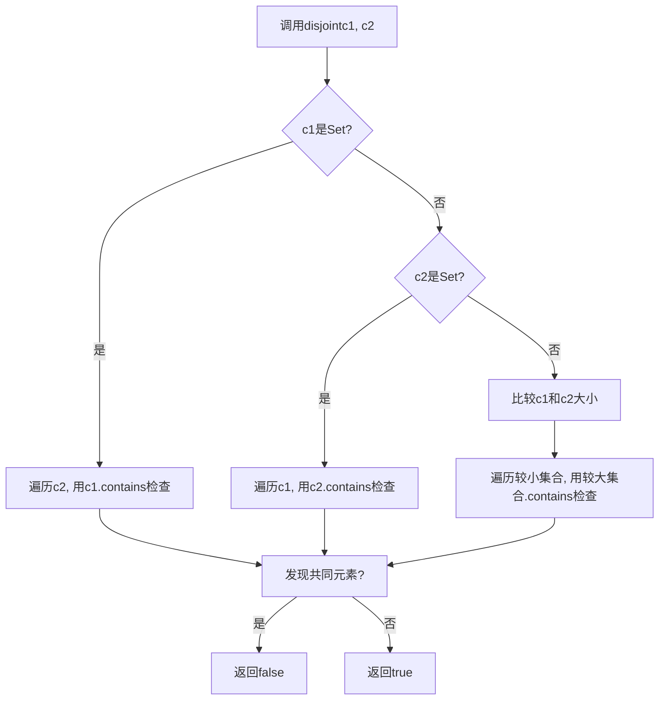

# Java Collections.disjoint()方法详解：高效判断集合交集的利器

## 开头摘要

Collections.disjoint()是Java集合框架中用于高效判断两个集合是否不存在共同元素的实用工具方法。本文深入解析其实现原理、性能优化技巧和实际应用场景，适合需要处理集合关系判断的Java开发者阅读，帮助读者避免手动循环判断的陷阱，编写更优雅高效的代码。

## 目录

- #collections-disjoint方法概述
- #方法语法与核心原理
- #源码分析与性能优化
- #使用示例与最佳实践
- #常见问题与注意事项
- #实际应用场景
- #与其他方法的对比
- #总结

## Collections.disjoint()方法概述

Collections.disjoint()是Java Collections工具类中的一个静态方法，用于判断两个集合是否没有共同的元素（即数学上的"不相交"集合）。如果两个集合没有任何交集，方法返回true；如果存在至少一个共同元素，则返回false。

这一方法的设计哲学在于将常见的集合关系判断操作封装成易于使用的API，提高了代码的可读性和健壮性。相比手动编写循环判断，使用disjoint()方法可以让代码意图更加清晰，同时享受Java标准库带来的性能优化。

## 方法语法与核心原理

### 方法签名

```java
public static boolean disjoint(Collection<?> c1, Collection<?> c2)
```

方法接受两个Collection对象作为参数，返回一个boolean值。需要注意的是，这两个集合可以是不同类型的集合实现（如List和Set），只要它们都实现了Collection接口即可。

### 核心原理

disjoint()方法的核心原理是遍历其中一个集合的元素，检查每个元素是否存在于另一个集合中。一旦发现任何共同元素，方法立即返回false；只有当遍历完所有元素都没有发现共同元素时，才返回true。

为了提高性能，方法内部会智能选择遍历策略：

1. 优先遍历较小的集合，减少contains()方法的调用次数
2. 如果其中一个集合是Set类型，则利用Set的高效查找特性
3. 处理空集合的边缘情况，提高效率



## 源码分析与性能优化

### 源码实现策略

从源码角度分析，disjoint()方法采用了智能的遍历策略优化：

```java
public static boolean disjoint(Collection<?> c1, Collection<?> c2) {
    // 性能优化：如果c1是Set，则遍历c2（因为Set的contains更高效）
    if (c1 instanceof Set) {
        // 使用c1进行contains操作，因为Set的contains()性能更好
        iterate = c2;
        contains = c1;
    } else if (!(c2 instanceof Set)) {
        // 两者都是普通Collection，遍历较小的集合
        int c1size = c1.size();
        int c2size = c2.size();
        if (c1size == 0 || c2size == 0) {
            // 至少一个集合为空，肯定没有共同元素
            return true;
        }
        if (c1size > c2size) {
            iterate = c2;
            contains = c1;
        }
    }
    for (Object e : iterate) {
        if (contains.contains(e)) {
            return false; // 发现共同元素
        }
    }
    return true; // 没有共同元素
}
```

### 性能考量

disjoint()方法的性能很大程度上取决于传入集合的类型及其contains()方法的实现复杂度：

- **最坏情况**：两个ArrayList，时间复杂度为O(m×n)
- **最优情况**：一个HashSet和一个任意集合，时间复杂度接近O(n)

下面的表格对比了不同集合组合的性能特征：

| 集合1类型 | 集合2类型 | contains()复杂度 | 总体复杂度 |
|---------|---------|----------------|----------|
| ArrayList | ArrayList | O(n) | O(m×n) |
| HashSet | ArrayList | O(1) | O(n) |
| ArrayList | HashSet | O(1) | O(m) |
| HashSet | HashSet | O(1) | O(min(m,n)) |

在实际使用中，如果需要频繁调用disjoint()方法，应尽量保证至少一个参数是HashSet等具有高效查找性能的集合实现。

## 使用示例与最佳实践

### 基础用法示例

以下是disjoint()方法的基本使用示例，展示了不同场景下的应用：

```java
import java.util.*;

public class DisjointExample {
    public static void main(String[] args) {
        // 示例1：水果集合与热带水果集合
        List<String> fruits = Arrays.asList("Apple", "Banana", "Cherry", "Date");
        Set<String> tropicalFruits = new HashSet<>(Arrays.asList("Mango", "Pineapple", "Banana"));
        
        // 有共同元素"Banana"，返回false
        boolean result1 = Collections.disjoint(fruits, tropicalFruits);
        System.out.println("Fruits and tropical fruits disjoint: " + result1); // 输出: false
        
        // 示例2：水果集合与浆果集合
        Set<String> berries = new HashSet<>(Arrays.asList("Strawberry", "Blueberry", "Raspberry"));
        
        // 没有共同元素，返回true
        boolean result2 = Collections.disjoint(fruits, berries);
        System.out.println("Fruits and berries disjoint: " + result2); // 输出: true
        
        // 示例3：数字集合
        List<Integer> numbers1 = Arrays.asList(1, 2, 3);
        List<Integer> numbers2 = Arrays.asList(4, 5, 6);
        
        // 没有共同元素，返回true
        boolean result3 = Collections.disjoint(numbers1, numbers2);
        System.out.println("Numbers1 and Numbers2 disjoint: " + result3); // 输出: true
    }
}
```

### 最佳实践

1. **集合类型选择**：对于需要频繁判断交集的场景，至少使用一个HashSet作为参数
2. **空集合处理**：disjoint()方法能够正确处理空集合，任意一个集合为空时都会返回true
3. **自定义对象**：如果集合包含自定义对象，必须正确重写equals()和hashCode()方法
4. **并发修改**：避免在方法执行期间修改集合，可能引发ConcurrentModificationException

## 常见问题与注意事项

### 空指针异常

当任一参数为null时，disjoint()方法会抛出NullPointerException：

```java
Set<String> set1 = new HashSet<>(Arrays.asList("A", "B"));
Set<String> set2 = null;

// 抛出NullPointerException
boolean result = Collections.disjoint(set1, set2);
```

在实际使用中，应对可能为null的参数进行校验：

```java
public static boolean safeDisjoint(Collection<?> c1, Collection<?> c2) {
    if (c1 == null || c2 == null) {
        return true; // 根据业务需求定义null处理逻辑
    }
    return Collections.disjoint(c1, c2);
}
```

### 自定义对象的相等性判断

disjoint()方法依赖元素的equals()方法判断相等性。对于自定义类，必须正确重写equals()和hashCode()方法：

```java
class User {
    private String id;
    private String name;
    
    // 必须正确重写equals和hashCode
    @Override
    public boolean equals(Object o) {
        if (this == o) return true;
        if (o == null || getClass() != o.getClass()) return false;
        User user = (User) o;
        return Objects.equals(id, user.id);
    }
    
    @Override
    public int hashCode() {
        return Objects.hash(id);
    }
}

// 使用示例
Set<User> users1 = new HashSet<>(Arrays.asList(new User("1", "Alice")));
Set<User> users2 = new HashSet<>(Arrays.asList(new User("1", "Alice")));

// 结果取决于User类是否正确重写了equals和hashCode
boolean disjoint = Collections.disjoint(users1, users2);
```

## 实际应用场景

### 权限管理与角色校验

在权限系统中，经常需要检查用户角色是否与禁止角色有重叠：

```java
// 用户拥有的角色
List<String> userRoles = Arrays.asList("ADMIN", "EDITOR", "VIEWER");

// 被禁止的角色
Set<String> forbiddenRoles = new HashSet<>(Arrays.asList("GUEST", "DEACTIVATED", "BANNED"));

// 检查用户是否拥有任何禁止角色
boolean hasForbiddenRole = !Collections.disjoint(userRoles, forbiddenRoles);
if (hasForbiddenRole) {
    // 拒绝访问
    System.out.println("用户拥有禁止角色，拒绝访问");
}
```

### 数据冲突检测

在数据导入或用户注册场景中，检查新数据与现有数据是否冲突：

```java
// 从数据库获取已存在的用户名
Set<String> existingUsernames = getUsernamesFromDatabase();

// 新批量注册的用户名
List<String> newUsernames = Arrays.asList("john_doe", "jane_doe", "test_user");

// 检查用户名是否已存在
if (!Collections.disjoint(existingUsernames, newUsernames)) {
    throw new IllegalArgumentException("部分用户名已存在");
}
```

### 资源分配与调度

在会议室预订、课程安排等场景中，检查资源是否冲突：

```java
// 现有会议的参与人员
Set<String> existingAttendees = new HashSet<>(Arrays.asList("Alice", "Bob", "Charlie"));

// 新会议的参与人员
Set<String> newAttendees = new HashSet<>(Arrays.asList("Bob", "David", "Eve"));

// 检查参会人员是否冲突
if (!Collections.disjoint(existingAttendees, newAttendees)) {
    System.out.println("存在人员时间冲突，无法安排会议");
}
```

### 游戏开发中的物品检查

在游戏开发中，检查玩家物品与限制物品的交集：

```java
// 玩家背包物品
Set<String> playerInventory = new HashSet<>(Arrays.asList("Sword", "Shield", "Potion"));

// 地下城中禁止携带的物品
Set<String> forbiddenItems = new HashSet<>(Arrays.asList("Magic Orb", "Shield", "Explosive"));

// 检查是否携带违禁物品
if (!Collections.disjoint(playerInventory, forbiddenItems)) {
    System.out.println("警告：你携带了禁止进入地下城的物品！");
}
```

## 与其他方法的对比

### 与手动遍历对比

与手动遍历相比，disjoint()方法具有明显优势：

**手动遍历实现：**
```java
// 手动判断交集
boolean hasCommon = false;
for (Object item : collectionA) {
    if (collectionB.contains(item)) {
        hasCommon = true;
        break;
    }
}
boolean disjoint = !hasCommon;
```

**disjoint()方法优势：**
- **代码简洁性**：一行代码代替多行循环
- **可读性**：方法名清晰表达意图
- **性能优化**：自动选择最优遍历策略
- **健壮性**：经过充分测试，处理各种边界情况

### 与retainAll()方法对比

retainAll()方法用于修改集合，只保留与指定集合共有的元素，可用于判断交集，但会改变原集合：

```java
// 使用retainAll()判断交集（会修改原集合）
List<String> list1 = new ArrayList<>(Arrays.asList("A", "B", "C"));
List<String> list2 = Arrays.asList("B", "D", "E");

// 创建副本以避免修改原集合
List<String> copy = new ArrayList<>(list1);
copy.retainAll(list2);
boolean hasIntersection = !copy.isEmpty();

// 使用disjoint()更简洁且不修改原集合
boolean disjoint = Collections.disjoint(list1, list2);
```

### 与Apache Commons CollectionUtils.containsAny()对比

Apache Commons Lang库提供类似的containsAny()方法，但逻辑相反（有交集返回true）：

```java
// 使用Apache Commons
boolean hasCommon = CollectionUtils.containsAny(collectionA, collectionB);

// 使用Collections.disjoint()
boolean hasCommon = !Collections.disjoint(collectionA, collectionB);
```

### Java 8 Stream API实现

Java 8及以上版本可以使用Stream API实现类似功能，但通常性能不如优化的disjoint()方法：

```java
// 使用Stream API判断是否有交集
boolean hasCommon = list1.stream().anyMatch(list2::contains);

// 对于大型集合，可并行处理（但未必更快）
boolean hasCommonParallel = list1.parallelStream().anyMatch(list2::contains);
```

## 总结

Collections.disjoint()方法是Java集合框架中一个实用且高效的工具方法，具有以下核心特点：

- **功能明确**：专门用于判断两个集合是否不存在共同元素，返回boolean结果
- **性能优化**：内部智能选择遍历策略，优先遍历小集合或利用Set的高效查找
- **使用简便**：一行代码替代复杂的手动循环判断
- **健壮性强**：作为标准库方法，经过充分测试，正确处理各种边界情况

### 选择使用场景

- **推荐使用disjoint()**：当只需要知道两个集合是否存在交集，而不关心具体交集内容时
- **考虑其他方案**：当需要获取具体交集元素，或需要对交集元素进行进一步处理时

### 性能要点

- 至少使用一个HashSet作为参数可以显著提升性能
- 避免对两个ArrayList使用disjoint()处理大数据集
- 确保自定义对象的equals()和hashCode()正确实现

## 延伸阅读

1. https://docs.oracle.com/javase/8/docs/technotes/guides/collections/
2. https://github.com/openjdk/jdk/tree/master/src/java.base/share/classes/java/util
3. https://www.oreilly.com/library/view/effective-java-3rd/9780134686097/ - 第3版包含集合使用的最佳实践

## 一句话记忆

Collections.disjoint()是判断集合无交集的利器，内部自动优化遍历策略，让代码更简洁高效。