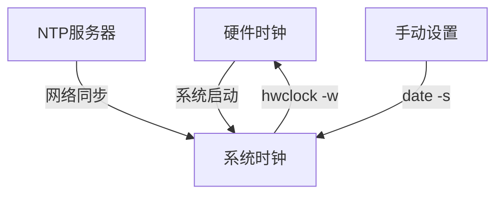
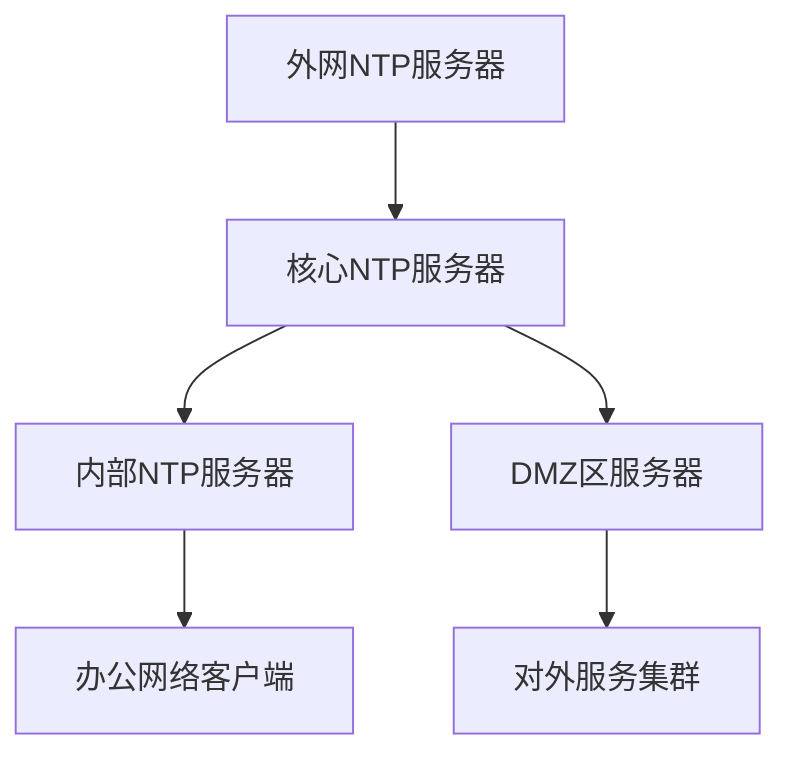

# Linux服务器时间同步全攻略：联网与离线环境详解

> 在分布式系统和集群环境中，时间同步是确保系统一致性和可靠性的基石，本文将全面介绍Linux环境下各种时间同步方案。

## 引言

在Linux服务器运维中，准确的时间同步至关重要。无论是金融交易系统、分布式数据库还是日志分析，时间不一致都可能导致数据不一致、服务异常等严重问题。本文将深入探讨Linux服务器在联网和离线环境下的时间同步方案，涵盖传统的ntpdate、ntpd以及现代化的chrony工具，帮助运维人员构建高精度的时间同步体系。

## 目录

1.  #时间同步的基本概念
2.  #联网环境时间同步
3.  #离线环境时间同步
4.  #chrony现代时间同步方案
5.  #实战案例企业级ntp服务器搭建
6.  #总结

## 时间同步的基本概念

### 为什么需要时间同步？

时间同步对于分布式系统来说如同"心跳"对于人体。在集群环境中，如果各节点时间不一致，会导致数据不一致、事务顺序错乱、日志分析困难等问题。例如，在数据库集群中，时间差超过一定阈值可能导致数据同步失败；在安全领域，基于时间的认证令牌（如TOTP）依赖时间同步才能正常工作。

### NTP协议简介

NTP（Network Time Protocol）是用于同步计算机时钟的网络协议，采用分层架构（Stratum）设计。Stratum 0为最高精度时间源（如原子钟、GPS），Stratum 1为直接连接Stratum 0的服务器，依此类推。这种设计既保证了时间精度，又避免了单点故障。

### Linux时间体系

Linux系统存在两个时钟：系统时钟（内核维护）和硬件时钟（主板BIOS）。系统关机后，硬件时钟依靠主板电池继续运行。系统启动时，从硬件时钟读取时间，之后由系统时钟独立运行。



## 联网环境时间同步

### 使用ntpdate工具（简单同步）

ntpdate是一款简单的NTP客户端工具，适用于一次性时间同步。

```bash
# 安装ntpdate（CentOS/RHEL）
yum install -y ntpdate

# 同步时间（使用-u参数绕过防火墙）
ntpdate -u ntp.aliyun.com

# 将系统时间写入硬件时钟
hwclock -w
```

常用NTP服务器地址：
- 中国国家授时中心：`ntp.ntsc.ac.cn`（原210.72.145.44）
- 阿里云：`ntp.aliyun.com`
- 腾讯云：`ntp.tencent.com`
- 国际NTP池项目：`cn.pool.ntp.org`

**注意**：使用ntpdate时需加`-u`参数，否则可能报错"no server suitable for synchronization found"。

### 使用ntpd服务（持续同步）

ntpd是标准的NTP守护进程，可持续调整系统时间，适合长期运行的服务。

```bash
# 安装ntp服务
yum install -y ntp

# 配置NTP服务器
vim /etc/ntp.conf
# 添加或修改服务器配置
server ntp.aliyun.com iburst
server ntp.tencent.com iburst

# 启动并启用服务
systemctl start ntpd
systemctl enable ntpd
```

ntpd与ntpdate的主要区别在于，ntpdate是立即调整时间（时间跳变），而ntpd是逐渐调整（时间渐变），避免对依赖连续时间的应用造成影响。

### 配置自动时间同步

为确保时间持续同步，可配置cron任务：

```bash
# 编辑crontab
crontab -e

# 每天10点同步时间
00 10 * * * /usr/sbin/ntpdate -u ntp.aliyun.com > /dev/null 2>&1; /sbin/hwclock -w
```

## 离线环境时间同步

### 搭建本地NTP服务器

在内网环境中，可指定一台能访问外网的服务器作为时间源，其他服务器同步该服务器时间。

**时间源服务器配置（可访问外网）**：

```bash
# 安装ntp服务
yum install -y ntp

# 编辑配置文件
vim /etc/ntp.conf
# 配置上游时间服务器
server ntp.aliyun.com iburst
# 允许内网网段访问
restrict 192.168.1.0 mask 255.255.255.0 nomodify notrap

# 启动服务
systemctl start ntpd
systemctl enable ntpd

# 配置定期同步
crontab -e
# 添加以下内容，每天同步一次外网时间
0 2 * * * /usr/sbin/ntpdate -u ntp.aliyun.com && /sbin/hwclock -w
```

**客户端配置（仅内网）**：

```bash
# 配置NTP客户端
vim /etc/ntp.conf
# 指向本地NTP服务器
server 192.168.1.100 iburst

# 启动服务
systemctl start ntpd
systemctl enable ntpd
```

### 离线安装NTP服务

在完全离线的环境中，需要先下载离线安装包。

**下载离线包**：

```bash
# 在有外网的环境中下载安装包和依赖
yum install --downloadonly --downloaddir=/tmp/ntp-packages ntp ntpdate
```

**离线安装**：

```bash
# 将安装包复制到离线机器
scp -r /tmp/ntp-packages/ root@offline-server:/tmp/

# 离线安装
cd /tmp/ntp-packages
rpm -Uvh *.rpm
```

对于Debian/Ubuntu系统，可使用dpkg离线安装：

```bash
# 下载deb包
wget http://archive.ubuntu.com/ubuntu/pool/universe/n/ntp/ntpdate_4.2.8p10+dfsg-5ubuntu7_amd64.deb

# 离线安装
sudo dpkg -i ntpdate_4.2.8p10+dfsg-5ubuntu7_amd64.deb
```

### 手动时间同步

在简单的测试环境中，可使用手动方式同步多台服务器时间：

```bash
# 使用并发工具在多台机器上同时执行
date -s "2025-11-11 10:00:00"
hwclock -w
```

此法精度较低，仅适合测试环境。

## Chrony：现代时间同步方案

### Chrony简介

Chrony是现代Linux发行版（RHEL 8+/CentOS 8+）默认的NTP实现，专为不稳定的网络环境设计，相比传统ntpd有显著优势。

**Chrony vs NTPD对比**：

| 特性 | Chrony | ntpd |
|------|--------|------|
| 同步速度 | 快速收敛 | 较慢 |
| 离线支持 | 支持硬件时钟校准 | 依赖网络 |
| 资源占用 | 轻量级 | 相对较高 |
| 时间偏差容忍度 | 可配置大偏差 | 容忍度低 |

### Chrony安装与配置

**安装Chrony**：

```bash
# CentOS/RHEL
yum install -y chrony

# 启动服务
systemctl start chronyd
systemctl enable chronyd
```

**服务端配置**（/etc/chrony.conf）：

```bash
# 使用公共NTP服务器
server ntp.aliyun.com iburst

# 允许客户端访问的网段
allow 192.168.0.0/16

# 当外部时间源不可用时，使用本地时间
local stratum 10

# 启用硬件时钟同步
rtcsync
```

**客户端配置**：

```bash
# 指向本地NTP服务器
server 192.168.1.100 iburst

# 启用快速同步
makestep 1.0 3
```

### Chrony监控与管理

```bash
# 检查同步状态
chronyc tracking

# 查看时间源
chronyc sources -v

# 手动同步时间
chronyc makestep

# 检查NTP服务器访问性
chronyc ntpdata
```

chronyc tracking输出参数说明：
- **Reference ID**：当前同步的NTP服务器
- **Stratum**：时间源层级（越小越精确）
- **System time**：系统时钟与NTP时间的偏差
- **Last offset**：最后一次时钟调整的偏移量
- **Root delay**：到Stratum 1服务器的总网络延迟

## 实战案例：企业级NTP服务器搭建

### 场景描述

某企业需要搭建内部时间同步架构，要求：
1.  核心服务器可访问外网，同步国际标准时间
2.  内部办公网络无法访问互联网，但需时间同步
3.  保证时间精度在100ms以内

### 架构设计



### 实施步骤

**核心NTP服务器配置**：

```bash
# 安装chrony
yum install -y chrony

# 配置/etc/chrony.conf
server ntp.aliyun.com iburst
server time.windows.com iburst
allow 10.0.0.0/8
local stratum 5
rtcsync
makestep 1000 10

# 启动服务
systemctl start chronyd
systemctl enable chronyd

# 配置防火墙
firewall-cmd --add-service=ntp --permanent
firewall-cmd --reload
```

**内部NTP服务器配置**：

```bash
# 配置指向核心服务器
server core-ntp.example.com iburst
allow 192.168.0.0/16
local stratum 10

# 验证同步状态
chronyc tracking
chronyc sources -v
```

**客户端配置**：

```bash
# 简单客户端配置
server internal-ntp.example.com iburst

# 设置时区（可选）
timedatectl set-timezone Asia/Shanghai
```

### 监控与维护

**日志监控**：
```bash
# 查看chrony日志
journalctl -u chronyd -f

# 检查同步状态
chronyc tracking
```

**设置监控告警**：
当时间偏移超过阈值时触发告警：

```bash
#!/bin/bash
OFFSET=$(chronyc tracking | grep "System time" | awk '{print $4}')
THRESHOLD=0.1 # 100ms

if (( $(echo "$OFFSET > $THRESHOLD" | bc -l) )); then
    echo "时间偏移过大: $OFFSET 秒" | mail -s "NTP告警" admin@example.com
fi
```

## 时区设置与硬件时钟

### 设置正确时区

时间同步前，需确保时区设置正确：

```bash
# 查看当前时区
timedatectl status
date +"%Z"

# 设置时区（亚洲/上海）
timedatectl set-timezone Asia/Shanghai
# 或使用传统方法
ln -sf /usr/share/zoneinfo/Asia/Shanghai /etc/localtime
```

### 系统时钟与硬件时钟同步

```bash
# 将系统时间写入硬件时钟
hwclock -w

# 从硬件时钟读取时间到系统时钟
hwclock -s

# 查看硬件时钟时间
hwclock -r
```

## 常见问题与解决方案

### 时间同步失败排查

1.  **检查网络连通性**：
    ```bash
    ping ntp.aliyun.com
    telnet ntp.aliyun.com 123
    ```

2.  **检查防火墙设置**：
    ```bash
    # 开放NTP端口（123/UDP）
    firewall-cmd --add-service=ntp --permanent
    firewall-cmd --reload
    ```

3.  **查看NTP服务状态**：
    ```bash
    systemctl status ntpd
    ntpq -p  # 查看NTP对等体状态
    ```

### 特殊环境配置

**虚拟化环境**：
- **XEN VPS**：需配置独立时钟源
- **OpenVZ VPS**：通常不能修改时间，需联系服务商

## 总结

Linux服务器时间同步是系统运维的基础工作，正确的配置可避免许多潜在问题：

### 方案选择建议

1.  **联网环境**：推荐使用chrony作为首选方案，特别是现代Linux发行版
2.  **离线环境**：搭建本地NTP服务器层级，指定少量服务器同步外网时间
3.  **简单需求**：可使用ntpdate配合cron实现基本同步需求
4.  **高可用需求**：配置多时间源，结合监控告警体系

### 最佳实践

- 📋 **定期监控**：建立时间同步状态监控机制
- 🔄 **多源备份**：配置多个时间服务器提高可靠性
- ⚡ **渐进调整**：生产环境优先使用渐进式同步（ntpd/chrony）
- 🛡️ **安全配置**：限制NTP服务器访问权限，防止滥用

## 延伸阅读

- https://chrony.tuxfamily.org/documentation.html
- http://www.ntp.org/
- [Linux man pages: chrony.conf, ntp.conf, timedatectl]

## 一句话记忆

> 时间同步是分布式系统的"心跳"，联网用chrony追外源，离线建层级靠内网，监控告警不可少。