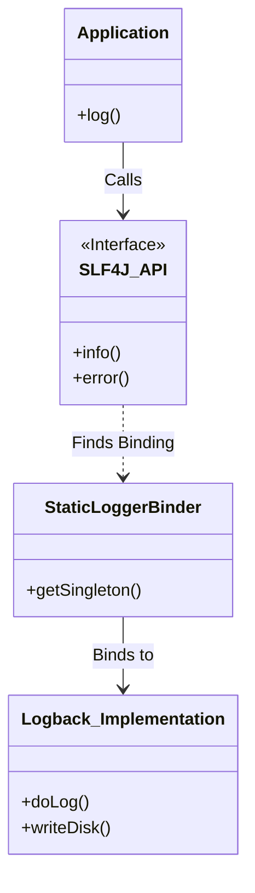
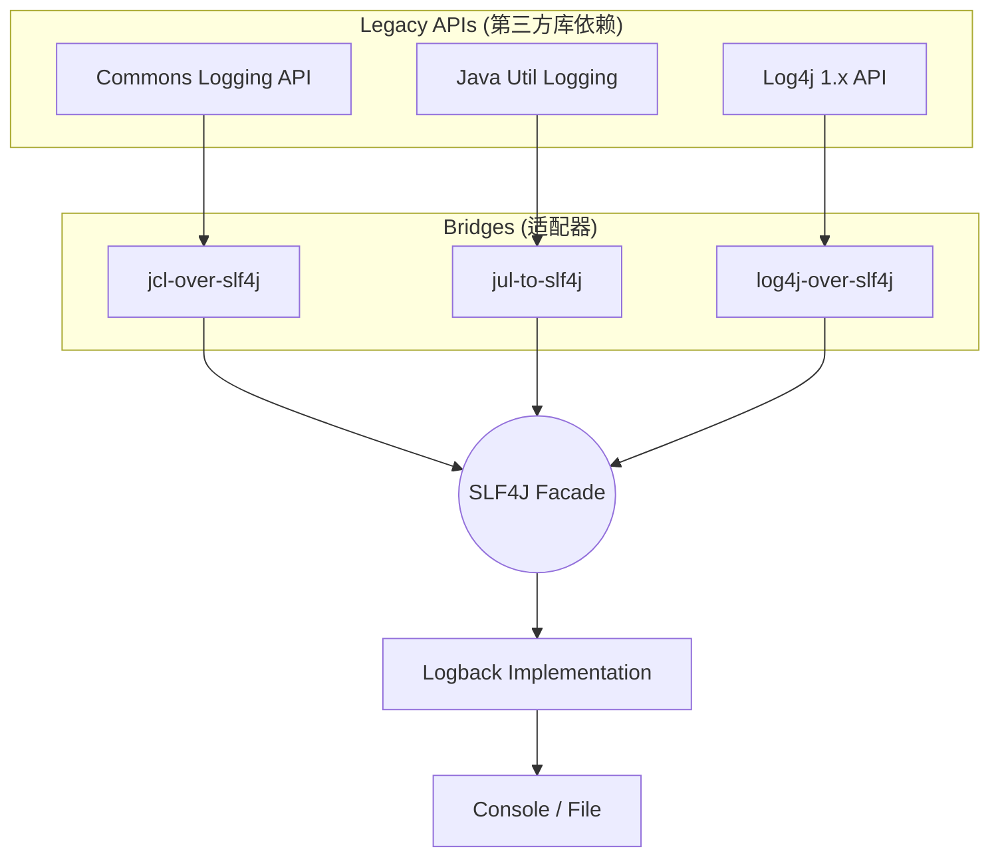

# Spring Boot 日志体系深度解析：从 SLF4J 到 Logback 的配置与最佳实践

## 1. 开头摘要

本文将深入剖析 Spring Boot 的日志体系，揭示 **SLF4J（门面）** 与 **Logback（实现）** 之间的协作机制，以及 Spring Boot 如何通过 **桥接器** 统一管理第三方库的日志。我们将详细探讨 `application.properties` 与 `logback-spring.xml` 的配置优先级与覆盖策略，并解决“多重日志绑定”等常见痛点。本文适合希望从知其然跨越到知其所以然的中高级 Java 后端开发者。

---

## 2. 目录

1. [日志门面与实现的设计哲学](#3-日志门面与实现的设计哲学)
2. [Spring Boot 的统一日志管理机制](#4-spring-boot-的统一日志管理机制)
3. [配置实战：从 Properties 到 XML](#5-配置实战从-properties-到-xml)
4. [多环境配置与 Profile 隔离](#6-多环境配置与-profile-隔离)
5. [跨语言对比：Java 日志的独特性](#7-跨语言对比java-日志的独特性)
6. [常见陷阱与实战案例](#8-常见陷阱与实战案例)
7. [总结](#9-总结)
8. [延伸阅读](#10-延伸阅读)
9. [一句话记忆](#11-一句话记忆)

---

## 3. 日志门面与实现的设计哲学

### 概念解释
在 Java 生态中，日志系统采用 **门面模式 (Facade Pattern)**。
*   **门面 (Facade)**：提供统一的 API 接口，不负责具体逻辑。代表库：**SLF4J** (Simple Logging Facade for Java), Apache Commons Logging (JCL)。
*   **实现 (Implementation)**：负责真正的日志打印、文件写入、滚动策略。代表库：**Logback**, Log4j2, Java Util Logging (JUL)。

**为什么要这么设计？**
早期的 Java 库（如 Hibernate, Spring Framework, Jetty）各自依赖不同的日志系统。如果不使用门面，当你的项目集成了这些库时，你可能需要同时配置 log4j.properties, logging.properties 等多个文件。SLF4J 的出现解耦了代码与日志实现，允许你在部署时决定使用哪个日志框架。

### 示例代码
在代码中，我们永远只引入 SLF4J 的包，而不直接使用 Logback 的类。

```java
package com.example.demo;

import org.slf4j.Logger;
import org.slf4j.LoggerFactory;
import org.springframework.web.bind.annotation.GetMapping;
import org.springframework.web.bind.annotation.RestController;

@RestController
public class LogController {

    // 1. 面向接口编程：Logger 和 LoggerFactory 都是 slf4j 的接口
    private static final Logger logger = LoggerFactory.getLogger(LogController.class);

    @GetMapping("/log")
    public String log() {
        // 2. 占位符写法，性能优于字符串拼接
        String user = "Admin";
        logger.info("User {} accessed the system at {}", user, System.currentTimeMillis());
        
        try {
            int i = 1 / 0;
        } catch (Exception e) {
            // 3. 异常堆栈的正确打印方式
            logger.error("Calculation failed for user {}", user, e);
        }
        return "logged";
    }
}
```

### Mermaid 图：门面与实现的绑定
下图展示了 SLF4J 如何在运行时绑定到具体的实现（Logback）。



---

## 4. Spring Boot 的统一日志管理机制

### 核心机制：偷天换日（桥接器）
Spring Boot 默认使用 **Logback** 作为核心实现。但 Spring 核心框架早期使用 JCL (Commons Logging)，Hibernate 可能使用 JBoss Logging。Spring Boot 通过引入 **桥接器 (Bridge)** jar 包，将其他日志框架的调用“重定向”到 SLF4J，最后统一由 Logback 输出。

### Mermaid 图：日志流向
所有的支流最终汇入 SLF4J 这条大河。



### 问题分析
*   **依赖冲突**：如果你手动引入了 `log4j` 的依赖，而不是 `log4j-over-slf4j`，项目启动时可能会出现类路径冲突或日志不输出。
*   **解决方案**：Spring Boot 的 `spring-boot-starter-logging` 已经处理好了这些依赖树。如果引入了旧的第三方包带入了 `log4j`，必须在 Maven/Gradle 中执行 `exclude`。

---

## 5. 配置实战：从 Properties 到 XML

### 配置优先级与关系
Spring Boot 提供了两个层面的配置：
1.  **简单配置** (`application.properties/yml`)：适合修改日志级别、简单的文件路径。
2.  **深度配置** (`logback-spring.xml`)：适合定义复杂的 Appender、日志格式、滚动策略、按包名拆分日志文件。

**关系**：`logback-spring.xml` 的优先级高于默认配置。如果存在该文件，Spring Boot 将不再使用默认的构建逻辑，而是加载该 XML。

### 场景 1：修改日志级别 (Properties)
最常见的需求是调整某个包的日志级别。

```yaml
# application.yml
logging:
  level:
    root: INFO
    # 单独设置自己的包为 DEBUG
    com.example.demo: DEBUG
    # 查看 Spring MVC 的路径匹配详情
    org.springframework.web: DEBUG
    # 关闭某个啰嗦库的日志
    org.hibernate: ERROR
  file:
    name: logs/app.log
```

### 场景 2：生产级配置 (XML)
在生产环境中，我们需要：
1.  异步打印（提高性能）。
2.  按天滚动，并限制最大文件大小。
3.  自定义控制台彩色输出。

在 `src/main/resources` 下创建 `logback-spring.xml` (推荐使用 `-spring` 后缀，以便支持 Spring 的高级特性)：

```xml
<?xml version="1.0" encoding="UTF-8"?>
<configuration>
    <!-- 引用 Spring Boot 默认的控制台颜色格式 -->
    <include resource="org/springframework/boot/logging/logback/defaults.xml" />
    
    <property name="LOG_FILE" value="logs/app.log" />

    <!-- 1. 控制台输出 -->
    <appender name="CONSOLE" class="ch.qos.logback.core.ConsoleAppender">
        <encoder>
            <pattern>${CONSOLE_LOG_PATTERN}</pattern>
            <charset>UTF-8</charset>
        </encoder>
    </appender>

    <!-- 2. 滚动文件输出 -->
    <appender name="FILE" class="ch.qos.logback.core.rolling.RollingFileAppender">
        <file>${LOG_FILE}</file>
        <rollingPolicy class="ch.qos.logback.core.rolling.SizeAndTimeBasedRollingPolicy">
            <!-- 每天一个文件，文件过大则分割 -->
            <fileNamePattern>logs/app-%d{yyyy-MM-dd}.%i.log</fileNamePattern>
            <maxFileSize>100MB</maxFileSize>
            <maxHistory>30</maxHistory> <!-- 保留30天 -->
            <totalSizeCap>3GB</totalSizeCap>
        </rollingPolicy>
        <encoder>
            <pattern>%d{yyyy-MM-dd HH:mm:ss.SSS} [%thread] %-5level %logger{35} - %msg%n</pattern>
            <charset>UTF-8</charset>
        </encoder>
    </appender>

    <!-- 3. 异步包装 (性能优化) -->
    <appender name="ASYNC_FILE" class="ch.qos.logback.classic.AsyncAppender">
        <discardingThreshold>0</discardingThreshold>
        <queueSize>512</queueSize>
        <appender-ref ref="FILE" />
    </appender>

    <!-- 根日志级别 -->
    <root level="INFO">
        <appender-ref ref="CONSOLE" />
        <appender-ref ref="ASYNC_FILE" />
    </root>
    
    <!-- 单独包级别控制 -->
    <logger name="com.example.demo.mapper" level="DEBUG" />
</configuration>
```

---

## 6. 多环境配置与 Profile 隔离

### 概念解释
开发环境希望看到详细的控制台日志，而生产环境希望日志写入文件且只记录关键信息。Spring Boot 允许在 `logback-spring.xml` 中使用 `<springProfile>` 标签，这是 `logback.xml` 做不到的。

### 代码示例

```xml
<configuration>
    <!-- 开发环境：打印到控制台，级别为 DEBUG -->
    <springProfile name="dev">
        <root level="DEBUG">
            <appender-ref ref="CONSOLE" />
        </root>
    </springProfile>

    <!-- 生产环境：打印到文件，级别为 INFO -->
    <springProfile name="prod">
        <root level="INFO">
            <appender-ref ref="ASYNC_FILE" />
        </root>
    </springProfile>
</configuration>
```

**配合方式**：
启动应用时指定 Profile：`java -jar app.jar --spring.profiles.active=prod`，Logback 会自动激活对应的配置块。

---

## 7. 跨语言对比：Java 日志的独特性

| 特性 | Java (SLF4J + Logback) | Python (logging) | Go (Zap / Logrus) |
| :--- | :--- | :--- | :--- |
| **架构复杂度** | **高** (门面+实现+桥接) | 中 (标准库内置，模块化) | 低 (通常直接依赖具体库) |
| **设计动机** | 解决庞大生态中的库兼容性问题 | 语言层面提供标准实现 | 追求极致性能和简洁 |
| **配置方式** | XML/Properties 为主 | Python 代码配置或 `.ini` | 代码配置 (Structs) |
| **动态性** | 支持 JMX 动态修改级别 | 支持 | 支持 HTTP 钩子修改 |

**核心差异**：Java 之所以搞得这么复杂（桥接、门面），是因为 Java 的开源生态历史悠久且碎片化严重。Go 和 Python 相对统一，通常不需要为了兼容第三方库而进行复杂的“桥接”。

---

## 8. 常见陷阱与实战案例

### 陷阱 1：SLF4J 多重绑定 (Multiple Bindings)
**现象**：启动时控制台打印红色警告：
`SLF4J: Class path contains multiple SLF4J bindings.`

**原因**：项目中同时引入了 `logback-classic` 和 `log4j-slf4j-impl`（或其他实现）。SLF4J 不知道该把日志发给谁。

**解决**：使用 Maven Helper 插件查看依赖树，排除不需要的日志实现 jar 包。
```xml
<dependency>
    <groupId>org.some-legacy-lib</groupId>
    <artifactId>legacy-lib</artifactId>
    <exclusions>
        <exclusion>
            <groupId>org.slf4j</groupId>
            <artifactId>slf4j-log4j12</artifactId>
        </exclusion>
    </exclusions>
</dependency>
```

### 陷阱 2：MyBatis SQL 日志不打印
**原因**：MyBatis 默认没有 debug 级别不会打印 SQL 和参数。
**配合**：
1. 确保包路径正确。
2. 级别设为 DEBUG。
```yaml
logging:
  level:
    # Mapper 接口所在的包路径
    com.example.demo.mapper: DEBUG
```

### 实战案例：动态修改日志级别
在生产环境排查 Bug 时，不想重启服务。可以使用 Spring Boot Actuator。
1. 引入 `spring-boot-starter-actuator`。
2. 暴露 `loggers` 端点。
3. 发送 POST 请求修改级别：
```bash
curl -X POST http://localhost:8080/actuator/loggers/com.example.demo -H 'Content-Type: application/json' -d '{"configuredLevel": "DEBUG"}'
```
这展示了 Spring Boot 日志体系的灵活性和配合能力。

---

## 9. 总结

1.  **架构**：Spring Boot 使用 **SLF4J** 作为门面，**Logback** 作为默认实现，并通过各类 **Bridge** 统一了 JCL、Log4j 等第三方日志。
2.  **配置**：简单的级别调整用 `application.yml`；复杂的 Appender 和滚动策略用 `logback-spring.xml`。
3.  **扩展**：利用 `<springProfile>` 可以在同一份 XML 中实现多环境差异化配置。
4.  **最佳实践**：始终使用 SLF4J 接口编程；生产环境使用异步 Appender；注意排除依赖冲突。

---

## 10. 延伸阅读

*   [Spring Boot 官方文档 - Logging](https://docs.spring.io/spring-boot/docs/current/reference/html/features.html#features.logging)
*   [Logback 官方手册 - Configuration](https://logback.qos.ch/manual/configuration.html)
*   [SLF4J 官方文档 - Bridging legacy APIs](https://www.slf4j.org/legacy.html)

---

## 11. 一句话记忆

**代码里只认 SLF4J 接口，配置里只改 Logback XML，依赖里只要 Spring Boot Starter，杂牌日志通通 Bridge 过来。**