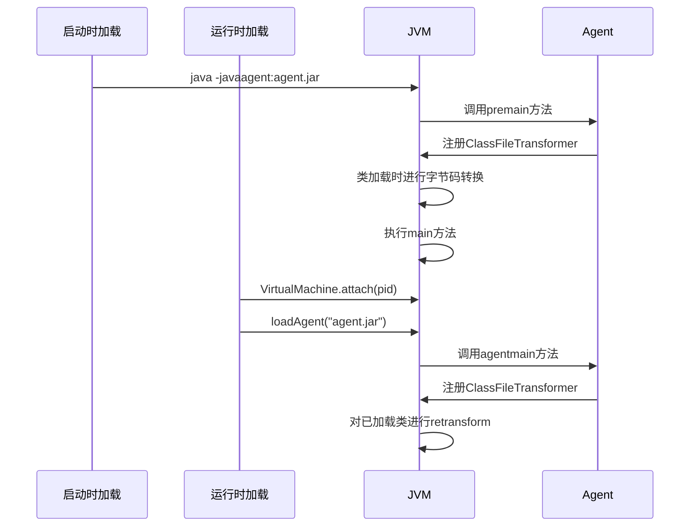

# Java Instrumentation 接口深入解析：JVM 级别的 AOP 强大工具

## 开头摘要

Java Instrumentation 是 `java.lang.instrument` 包提供的核心 API，允许开发者在 JVM 加载类时修改字节码或在运行时重新定义已加载的类。这项技术为 JVM 级别的监控、调试和性能分析提供了基础支撑，广泛应用于 APM、热部署、代码覆盖率等工具开发。本文适合熟悉 Java 基础并希望深入了解 JVM 底层机制和字节码增强技术的开发者。

## 目录

- #instrumentation-概述
- #核心概念与 api 解析
- #两种使用方式
- #字节码修改实战
- #底层原理与 jvmti
- #应用场景与典型案例
- #注意事项与最佳实践
- #总结

## Instrumentation 概述

Java Instrumentation 是 JDK 1.5 引入的关键特性，它提供了一种**虚拟机级别的 AOP 机制**，无需修改源代码即可实现对 Java 程序的监控和增强。Instrumentation 的核心价值在于能够在类加载前后动态修改字节码，这一机制为许多高级应用提供了基础。

从历史发展来看，JDK 1.5 引入了基本的静态 Instrumentation 功能，而 JDK 1.6 进一步增强了其能力，增加了动态 Attach 机制、本地代码 instrumentation 等功能。这些演进使得 Java 语言具有了更强大的动态控制和解释能力。

与传统的 AOP 框架（如 Spring AOP）相比，Instrumentation 工作在更底层，它直接操作字节码，而不是通过代理对象和反射机制。这种底层实现使得它具有更高的执行效率和更广泛的应用范围，能够拦截和增强包括系统类在内的几乎所有类。

## 核心概念与 API 解析

### Java Agent 机制

Java Agent 是 Instrumentation 的载体，它是一种特殊的 JAR 包，通过 JVM 参数`-javaagent`加载。Agent 包必须在`MANIFEST.MF`文件中指定入口类，该类需要实现`premain`或`agentmain`方法。

```java
// MANIFEST.MF 文件内容示例
Premain-Class: com.example.MyAgent
Can-Redefine-Classes: true
Can-Retransform-Classes: true
```

### Instrumentation 接口详解

Instrumentation 接口是整个包的核心，它提供了一系列关键方法：

```java
public interface Instrumentation {
    // 添加ClassFileTransformer
    void addTransformer(ClassFileTransformer transformer, boolean canRetransform);
    void addTransformer(ClassFileTransformer transformer);

    // 移除ClassFileTransformer
    boolean removeTransformer(ClassFileTransformer transformer);

    // 类重定义和重转换
    void redefineClasses(ClassDefinition... definitions)
        throws ClassNotFoundException, UnmodifiableClassException;
    void retransformClasses(Class<?>... classes)
        throws UnmodifiableClassException;

    // 查询功能
    boolean isRetransformClassesSupported();
    boolean isModifiableClass(Class<?> theClass);
    Class[] getAllLoadedClasses();
    Class[] getInitiatedClasses(ClassLoader loader);

    // 获取对象大小
    long getObjectSize(Object objectToSize);

    // 类路径管理
    void appendToBootstrapClassLoaderSearch(JarFile jarfile);
    void appendToSystemClassLoaderSearch(JarFile jarfile);
}
```

### ClassFileTransformer 接口

ClassFileTransformer 是实际进行字节码修改的接口，它只有一个 transform 方法，在类加载时被 JVM 调用：

```java
public interface ClassFileTransformer {
    byte[] transform(ClassLoader loader, String className, Class<?> classBeingRedefined,
                    ProtectionDomain protectionDomain, byte[] classfileBuffer)
                    throws IllegalClassFormatException;
}
```

值得注意的是，className 参数使用 JVM 内部格式（如`java/lang/String`而不是`java.lang.String`），且对由 Bootstrap ClassLoader 加载的类，loader 参数为 null。

## 两种使用方式

### 1. 启动时加载（Premain 方式）

这是最基本的使用方式，在 JVM 启动时通过`-javaagent`参数加载 Agent：

```bash
java -javaagent:myagent.jar -jar myapp.jar
```

对应的 Agent 类需要实现 premain 方法：

```java
public class MyAgent {
    public static void premain(String agentArgs, Instrumentation inst) {
        System.out.println("Agent loaded!");
        inst.addTransformer(new MyTransformer());
    }
}
```

JVM 会优先加载带 Instrumentation 参数的 premain 方法，如果不存在则尝试加载不带该参数的方法。

### 2. 运行时动态加载（Agentmain 方式）

JDK 1.6 引入了动态 Attach 机制，允许向运行中的 JVM 进程加载 Agent：

```java
// 获取目标JVM的进程ID
VirtualMachine vm = VirtualMachine.attach("pid");
// 加载Agent
vm.loadAgent("myagent.jar");
// 断开连接
vm.detach();
```

对应的 Agent 类需要实现 agentmain 方法：

```java
public class MyAgent {
    public static void agentmain(String agentArgs, Instrumentation inst) {
        System.out.println("Agent dynamically loaded!");
        inst.addTransformer(new MyTransformer());
    }
}
```

动态 Attach 机制使得我们可以在不重启 JVM 的情况下对程序进行监控和调试，这一机制被 jstack、jmap 等 JDK 工具广泛使用。

以下是两种加载方式的时序对比：



## 字节码修改实战

### 使用 Javassist 进行字节码增强

Javassist 是一个强大的字节码操作库，它提供了源码级别的 API，使得字节码修改更加简单：

```java
import javassist.*;

public class MethodTimer {
    public static byte[] injectTimer(byte[] classfileBuffer) throws Exception {
        ClassPool pool = ClassPool.getDefault();
        CtClass ctClass = pool.makeClass(new java.io.ByteArrayInputStream(classfileBuffer));

        for (CtMethod method : ctClass.getDeclaredMethods()) {
            if (!method.isEmpty() && !method.getName().equals("<init>")) {
                // 添加局部变量记录开始时间
                method.addLocalVariable("_startTime", CtClass.longType);
                // 在方法开始处插入代码
                method.insertBefore("_startTime = System.nanoTime();");
                // 在方法返回处插入代码
                method.insertAfter(
                    "System.out.println(\"[Performance] Method " + method.getName() +
                    " executed in \" + (System.nanoTime() - _startTime) + \" ns.\");"
                );
            }
        }

        byte[] byteCode = ctClass.toBytecode();
        ctClass.detach();
        return byteCode;
    }
}
```

### 使用 ASM 进行字节码增强

ASM 是另一个流行的字节码操作框架，它更接近底层但性能更高：

```java
public class MyClassFileTransformer implements ClassFileTransformer {
    @Override
    public byte[] transform(ClassLoader loader, String className,
                           Class<?> classBeingRedefined, ProtectionDomain protectionDomain,
                           byte[] classfileBuffer) {
        if (!className.equals("com/example/TargetClass")) {
            return classfileBuffer;
        }

        ClassReader cr = new ClassReader(classfileBuffer);
        ClassWriter cw = new ClassWriter(cr, ClassWriter.COMPUTE_FRAMES);
        ClassVisitor cv = new MyClassVisitor(cw);
        cr.accept(cv, ClassReader.SKIP_FRAMES | ClassReader.SKIP_DEBUG);
        return cw.toByteArray();
    }
}
```

### 性能监控实战案例

下面是一个完整的性能监控 Agent 实现：

```java
// 1. 创建Agent主类
public class PerformanceMonitorAgent {
    public static void premain(String agentArgs, Instrumentation inst) {
        System.out.println("PerformanceMonitorAgent loaded.");
        inst.addTransformer(new PerformanceTransformer());
    }
}

// 2. 实现ClassFileTransformer
public class PerformanceTransformer implements ClassFileTransformer {
    @Override
    public byte[] transform(ClassLoader loader, String className,
                           Class<?> classBeingRedefined, ProtectionDomain protectionDomain,
                           byte[] classfileBuffer) {
        if (className != null && className.startsWith("com/example/")) {
            try {
                return MethodTimer.injectTimer(classfileBuffer);
            } catch (Exception e) {
                e.printStackTrace();
            }
        }
        return classfileBuffer;
    }
}

// 3. 目标测试类
package com.example;
public class Demo {
    public void test() {
        try { Thread.sleep(100); } catch (Exception e) {}
    }
    public static void main(String[] args) {
        new Demo().test();
    }
}
```

运行结果将显示每个方法的执行时间，帮助开发者识别性能瓶颈。

## 底层原理与 JVMTI

Instrumentation 的底层实现依赖于**JVMTI（JVM Tool Interface）**，这是 JVM 暴露给用户的一组扩展接口集合。

JVMTI 基于事件驱动机制，JVM 在执行过程中会在特定点触发回调函数。对于 Instrumentation 来说，最关键的事件是**ClassFileLoadHook**，这个事件在类加载时触发，允许修改类的字节码。

JVMTIAgent 有三种生命周期方法：

- `Agent_OnLoad`：Agent 启动时加载（对应 premain 方式）
- `Agent_OnAttach`：Agent 动态 attach 时加载（对应 agentmain 方式）
- `Agent_OnUnload`：Agent 卸载时调用

Instrumentation 就是一种特殊的 JVMTIAgent，称为 JPLISAgent（Java Programming Language Instrumentation Services Agent）。

类重定义（redefineClasses）的过程涉及复杂的 JVM 内部操作，大致步骤如下：

1. 创建 VM_RedefineClasses 操作，触发 stop-the-world
2. 遍历所有需要重定义的类
3. 验证新字节码的合法性
4. 合并新旧类的常量池
5. 更新方法的 jmethodID
6. 交换新旧类的属性（常量池、方法等）
7. 重新初始化 vtable 和 itable

这个过程保证了类重定义不会影响已有的类实例，避免了大规模对象遍历的开销。

## 应用场景与典型案例

### 1. 应用性能监控（APM）

知名的 APM 工具如 Pinpoint、SkyWalking、NewRelic 等都基于 Instrumentation 实现。它们通过在方法入口和出口插入监控代码，收集方法执行时间、调用链路等信息。

```java
// 简化的方法监控插桩示例
public void monitorMethod(Method method) {
    long start = System.nanoTime();
    try {
        method.invoke(target, args);
    } finally {
        long duration = System.nanoTime() - start;
        // 上报监控数据
        reportMetrics(method.getName(), duration);
    }
}
```

### 2. 热部署工具

IntelliJ IDEA 的 HotSwap、JRebel 等工具利用 Instrumentation 的 redefineClasses 方法实现类级别的热部署，提高开发效率。

### 3. 代码覆盖率分析

JaCoCo、Cobertura 等工具通过在代码分支点插入标记位，记录测试过程中哪些代码被执行过。

### 4. Java 诊断工具

Arthas、Btrace 等诊断工具利用 Instrumentation 动态增强类，实现方法调用追踪、参数查看等功能，而无需修改源码或重启应用。

### 5. 安全防护

RASP（运行时应用自我保护）产品通过 Instrumentation 在敏感 API（如文件操作、网络请求、反射调用）前插入安全检查逻辑，实现运行时安全防护。

## 注意事项与最佳实践

### 类修改限制

并非所有类都能被成功修改，以下情况需要特别注意：

- JVM 内部类（如`java.lang.*`包下的核心类）
- 已被 native 方法锁定的类
- 修改后的类必须保持兼容性：不能新增/删除方法、不能修改方法签名、不能更改父类

### 性能考虑

字节码修改会增加类加载时间和内存占用，应遵循以下最佳实践：

- 精确匹配目标类，避免不必要的字节码转换
- 使用高效的字节码操作库（如 ASM）
- 避免在 transform 方法中执行耗时操作
- 合理使用 Can-Redefine-Classes 和 Can-Retransform-Classes 特性

### 稳定性保障

字节码修改容易引发稳定性问题，建议：

- 充分测试修改后的字节码，确保符合 JVM 验证规则
- 处理可能的`IllegalClassFormatException`和`VerifyError`
- 确保插入的代码在目标 ClassLoader 中可访问，避免`ClassNotFoundException`

### 调试技巧

开发 Instrumentation Agent 时可以使用以下调试技巧：

- 使用`System.out`或日志框架记录转换过程
- 将修改后的字节码写入文件进行分析：`ctClass.writeFile()`
- 使用`-XX:+TraceClassLoading` JVM 参数跟踪类加载过程

## 总结

Java Instrumentation 接口是 JVM 提供的强大工具，具有以下核心价值：

1. **虚拟机级别的 AOP 能力**：无需修改源代码即可实现字节码级别的增强，比应用级 AOP 框架更底层、更强大。

2. **两种加载机制**：支持启动时静态加载和运行时动态加载，满足不同场景需求。

3. **丰富的字节码操作支持**：结合 ASM、Javassist 等字节码库，可以实现复杂的类转换逻辑。

4. **广泛的应用场景**：为 APM、热部署、代码覆盖率、诊断工具等提供了基础支持。

5. **基于标准的 JVMTI 实现**：作为 JVMTI 的高级封装，既提供了强大功能，又保持了与 JVM 的兼容性。

Instrumentation 技术的核心价值在于它**极大扩展了 Java 语言的动态性能**，使得许多原本需要修改 JVM 本身才能实现的功能，现在通过标准 API 即可完成。随着云原生和可观测性需求的增长，Instrumentation 在现代 Java 生态中的地位将愈发重要。

## 延伸阅读

1. **官方文档**

   - https://docs.oracle.com/javase/8/docs/api/java/lang/instrument/package-summary.html

2. **字节码操作库**

   - https://asm.ow2.io/
   - http://www.javassist.org/tutorial/tutorial.html

3. **开源项目参考**
   - https://github.com/apache/skywalking
   - https://github.com/alibaba/arthas

## 一句话记忆

Java Instrumentation 是通过 JVMTI 实现的 JVM 级别 AOP 机制，允许在类加载时或运行后动态修改字节码，是实现 APM、热部署等高级工具的基础设施。
