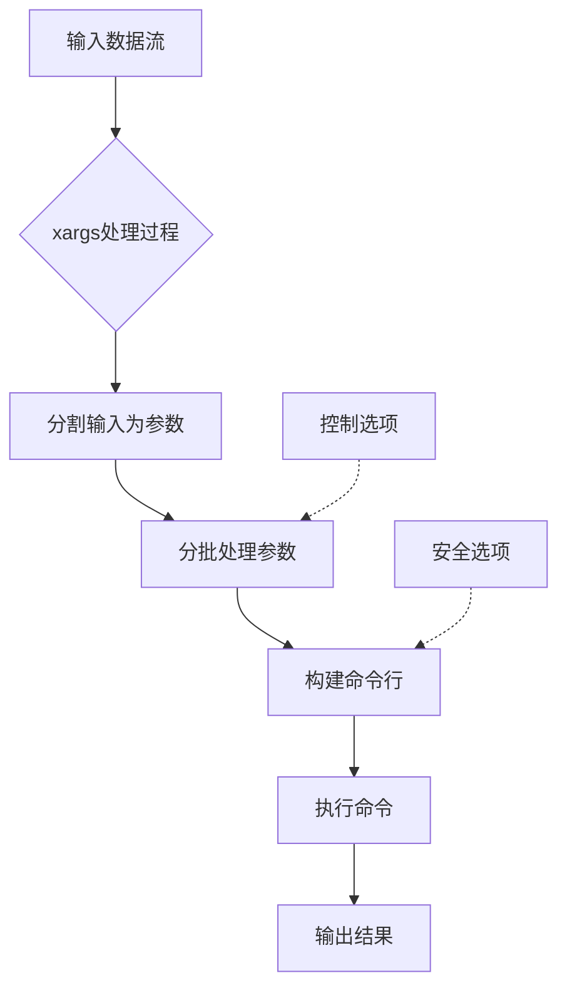
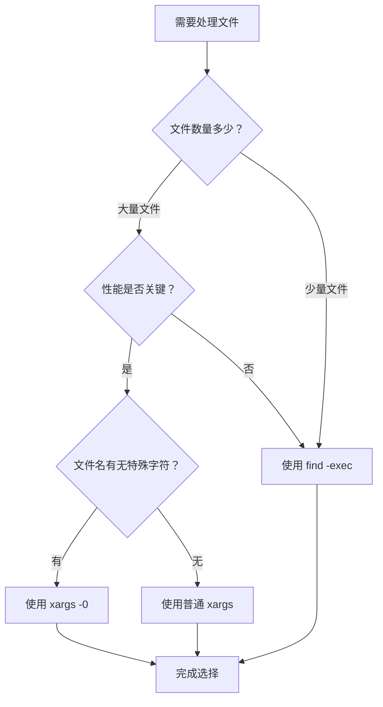

# Linux xargs命令详解：从入门到精通的高效用法指南

## 1 概述

在Linux和Unix系统管理中，我们经常会遇到需要将**一个命令的输出**作为**另一个命令的参数**进行处理的情况。而`xargs`命令正是为此而生的强大工具，它能够从标准输入读取数据流，将其解析为参数并传递给指定的命令进行执行。本文将全面深入地介绍`xargs`命令的工作原理、核心选项、实用技巧以及常见应用场景，帮助您掌握这一系统管理利器。

**xargs的设计动机**源于Unix系统对命令行参数长度的限制。当您尝试使用类似`rm *`的命令删除大量文件时，可能会遇到"参数列表过长"的错误。这是因为Unix系统对命令行参数的数量和总大小有限制（通过`ARG_MAX`常量定义），而`xargs`通过**分批处理**的方式巧妙解决了这一问题。

与Shell的反引号或`$()`命令替换相比，`xargs`具有显著优势：它不仅能够**正确处理包含空格、引号等特殊字符的文件名**，还可以通过智能分批策略**大幅提升命令执行效率**。正因如此，`xargs`成为处理大量文件或数据时的首选工具，特别适合系统管理员、开发人员和任何需要批量处理文件的用户。

## 2 xargs命令核心选项与参数详解

### 2.1 基本语法与工作流程

`xargs`命令的基本语法格式如下：
```bash
xargs [选项] [命令 [命令的初始参数]]
```
其中，`命令`部分为可选项，如果不指定，则默认使用`echo`命令。`xargs`从标准输入读取数据，按照空白字符（空格、制表符、换行符等）进行分割，然后将这些数据项作为参数传递给指定的命令。

下面通过一个Mermaid流程图来直观展示xargs的基本工作流程：



### 2.2 核心选项详解

`xargs`提供了丰富的选项来控制其行为，以下是其中最常用和重要的选项：

#### 2.2.1 控制参数数量的选项

- **`-n number`**：指定每次命令执行时使用的参数个数。例如，`echo "1 2 3 4" | xargs -n 2 echo`会生成两次调用：`echo 1 2`和`echo 3 4`。
  
- **`-L number`**：指定每次命令执行时使用的输入行数。与`-n`不同，`-L`是按行而非按空白分割的参数进行分组。例如，如果输入文件每行包含多个参数，`-L 1`会确保每行参数一起处理。

#### 2.2.2 参数替换与控制选项

- **`-I replace-str`**：定义替换字符串，`xargs`会将命令中出现该字符串的地方替换为从输入读取的参数。通常使用`{}`作为替换字符串。此选项自动隐含`-L 1`，即每行参数单独处理。例如：
```bash
find . -name "*.txt" | xargs -I {} cp {} /backup/
```
此命令会将找到的每个.txt文件复制到/backup目录，**逐个处理**，确保安全处理特殊文件名。

- **`-p`**：交互式模式，在执行每个命令前询问用户是否确认执行。这在**执行危险操作前**（如删除文件）提供了一次确认的机会。

#### 2.2.3 特殊字符处理选项

- **`-0`或`--null`**：与`-print0`选项（在`find`中）配合使用，以null字符而非换行符作为参数分隔符。这是**安全处理包含空格、引号等特殊字符文件名的关键技巧**。例如：
```bash
find . -name "*.txt" -print0 | xargs -0 rm
```
此命令能够安全删除所有.txt文件，即使文件名中包含空格。

#### 2.2.4 并行处理选项

- **`-P max-procs`**：指定**并行执行的最大进程数**，可以显著加快对大量独立项目的处理速度。默认情况下`P=1`（顺序执行）。例如，使用4个并行进程压缩图片：
```bash
find . -name "*.jpg" | xargs -P 4 -I {} convert {} -resize 50% {}
```
这对于多核系统和大批量操作可以带来显著的**性能提升**。

### 2.3 退出状态与错误处理

`xargs`的退出状态码提供了关于命令执行结果的重要信息：

- **0**：所有命令都成功执行完成
- **1-125**：部分命令执行失败或无法构建命令行
- **123**：某个命令被信号终止
- **124**：指定的命令存在但无法执行
- **125**：命令执行成功但带有非零退出状态

理解这些状态码对于编写健壮的Shell脚本和错误处理至关重要。

## 3 常见搭配与实用脚本示例

### 3.1 与find命令的绝佳搭配

`find`和`xargs`的组合是Linux系统管理中最常见且强大的模式之一，特别适用于**批量文件操作**。

#### 3.1.1 批量文件操作

```bash
# 查找并删除所有临时文件（安全版本）
find /tmp -name "*.tmp" -type f -print0 | xargs -0 rm -f

# 查找并压缩日志文件（保留原文件）
find /var/log -name "*.log" -type f -size +1M | xargs -I {} gzip {}

# 批量更改文件权限
find /home -name "*.sh" -type f | xargs chmod 755

# 查找并备份配置文件（使用-P加速）
find /etc -name "*.conf" -type f | xargs -P 4 -I {} cp {} {}.backup
```
这些示例展示了如何结合`find`的**强大查找能力**与`xargs`的**高效批处理能力**，完成日常系统管理任务。

#### 3.1.2 文件内容批量处理

```bash
# 在多个文件中搜索特定字符串
find . -name "*.java" -type f | xargs grep -l "HashMap"

# 批量替换文件中的文本内容（GNU sed版本）
find . -name "*.html" -type f -print0 | xargs -0 sed -i 's/old-text/new-text/g'

# 统计多种类型文件的行数
find src -name "*.java" -o -name "*.xml" | xargs wc -l
```
这些命令在**代码重构**、**内容管理**和**项目分析**中极为实用。

### 3.2 与grep命令的组合使用

`xargs`与`grep`的结合可以实现**跨多个文件的高效内容搜索**，是开发者和系统管理员常用的调试和分析工具。

```bash
# 在当前目录所有Python文件中搜索特定函数定义
find . -name "*.py" -type f | xargs grep -n "def calculate"

# 忽略大小写搜索，并显示匹配行号
find /var/www -name "*.php" -type f | xargs grep -ni "database_connection"

# 使用正则表达式进行复杂模式匹配
find . -name "*.md" -type f | xargs grep -E "\[[0-9]+\]"

# 仅显示包含匹配内容的文件名
find /home -name "*.txt" -type f | xargs grep -l "important_keyword"
```
这些示例体现了`xargs`在**文本处理和数据分析**中的强大能力。

### 3.3 与其他命令的创意组合

#### 3.3.1 文件列表处理

```bash
# 批量重命名文件（为所有.txt文件添加.bak后缀）
ls *.txt | xargs -I {} mv {} {}.bak

# 检查多个网站的HTTP状态码
cat urls.txt | xargs -P 10 -I {} curl -I -s -o /dev/null -w "{}: %{http_code}\n" {}

# 并行下载多个文件
cat download-list.txt | xargs -P 5 -n 1 wget

# 批量创建用户
cat usernames.txt | xargs -n 1 useradd
```
这些示例展示了`xargs`与**各种系统工具**的灵活组合能力。

#### 3.3.2 目录与权限管理

```bash
# 批量创建目录结构
echo "dir1 dir2 dir3" | xargs mkdir

# 查找并更改特定用户拥有的文件权限
find /home -user john -type f | xargs chmod 644

# 批量更改文件所有者
find /var/www -name "*.php" -type f | xargs chown www-data:www-data
```

## 4 高级技巧与常见陷阱规避

### 4.1 性能优化技巧

#### 4.1.1 合理利用并行处理（-P选项）

`xargs`的`-P`选项可以显著提升处理速度，特别是对于I/O密集型或可以并行执行的任务。

```bash
# 顺序处理（默认）
find . -name "*.log" | xargs gzip

# 并行处理（使用4个进程）
find . -name "*.log" | xargs -P 4 gzip

# 根据CPU核心数自动设置并行度
CORES=$(nproc)
find . -name "*.data" | xargs -P $CORES -I {} process_file {}
```
但需注意，**并非并行度越高越好**，过多的并行进程可能导致系统资源竞争，反而降低整体性能。

#### 4.1.2 调整批处理大小优化性能

通过`-n`选项控制每次调用命令的参数数量，可以在**进程启动开销**和**单次处理负载**之间找到平衡点。

```bash
# 每次处理100个文件（在效率和内存使用间取得平衡）
find /archive -name "*.txt" | xargs -n 100 tar -czf archive-$(date +%s).tar.gz

# 对小文件使用较大的批处理大小
find /cache -name "*.cache" -size -1k | xargs -n 500 rm
```

### 4.2 安全性与陷阱规避

#### 4.2.1 正确处理特殊字符文件名

这是`xargs`使用中最常见的陷阱之一。默认情况下，`xargs`以空白字符分隔参数，这会导致包含空格的文件名被错误分割。

**危险示例**：
```bash
# 如果文件名包含空格，此命令可能误删文件
find . -name "*.tmp" | xargs rm
```

**安全做法**：
```bash
# 使用-print0和-0正确处理特殊字符
find . -name "*.tmp" -print0 | xargs -0 rm

# 或者使用find的-exec替代简单场景
find . -name "*.tmp" -exec rm {} \;
```
对于包含引号、换行符等特殊字符的文件名，`-print0`和`-0`组合是**唯一安全的选择**。

#### 4.2.2 预防误操作的安全措施

在处理重要数据时，特别是删除操作，应采取适当的安全预防措施：

```bash
# 1. 先预览将要执行的操作
find . -name "*.bak" | xargs -p rm

# 2. 使用echo先查看生成的命令
find /data -name "core" -size +100M | xargs echo rm

# 3. 重要操作前先备份
find . -name "*.important" -print0 | xargs -0 tar -czf backup.tar.gz

# 4. 使用交互式确认(-p选项)
find /tmp -name "*.cache" -mtime +30 | xargs -p rm
```

### 4.3 xargs与find -exec的深度对比

在选择`xargs`还是`find -exec`时，需要了解它们的主要差异：

| 特性 | xargs | find -exec |
|------|-------|------------|
| **处理效率** | 单进程分批处理，高效 | 每个文件启动一个进程，较慢 |
| **安全性** | 需配合`-print0`和`-0`保证安全 | 原生安全，直接处理每个文件 |
| **灵活性** | 可与任何命令组合，非常灵活 | 只能与find找到的文件配合使用 |
| **复杂度** | 需要理解参数分割和引用 | 语法相对简单直接 |

**选择建议**：
- 处理大量文件且性能关键时，优先选择`xargs`
- 处理文件数量少或安全性为第一考量时，使用`find -exec`
- 文件名可能包含特殊字符时，使用`find -exec`或`xargs -print0 | xargs -0`

下面的Mermaid流程图展示了在面对"xargs vs find -exec"选择时的决策过程：



## 5 实战案例：自动化日志清理脚本

以下是一个结合`find`、`xargs`和`cron`的实际应用案例，展示如何创建自动化的日志清理系统。

### 5.1 完整的日志清理脚本

```bash
#!/bin/bash
# 自动化日志清理脚本
# 功能：压缩旧日志，删除过期归档文件

set -euo pipefail  # 启用严格错误处理

# 配置变量
LOG_DIR="/var/log/myapp"
BACKUP_DIR="/backup/logs"
RETENTION_DAYS=30
COMPRESS_DAYS=7

# 创建备份目录（如果不存在）
mkdir -p "$BACKUP_DIR"

echo "$(date): 开始日志清理作业"

# 1. 压缩7天前的未压缩日志
echo "压缩7天前的日志文件..."
find "$LOG_DIR" -name "*.log" -type f -mtime +$COMPRESS_DAYS | \
  xargs -I {} sh -c 'gzip -c "$1" > "$BACKUP_DIR/$(basename "$1")_$(date +%Y%m%d).gz" && rm "$1"' _ {}

# 2. 删除30天前的压缩备份
echo "删除过期备份文件..."
find "$BACKUP_DIR" -name "*.gz" -type f -mtime +$RETENTION_DAYS -print0 | \
  xargs -0 -p rm

# 3. 记录操作结果
echo "$(date): 日志清理作业完成"
COMPRESSED_COUNT=$(find "$BACKUP_DIR" -name "*.gz" -type f -mtime -1 | wc -l)
echo "今天压缩了 $COMPRESSED_COUNT 个日志文件"

# 4. 报告磁盘使用情况
echo "当前日志磁盘使用情况:"
du -sh "$LOG_DIR" "$BACKUP_DIR"
```

### 5.2 设置定时自动执行

使用`cron`设置每天自动执行清理任务：

```bash
# 编辑当前用户的cron任务
crontab -e

# 添加以下行，设置每天凌晨2点执行日志清理
0 2 * * * /path/to/log-cleanup.sh >> /var/log/log-cleanup.log 2>&1
```

### 5.3 脚本增强版：带错误处理和通知

```bash
#!/bin/bash
# 增强版日志清理脚本，带错误处理和通知

# 配置
ADMIN_EMAIL="admin@company.com"
LOG_FILE="/var/log/log-cleanup.log"
LOCK_FILE="/tmp/log-cleanup.lock"

# 错误处理函数
error_exit() {
    echo "$(date): ERROR: $1" >> "$LOG_FILE"
    echo "$1" | mail -s "日志清理任务失败" "$ADMIN_EMAIL"
    rm -f "$LOCK_FILE"
    exit 1
}

# 创建锁文件，防止并发执行
if [ -e "$LOCK_FILE" ]; then
    error_exit "清理任务已在运行中"
fi
trap 'rm -f "$LOCK_FILE"; exit' EXIT
touch "$LOCK_FILE"

# 记录开始时间
START_TIME=$(date +%s)
echo "$(date): 开始日志清理作业" >> "$LOG_FILE"

# 主要的清理逻辑（这里省略具体命令）

# 记录结束时间和统计信息
END_TIME=$(date +%s)
DURATION=$((END_TIME - START_TIME))
echo "$(date): 清理作业完成，耗时 ${DURATION} 秒" >> "$LOG_FILE"

# 发送成功通知（可选）
echo "日志清理作业于 $(date) 完成，耗时 ${DURATION} 秒" | \
  mail -s "日志清理完成通知" "$ADMIN_EMAIL"
```

此案例展示了`xargs`在**生产环境自动化任务**中的实际应用，结合了错误处理、日志记录和通知机制，是一个工业强度的解决方案。

## 6 总结

通过本文的详细讲解，我们可以看到`xargs`是Linux/Unix系统中一个极其强大和灵活的工具。正确使用`xargs`可以显著提高文件批处理的效率和安全性。

### 6.1 核心要点回顾

- **xargs的核心价值**：解决"参数列表过长"错误，实现高效批处理
- **关键安全措施**：使用`-print0`和`-0`选项处理特殊字符文件名
- **性能优化**：合理使用`-P`选项进行并行处理，调整`-n`控制批处理大小
- **实用组合**：与`find`、`grep`等命令结合形成强大的文件处理流水线
- **安全第一**：危险操作前使用`-p`确认，或先用`echo`预览命令

### 6.2 最佳实践总结表

| 场景 | 推荐命令模式 | 注意事项 |
|------|-------------|----------|
| 批量删除文件 | `find ... -print0 | xargs -0 rm` | 务必先测试 |
| 批量文件内容处理 | `find ... | xargs -I {} sed -i 's/old/new/g' {}` | 备份原文件 |
| 并行处理 | `find ... | xargs -P 4 -I {} process_file {}` | 根据CPU核心数调整 |
| 安全预览 | `find ... | xargs -p cmd` 或 `find ... | xargs echo cmd` | 防止误操作 |
| 复杂命令 | `find ... | xargs -I {} sh -c 'cmd1 {} | cmd2 > {}.out'` | 处理复杂管道 |

## 7 延伸阅读

要深入了解`xargs`及其相关工具，推荐以下资源：

1. **官方文档**
   - GNU Findutils手册（包含xargs）：`info xargs`
   - man页面：`man xargs`

2. **相关工具学习**
   - `find`命令深入指南：`man find`
   - GNU Parallel：更强大的并行处理工具

3. **推荐书籍**
   - "Linux命令行与Shell脚本编程大全"
   - "Unix环境高级编程"

4. **在线资源**
   - Linux Documentation Project (TLDP)
   - Stack Overflow的xargs相关讨论

**一句话记忆**：xargs将标准输入转换为命令行参数，通过分批处理和并行执行解决参数列表过长问题，是Linux批处理任务的利器。

希望本文能帮助您全面掌握`xargs`这一强大工具，在日常系统管理和开发工作中发挥其最大效用。