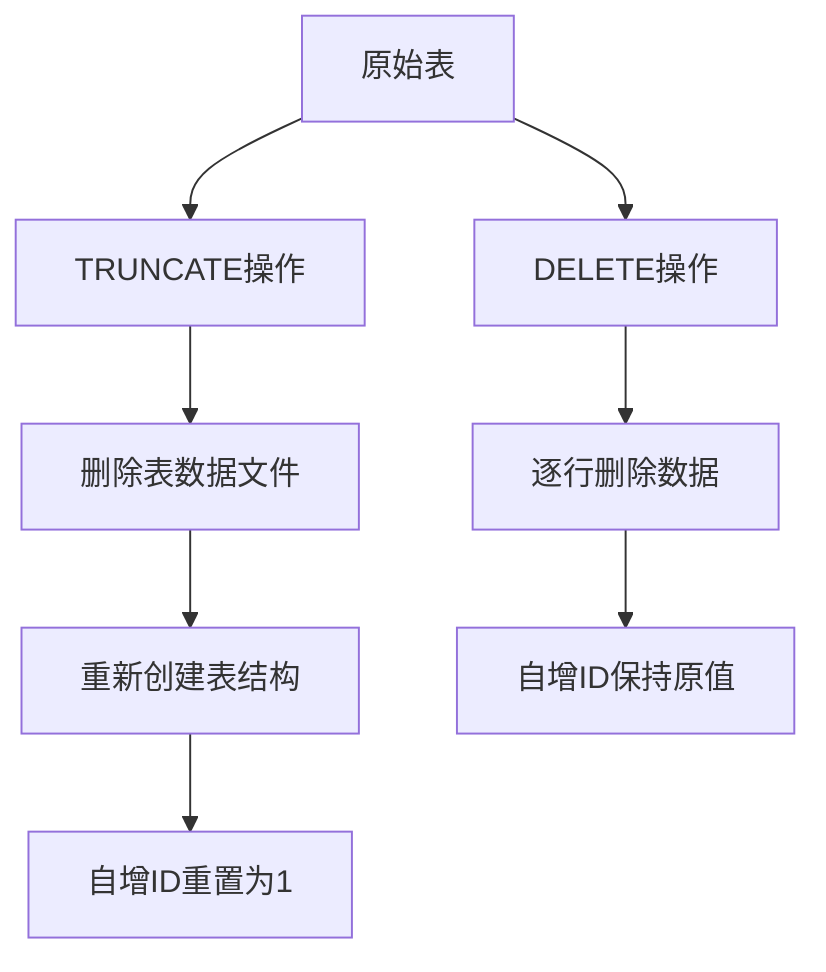

# MySQL的TRUNCATE陷阱：自增ID重置的坑与解决方案

## 开头摘要

本文深入分析MySQL中TRUNCATE操作导致自增ID重置的经典问题，探讨这一现象背后的原理及其对业务系统造成的严重影响。适合中高级MySQL开发者、DBA以及全栈开发人员阅读，帮助大家在数据库操作中避免这一常见陷阱。

## 目录

- #truncate与delete的基本区别
- #自增id重置的问题分析
- #实际应用场景与影响
- #解决方案与最佳实践
- #跨数据库对比
- #实战案例
- #总结
- #延伸阅读

## TRUNCATE与DELETE的基本区别

### 概念解释

TRUNCATE和DELETE是MySQL中两种主要的数据清空方式，但它们在实现机制和影响上存在本质区别。TRUNCATE属于DDL（数据定义语言）操作，其本质是直接删除表的数据文件并重新创建一个新表，而DELETE属于DML（数据操作语言）操作，逐行删除记录。

从历史发展来看，TRUNCATE是为了解决大规模数据删除的性能问题而引入的。在早期数据库版本中，当需要清空大表时，DELETE操作由于需要记录完整的日志和触发器等机制，性能表现较差。TRUNCATE通过绕过这些机制实现了性能的显著提升。

### 核心差异对比

```sql
-- 创建测试表
CREATE TABLE `user` (
  `id` int(11) NOT NULL AUTO_INCREMENT,
  `name` varchar(20) DEFAULT NULL,
  PRIMARY KEY (`id`)
) ENGINE=InnoDB AUTO_INCREMENT=100 DEFAULT CHARSET=utf8;

-- 插入测试数据
INSERT INTO `user` (`name`) VALUES('张三'),('李四'),('王五');

-- 使用DELETE清空表
DELETE FROM `user`;
-- 再次插入数据，id会从100开始（接着之前的自增值）
INSERT INTO `user` (`name`) VALUES('赵六');
-- 结果：id=100

-- 使用TRUNCATE清空表（先重新初始化数据）
TRUNCATE TABLE `user`;
-- 再次插入数据，id会从1开始（重置了自增值）
INSERT INTO `user` (`name`) VALUES('赵六');
-- 结果：id=1
```

### 两种操作的区别对比表

| 特性 | TRUNCATE TABLE | DELETE FROM |
|------|----------------|-------------|
| **操作类型** | DDL（数据定义语言） | DML（数据操作语言） |
| **执行速度** | 非常快 | 相对较慢（尤其是大表） |
| **事务安全性** | 无法回滚（隐式提交） | 可以回滚（在事务内） |
| **触发器** | 不触发 | 触发 |
| **自增ID** | 重置为初始值 | 不重置 |
| **磁盘空间** | 释放空间 | 不立即释放（标记为可覆盖） |
| **WHERE条件** | 不支持 | 支持 |

## 自增ID重置的问题分析

### 问题产生机制

TRUNCATE操作的自增ID重置行为源于其实现机制：它实际上是通过删除并重新创建表结构来实现数据清空的。当新表被创建时，所有表属性（包括AUTO_INCREMENT值）都会重置为初始状态。

从技术视角看，InnoDB存储引擎将自增计数器的值保存在内存中，TRUNCATE操作会直接清除这一内存值。相比之下，DELETE操作虽然删除了数据，但自增计数器的值仍然保留在内存中，不会重置。

### 问题演示

```sql
-- 创建测试表并插入数据
CREATE TABLE `product` (
  `id` int(11) NOT NULL AUTO_INCREMENT,
  `product_name` varchar(50) DEFAULT NULL,
  PRIMARY KEY (`id`)
) ENGINE=InnoDB AUTO_INCREMENT=300 DEFAULT CHARSET=utf8;

INSERT INTO `product` (`product_name`) VALUES('手机'),('电脑'),('平板');

-- 查看当前数据
SELECT * FROM `product`;
-- 结果：id分别为300, 301, 302

-- 使用TRUNCATE清空表
TRUNCATE TABLE `product`;

-- 重新插入数据
INSERT INTO `product` (`product_name`) VALUES('耳机'),('键盘');

-- 再次查看数据
SELECT * FROM `product`;
-- 结果：id分别为1, 2（自增ID已被重置）
```

### 业务影响分析

自增ID重置可能引发以下严重问题：

1. **数据不一致性**：前端应用可能存储了之前获取的ID引用，当ID重置后，这些引用将指向错误的数据或不存在的数据

2. **业务逻辑错误**：某些业务场景依赖ID的连续性或递增性，重置可能导致逻辑错误

3. **外键约束破坏**：如果该表被其他表外键引用，ID重置后新建的数据可能与原有引用关系产生冲突

## 实际应用场景与影响

### 前端报错案例

在实际开发中，经常会出现以下典型错误场景：

```sql
-- 假设有一个用户表，已有数据ID为300, 301, 302
-- 前端缓存了这些ID用于后续查询

-- 开发人员使用TRUNCATE清空表（可能为了快速清理测试数据）
TRUNCATE TABLE `users`;

-- 重新插入新数据
INSERT INTO `users` (`name`) VALUES('新用户1'),('新用户2');

-- 此时新数据的ID为1和2
-- 前端尝试使用之前缓存的ID（如300）查询用户
SELECT * FROM `users` WHERE id = 300;
-- 结果返回空，导致前端显示"not found"错误
```

### 数据库关系图示意

以下mermaid图展示了TRUNCATE操作对自增ID的影响机制：



## 解决方案与最佳实践

### 1. 根据场景选择正确的清空方法

**使用DELETE的情况：**
- 需要保留自增ID当前值的情况
- 需要支持事务回滚的数据删除操作
- 只需要删除部分数据（配合WHERE子句）
- 需要触发DELETE触发器的场景

```sql
-- 需要保留自增ID的场景示例
BEGIN;
DELETE FROM `order_log`;
-- 检查删除结果
SELECT ROW_COUNT();
-- 确认无误后提交
COMMIT;
-- 如果发现问题可以回滚
-- ROLLBACK;
```

**使用TRUNCATE的情况：**
- 需要快速清空大表且不需要恢复数据
- 明确需要重置自增ID的场景（如重新初始化系统）
- 对性能要求极高的ETL任务中间表清理

```sql
-- 适合TRUNCATE的场景：临时表或需要完全重置的表
TRUNCATE TABLE `temp_processing_data`;
```

### 2. 手动调整自增ID值

如果已经误用了TRUNCATE但需要恢复原来的自增ID序列，可以通过ALTER TABLE语句调整：

```sql
-- 误用TRUNCATE后，需要恢复自增ID到指定值
TRUNCATE TABLE `product`;
-- 将自增ID重置为特定值（如300）
ALTER TABLE `product` AUTO_INCREMENT = 300;
INSERT INTO `product` (`product_name`) VALUES('新产品');
-- 此时ID将从300开始
```

### 3. 外键约束下的特殊处理

当表存在外键约束时，TRUNCATE操作可能会失败，需要特殊处理：

```sql
-- 有外键引用的表清空方案
-- 方案1：使用DELETE（安全，但较慢）
DELETE FROM `parent_table`;

-- 方案2：禁用外键检查（快速，但有风险）
SET FOREIGN_KEY_CHECKS = 0;
TRUNCATE TABLE `parent_table`;
SET FOREIGN_KEY_CHECKS = 1;
-- 注意：需确保数据一致性
```

### 4. 预防措施与运维规范

1. **权限控制**：在生产环境中限制TRUNCATE权限，只允许特定管理员执行
2. **操作审批**：建立危险操作审批流程，TRUNCATE需经过审核
3. **备份策略**：执行任何数据清空操作前先进行备份
4. **代码审查**：在代码审查中特别注意TRUNCATE的使用场景

## 跨数据库对比

### 不同数据库中TRUNCATE的实现差异

| 数据库 | TRUNCATE行为 | 自增ID处理 | 事务支持 |
|--------|--------------|------------|----------|
| **MySQL** | 重置自增ID，快速清空 | 重置为初始值 | 隐式提交，不可回滚 |
| **PostgreSQL** | 类似DELETE，但更快 | 不重置序列 | 可回滚（在事务中） |
| **SQL Server** | 重置自增ID，快速清空 | 重置为初始值 | 可回滚（在事务中） |
| **Oracle** | 快速清空，不写日志 | 不影响序列 | 可回滚 |

值得注意的是，MySQL的TRUNCATE行为在各数据库中较为特殊，其隐式提交特性意味着即使是在事务中执行TRUNCATE，也会立即提交当前事务，导致后续回滚无效。

## 实战案例

### Spring框架中的使用示例

在基于Spring Boot的应用中，正确选择数据清空方式至关重要：

```java
@Repository
public class UserRepository {
    
    @Autowired
    private JdbcTemplate jdbcTemplate;
    
    // 不推荐：使用TRUNCATE可能导致ID重置问题
    public void clearTableWithTruncate() {
        jdbcTemplate.execute("TRUNCATE TABLE users");
        // 注意：此操作在MySQL中无法回滚
    }
    
    // 推荐：使用DELETE保持事务一致性
    @Transactional
    public void clearTableWithDelete() {
        jdbcTemplate.update("DELETE FROM users");
        // 可以回滚，且保持自增ID连续性
    }
    
    // 需要重置ID的特殊场景
    @Transactional
    public void resetTable() {
        jdbcTemplate.execute("TRUNCATE TABLE users");
        jdbcTemplate.execute("ALTER TABLE users AUTO_INCREMENT = 1000");
        // 明确重置ID到指定起始值
    }
}
```

### 数据库迁移脚本中的注意事项

在Flyway或Liquibase数据库迁移脚本中，应谨慎使用TRUNCATE：

```sql
-- 不好的实践：可能造成测试环境ID不一致
-- TRUNCATE TABLE `config`;
-- INSERT INTO `config` (`key`, `value`) VALUES ('version', '1.0');

-- 推荐的实践：使用DELETE或明确重置ID
DELETE FROM `config`;
ALTER TABLE `config` AUTO_INCREMENT = 1;
INSERT INTO `config` (`key`, `value`) VALUES ('version', '1.0');
```

## 总结

1. **根本区别**：TRUNCATE是DDL操作，快速清空表并重置自增ID；DELETE是DML操作，逐行删除且保持ID连续性

2. **核心问题**：TRUNCATE的自增ID重置特性可能导致业务逻辑错误、数据引用失效

3. **应用场景**：根据是否需要保留ID、事务支持、性能要求等因素选择合适方案

4. **最佳实践**：生产环境谨慎使用TRUNCATE，建立操作规范，重要操作前备份数据

5. **跨平台差异**：MySQL的TRUNCATE具有隐式提交特性，与其他数据库行为存在差异

## 延伸阅读

1. **官方文档**：
   - https://dev.mysql.com/doc/refman/8.0/en/truncate-table.html
   - https://dev.mysql.com/doc/refman/8.0/en/example-auto-increment.html

2. **经典书籍**：
   - 《高性能MySQL》（第4版）：第5章深入讨论存储引擎和SQL优化
   - 《MySQL技术内幕》：InnoDB存储引擎详细解析

3. **相关工具**：
   - Percona Toolkit：提供MySQL高级运维功能
   - mysqldump：备份工具，TRUNCATE前必备

## 一句话记忆

> TRUNCATE重置自增ID且不可回滚，DELETE保持ID连续性且支持事务，根据业务需求谨慎选择。