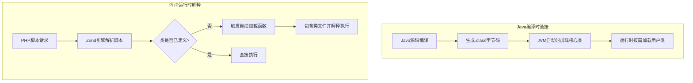
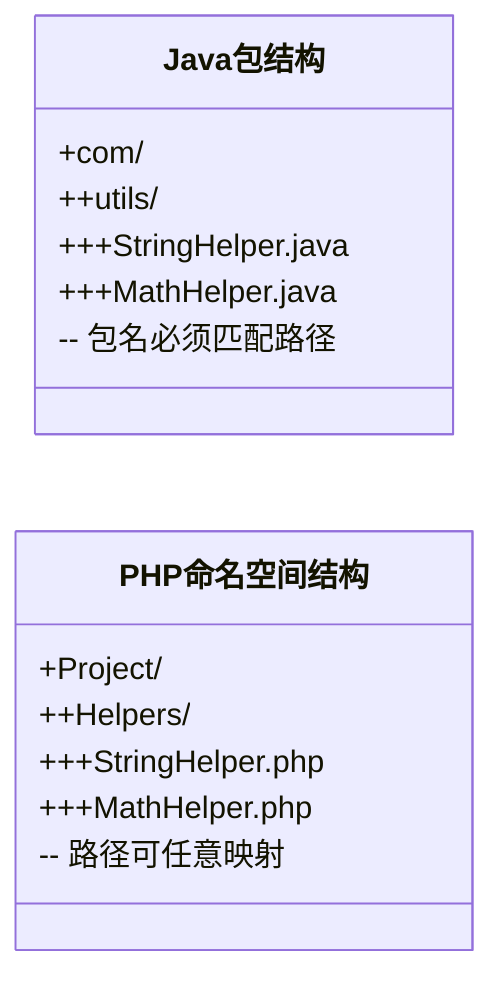
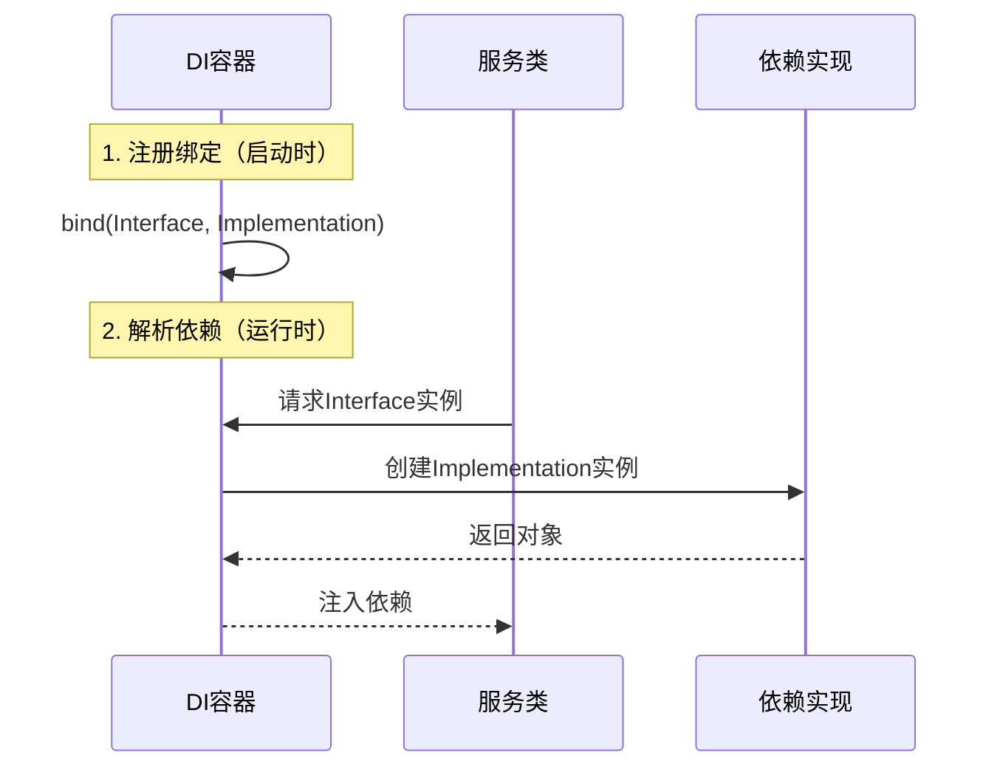

# PHP与Java类加载与依赖管理深入对比

## 开头摘要

本文深入对比PHP和Java在类加载、依赖管理和运行时处理的核心机制，帮助PHP开发者理解Java的类加载体系。通过剖析两者设计哲学、实现差异及实际应用，使PHP开发者能快速适应Java开发环境，理解JVM生态下的编程模式。适合有PHP开发经验，正在或计划学习Java的读者。

## 目录

- #类加载机制设计哲学与实现差异
- #命名空间与包代码组织方式的对比
- #依赖管理composer与maven gradle机制剖析
- #运行时依赖处理反射与依赖注入
- #实战案例laravel与spring框架对比
- #总结
- #延伸阅读
- #一句话记忆

## 类加载机制：设计哲学与实现差异

### 概念解释

类加载是面向对象语言中将类定义加载到内存并初始化的过程。Java采用**编译时链接**机制，代码先编译为字节码，由JVM在运行时按需加载类。PHP作为脚本语言，采用**运行时解释**机制，代码在每次请求时被解析执行。

Java的类加载器遵循**双亲委派模型**，防止核心类被篡改，确保安全。PHP则依赖**自动加载函数**（如`spl_autoload_register`），在类被首次使用时动态包含文件。根本差异在于：Java的类路径（classpath）在启动时确定，而PHP的文件路径在运行时解析。

### 示例代码

**Java类加载示例：**
```java
// 类路径需与文件系统路径对应：com/example/MyClass.java
package com.example;
public class MyClass {
    public void greet() {
        System.out.println("Hello from Java!");
    }
}

// 主程序中使用类
import com.example.MyClass;
public class Main {
    public static void main(String[] args) {
        MyClass obj = new MyClass(); // JVM通过类加载器查找并初始化MyClass
        obj.greet();
    }
}
```

**PHP自动加载示例：**
```php
<?php
// 注册自动加载函数（模拟Composer机制）
spl_autoload_register(function ($className) {
    $filePath = str_replace('\\', DIRECTORY_SEPARATOR, $className) . '.php';
    if (file_exists($filePath)) {
        require_once $filePath;
    }
});

// 使用类（文件位于Project/Utils/Logger.php）
use Project\Utils\Logger;
$logger = new Logger(); // 触发自动加载函数动态加载文件
$logger->log("PHP autoload demo");
?>
```

### Mermaid图：类加载流程对比



### 问题分析

- **Java类路径陷阱**：Java类必须位于classpath中，且包名需与目录结构严格匹配。常见错误如缺省包（无名包）导致类冲突。
- **PHP文件路径敏感性**：自动加载需手动处理文件路径映射。若路径错误，PHP报`Class not found`，而Java在编译时即报错。
- **性能影响**：Java类加载需JVM启动成本，但借助JIT缓存热点代码；PHP无启动成本，但每次请求需重新解释脚本（可通OPcache缓解）。

### 应用场景

- **Java适合大型系统**：类加载机制确保类型安全，便于模块化部署（如OSGi）。例如Spring Boot应用打包为JAR，内嵌Tomcat，类加载隔离依赖。
- **PHP适合快速迭代**：脚本语言特性支持热部署，上传文件即生效。虚拟主机环境中PHP占优势。

## 命名空间与包：代码组织方式的对比

### 概念解释

命名空间和包均用于解决命名冲突，但实现不同。Java的**包（package）** 既是命名空间，也是物理路径映射。一个.java文件只能属于一个包，且目录结构必须匹配包名。PHP的**命名空间（namespace）** 纯为逻辑划分，与文件路径无关，一个文件可定义多个命名空间。

设计动机上，Java包与JVM安全机制绑定，支持包级访问控制（如`protected`）。PHP命名空间更灵活，仅避免符号冲突。例如，Java中不同包的同名类需用全限定名，PHP中通过`use`别名简化。

### 示例代码

**Java包的使用：**
```java
// 文件：com/utils/StringHelper.java
package com.utils;
public class StringHelper {
    public static String reverse(String str) {
        return new StringBuilder(str).reverse().toString();
    }
}

// 主文件：Main.java
import com.utils.StringHelper; // 导入包
public class Main {
    public static void main(String[] args) {
        String result = StringHelper.reverse("Hello"); // 使用类
    }
}
```

**PHP命名空间的使用：**
```php
<?php
// 文件：Project/Helpers/StringHelper.php
namespace Project\Helpers;
class StringHelper {
    public static function reverse($str) {
        return strrev($str);
    }
}

// 同一文件可定义多个命名空间（不推荐）
namespace Project\Utils;
class Logger { /* ... */ }

// 主文件：index.php
use Project\Helpers\StringHelper;
$result = StringHelper::reverse("Hello"); // 通过use别名调用
?>
```

### Mermaid图：包/命名空间结构



### 问题分析

- **Java包的严格性**：包名需用逆域名规范（如`com.example`），路径错误导致`ClassNotFoundException`。PHP无此约束，但需自动加载器正确映射。
- **PHP多重命名空间陷阱**：一个文件多命名空间易导致维护困难，违反PSR标准。建议每文件单一命名空间。

### 应用场景

- **Java企业开发**：包用于模块化安全控制，如JDK核心类`java.lang`禁止用户重写。
- **PHP框架开发**：命名空间通过Composer实现自动加载，如Laravel的`Illuminate`系列类。

## 依赖管理：Composer与Maven/Gradle机制剖析

### 概念解释

依赖管理解决库的版本控制和自动下载。PHP的**Composer**基于PSR标准，使用`composer.json`声明依赖，生成自动加载器。Java的**Maven**（或Gradle）通过`pom.xml`管理依赖，从中央仓库下载JAR至本地仓库。

核心差异：Composer依赖安装到项目`vendor`目录，而Maven依赖缓存于用户家目录的`.m2`文件夹，支持多项目共享。Composer的自动加载动态包含PHP文件，Maven依赖在编译时被加入classpath。

### 示例代码

**Composer配置（composer.json）：**
```json
{
    "require": {
        "monolog/monolog": "^2.0"
    },
    "autoload": {
        "psr-4": {
            "Project\\": "src/"
        }
    }
}
```
执行`composer install`后，通过`require 'vendor/autoload.php'`加载依赖。

**Maven配置（pom.xml）：**
```xml
<dependencies>
    <dependency>
        <groupId>log4j</groupId>
        <artifactId>log4j</artifactId>
        <version>1.2.17</version>
    </dependency>
</dependencies>
```
Maven编译时自动下载log4j.jar并加入类路径。

### 问题分析

- **版本冲突处理**：Composer支持语义化版本（如`^1.2.3`），Maven依赖调解采用最近定义优先。PHP开发者需注意Java依赖传递性更复杂。
- **网络依赖**：两者均需中央仓库（Packagist vs Maven Central），内网环境需搭建私有仓库。

### 应用场景

- **Composer在PHP项目**：Laravel、Symfony等框架通过Composer管理组件依赖。
- **Maven在Java项目**：Spring Boot项目的`pom.xml`定义Starter依赖，简化配置。

## 运行时依赖处理：反射与依赖注入

### 概念解释

反射允许运行时检查类结构，依赖注入（DI）实现解耦。Java反射API（如`java.lang.reflect`）功能全面，但使用繁琐；PHP反射更简洁，但功能较弱。

DI容器是框架核心。Java的Spring容器通过注解（如`@Autowired`）注入依赖，编译时验证类型。PHP的Laravel容器通过服务提供者绑定接口与实现，运行时解析。关键区别：Java强类型确保注入安全，PHP动态类型需开发者手动保证。

### 示例代码

**Java反射与Spring DI：**
```java
// 反射示例
Class<?> clazz = Class.forName("com.example.UserService");
Method method = clazz.getMethod("findUser", String.class);
Object result = method.invoke(clazz.newInstance(), "admin");

// Spring DI：通过注解注入
@Service
public class UserService {
    @Autowired
    private UserRepository userRepo; // 容器自动注入实现
}
```

**PHP反射与Laravel DI：**
```php
<?php
// 反射示例
$class = new ReflectionClass('UserService');
$methods = $class->getMethods();
foreach ($methods as $method) {
    echo $method->getName();
}

// Laravel DI：绑定接口与实现
app()->bind(UserRepositoryInterface::class, MySqlUserRepository::class);
$userService = app()->make(UserService::class); // 自动解析依赖
?>
```

### Mermaid图：依赖注入流程



### 问题分析

- **Java类型安全**：编译时检查依赖是否可满足，避免运行时错误。PHP需通过测试保障。
- **循环依赖**：两者均需避免。Spring抛出`BeanCurrentlyInCreationException`，Laravel通过上下文绑定解决。

### 应用场景

- **Java Spring生态**：反射用于AOP代理，DI管理Bean生命周期。
- **PHP框架**：反射用于路由注解解析，DI实现服务容器。

## 实战案例：Laravel与Spring框架对比

### 案例背景

以用户注册功能为例，对比Laravel（PHP）和Spring Boot（Java）的类加载与依赖处理。

**Laravel实现（简化）：**
- 依赖管理：`composer.json`定义`illuminate/database`依赖。
- 自动加载：通过`vendor/autoload.php`加载Composer生成的加载器。
- DI容器：`UserController`的依赖通过服务提供者自动注入。
```php
// 控制器
class UserController extends Controller {
    public function __construct(private UserService $userService) {} // 自动注入
    public function store(Request $request) {
        $this->userService->create($request->all());
    }
}
```

**Spring Boot实现（简化）：**
- 依赖管理：`pom.xml`引入`spring-boot-starter-web`。
- 类加载：启动时扫描`@Component`注解的类，加载至ApplicationContext。
- DI容器：`@Service`类被注入到Controller。
```java
@RestController
public class UserController {
    @Autowired
    private UserService userService; // 容器注入

    @PostMapping("/users")
    public void createUser(@RequestBody User user) {
        userService.create(user);
    }
}
```

### 关键差异分析

- **启动方式**：Spring Boot需编译为JAR，通过`java -jar`启动；Laravel直接通过Web服务器访问。
- **配置方式**：Java依赖注解和编译时检查；PHP多用配置文件和运行时绑定。

## 总结

- **类加载本质**：Java是编译时链接的静态语言，PHP是运行时解释的动态语言。JVM类加载器确保安全，PHP自动加载提供灵活度。
- **代码组织**：Java包强制路径映射，支持访问控制；PHP命名空间仅逻辑划分，需借助Composer实现自动加载。
- **依赖管理**：Composer和Maven均解决依赖下载，但Java编译时加入classpath，PHP运行时动态包含。
- **运行时处理**：Java反射和DI容器类型安全，PHP更灵活但需测试保障。
- **适用场景**：Java适合长期维护的大型系统，PHP适合快速迭代的Web项目。

## 延伸阅读

1. **官方文档**：
   - https://docs.oracle.com/javase/specs/jvms/se17/html/jvms-5.html
   - https://www.php.net/manual/zh/language.namespaces.php
   - https://getcomposer.org/doc/
2. **经典书籍**：
   - 《深入理解Java虚拟机》（周志明）
   - 《Modern PHP》（Josh Lockhart）
3. **源码参考**：
   - https://github.com/openjdk/jdk
   - https://github.com/composer/composer

## 一句话记忆

Java的类加载是“先编译后执行”的严格体系，而PHP是“即写即用”的灵活模式，理解JVM的路径绑定和类型安全是PHP开发者转型的关键。