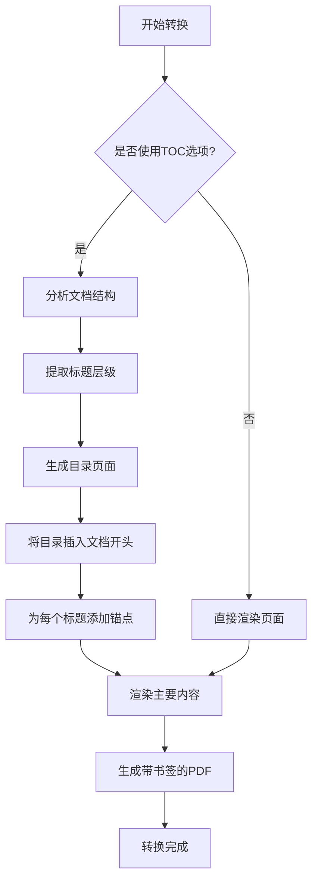

# wkhtmltopdf 完整使用指南：从基础到高级技巧

## 1 wkhtmltopdf 简介

wkhtmltopdf 是一个开源（LGPLv3 协议）的命令行工具，用于将 HTML 文档转换为 PDF 格式，同时还支持将 HTML 转换为各种图像格式。该工具基于 Qt WebKit 渲染引擎，能够在无界面（headless）环境下运行，不需要显示服务或图形界面支持。这意味着它可以在服务器环境中稳定工作，为 Web 应用提供强大的 PDF 生成能力。

与许多基于 Gecko 或 Trident 引擎的 HTML 转 PDF 工具不同，wkhtmltopdf 使用与 Safari 和早期 Chrome 浏览器相同的 WebKit 引擎，这确保了它对现代 Web 标准的良好支持。工具采用 C++编写，并提供了 C 库接口，允许开发者进行更深层次的集成和定制。除了主要的 wkhtmltopdf 工具外，项目还包含 wkhtmltoimage 用于生成图像截图，满足不同场景下的需求。

wkhtmltopdf 的核心优势在于其**高质量的输出保真度**，能够将 CSS 样式、JavaScript 生成的动态内容以及 SVG 图像等复杂内容准确呈现在 PDF 中。不同于简单的 HTML 到 PDF 转换，它实际上是一个**无头浏览器**，能够执行页面中的 JavaScript 代码，并在完成所有动态操作后执行渲染，这对于单页面应用(SPA)或富含交互内容的页面特别有用。

在实际应用中，wkhtmltopdf 被广泛用于生成发票、报告、文档存档、电子书等多种场景。许多流行的 Web 框架（如 Django、Rails）都有集成了 wkhtmltopdf 的插件或插件，使其成为 Web 开发中生成 PDF 的首选方案之一。

## 2 安装与配置

### 2.1 系统要求与下载

wkhtmltopdf 支持所有主流操作系统，包括 Windows、Linux 和 macOS。在选择版本时，应注意选择稳定版本以获得最佳兼容性。官方下载页面提供了多种预编译二进制文件，用户可根据自己的操作系统和架构选择合适版本。

对于 Linux 用户，除了下载预编译的二进制文件外，还可以通过包管理器安装。例如，在 CentOS/RHEL 系统上，可以使用 RPM 包进行安装；而在 Debian/Ubuntu 系统上，则可以使用 DEB 包。Windows 用户可以直接下载 EXE 安装程序，按照图形界面指引完成安装。

### 2.2 详细安装步骤

**Windows 系统安装**：下载 Windows 安装包后，直接运行 EXE 文件并按照向导完成安装。安装完成后，需要将安装路径（通常是"bin"文件夹）添加到系统环境变量 PATH 中。具体步骤为：右键"此电脑"→"属性"→"高级系统设置"→"环境变量"，在系统变量中找到 Path，编辑并添加 wkhtmltopdf 的 bin 目录路径。完成设置后，重新打开命令提示符，输入`wkhtmltopdf --version`验证安装成功。

**Linux 系统安装**：对于基于 Debian 的系统（如 Ubuntu），可以使用以下命令安装：

```bash
sudo apt-get update
sudo apt-get install wkhtmltopdf
```

对于基于 RHEL 的系统（如 CentOS），首先需要安装依赖项：

```bash
sudo yum install libX11 libXrender libXext libjpeg xorg-x11-fonts-75dpi xorg-x11-fonts-Type1
```

然后下载并安装 RPM 包：

```bash
sudo rpm -ivh wkhtmltox-0.12.6-1.centos7.x86_64.rpm
```

对于通过 tar 包安装的方式，先下载对应架构的 tar 包，解压后将可执行文件复制到系统路径：

```bash
wget https://github.com/wkhtmltopdf/packaging/releases/download/0.12.6-1/wkhtmltox-0.12.6-1.centos7.x86_64.rpm
sudo tar -xvf wkhtmltox-0.12.6-1.centos7.x86_64.rpm
sudo cp wkhtmltox/bin/wkhtmltopdf /usr/bin/
```

**验证安装**：无论哪种安装方式，安装完成后都应在终端中运行`wkhtmltopdf --version`命令，确认正确显示版本信息，表明安装成功。

### 2.3 字体配置

为了确保 PDF 中文字的正确显示，特别是中文字符，需要配置系统字体。在 Linux 系统中，可能需要额外安装中文字体包。对于中文内容，可以将 Windows 系统中的 SimSun、MS YaHei 等中文字体复制到 Linux 系统的`/usr/share/fonts/`目录下，然后更新字体缓存：

```bash
sudo fc-cache -fv
```

在 HTML 文档中，也应确保指定正确的字符编码：

```html
<meta http-equiv="content-type" content="text/html;charset=utf-8" />
```

这样可以避免因编码问题导致的乱码情况。

## 3 基础使用与核心功能

### 3.1 基本命令格式

wkhtmltopdf 的基本命令格式非常直观，主要由工具路径、选项参数、输入源和输出目标组成：

```bash
wkhtmltopdf [OPTIONS] <input> <output>
```

其中，`<input>` 可以是一个 URL、本地 HTML 文件路径，或者是标准的 HTML 输入（使用`-`表示从标准输入读取）。`<output>` 指定生成的 PDF 文件路径。例如，将百度首页转换为 PDF 的基本命令如下：

```bash
wkhtmltopdf https://www.baidu.com baidu.pdf
```

将本地 HTML 文件转换为 PDF 的命令为：

```bash
wkhtmltopdf example.html example.pdf
```

### 3.2 常用命令行参数详解

wkhtmltopdf 提供了丰富的命令行参数，让用户可以精细控制 PDF 输出的各个方面：

**页面布局相关参数**：

- `--page-size <size>`：设置纸张大小，如 A4、A3、Letter 等（默认为 A4）
- `--orientation <Orientation>`：设置页面方向，Landscape 为横向，Portrait 为纵向
- `--margin-top <unit>`、`--margin-bottom <unit>`、`--margin-left <unit>`、`--margin-right <unit>`：设置页边距，单位可以是 mm、cm、in 等
- `-T <mm>`、`-B <mm>`、`-L <mm>`、`-R <mm>`：分别设置上、下、左、右边距的简写形式

**内容控制参数**：

- `--encoding <encoding>`：设置输入 HTML 的字符编码（如 utf-8）
- `--disable-external-links`：禁止生成指向外部网页的链接
- `--disable-internal-links`：禁止生成内部链接（锚点链接）
- `--disable-javascript`：禁止页面执行 JavaScript
- `--enable-plugins`：启用浏览器插件（如 Flash）
- `--disable-smart-shrinking`：禁用 WebKit 的智能缩放功能
- `--zoom <factor>`：设置缩放比例（默认 1）

**页眉页脚参数**：
wkhtmltopdf 允许在 PDF 的页眉和页脚添加丰富的内容，包括文本、页码、文档标题等：

```bash
wkhtmltopdf --header-left "公司报告" --header-center "第[page]页" --header-right "机密文件" \
--footer-center "版权所有 © 2023" https://example.com report.pdf
```

在页眉页脚中可以使用以下特殊变量：

- `[page]`：当前页码
- `[frompage]`：起始页码
- `[topage]`：结束页码
- `[webpage]`：当前页面的 URL
- `[section]`：当前章节名称
- `[subsection]`：当前子章节名称
- `[date]`：当前日期（系统本地格式）
- `[time]`：当前时间（系统本地格式）

### 3.3 生成目录（TOC）

wkhtmltopdf 强大的目录生成功能可以自动分析文档结构，创建带有层级关系的书签。使用`--toc`选项可以启用目录生成：

```bash
wkhtmltopdf --toc http://example.com/long-document document-with-toc.pdf
```

目录生成的相关选项非常丰富：

- `--toc-depth <level>`：设置目录包含的标题层级深度（默认 3 级）
- `--toc-header-text <text>`：设置目录页的标题文本
- `--toc-level-indentation <unit>`：设置各级目录的缩进量
- `--toc-text-size-shrink <factor>`：设置目录文字缩小的比例
- `--toc-l1-font-size <size>`：设置一级标题的字体大小
- `--toc-l2-font-size <size>`：设置二级标题的字体大小



### 3.4 高级页面控制

对于复杂的文档布局，wkhtmltopdf 提供了封面和封底的支持。可以使用`--cover`选项指定一个 HTML 文件作为封面，该封面会独立成页，不包含页眉页脚：

```bash
wkhtmltopdf --cover cover.html toc --toc-header-text "目录" content.html output.pdf
```

此外，还可以使用`--page-offset`选项设置起始页码偏移，这对于将多个文档合并为一个 PDF 时非常有用。`--disable-dotted-lines`选项可以去除目录中的点线，使外观更加简洁。

## 4 高级应用技巧

### 4.1 分页控制技巧

在将长 HTML 文档转换为 PDF 时，合理的分页控制至关重要。wkhtmltopdf 支持通过 CSS 样式控制分页行为，确保内容在合适的位置分页。

**强制分页**：在需要分页的 HTML 元素上添加`page-break-before: always;`或`page-break-after: always;`样式，可以在该元素前或后强制分页：

```html
<div style="page-break-after: always;"></div>
<!-- 在此元素后分页 -->
<h2 style="page-break-before: always;">新章节</h2>
<!-- 在此元素前分页 -->
```

**避免内容被分割**：使用`page-break-inside: avoid;`可以防止元素内容被分割到两页：

```css
.chapter {
  page-break-inside: avoid;
}
```

**表格分页处理**：对于跨页的长表格，可以通过 CSS 确保表头在每页重复显示：

```css
thead {
  display: table-header-group;
}
tbody tr {
  page-break-inside: avoid;
}
```

需要注意的是，在某些情况下，表格中使用`thead`标签可能导致分页时出现重复表头的问题。此时，可以考虑使用`display: table-header-group;`样式来替代。

### 4.2 水印添加技术

为 PDF 添加水印可以通过两种方式实现：在转换前修改 HTML 内容，或在转换后处理 PDF 文件。

**转换前添加水印**：通过在 HTML 中添加水印层，利用 CSS 实现水印效果：

```html
<!DOCTYPE html>
<html>
  <head>
    <style>
      .watermark {
        position: fixed;
        top: 50%;
        left: 50%;
        transform: translate(-50%, -50%) rotate(-45deg);
        font-size: 60px;
        color: rgba(0, 0, 0, 0.1);
        z-index: 9999;
        pointer-events: none;
      }
    </style>
  </head>
  <body>
    <div class="watermark">机密文件</div>
    <!-- 页面主要内容 -->
  </body>
</html>
```

**转换后添加水印（使用 Java+iText）**：通过编程方式为已生成的 PDF 添加水印，这种方法更灵活可靠：

```java
public static void setWatermark(String input, String output, String watermarkText)
    throws DocumentException, IOException {
    PdfReader reader = new PdfReader(input);
    PdfStamper stamper = new PdfStamper(reader, new FileOutputStream(output));

    // 创建字体
    BaseFont baseFont = BaseFont.createFont("STSong-Light", "UniGB-UCS2-H", BaseFont.EMBEDDED);

    // 设置水印透明度
    PdfGState gs = new PdfGState();
    gs.setFillOpacity(0.2f);

    int totalPages = reader.getNumberOfPages();
    for (int i = 1; i <= totalPages; i++) {
        // 获取页面尺寸
        Rectangle pageSize = reader.getPageSize(i);
        float width = pageSize.getWidth();
        float height = pageSize.getHeight();

        // 获取水印层
        PdfContentByte content = stamper.getOverContent(i);
        content.saveState();
        content.setGState(gs);
        content.beginText();
        content.setFontAndSize(baseFont, 50);
        content.setColorFill(Color.GRAY);

        // 计算水印位置（居中）
        float x = width / 2;
        float y = height / 2;
        content.showTextAligned(Element.ALIGN_CENTER, watermarkText, x, y, 45);
        content.endText();
        content.restoreState();
    }
    stamper.close();
    reader.close();
}
```

对于中文水印，在 Linux 环境下可能会遇到字体识别问题。解决方案是使用图片水印替代文字水印，或者确保系统中已安装正确的中文字体。

### 4.3 多文件合并与批量处理

wkhtmltopdf 天然支持将多个输入源合并为一个 PDF 文件。只需在命令中依次列出所有输入文件和最终的输出文件即可：

```bash
wkhtmltopdf cover.html toc content1.html content2.html content3.html appendix.html full-document.pdf
```

对于批量转换大量 HTML 文件，可以结合 Shell 脚本或 PowerShell 实现自动化处理：

**Linux Shell 脚本示例**：

```bash
#!/bin/bash
OUTPUT_DIR="./pdf_output"
mkdir -p $OUTPUT_DIR

for file in *.html; do
    filename=$(basename "$file" .html)
    wkhtmltopdf --encoding utf-8 "$file" "$OUTPUT_DIR/$filename.pdf"
done

echo "批量转换完成"
```

**Windows PowerShell 脚本示例**：

```powershell
Get-ChildItem *.html | ForEach-Object -Process {
    $newname = ($_.name.Split(".")[0] + '.pdf')
    wkhtmltopdf --encoding utf8 $_.name $newname
}
```

对于更复杂的合并需求，如需要动态调整页面顺序或添加分隔页，可以先用 wkhtmltopdf 生成各个部分的 PDF，再使用 PDF 处理库（如 iText、PyPDF2）进行精细合并。

## 5 编程语言集成

### 5.1 Java 集成示例

在 Java 应用中集成 wkhtmltopdf，可以通过`Runtime.getRuntime().exec()`方法执行命令行转换。以下是完整的工具类示例：

```java
public class WkHtmlToPdfUtil {

    /**
     * HTML转PDF
     * @param srcPath 输入HTML路径（URL或文件路径）
     * @param destPath 输出PDF路径
     * @return 转换是否成功
     */
    public static boolean convert(String srcPath, String destPath) {
        StringBuilder cmd = new StringBuilder();
        // 根据操作系统选择执行路径
        if (System.getProperty("os.name").contains("Windows")) {
            cmd.append("C:\\Program Files\\wkhtmltopdf\\bin\\wkhtmltopdf.exe");
        } else {
            cmd.append("/usr/local/bin/wkhtmltopdf");
        }

        // 添加常用参数
        cmd.append(" --page-size A4");
        cmd.append(" --margin-top 15mm");
        cmd.append(" --margin-bottom 15mm");
        cmd.append(" --margin-left 10mm");
        cmd.append(" --margin-right 10mm");
        cmd.append(" --encoding UTF-8");

        cmd.append(" ").append(srcPath).append(" ").append(destPath);

        try {
            Process process = Runtime.getRuntime().exec(cmd.toString());

            // 处理输出流，避免阻塞
            StreamGobbler errorGobbler = new StreamGobbler(process.getErrorStream(), "ERROR");
            StreamGobbler outputGobbler = new StreamGobbler(process.getInputStream(), "OUTPUT");
            errorGobbler.start();
            outputGobbler.start();

            int exitCode = process.waitFor();
            return exitCode == 0;
        } catch (Exception e) {
            e.printStackTrace();
            return false;
        }
    }

    /**
     * 处理进程输出流的内部类
     */
    static class StreamGobbler extends Thread {
        InputStream is;
        String type;

        StreamGobbler(InputStream is, String type) {
            this.is = is;
            this.type = type;
        }

        public void run() {
            try (InputStreamReader isr = new InputStreamReader(is);
                 BufferedReader br = new BufferedReader(isr)) {
                String line;
                while ((line = br.readLine()) != null) {
                    System.out.println(type + "> " + line);
                }
            } catch (IOException e) {
                e.printStackTrace();
            }
        }
    }
}
```

**解决进程阻塞问题**：在使用 Java 调用 wkhtmltopdf 时，常见的问题是进程阻塞导致无法完成转换。这是因为进程的输出流和错误流没有被及时处理。解决方案是使用单独的线程处理这些流，如上述代码所示。

### 5.2 Python 集成示例

Python 可以通过`pdfkit`库（wkhtmltopdf 的包装器）或`subprocess`模块调用 wkhtmltopdf。

**使用 pdfkit 库**：

```python
import pdfkit

# 配置wkhtmltopdf路径
config = pdfkit.configuration(wkhtmltopdf='/usr/local/bin/wkhtmltopdf')

# 基本转换
pdfkit.from_url('http://example.com', 'output.pdf', configuration=config)

# 使用选项转换
options = {
    'page-size': 'A4',
    'margin-top': '0.75in',
    'margin-right': '0.75in',
    'margin-bottom': '0.75in',
    'margin-left': '0.75in',
    'encoding': "UTF-8",
    'header-center': '报表标题',
    'footer-center': '第[page]页/共[topage]页'
}

pdfkit.from_file('input.html', 'output.pdf', options=options, configuration=config)
```

**使用 subprocess 模块**：

```python
import subprocess
import os

def html_to_pdf(source_html, output_pdf):
    # 构建命令
    cmd = ['wkhtmltopdf', '--encoding', 'utf-8', '--quality', '100']

    # 添加选项
    cmd.extend(['--margin-top', '15mm'])
    cmd.extend(['--margin-bottom', '15mm'])
    cmd.extend(['--margin-left', '10mm'])
    cmd.extend(['--margin-right', '10mm'])

    cmd.append(source_html)
    cmd.append(output_pdf)

    try:
        # 执行转换
        result = subprocess.run(cmd, capture_output=True, text=True, check=True)
        print("转换成功")
        return True
    except subprocess.CalledProcessError as e:
        print(f"转换失败: {e.stderr}")
        return False

# 使用示例
html_to_pdf('input.html', 'output.pdf')
```

### 5.3 C#集成示例

在 C#应用中，可以通过`Process`类调用 wkhtmltopdf：

```csharp
using System;
using System.Diagnostics;
using System.IO;

public class PdfGenerator
{
    public bool GeneratePdf(string htmlPath, string pdfPath)
    {
        // 验证输入文件是否存在
        if (!File.Exists(htmlPath))
        {
            throw new FileNotFoundException("HTML文件不存在", htmlPath);
        }

        // 创建输出目录
        string outputDir = Path.GetDirectoryName(pdfPath);
        if (!Directory.Exists(outputDir))
        {
            Directory.CreateDirectory(outputDir);
        }

        // 构建命令参数
        string parameters = $@"--page-size A4 --margin-top 15 --margin-bottom 15 --margin-left 10 --margin-right 10 --encoding UTF-8 ""{htmlPath}"" ""{pdfPath}""";

        ProcessStartInfo startInfo = new ProcessStartInfo
        {
            FileName = "wkhtmltopdf.exe",
            Arguments = parameters,
            UseShellExecute = false,
            CreateNoWindow = true,
            RedirectStandardOutput = true,
            RedirectStandardError = true
        };

        try
        {
            using (Process process = Process.Start(startInfo))
            {
                // 读取输出流
                string output = process.StandardOutput.ReadToEnd();
                string errors = process.StandardError.ReadToEnd();

                process.WaitForExit();

                if (process.ExitCode != 0)
                {
                    Console.WriteLine($"错误: {errors}");
                    return false;
                }

                Console.WriteLine("PDF生成成功");
                return true;
            }
        }
        catch (Exception ex)
        {
            Console.WriteLine($"异常: {ex.Message}");
            return false;
        }
    }
}
```

## 6 常见问题与解决方案

### 6.1 中文乱码问题

中文乱码是 wkhtmltopdf 使用中最常见的问题之一，主要由字体缺失或编码设置不正确引起。

**解决方案**：

1. **确保 HTML 文档指定正确的编码**：

```html
<meta http-equiv="Content-Type" content="text/html; charset=utf-8" />
```

2. **在命令行中明确指定编码**：

```bash
wkhtmltopdf --encoding UTF-8 input.html output.pdf
```

3. **安装中文字体**：

   - **Windows**：确保系统已安装所需的中文字体
   - **Linux**：将中文字体文件复制到`/usr/share/fonts/`目录，然后更新字体缓存：

   ```bash
   sudo cp simsun.ttf /usr/share/fonts/
   sudo fc-cache -fv
   ```

4. **在 CSS 中指定字体族**：

```css
body {
  font-family: "SimSun", "Microsoft YaHei", sans-serif;
}
```

### 6.2 样式和脚本支持限制

wkhtmltopdf 基于较旧的 WebKit 引擎，对现代 CSS3 和 ES6+特性支持有限。

**不支持的 CSS 特性**：

- `display: flex`（Flexbox 布局）
- `display: grid`（Grid 布局）
- CSS Transforms（`transform`属性）
- CSS Transitions（过渡动画）
- CSS Animations（关键帧动画）
- `position: sticky`（粘性定位）

**不支持的 JavaScript 特性**：

- ES6+语法（箭头函数、let/const、模板字符串等）
- 现代浏览器 API（Fetch、Promise 等）
- 部分数组方法（如`includes`、`forEach`在某些版本中可能有问题）

**兼容性解决方案**：

1. **使用传统的 CSS 布局**：优先使用 float、inline-block 和传统盒模型
2. **降级 JavaScript 代码**：使用 Babel 等工具将 ES6+代码转译为 ES5
3. **避免现代 API**：使用 XMLHttpRequest 替代 Fetch，回调函数替代 Promise
4. **全面测试**：在实际使用前充分测试所有功能

### 6.3 性能优化与故障排除

**性能优化建议**：

1. **减少外部资源**：尽量减少页面中的外部资源（图片、CSS、JS）数量
2. **使用本地资源**：将外部资源下载到本地，使用相对路径引用
3. **设置超时时间**：使用`--javascript-delay`参数给 JS 执行留出足够时间
4. **禁用不必要的功能**：如不需要 JS，使用`--disable-javascript`提升性能

**常见错误及解决**：

1. **进程挂起/阻塞**：确保正确处理标准输出和错误流
2. **内存不足**：对于大文档，适当增加 JVM 内存或使用分块处理
3. **权限问题**：确保 wkhtmltopdf 有足够的文件系统访问权限
4. **路径问题**：使用绝对路径而非相对路径，避免路径解析错误

**调试技巧**：

1. **启用详细日志**：添加`--debug`参数获取详细输出
2. **分阶段测试**：先测试简单 HTML，逐步增加复杂度
3. **使用浏览器验证**：先用 Chrome 浏览器查看 HTML 显示是否正常
4. **检查控制台错误**：通过开发者工具检查浏览器控制台是否有 JS 错误

## 7 总结

wkhtmltopdf 作为一个基于 WebKit 引擎的 HTML 转 PDF 工具，在保真度和兼容性方面表现出色，特别适合需要高精度还原 Web 页面样式的场景。通过本文介绍的安装配置、基础使用、高级技巧和编程集成方法，读者应能全面掌握这一强大工具的应用。

虽然 wkhtmltopdf 对最新 Web 标准的支持存在一定局限，且项目活跃度有所降低，但在许多传统业务场景中，它仍然是生成高质量 PDF 的首选方案。通过合理的兼容性处理和故障排除，可以解决大部分使用中遇到的问题。

对于需要更高性能或更现代标准支持的项目，可以考虑像 Puppeteer、Playwright 这样的无头浏览器方案，但 wkhtmltopdf 在简单性、资源消耗和部署便利性方面仍具有明显优势，值得在合适的项目中采用。

### 延伸阅读

- 官方文档：http://wkhtmltopdf.org/usage/wkhtmltopdf.txt
- 项目源码：https://github.com/wkhtmltopdf/wkhtmltopdf
- 完整选项说明：https://wkhtmltopdf.org/usage/wkhtmltopdf.txt

### 一句话记忆

wkhtmltopdf 通过 WebKit 引擎将 HTML 精准转换为 PDF，虽对现代 Web 标准支持有限，但通过合理配置和兼容性处理，仍是高质量 PDF 生成的可靠选择。
帮我再优化或者再深入一些
