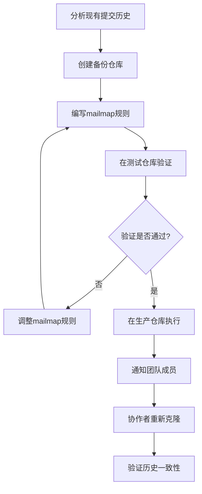

# Git 历史重构利器：使用 mailmap 与 filter-repo 统一提交者信息

## 摘要

在团队协作的 Git 项目中，我们经常会遇到提交历史中作者信息混乱的问题——同一贡献者使用多个姓名或邮箱地址，导致历史记录难以追踪。本文将深入解析如何利用`git filter-repo --force --mailmap .mailmap`命令，结合 mailmap 文件批量规范化 Git 历史提交信息，提升仓库历史的清晰度和可维护性。适合需要清理提交历史、统一团队标识或准备开源项目的开发者阅读。

## 目录

- #git 历史重构利器使用 mailmap 与 filter-repo 统一提交者信息
  - #摘要
  - #目录
  - #正文
    - #问题背景为什么需要统一提交信息
    - #mailmap 文件标准化提交信息的核心
    - #git-filter-repo 历史重写的工业级工具
    - #命令深入解析--force---mailmap-mailmap
    - #实战案例企业项目历史清理
    - #注意事项与风险控制
  - #总结
  - #延伸阅读
  - #一句话记忆

## 正文

### 问题背景：为什么需要统一提交信息

在真实的软件开发过程中，同一开发者可能使用不同的身份信息进行提交：公司邮箱与个人邮箱混用、姓名拼写不一致（如"张三"、"张叁"、"zhang san"）、用户名缩写变化等。这种混乱不仅影响历史追踪，还会在统计贡献量时造成偏差。

Git 虽然记录了每次提交的原始作者信息，但提供了一种标准化机制——mailmap 文件。通过合理的配置，可以将不同的署名映射到统一标识，让历史记录更加清晰整洁。

### mailmap 文件：标准化提交信息的核心

mailmap 文件是一个纯文本文件，遵循特定格式，用于将多个作者标识映射到规范形式。其基本语法规则如下：

```
规范名称 <规范邮箱> 其他名称 <其他邮箱>
```

实际示例：

```
张三 <zhang.san@company.com> zhangsan <zs@personal.com>
张三 <zhang.san@company.com> 张叁 <san.zhang@old-company.com>
李四 <li.si@company.com> lisi <lisi123@gmail.com>
```

mailmap 支持多种映射模式：

- **姓名+邮箱映射**：最完整的映射方式，同时匹配姓名和邮箱
- **仅姓名映射**：统一不同拼写的姓名
- **仅邮箱映射**：将多个邮箱映射到同一规范邮箱

```bash
# 查看应用mailmap后的历史记录
git log --use-mailmap
```

通过 mailmap，我们可以将分散的提交信息聚合到统一的身份下，为后续的历史重写操作奠定基础。

### git-filter-repo：历史重写的工业级工具

git-filter-repo 是 Git 官方推荐的历史修改工具，相比传统的 filter-branch 具有显著优势。它采用流式处理架构，内存占用降低 90%以上，处理速度提升 10-100 倍。

**核心特性对比**：
| 特性 | git-filter-branch | git-filter-repo |
|------|-------------------|-----------------|
| 处理速度 | 慢（小型仓库 30-60 秒） | 快（小型仓库 3-5 秒） |
| 内存占用 | 高 | 降低 90%以上 |
| 安全性 | 易出错 | 内置多重检查 |
| 易用性 | 复杂脚本 | 简单命令接口 |

git-filter-repo 提供多种回调函数用于修改提交元数据，其中`--mailmap`参数专门用于批量应用 mailmap 映射规则。

### 命令深入解析：--force --mailmap .mailmap

`git filter-repo --force --mailmap .mailmap`命令的各部分作用如下：

**--mailmap .mailmap**：

- 指定使用当前目录下的.mailmap 文件
- 读取文件中的映射规则，重写所有提交的作者/提交者信息
- 保持提交内容不变，仅修改提交元数据

**--force**：

- 跳过安全检查，强制在非全新克隆的仓库上执行操作
- 删除所有现有的 remote 关联（重要副作用）
- 必要但需谨慎使用，因为历史重写会影响所有协作者

**重要提示**：执行此命令后，必须手动重新添加远程仓库关联并使用`--set-upstream`参数设置分支追踪关系。

```bash
# 完整执行流程
# 1. 创建.mailmap文件
cat > .mailmap << EOF
张三 <zhang.san@company.com> zhangsan <zs@personal.com>
李四 <li.si@company.com> lisi <lisi123@gmail.com>
EOF

# 2. 执行历史重写（会删除remote关联）
git filter-repo --force --mailmap .mailmap

# 3. 重新设置远程仓库关联
git remote add origin git@github.com:your-username/your-repo.git

# 4. 设置上游分支并强制推送
git push --set-upstream origin main --force

# 5. 验证结果
git log --oneline --use-mailmap
```

执行后，所有匹配的提交者信息将被更新，提交哈希值也会改变（因为提交内容包含元数据）。

### 实战案例：企业项目历史清理

假设某公司有一个发展多年的项目，期间经历了：

- 员工邮箱域名变更（@old-company.com → @new-company.com）
- 员工姓名拼写标准化（英文名 → 中文名）
- 实习生转正后邮箱变更

**步骤 1：分析现有提交历史**

```bash
git shortlog -sne --all
```

**步骤 2：创建全面的.mailmap 文件**

```
# 邮箱域名变更
张三 <zhang.san@new-company.com> 张三 <zhang.san@old-company.com>
李四 <li.si@new-company.com> 李四 <lisi@old-company.com>

# 姓名标准化
王五 <wang.wu@new-company.com> wangwu <wangwu@new-company.com>
王五 <wang.wu@new-company.com> WWang <w.wang@new-company.com>

# 实习生转正
赵六 <zhao.liu@new-company.com> 实习生赵六 <intern.zhao@new-company.com>
```

**步骤 3：执行重写操作**

```bash
# 备份原始仓库
git clone --mirror original-repo.git backup-repo.git

# 应用mailmap重写（注意：此操作会删除所有remote关联）
git filter-repo --force --mailmap .mailmap

# 重新添加远程仓库关联
git remote add origin git@github.com:your-username/your-repo.git

# 强制推送到远程仓库（需要指定上游分支）
git push --set-upstream origin main --force
# 或如果使用其他分支名称（如master）
# git push --set-upstream origin master --force
```

**步骤 4：处理关联关系更新**
执行`git filter-repo`命令后，仓库会发生以下重要变化：

- **远程关联被删除**：所有原有的 remote 关联都会被清除
- **需要重新建立连接**：必须手动添加远程仓库地址
- **分支关联重置**：需要重新设置上游分支

**步骤 5：团队协作处理**
由于历史重写改变了所有提交的哈希值，所有协作者必须重新克隆仓库：

```bash
# 删除旧的本地仓库
rm -rf project-directory

# 重新克隆更新后的仓库
git clone git@github.com:your-username/your-repo.git

# 或者如果保留旧目录，重新设置remote和拉取
git remote set-url origin git@github.com:your-username/your-repo.git
git fetch origin
git reset --hard origin/main
```

通过此流程，企业项目的提交历史变得清晰统一，便于后续的维护和贡献统计。

### 注意事项与风险控制

历史重写操作具有破坏性，必须谨慎执行：

1. **完整备份**：操作前必须完整备份仓库，防止数据丢失
2. **团队协调**：通知所有协作者，确保同步更新本地仓库
3. **测试验证**：先在测试仓库验证 mailmap 规则，确认无误后再应用于生产仓库
4. **时机选择**：最好在项目相对稳定、没有大量并行开发时执行



遵循上述流程，可以最大限度降低历史重写带来的风险。

## 总结

- **mailmap 文件**是标准化 Git 提交信息的核心机制，支持多种映射规则
- **git-filter-repo**是高效、安全的历史重写工具，显著优于传统方案
- **--mailmap 参数**结合.mailmap 文件可以批量统一作者信息
- **--force 参数**必要但需谨慎使用，必须配合完善的备份策略
- **团队协作项目**需要周密的协调和同步计划
- **测试验证**是确保操作成功的关键环节

## 延伸阅读

1. https://git-scm.com/docs/gitmailmap
2. https://github.com/newren/git-filter-repo
3. https://docs.github.com/cn/get-started/using-git/splitting-a-subfolder-out-into-a-new-repository

## 一句话记忆

mailmap 文件定义映射规则，git-filter-repo 应用规则重写历史，强制操作需备份且团队协调。
