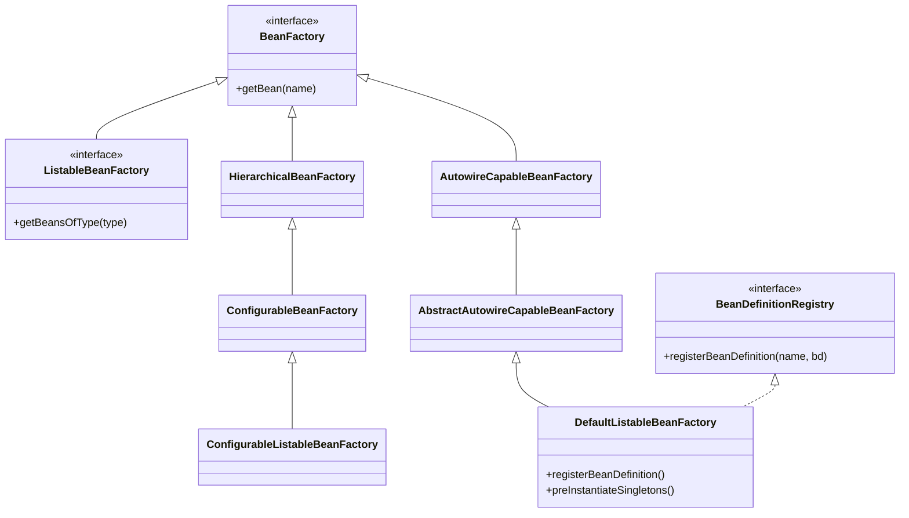

# DefaultListableBeanFactory：Spring IoC容器的核心引擎

## 开头摘要

DefaultListableBeanFactory 是 Spring 框架中 **IoC（控制反转）容器的最核心实现**，它负责管理应用中所有 Bean 的注册、依赖注入和生命周期。几乎所有 Spring 应用（包括 ApplicationContext）最终都依赖于这个类来管理 Bean 。本文将深入剖析其设计原理、使用方法和实际应用场景，适合有一定 Spring 基础、希望深入理解 IoC 底层机制的开发者。

## 目录

- #defaultlistablebeanfactory-是什么
- #核心架构与设计动机
- #核心功能详解
- #编程式使用示例
- #与-applicationcontext-的对比
- #典型应用场景
- #注意事项与常见陷阱
- #总结
- #延伸阅读
- #一句话记忆

## DefaultListableBeanFactory 是什么？

DefaultListableBeanFactory 是 Spring IoC 容器的**默认且最完整的底层实现**。它同时实现了 `ListableBeanFactory`（支持枚举所有 Bean）和 `BeanDefinitionRegistry`（支持动态注册 Bean 定义）等接口，是一个成熟的 Bean 工厂 。

Spring 容器的实现从根源上是通过 BeanFactory 实现的，但真正可以作为一个独立使用的容器还是 DefaultListableBeanFactory 。最典型的应用是：在访问 Bean 前，先注册所有的 definition（可能从 Bean 定义配置文件中），使用预先建立的 Bean 定义元数据对象，从本地的 Bean 定义表中查询 Bean 定义，这样不会花费太多成本 。

## 核心架构与设计动机

### 类继承关系

要理解 DefaultListableBeanFactory，首先需要了解其层次结构。下图展示了其核心继承关系：



这种设计遵循**接口隔离原则**，将不同维度的功能拆解到特定接口，再通过 DefaultListableBeanFactory 整合，确保灵活性和可扩展性 。

### 关键接口的角色

- **BeanDefinitionRegistry**：允许动态注册、修改或删除 Bean 的定义（`BeanDefinition`），这是只有 DefaultListableBeanFactory 实现的接口 
- **ListableBeanFactory**：提供批量操作 Bean 的能力（如按类型获取所有 Bean）
- **AutowireCapableBeanFactory**：支持自动装配（如 `@Autowired`）和依赖解析 

DefaultListableBeanFactory 功能的实现是通过实现特定功能的接口来完成：AbstractAutowireCapableBeanFactory 实现属性的自动绑定功能；ConfigurableListableBeanFactory 提供对 Bean 定义的分析和修改的便利方法；ListableBeanFactory 提供枚举所有的 Bean 实例的能力；BeanDefinitionRegistry 提供 BeanDefinition 的管理 。

## 核心功能详解

### 1. Bean 注册与管理

DefaultListableBeanFactory 的核心是作为 **Bean 注册中心**，维护 Bean 名称到 BeanDefinition 的映射，支持别名管理，并存储 Bean 的元数据（作用域、依赖、属性等）。

**注册 Bean 定义**：通过 `BeanDefinition` 描述 Bean 的元数据（类名、作用域、属性等），并注册到容器中。

```java
// 创建工厂实例
DefaultListableBeanFactory beanFactory = new DefaultListableBeanFactory();

// 创建 BeanDefinition
GenericBeanDefinition definition = new GenericBeanDefinition();
definition.setBeanClass(UserService.class);
definition.setScope(BeanDefinition.SCOPE_SINGLETON);

// 设置属性（相当于 <property name="userDao" ref="userDao"/>）
MutablePropertyValues props = new MutablePropertyValues();
props.addPropertyValue("userDao", new RuntimeBeanReference("userDao"));
definition.setPropertyValues(props);

// 注册 BeanDefinition
beanFactory.registerBeanDefinition("userService", definition);
```

**单例缓存**：单例 Bean 的实例存储在 `DefaultSingletonBeanRegistry` 的 `singletonObjects`（ConcurrentHashMap）中，保证线程安全 。

### 2. 依赖注入（DI）与循环依赖处理

DefaultListableBeanFactory 作为**依赖注入引擎**，能解析构造函数参数，通过 setter/字段注入依赖，并处理循环依赖（三级缓存机制）。

**依赖注入**：通过 `resolveDependency()` 方法解析依赖，支持按类型（byType）、按名称（byName）或构造函数注入。

**三级缓存解决循环依赖**：
1. 一级缓存 `singletonObjects`：存储完整的单例 Bean
2. 二级缓存 `earlySingletonObjects`：存储提前暴露的原始对象（未填充属性）
3. 三级缓存 `singletonFactories`：存储 Bean 的工厂对象，用于生成早期引用

当 A 依赖 B、B 又依赖 A 时，Spring 通过提前暴露 A 的早期引用（三级缓存）打破循环 。

### 3. 生命周期管理

DefaultListableBeanFactory 负责完整的 Bean **生命周期管理**：
- **实例化**：调用构造函数或工厂方法创建 Bean
- **初始化**：执行 `@PostConstruct`、`InitializingBean` 的回调
- **销毁**：容器关闭时调用 `@PreDestroy` 或 `DisposableBean` 的方法 

## 编程式使用示例

### 1. 手动创建容器并注册 Bean

```java
DefaultListableBeanFactory factory = new DefaultListableBeanFactory();

// 使用 BeanDefinitionBuilder 快速构建 BeanDefinition
BeanDefinition definition = BeanDefinitionBuilder
    .genericBeanDefinition(UserService.class)
    .addPropertyReference("userDao", "userDao")  // 注入依赖
    .setInitMethodName("init")
    .getBeanDefinition();

factory.registerBeanDefinition("userService", definition);
factory.preInstantiateSingletons(); // 触发单例初始化
```

### 2. 集成注解配置

需手动注册后置处理器以支持 `@Autowired` 等注解：

```java
// 添加注解处理器
factory.addBeanPostProcessor(new AutowiredAnnotationBeanPostProcessor());
factory.addBeanPostProcessor(new CommonAnnotationBeanPostProcessor());
```

如果不手动添加这些处理器，注解不会生效，这是与 ApplicationContext 的一个重要区别 。

### 3. 从 XML 或注解配置加载

```java
// 从 XML 加载
XmlBeanDefinitionReader reader = new XmlBeanDefinitionReader(factory);
reader.loadBeanDefinitions("classpath:beans.xml");

// 从配置类加载（需 spring-context 依赖）
AnnotatedBeanDefinitionReader annotatedReader = new AnnotatedBeanDefinitionReader(factory);
annotatedReader.register(AppConfig.class);
```

## 与 ApplicationContext 的对比

| 特性 | DefaultListableBeanFactory | ApplicationContext |
|------|------------------------------|-------------------|
| **事件发布** | ❌ 不支持 | ✅ 支持 ApplicationEvent |
| **资源访问** | ❌ 基础支持 | ✅ 统一 Resource 接口 |
| **AOP 集成** | ❌ 需手动添加处理器 | ✅ 自动集成 |
| **注解支持** | ❌ 需手动注册处理器 | ✅ 自动支持 |
| **国际化** | ❌ 不支持 | ✅ 支持 MessageSource |
| **启动速度** | ⚡ 更快（功能少） | ⚡ 稍慢（功能多） |
| **内存占用** | 📊 更小 | 📊 更大 |
| **易用性** | 🛠️ 需手动配置 | 🎯 开箱即用  |

**核心建议**：除非有特殊需求（如性能优化、动态注册、框架集成），否则优先使用 ApplicationContext 。

## 典型应用场景

### 1. 测试场景（精确控制）

```java
public class MyServiceTest {
    private DefaultListableBeanFactory factory;
    
    @Before
    public void setup() {
        factory = new DefaultListableBeanFactory();
        // 仅注册需要的 Bean，避免加载整个上下文
        factory.registerBeanDefinition("myService", 
            BeanDefinitionBuilder.genericBeanDefinition(MyService.class)
                .addPropertyReference("dao", "mockDao")
                .getBeanDefinition());
        
        // 注册 Mock 对象
        factory.registerSingleton("mockDao", Mockito.mock(MyDao.class));
    }
}
```

单元测试中，使用 DefaultListableBeanFactory 可以精确控制要注册的 Bean，避免加载整个 Spring 上下文，提高测试性能 。

### 2. 动态插件系统

可以根据运行时条件动态注册或移除 Bean：

```java
// 根据运行时条件动态注册 Bean
if (featureEnabled) {
    beanFactory.registerBeanDefinition("featureService",
        BeanDefinitionBuilder.genericBeanDefinition(FeatureService.class).getBeanDefinition());
}
```

这种动态注册能力使得 DefaultListableBeanFactory 非常适合需要动态加载插件或模块的系统 。

### 3. 框架集成

在自定义框架中嵌入 Spring IoC 功能：

```java
public class MyFramework {
    private final DefaultListableBeanFactory beanFactory;
    
    public MyFramework() {
        this.beanFactory = new DefaultListableBeanFactory();
        // 自动扫描框架内部的 Bean
        new ClassPathBeanDefinitionScanner(beanFactory)
            .scan("com.myframework.internal");
    }
}
```

许多集成框架（如 MyBatis-Spring）在内部使用 DefaultListableBeanFactory 来嵌入 Spring 的 IoC 功能 。

### 4. 性能优化（延迟加载）

当只需要核心功能时，使用 DefaultListableBeanFactory 可以避免 ApplicationContext 的额外开销：

```java
// 只加载必要的 Bean，避免 ApplicationContext 的额外开销
DefaultListableBeanFactory factory = new DefaultListableBeanFactory();
XmlBeanDefinitionReader reader = new XmlBeanDefinitionReader(factory);
reader.loadBeanDefinitions("core-beans.xml");

// 按需加载其他模块
if (needModuleA) {
    reader.loadBeanDefinitions("module-a-beans.xml");
}
```

## 注意事项与常见陷阱

### 1. 生命周期需手动触发

与 ApplicationContext 不同，DefaultListableBeanFactory 需要手动触发生命周期方法：

```java
DefaultListableBeanFactory factory = new DefaultListableBeanFactory();

// 错误：忘记调用 preInstantiateSingletons()
factory.registerBeanDefinition(...);
// 此时单例 Bean 还未初始化！

// 正确：手动触发初始化
factory.preInstantiateSingletons();

// 应用结束时需要调用销毁方法
factory.destroySingletons(); // 销毁所有单例
```

忘记调用 `preInstantiateSingletons()` 会导致单例 Bean 没有初始化，而忘记调用 `destroySingletons()` 可能导致资源泄漏 。

### 2. 注解支持需手动配置

ApplicationContext 会自动检测并注册后置处理器，但 DefaultListableBeanFactory 不会，必须手动添加常用处理器：

```java
// 必须手动添加常用处理器
factory.addBeanPostProcessor(new AutowiredAnnotationBeanPostProcessor()); // 处理 @Autowired
factory.addBeanPostProcessor(new CommonAnnotationBeanPostProcessor());    // 处理 @Resource @PostConstruct
```

否则注解如 `@Autowired` 等不会生效 。

### 3. 配置元数据丢失问题

直接注册单例实例会丢失配置信息：

```java
UserService service = new UserService();
factory.registerSingleton("userService", service);
// ✅ 速度快
// ❌ 无法应用 BeanPostProcessor
// ❌ 无法处理依赖注入
// ❌ 无法调用生命周期方法

// 推荐：通过 BeanDefinition 注册
BeanDefinition definition = BeanDefinitionBuilder
    .genericBeanDefinition(UserService.class)
    .getBeanDefinition();
factory.registerBeanDefinition("userService", definition);
// ✅ 完整生命周期支持
```

### 4. 线程安全考虑

- Bean 注册阶段：非线程安全，应在单线程中完成所有注册
- Bean 获取阶段：线程安全，支持并发访问 

推荐在应用启动时完成所有注册操作，之后将 BeanFactory 作为只读对象使用。

## 总结

- **DefaultListableBeanFactory 是 Spring IoC 的底层基石**，提供了完整的 Bean 管理能力，是整个 Spring IoC 的始祖 。
- 其设计通过**接口分层**实现关注点分离，支持灵活扩展 。
- 支持完整的 Bean **生命周期管理**、**依赖注入**和**循环依赖解决**机制 。
- 适用于**精细化控制、测试或嵌入式场景**，但多数业务开发更推荐使用 ApplicationContext 。
- 使用时需注意**手动触发生命周期**、**显式配置注解支持**和**线程安全**等问题 。

## 延伸阅读

1. **Spring 官方文档**：https://docs.spring.io/spring-framework/docs/current/reference/html/core.html#beans-beanfactory
2. **源码位置**：`org.springframework.beans.factory.support.DefaultListableBeanFactory`
3. **相关设计模式**：工厂模式、模板方法模式、单例模式
4. **进阶学习**：Spring 容器启动流程、Bean 生命周期完整过程、循环依赖解决原理

## 一句话记忆

DefaultListableBeanFactory 是 Spring 容器的"发动机"，负责 Bean 的注册、装配与生命周期管理，但日常开发中通常被更高级的 ApplicationContext 所封装 。