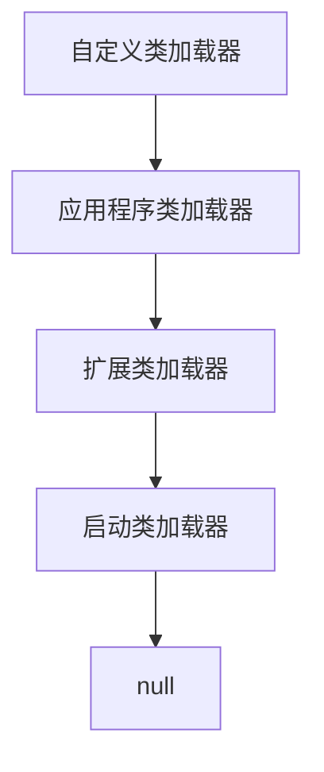
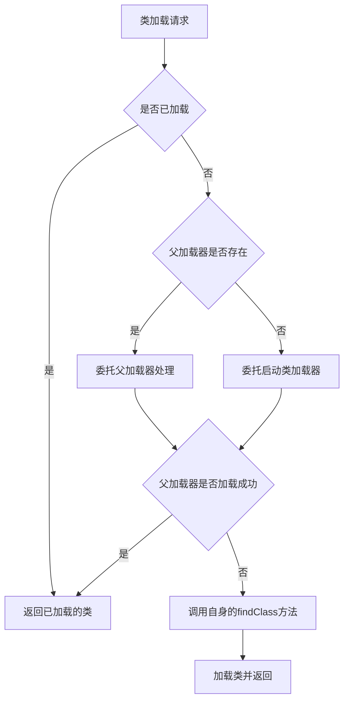

# JVM类加载器与热加载技术深度剖析：从原理到实践

## 开头摘要

本文深入剖析JVM类加载器机制与类唯一限定名的作用，解释为何默认类加载器无法实现热加载，并提供自定义类加载器实现热加载的完整方案。适合需要理解JVM底层机制、实现动态更新功能的Java中级和高级开发者，内容涵盖从基础概念到框架集成的全链路知识。

## 目录

- #类加载器基础概念
- #类唯一限定名与命名空间
- #双亲委派机制深度解析
- #自定义类加载器实现
- #热加载原理与实现
- #实战案例spring框架中的热部署
- #总结
- #延伸阅读
- #一句话记忆

## 类加载器基础概念

### 概念解释

类加载器是JVM的组成部分，负责将Class文件加载到JVM内存中，这一过程分为**加载**、**链接**和**初始化**三个阶段。加载阶段通过类的全限定名获取二进制字节流，将字节流转化为方法区的运行时数据结构，并在堆中生成对应的Class对象。链接阶段包括验证、准备和解析过程，确保类信息的正确性和可用性。初始化阶段则是执行类构造器`<clinit>`方法，对静态变量和静态代码块进行初始化。

Java中的类加载分为**隐式加载**和**显示加载**两种方式。隐式加载是程序在运行过程中当碰到通过new等方式生成对象时，隐式调用类装载器加载对应的类到JVM中。显示加载则是通过Class.forName()、getClassLoader().loadClass()等方法显式加载需要的类。这种动态加载机制使得JVM无需一次性加载所有类，而是按需加载，节省了内存开销。

### JVM三类内置加载器

JVM提供了三层类加载器，形成了严格的层次结构：

1. **启动类加载器（Bootstrap ClassLoader）**：由C/C++实现，是JVM的一部分，负责加载Java核心类库（位于`%JRE_HOME%/lib`目录下的rt.jar、resources.jar等）。由于是底层实现，在Java代码中无法直接引用，获取其引用时返回null。

2. **扩展类加载器（Extension ClassLoader）**：由Java实现，继承自URLClassLoader，负责加载`%JRE_HOME%/lib/ext`目录下的扩展类库。其父加载器是Bootstrap ClassLoader。

3. **应用程序类加载器（Application Classloader）**：也称为系统类加载器，负责加载用户类路径（classpath）上的类库。它是Java程序中默认的类加载器，通过`ClassLoader.getSystemClassLoader()`方法可以获取到它。



### 示例代码：查看类加载器层次

```java
public class ClassLoaderHierarchy {
    public static void main(String[] args) {
        // 获取当前类的类加载器（通常是AppClassLoader）
        ClassLoader appClassLoader = ClassLoaderHierarchy.class.getClassLoader();
        System.out.println("应用程序类加载器: " + appClassLoader);
        
        // 获取父加载器（ExtClassLoader）
        ClassLoader extClassLoader = appClassLoader.getParent();
        System.out.println("扩展类加载器: " + extClassLoader);
        
        // 获取启动类加载器（显示为null，因为由C++实现）
        ClassLoader bootstrapClassLoader = extClassLoader.getParent();
        System.out.println("启动类加载器: " + bootstrapClassLoader);
        
        // 查看核心类库的加载器
        System.out.println("String类的加载器: " + String.class.getClassLoader());
        System.out.println("DESKeyFactory类的加载器: " + 
            javax.crypto.DESKeyFactory.class.getClassLoader());
    }
}
```

### 问题分析

**常见误解**：许多开发者误认为类加载器之间存在继承关系，实际上它们之间是**组合关系**而非继承关系。每个类加载器实例内部包含一个对父加载器的引用，而非通过继承获取父类的功能。另一个常见误区是认为"双亲委派"意味着类加载器有"两个父母"，实际上"双亲"是指父加载器的单数形式，是一种误译。

**边界情况**：当同一个类被不同的类加载器加载时，JVM会将其视为不同的类型，即使在磁盘上是同一个Class文件。这种机制虽然保证了类的隔离性，但也可能导致类型转换异常或资源重复加载的问题。

## 类唯一限定名与命名空间

### 概念解释

在Java中，类的**完全限定名**（Fully Qualified Name）是指包括包名和类名的完整标识符，用于在整个项目中唯一标识一个类。例如，`java.lang.String`就是一个完全限定名，其中`java.lang`是包名，`String`是类名。这种命名机制是Java解决类命名冲突的核心策略，尤其在大型项目和团队协作中至关重要。

类名本身需要遵循Java的命名规范：必须以大写字母开头，采用驼峰命名法，只能包含字母、数字、下划线和美元符号，不能使用Java保留字。虽然从技术上讲，可以使用像"New"这样的类名（因为不是Java关键字），但按照约定，类名应该使用名词，并反映类的目的和功能。

### 类加载器与命名空间

每个类加载器实例都拥有一个独立的**类命名空间**，JVM中使用**类全限定名 + 类加载器实例**共同确定一个类的唯一性。这意味着即使相同的类文件，被不同的类加载器加载后，在JVM中也会被视为不同的类型。这种机制是实现类隔离和热加载的基础。

```java
// 示例：相同的类被不同类加载器加载后，被视为不同类型
ClassLoader customLoader1 = new CustomClassLoader();
ClassLoader customLoader2 = new CustomClassLoader();

Class<?> class1 = customLoader1.loadClass("com.example.Test");
Class<?> class2 = customLoader2.loadClass("com.example.Test");

System.out.println("是否为同一类型: " + (class1 == class2)); // 输出 false
```

### 应用场景

在大型企业应用和微服务架构中，完全限定名的正确使用可以减少约70%的命名冲突几率。特别是在模块化系统和容器环境中，不同的模块可能需要加载同一类的不同版本，这时类加载器的命名空间机制就显得尤为重要。

## 双亲委派机制深度解析

### 工作原理

**双亲委派模型**是JVM类加载的核心机制。当一个类加载器收到类加载请求时，它首先不会自己尝试加载，而是将请求委派给父类加载器处理，如此递归，直到传送到顶层的启动类加载器。只有当所有父加载器都无法完成加载请求时（在各自的搜索范围内没找到所需类），子加载器才会尝试自己加载。

这种机制通过ClassLoader类的loadClass()方法实现，其核心逻辑如下：

1. 检查类是否已被加载，避免重复加载
2. 如果父加载器存在，委托父加载器加载
3. 如果父加载器为null，委托启动类加载器加载
4. 如果父加载器都加载失败，调用自己的findClass()方法加载



### 源码分析

```java
protected Class<?> loadClass(String name, boolean resolve)
        throws ClassNotFoundException {
    synchronized (getClassLoadingLock(name)) {
        // 首先，检查是否已经加载过
        Class<?> c = findLoadedClass(name);
        if (c == null) {
            long t0 = System.nanoTime();
            try {
                if (parent != null) {
                    // 父加载器不为空，委托父加载器加载
                    c = parent.loadClass(name, false);
                } else {
                    // 父加载器为空，委托启动类加载器加载
                    c = findBootstrapClassOrNull(name);
                }
            } catch (ClassNotFoundException e) {
                // 父加载器无法加载，抛出异常
            }
            
            if (c == null) {
                // 父加载器未能加载，调用自身的findClass方法
                long t1 = System.nanoTime();
                c = findClass(name);
                // 记录统计信息
            }
        }
        if (resolve) {
            resolveClass(c);
        }
        return c;
    }
}
```

### 设计意义与三次破坏

双亲委派机制的主要优势包括：

1. **安全性**：防止核心API被篡改，确保Java程序安全。例如，自定义的java.lang.String类不会被加载，因为启动类加载器会优先加载核心库中的String类。
2. **一致性**：避免类的重复加载，保证类的唯一性。
3. **灵活性**：为自定义类加载器提供了扩展空间。

然而，在Java发展过程中，双亲委派机制经历了三次主要破坏：

1. **JDBC SPI机制**：通过线程上下文类加载器打破双亲委派，使核心库能加载实现类。
2. **OSGi模块化系统**：实现网络状的类加载器架构，支持模块化热部署。
3. **热部署需求**：在应用服务器中实现类的动态更新。

### 问题分析

**常见误区**：开发者常常认为双亲委派模型是强制性的，实际上它只是ClassLoader的一种实现模式，开发者可以重写loadClass()方法来改变此行为。但这样做需要谨慎，因为可能破坏Java的安全模型。

**性能考量**：双亲委派机制通过缓存已加载的类来提高性能。JVM会缓存已加载的类，当程序需要使用某个类时，类加载器先从缓存区中搜寻，只有当缓存中不存在时，才会读取类的二进制数据。

## 自定义类加载器实现

### 实现步骤

创建自定义类加载器需要遵循以下步骤：

1. 继承java.lang.ClassLoader类
2. 重写findClass()方法，实现自定义类加载逻辑
3. 在findClass()中调用defineClass()方法将字节数组转换为Class对象

这种设计允许开发者专注于类的获取逻辑，而不必重写整个加载流程。findClass()方法是在loadClass()方法中被调用的，当父加载器无法加载类时，会自动调用子类的findClass()方法。

### 完整示例代码

以下是一个从文件系统加载类的自定义类加载器实现：

```java
import java.io.*;

public class FileSystemClassLoader extends ClassLoader {
    private String classPath;
    
    public FileSystemClassLoader(String classPath) {
        // 指定父加载器为系统类加载器
        super(ClassLoader.getSystemClassLoader());
        this.classPath = classPath;
    }
    
    @Override
    protected Class<?> findClass(String name) throws ClassNotFoundException {
        try {
            byte[] classData = loadClassData(name);
            if (classData == null) {
                throw new ClassNotFoundException();
            }
            // 将字节数组转换为Class对象
            return defineClass(name, classData, 0, classData.length);
        } catch (IOException e) {
            throw new ClassNotFoundException("类加载失败: " + name, e);
        }
    }
    
    private byte[] loadClassData(String className) throws IOException {
        // 将类名转换为文件路径
        String path = classNameToPath(className);
        try (InputStream ins = new FileInputStream(path);
             ByteArrayOutputStream baos = new ByteArrayOutputStream()) {
            
            byte[] buffer = new byte[4096];
            int bytesRead;
            while ((bytesRead = ins.read(buffer)) != -1) {
                baos.write(buffer, 0, bytesRead);
            }
            return baos.toByteArray();
        }
    }
    
    private String classNameToPath(String className) {
        // 将包名中的点替换为文件分隔符，并添加.class扩展名
        return classPath + File.separatorChar + 
               className.replace('.', File.separatorChar) + ".class";
    }
}
```

### 使用自定义类加载器

```java
public class CustomClassLoaderDemo {
    public static void main(String[] args) throws Exception {
        // 创建自定义类加载器，指定类路径为D:/lib
        FileSystemClassLoader classLoader = new FileSystemClassLoader("D:/lib");
        
        // 使用自定义类加载器加载类
        Class<?> clazz = classLoader.loadClass("com.example.Test");
        
        // 创建实例并调用方法
        Object instance = clazz.newInstance();
        Method method = clazz.getMethod("sayHello");
        method.invoke(instance);
        
        // 查看类加载器信息
        System.out.println("Test类的加载器: " + clazz.getClassLoader());
        System.out.println("父加载器: " + clazz.getClassLoader().getParent());
    }
}
```

### 应用场景

自定义类加载器在以下场景中发挥重要作用：

1. **代码加密**：对类文件进行加密，运行时通过自定义类加载器解密
2. **模块化加载**：从非标准位置（数据库、网络）动态加载模块
3. **版本隔离**：在同一JVM中运行同一类的不同版本
4. **热部署**：在不重启JVM的情况下更新类定义

### 问题与解决方案

**内存泄漏风险**：类加载器会持有对它所加载的所有Class对象的引用，如果类加载器本身没有被正确释放，可能导致内存泄漏。解决方案是确保类加载器的生命周期与应用需求一致，及时解除引用。

**类加载冲突**：在多类加载器环境下，可能出现类转换异常或方法调用错误。应确保良好的类加载器层次结构设计，遵循双亲委派原则，或者在明确需要隔离时彻底打破委派模型。

## 热加载原理与实现

### 为什么默认类加载器不能热加载

JVM默认的类加载器（特别是AppClassLoader）遵循**双亲委派模型**且具有**缓存机制**，这是导致其无法实现热加载的根本原因。

1. **类缓存机制**：每个类加载器会缓存已经加载的类，在收到类加载请求时，首先检查缓存中是否已存在该类。如果存在，直接返回缓存的Class对象，不会重新加载。

2. **双亲委派优先**：即使我们试图重新加载某个类，类加载请求也会先委派给父加载器，而父加载器会返回已缓存的类定义。

3. **永久代/元空间限制**：在传统JVM架构中，类元数据存放在永久代（JDK7及之前）或元空间（JDK8+）中，已加载的类无法被卸载，除非对应的类加载器被垃圾回收。

```java
// 演示默认类加载器的缓存行为
ClassLoader systemLoader = ClassLoader.getSystemClassLoader();
Class<?> clazz1 = systemLoader.loadClass("com.example.Test");
Class<?> clazz2 = systemLoader.loadClass("com.example.Test");

System.out.println("两次加载是否为同一类: " + (clazz1 == clazz2)); 
// 输出 true，证明类被缓存了
```

### 热加载的实现原理

实现热加载的关键在于**打破双亲委派模型**和**避免类缓存**的影响。核心思路是每次需要热加载时，创建一个新的类加载器实例，通过这个新加载器加载修改后的类。

热加载的基本原理如下：

1. 监控类文件的变化（时间戳、MD5校验等）
2. 当检测到类文件发生变化时，创建新的类加载器实例
3. 使用新的类加载器加载修改后的类
4. 创建新类的实例，并逐步替换旧实例的引用

### 完整热加载实现

以下是一个简单的热加载器实现，监控指定目录下的类文件变化：

```java
public class HotSwapClassLoader extends ClassLoader {
    private String classPath;
    private Map<String, Long> classModifiedMap = new HashMap<>();
    
    public HotSwapClassLoader(String classPath) {
        super(null); // 指定父加载器为null，打破双亲委派
        this.classPath = classPath;
        monitorClassFiles();
    }
    
    @Override
    protected Class<?> loadClass(String name, boolean resolve) 
            throws ClassNotFoundException {
        // 对于需要热加载的类，打破双亲委派
        if (name.startsWith("com.hotswap")) {
            return findClass(name);
        }
        // 其他类仍遵循双亲委派
        return super.loadClass(name, resolve);
    }
    
    @Override
    protected Class<?> findClass(String name) throws ClassNotFoundException {
        try {
            byte[] classData = loadClassData(name);
            if (classData == null) {
                throw new ClassNotFoundException();
            }
            return defineClass(name, classData, 0, classData.length);
        } catch (IOException e) {
            throw new ClassNotFoundException("热加载失败: " + name, e);
        }
    }
    
    private byte[] loadClassData(String className) throws IOException {
        String path = classNameToPath(className);
        File file = new File(path);
        
        if (!file.exists()) {
            return null;
        }
        
        // 检查文件是否被修改
        long lastModified = file.lastModified();
        Long lastLoaded = classModifiedMap.get(className);
        
        if (lastLoaded != null && lastLoaded == lastModified) {
            // 文件未修改，可以返回null触发重新加载，或者维护已加载类的缓存
            // 这里为了简化，每次都会重新加载
        }
        
        try (InputStream ins = new FileInputStream(file);
             ByteArrayOutputStream baos = new ByteArrayOutputStream()) {
            
            byte[] buffer = new byte[4096];
            int bytesRead;
            while ((bytesRead = ins.read(buffer)) != -1) {
                baos.write(buffer, 0, bytesRead);
            }
            
            // 记录加载时间
            classModifiedMap.put(className, lastModified);
            return baos.toByteArray();
        }
    }
    
    private void monitorClassFiles() {
        // 启动监控线程，定期检查类文件变化
        Thread monitorThread = new Thread(() -> {
            while (true) {
                try {
                    Thread.sleep(2000); // 每2秒检查一次
                    checkForUpdates();
                } catch (InterruptedException e) {
                    Thread.currentThread().interrupt();
                    break;
                }
            }
        });
        monitorThread.setDaemon(true);
        monitorThread.start();
    }
    
    private void checkForUpdates() {
        // 检查类文件是否被修改，如果修改则触发重加载
        for (String className : classModifiedMap.keySet()) {
            String path = classNameToPath(className);
            File file = new File(path);
            if (file.exists()) {
                long lastModified = file.lastModified();
                Long lastLoaded = classModifiedMap.get(className);
                if (lastLoaded != null && lastModified > lastLoaded) {
                    System.out.println("检测到类文件变化: " + className);
                    // 触发重加载逻辑
                    onClassReload(className);
                }
            }
        }
    }
    
    private void onClassReload(String className) {
        // 在实际应用中，这里需要通知应用程序进行适当的实例替换
        System.out.println("准备重新加载类: " + className);
        try {
            findClass(className); // 重新加载类
        } catch (ClassNotFoundException e) {
            System.err.println("重加载失败: " + e.getMessage());
        }
    }
    
    private String classNameToPath(String className) {
        return classPath + File.separatorChar + 
               className.replace('.', File.separatorChar) + ".class";
    }
}
```

### 热加载的挑战与解决方案

**状态保持问题**：热加载类后，旧实例的状态如何迁移到新实例是一个复杂问题。解决方案包括：

1. **序列化/反序列化**：将旧实例状态序列化，新实例反序列化恢复
2. **状态提取与注入**：提取关键状态数据，注入到新实例中
3. **渐进式更新**：创建新实例，逐步接管旧实例的功能

**资源清理问题**：旧类创建的线程、打开的连接等资源需要妥善处理。解决方案包括：

1. **资源代理模式**：通过代理管理资源，热加载时只替换业务逻辑
2. **优雅关闭**：通知旧实例进行资源清理，然后再创建新实例

```java
// 资源代理示例
public class ResourceManager {
    private volatile Service service;
    private Object serviceState;
    
    public void updateService(Service newService) {
        // 保存状态
        if (service != null) {
            serviceState = service.extractState();
            service.cleanup(); // 清理资源
        }
        
        // 恢复状态到新实例
        newService.restoreState(serviceState);
        service = newService;
    }
}
```

## 实战案例：Spring框架中的热部署

### Spring DevTools热部署原理

Spring Boot DevTools是热部署的经典实现，它通过自定义类加载器和运行时重启机制实现快速应用更新。其核心原理是将应用代码和第三方依赖分离到不同的类加载器中。

DevTools使用两个类加载器：
1. **Base ClassLoader**：加载不变化的第三方依赖库
2. **Restart ClassLoader**：加载应用代码，支持热替换

当检测到类文件变化时，DevTools会创建一个新的Restart ClassLoader，重新加载应用类，而基类加载器保持不变，大大提高了重启速度。

### 类加载器配置示例

```java
// 简化的Spring类加载器结构
public class SpringClassLoader extends URLClassLoader {
    private final ClassLoader parentLoader;
    
    public SpringClassLoader(URL[] urls, ClassLoader parent) {
        super(urls, null); // 指定父加载器为null，打破双亲委派
        this.parentLoader = parent;
    }
    
    @Override
    protected Class<?> loadClass(String name, boolean resolve) 
            throws ClassNotFoundException {
        // 1. 检查类是否已加载
        Class<?> clazz = findLoadedClass(name);
        if (clazz != null) {
            return clazz;
        }
        
        // 2. 排除特定包名不热加载（如第三方库）
        if (name.startsWith("org.springframework") || 
            name.startsWith("com.fasterxml")) {
            return parentLoader.loadClass(name);
        }
        
        // 3. 尝试自己加载应用类
        try {
            clazz = findClass(name);
            if (clazz != null) {
                return clazz;
            }
        } catch (ClassNotFoundException e) {
            // 忽略，委托给父加载器
        }
        
        // 4. 委托给父加载器
        return parentLoader.loadClass(name);
    }
}
```

### 热部署在微服务架构中的应用

在微服务架构中，热部署技术可以显著提高开发效率。通过将热部署与容器化技术结合，可以实现更高级别的动态更新能力：

1. **金丝雀发布**：热加载新版本到部分实例，逐步验证
2. **A/B测试**：同时运行多个版本，根据业务指标选择最优版本
3. **快速回滚**：检测到问题迅速热加载回旧版本

### 性能优化建议

热加载技术虽然强大，但需要谨慎使用以避免性能问题：

1. **类缓存策略**：合理设置类缓存大小和过期时间
2. **监控频率**：根据项目规模调整文件监控频率
3. **内存管理**：及时清理不再使用的类加载器，避免内存泄漏
4. **增量加载**：只重新加载真正发生变化的类

## 总结

1. **类加载器层次**：JVM通过启动类加载器、扩展类加载器和应用程序类加载器形成分层结构，每层负责不同范围的类加载任务。

2. **双亲委派机制**：通过先将加载请求委派给父加载器，确保核心类库的安全性和类的唯一性，是Java安全模型的基石。

3. **类唯一性**：JVM中类的唯一性由**全限定名 + 类加载器实例**共同决定，这为类隔离和热加载提供了理论基础。

4. **热加载实现**：通过打破双亲委派模型、创建新的类加载器实例，并妥善处理状态迁移和资源清理，可以实现类的热加载功能。

5. **应用场景**：热加载技术在开发调试、应用服务器、微服务架构中具有重要价值，能显著提高开发效率和系统可用性。

## 延伸阅读

1. **官方文档**
   - https://docs.oracle.com/javase/8/docs/api/java/lang/ClassLoader.html
   - https://docs.oracle.com/javase/specs/jvms/se8/html/jvms-5.html

2. **经典书籍**
   - 《深入理解Java虚拟机》- 周志明
   - 《Java虚拟机规范》
   - 《The Java Virtual Machine Specification》

3. **源码参考**
   - http://hg.openjdk.java.net/jdk8/jdk8/jdk/file/tip/src/share/classes/java/lang/ClassLoader.java
   - https://github.com/spring-projects/spring-boot/tree/main/spring-boot-project/spring-boot-devtools

## 一句话记忆

> JVM类唯一性由类全限定名和加载器实例共同确定，热加载通过创建新的类加载器打破双亲委派实现，但需妥善处理状态迁移和资源清理。