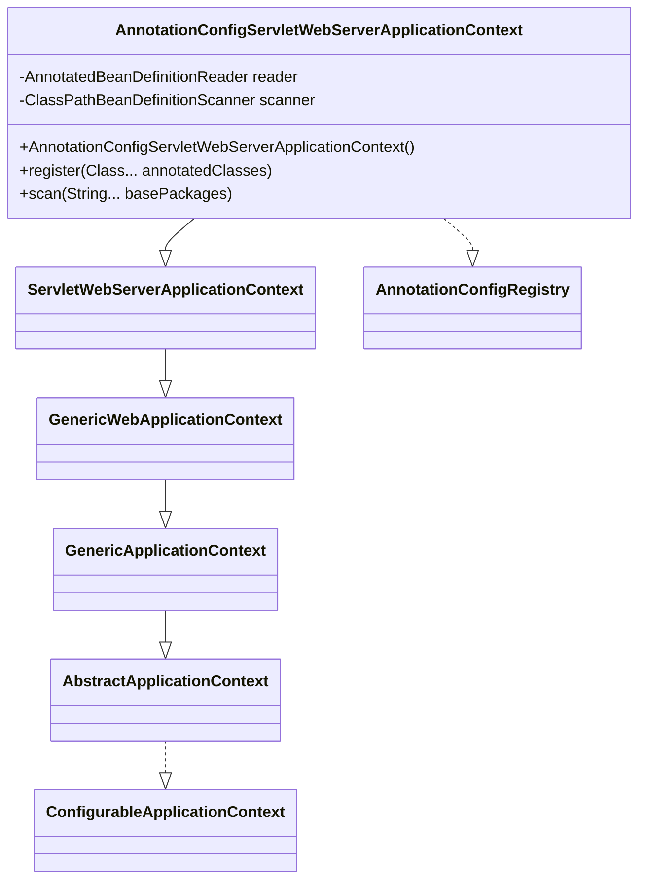
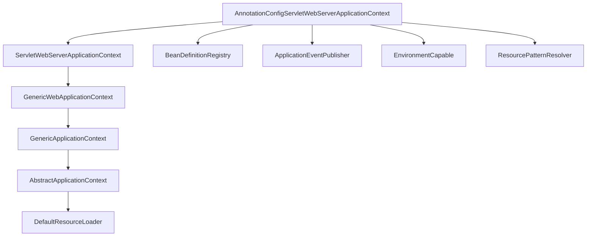
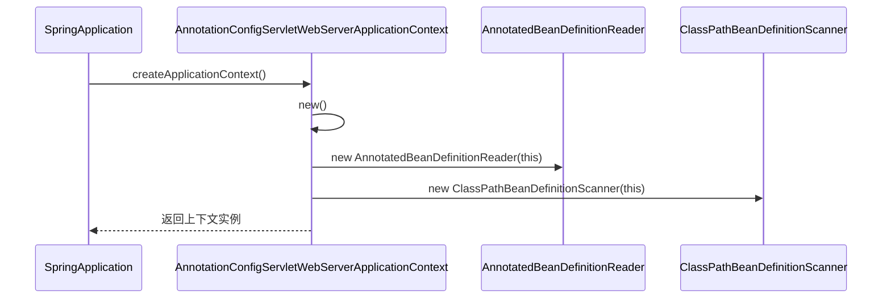
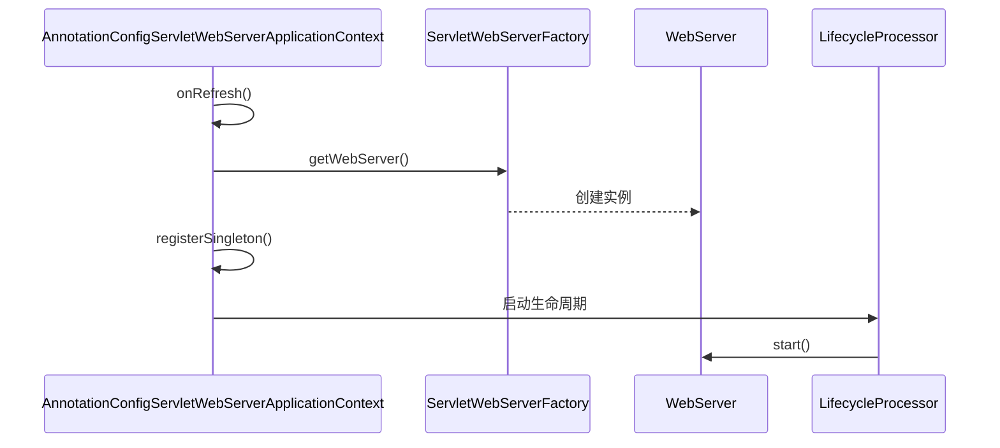

# AnnotationConfigServletWebServerApplicationContext：Spring Boot的注解驱动Web应用上下文详解

## 开头摘要
AnnotationConfigServletWebServerApplicationContext是Spring Boot中用于Servlet Web环境的默认应用上下文实现，它基于注解驱动配置取代传统XML方式，极大简化了企业级Web应用的开发流程。本文深入剖析其设计原理、核心机制和实战应用，适合正在从Spring Framework转向Spring Boot或希望深入理解Boot自动配置原理的中高级开发者。

## 目录
- #第一章概述与设计动机
- #第二章核心概念与继承体系
- #第三章初始化过程与关键组件
- #第四章bean定义注册与处理机制
- #第五章嵌入式web服务器集成
- #第六章跨配置方式对比
- #第七章实战案例与最佳实践
- #总结
- #延伸阅读
- #一句话记忆

## 第一章：概述与设计动机

### 概念解释
AnnotationConfigServletWebServerApplicationContext是Spring Boot专门为Servlet Web环境设计的注解驱动应用上下文，它继承自ServletWebServerApplicationContext并实现了AnnotationConfigRegistry接口。该上下文特别优化了对@Configuration注解类的处理，同时支持@Component、JSR-330标准注解等，成为Spring Boot自动化配置的核心基石。

从历史演进角度看，Spring Framework最初仅支持XML配置，直到3.x版本才引入注解驱动。Spring Boot在此基础上进一步强化了"约定大于配置"的理念，通过此上下文实现零XML配置的完整Web应用开发体验。

### 设计动机
Spring Boot选择注解驱动而非传统XML配置的主要考量在于：
- **开发效率**：注解配置直接在Java类中完成，类型安全且IDE支持良好
- **条件化装配**：支持@Conditional等条件注解，实现不同环境下的差异化配置
- **模块化设计**：通过@EnableXXX注解实现功能模块的按需加载
- **嵌入式容器**：无缝集成Tomcat、Jetty等嵌入式Web服务器，简化部署

### 示例代码：基础创建
```java
// 手动创建AnnotationConfigServletWebServerApplicationContext
AnnotationConfigServletWebServerApplicationContext context = 
    new AnnotationConfigServletWebServerApplicationContext();
context.register(WebConfig.class);
context.refresh();
```

### Mermaid类图


### 问题分析
**常见误解**：许多开发者认为Spring Boot完全摒弃了XML配置，实际上AnnotationConfigServletWebServerApplicationContext仍可与XML配置共存，只是注解方式成为默认首选。另一个误区是认为此上下文只能处理注解配置，实际上它通过父类体系仍支持多种资源加载方式。

### 应用场景
作为Spring Boot Web应用的默认上下文，它广泛应用于：
- Spring Boot Starter自动配置
- 嵌入式Web应用开发
- 微服务架构中的独立部署单元
- 测试环境中的Web应用上下文模拟

## 第二章：核心概念与继承体系

### 概念解释
AnnotationConfigServletWebServerApplicationContext的实现建立在Spring框架完整的应用上下文体系之上，通过多重继承整合了Bean工厂、资源加载、事件发布等核心功能。其类图深度集成了至少20个核心接口和抽象类，形成高度协同的架构。

关键接口包括：
- **BeanFactory**：IoC容器基础，提供Bean生命周期管理
- **ListableBeanFactory**：支持批量Bean枚举和按类型查找
- **HierarchicalBeanFactory**：支持父子容器层次结构
- **ApplicationEventPublisher**：应用事件发布机制
- **EnvironmentCapable**：环境配置信息访问
- **ResourcePatternResolver**：资源模式解析

### 为什么需要复杂继承体系
这种设计遵循了**接口隔离原则**和**单一职责原则**，每个接口专注特定领域功能，通过组合实现复杂业务能力。例如，BeanFactory专注Bean实例化，而EnvironmentCapable负责环境配置，彼此解耦又协同工作。

### 示例代码：多接口能力演示
```java
// 展示上下文的多接口能力
AnnotationConfigServletWebServerApplicationContext context = 
    (AnnotationConfigServletWebServerApplicationContext) SpringApplication.run(Application.class, args);

// BeanFactory能力
Object bean = context.getBean("sampleBean");

// EnvironmentCapable能力
Environment env = context.getEnvironment();
String port = env.getProperty("server.port");

// ApplicationEventPublisher能力
context.publishEvent(new CustomApplicationEvent(this));
```

### Mermaid接口关系图


### 问题分析
**深度继承陷阱**：过于复杂的继承体系可能导致方法调用链过长，调试困难。开发者需注意某些方法可能在多个父类中被重写，理解执行顺序至关重要。特别是refresh()方法在AbstractApplicationContext中定义模板，在子类中被扩展。

### 应用场景
复杂继承体系使得该上下文能够无缝融入Spring生态系统：
- 与Spring Security集成时通过HierarchicalBeanFactory支持安全过滤器链
- 与Spring Data集成时通过EnvironmentCapable读取数据源配置
- 与Spring Cloud集成时通过ApplicationEventPublisher发布服务发现事件

## 第三章：初始化过程与关键组件

### 概念解释
AnnotationConfigServletWebServerApplicationContext的初始化始于SpringApplication.run()方法，根据Web应用类型(SERVLET/REACTIVE)通过createApplicationContext()方法创建相应实例。创建过程采用**反射机制**调用无参构造函数，确保容器初始状态一致性。

构造函数内部分别初始化了两个核心组件：AnnotatedBeanDefinitionReader用于注解配置类注册，ClassPathBeanDefinitionScanner用于类路径扫描。这两个组件是注解驱动能力的直接实现者。

### 为什么采用延迟初始化
Spring Boot采用**懒加载策略**，在构造函数中仅初始化基础组件，真正的Bean定义注册和依赖注入等到refresh()阶段执行。这种设计优化了启动性能，避免加载未使用的Bean。

### 示例代码：初始化流程
```java
// SpringApplication中的创建逻辑
protected ConfigurableApplicationContext createApplicationContext() {
    Class<?> contextClass = this.applicationContextClass;
    if (contextClass == null) {
        try {
            switch (this.webApplicationType) {
                case SERVLET:
                    // 创建AnnotationConfigServletWebServerApplicationContext实例
                    contextClass = Class.forName(DEFAULT_SERVLET_WEB_CONTEXT_CLASS);
                    break;
                // 其他类型处理
            }
        } catch (ClassNotFoundException ex) {
            throw new IllegalStateException("Unable create default ApplicationContext", ex);
        }
    }
    return (ConfigurableApplicationContext) BeanUtils.instantiateClass(contextClass);
}

// 上下文的无参构造函数
public AnnotationConfigServletWebServerApplicationContext() {
    this.reader = new AnnotatedBeanDefinitionReader(this);
    this.scanner = new ClassPathBeanDefinitionScanner(this);
}
```

### Mermaid时序图


### 问题分析
**组件初始化顺序依赖**：AnnotatedBeanDefinitionReader的创建会触发注解配置处理器的注册，如果此时BeanFactory尚未完全初始化可能导致异常。实际执行中，GenericApplicationContext构造函数会先创建DefaultListableBeanFactory，确保后续操作有可用容器。

### 应用场景
初始化流程的精确控制使得该上下文能够适应不同部署环境：
- 开发环境：快速启动，支持热部署
- 测试环境：灵活配置，支持上下文重用
- 生产环境：稳定可靠，保证启动一致性

## 第四章：Bean定义注册与处理机制

### 概念解释
Bean定义注册是IoC容器的核心功能，AnnotationConfigServletWebServerApplicationContext通过组合**BeanDefinitionRegistry**和**BeanFactory**实现完整的Bean生命周期管理。其内部维护的DefaultListableBeanFactory包含beanDefinitionMap用于存储Bean定义，singletonObjects用于缓存单例实例。

注解处理的关键在于ConfigurationClassPostProcessor，这个BeanFactory后置处理器负责解析@Configuration注解类，处理@Bean方法、@ComponentScan等元数据，最终将Bean定义注册到容器中。

### 为什么需要后置处理器机制
后置处理器实现了**开放封闭原则**，允许在Bean实例化前对定义进行修改和扩展。ConfigurationClassPostProcessor通过优先级控制确保配置类先于普通Bean处理，解决依赖注入的顺序问题。

### 示例代码：Bean定义注册流程
```java
// AnnotatedBeanDefinitionReader中的注解处理器注册
public AnnotatedBeanDefinitionReader(BeanDefinitionRegistry registry, Environment environment) {
    Assert.notNull(registry, "BeanDefinitionRegistry must not be null");
    Assert.notNull(environment, "Environment must not be null");
    this.registry = registry;
    this.conditionEvaluator = new ConditionEvaluator(registry, environment, null);
    // 注册注解配置处理器
    AnnotationConfigUtils.registerAnnotationConfigProcessors(this.registry);
}

// 注解处理器注册详情
public static Set<BeanDefinitionHolder> registerAnnotationConfigProcessors(
        BeanDefinitionRegistry registry, @Nullable Object source) {
    
    // 注册ConfigurationClassPostProcessor
    if (!registry.containsBeanDefinition(CONFIGURATION_ANNOTATION_PROCESSOR_BEAN_NAME)) {
        RootBeanDefinition def = new RootBeanDefinition(ConfigurationClassPostProcessor.class);
        def.setSource(source);
        beanDefs.add(registerPostProcessor(registry, def, CONFIGURATION_ANNOTATION_PROCESSOR_BEAN_NAME));
    }
    
    // 注册其他处理器...
    return beanDefs;
}
```

### Mermaid流程图
```mermaid
flowchart TD
    A[开始] --> B[创建AnnotationConfigServletWebServerApplicationContext]
    B --> C[初始化AnnotatedBeanDefinitionReader]
    C --> D[注册注解配置处理器]
    D --> E[调用refresh方法]
    E --> F[invokeBeanFactoryPostProcessors]
    F --> G[ConfigurationClassPostProcessor执行]
    G --> H[解析@Configuration类]
    H --> I[注册@Bean方法定义]
    I --> J[完成Bean定义注册]
```

### 问题分析
**Bean定义覆盖机制**：当存在多个@Configuration类时，后加载的@Bean定义会覆盖先前的定义，这既是特性也是陷阱。开发者需要明确配置类加载顺序，避免意外的覆盖行为。

**条件注解处理时机**：@Conditional注解的评估发生在ConfigurationClassPostProcessor执行期间，此时部分环境变量可能尚未完全准备，导致条件判断不准确。

### 应用场景
Bean定义注册机制支撑了Spring Boot的核心特性：
- 自动配置：通过@ConditionalOnClass等条件注解实现智能配置加载
- Starter机制：每个Starter提供自己的@Configuration类
- 测试配置：通过@TestConfiguration覆盖生产配置

## 第五章：嵌入式Web服务器集成

### 概念解释
AnnotationConfigServletWebServerApplicationContext通过继承ServletWebServerApplicationContext获得嵌入式Web服务器管理能力。在onRefresh()生命周期阶段，它会自动检测classpath中的可用Web服务器实现(Tomcat/Jetty/Undertow)，通过ServletWebServerFactory创建并启动WebServer实例。

这种设计实现了**控制反转**，应用代码无需直接操作服务器生命周期，只需提供配置参数，上下文自动完成服务器初始化和启动。

### 为什么采用工厂模式
ServletWebServerFactory抽象了不同Web服务器的创建细节，使应用能够无缝切换服务器实现而不修改业务代码。同时，工厂模式支持**条件化装配**，根据classpath中存在的类决定使用哪种服务器。

### 示例代码：Web服务器创建流程
```java
// ServletWebServerApplicationContext中的服务器创建
private void createWebServer() {
    WebServer webServer = this.webServer;
    ServletContext servletContext = getServletContext();
    if (webServer == null && servletContext == null) {
        // 获取Web服务器工厂
        ServletWebServerFactory factory = getWebServerFactory();
        // 创建Web服务器实例
        this.webServer = factory.getWebServer(getSelfInitializer());
        
        // 注册生命周期管理Bean
        getBeanFactory().registerSingleton("webServerGracefulShutdown", 
            new WebServerGracefulShutdownLifecycle(this.webServer));
    }
}

// 配置嵌入式Tomcat的示例
@Configuration
public class WebConfig {
    @Bean
    public ServletWebServerFactory servletWebServerFactory() {
        TomcatServletWebServerFactory factory = new TomcatServletWebServerFactory();
        factory.setPort(8080);
        factory.setContextPath("/api");
        return factory;
    }
}
```

### Mermaid交互图


### 问题分析
**端口冲突处理**：如果默认端口被占用，嵌入式服务器启动将失败。开发时需要确保配置端口可用，或设置server.port=0自动选择可用端口。

**Servlet上下文初始化时机**：ServletContext在Web服务器启动后才会完全初始化，过早访问ServletContext相关API可能导致异常。

### 应用场景
嵌入式服务器集成简化了各种部署场景：
- 微服务架构：每个服务独立部署，内置Web容器
- 云原生应用：容器化部署，快速启动
- 开发测试：内嵌服务器，无需外部环境依赖

## 第六章：跨配置方式对比

### 概念解释
在Spring生态中，除了注解配置方式，还存在传统的XML配置和新兴的函数式配置。AnnotationConfigServletWebServerApplicationContext代表的注解驱动方式在当代Spring Boot开发中已成为主流，但理解不同配置方式的优劣有助于做出正确技术选型。

### 为什么注解配置成为主流
注解配置的胜利体现了**开发者体验**优先的设计哲学。相比XML的类型不安全、配置冗余，注解配置提供编译期检查、IDE智能提示等优势，显著提升开发效率。

### 示例代码：配置方式对比
```java
// 注解配置方式
@Configuration
@EnableWebMvc
public class AnnotationConfig {
    @Bean
    public DataSource dataSource() {
        return new EmbeddedDatabaseBuilder().setType(EmbeddedDatabaseType.H2).build();
    }
}

// XML配置方式（对比）
<!-- applicationContext.xml -->
<beans>
    <bean id="dataSource" class="org.springframework.jdbc.datasource.embedded.EmbeddedDatabaseBuilder">
        <property name="type" value="H2"/>
    </bean>
</beans>
```

### Mermaid对比图


### 问题分析
**配置方式混合使用陷阱**：在迁移过程中可能出现注解和XML配置混用情况，需要明确配置加载顺序和覆盖规则。通常注解配置优先级高于XML。

**条件注解的局限性**：注解配置虽然强大，但动态调整能力不如XML，特别是在需要运行时修改配置的场景。

### 应用场景
不同配置方式适用不同场景：
- 注解配置：新项目开发、微服务架构
- XML配置：遗留系统维护、需要动态配置的场景
- 函数式配置：响应式编程、Lambda表达式重度使用场景

## 第七章：实战案例与最佳实践

### 概念解释
通过完整实战案例展示AnnotationConfigServletWebServerApplicationContext在真实项目中的应用，包括配置、自定义扩展和异常处理。本案例基于Spring Boot 2.7+版本，演示如何利用上下文特性构建生产级Web应用。

### 为什么需要自定义扩展
虽然Spring Boot提供了大量自动化配置，但真实业务场景常需要**定制化扩展**。理解上下文生命周期和扩展点允许开发者在不修改框架源码的前提下实现业务特定需求。

### 示例代码：完整Web应用
```java
@SpringBootApplication
public class WebApplication {
    public static void main(String[] args) {
        SpringApplication.run(WebApplication.class, args);
    }
}

@Configuration
public class WebConfig {
    
    @Bean
    public ServletWebServerFactory servletWebServerFactory() {
        TomcatServletWebServerFactory factory = new TomcatServletWebServerFactory();
        factory.addConnectorCustomizers(connector -> {
            connector.setPort(8080);
            connector.setProperty("maxThreads", "200");
        });
        return factory;
    }
    
    @Bean
    public DispatcherServlet dispatcherServlet() {
        return new DispatcherServlet();
    }
    
    @Bean
    public DispatcherServletRegistrationBean dispatcherServletRegistration(
            DispatcherServlet dispatcherServlet) {
        return new DispatcherServletRegistrationBean(dispatcherServlet, "/api/*");
    }
    
    @RestController
    public static class SampleController {
        @GetMapping("/hello")
        public String hello() {
            return "Hello from AnnotationConfigServletWebServerApplicationContext!";
        }
    }
}
```

### Mermaid部署图
```mermaid
graph TB
    A[客户端] --> B[嵌入式Tomcat]
    B --> C[DispatcherServlet]
    C --> D[AnnotationConfigServletWebServerApplicationContext]
    D --> E[BeanFactory]
    D --> F[WebServer]
    D --> G[EventPublisher]
    
    E --> H[@Controller Beans]
    E --> I[@Service Beans]
    E --> J[@Repository Beans]
```

### 问题分析
**上下文刷新异常处理**：Web服务器启动失败或Bean初始化异常可能导致整个应用启动失败，需要完善的错误处理和日志记录。

**资源清理问题**：应用关闭时需要确保Web服务器正确停止，避免端口占用或资源泄漏。

### 应用场景
实战案例可应用于：
- RESTful API服务开发
- 前后端分离架构后端服务
- 微服务架构中的业务服务
- 云原生应用原型开发

## 总结

- **核心定位**：AnnotationConfigServletWebServerApplicationContext是Spring Boot Servlet Web应用的默认上下文，完美结合注解驱动配置和嵌入式Web服务器管理
- **架构设计**：通过复杂继承体系实现关注点分离，集成Bean管理、资源加载、事件发布等核心功能
- **初始化流程**：基于反射机制创建，通过AnnotatedBeanDefinitionReader和ClassPathBeanDefinitionScanner支持注解配置
- **Bean处理**：借助ConfigurationClassPostProcessor等后置处理器实现智能Bean定义注册和条件化装配
- **Web集成**：内置嵌入式Web服务器支持，简化部署和运维
- **配置演进**：注解配置取代XML成为主流，体现"约定大于配置"的Spring Boot哲学
- **实战价值**：为现代Java Web应用提供开箱即用的企业级容器环境

## 延伸阅读

- https://docs.spring.io/spring-framework/docs/current/reference/html/core.html - ApplicationContext详细规范
- https://docs.spring.io/spring-boot/docs/current/reference/htmlsingle/ - 嵌入式Web容器配置指南
- https://github.com/spring-projects/spring-framework - Spring Framework源码仓库
- 《Spring Boot编程思想》- 核心篇 - 国内权威Spring Boot解析资料

## 一句话记忆

**AnnotationConfigServletWebServerApplicationContext是Spring Boot将注解驱动配置与嵌入式Web服务器无缝整合的企业级容器实现，通过"约定大于配置"原则极大简化了现代Java Web应用开发。**