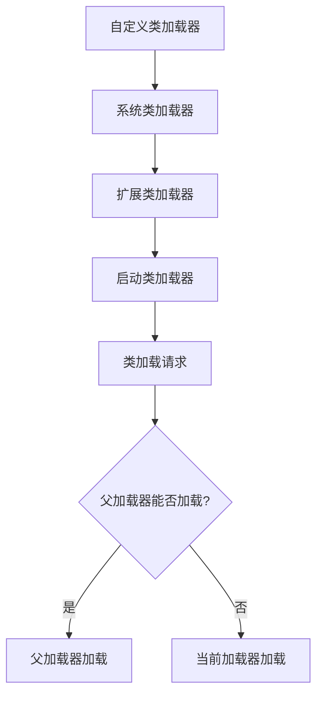

# 深入理解JVM运行机制：从启动到退出的完整生命周期

## 开头摘要

本文深入探讨Java虚拟机（JVM）的完整运行机制，涵盖JVM启动过程、生命周期管理、资源分配及监控原理。无论你是多年Java开发还是刚入门，都能通过本文全面理解JVM如何执行Java程序、何时退出以及如何管理多个程序。本文将解答关于JVM实例隔离性、进程间通信和监控工具实现原理等核心问题。

## 目录

1. #jvm概述与核心职责
2. #jvm启动过程详解
3. #jvm实例与java程序的关系
4. #jvm的退出机制
5. #jvm的程序管理机制
6. #jvm监控工具原理
7. #总结
8. #延伸阅读

## JVM概述与核心职责

Java虚拟机（JVM）是Java技术的核心，它是一个虚拟的计算机，具有独立的指令集和运行时数据区。JVM的主要职责是**加载Java代码**、**验证代码**、**执行代码**和**管理内存**。

当我们运行Java程序时，实际上是在启动一个JVM实例，这个实例负责将Java字节码转换为特定平台的机器指令并执行。JVM的这种"一次编写，到处运行"的能力，得益于它作为中间层抽象了底层操作系统的差异。

与普遍认知不同，JVM并不是一个持续运行的后台守护进程，而是**按需启动的独立进程**。每个Java应用程序都对应一个独立的JVM实例，这些实例之间相互隔离，不共享堆内存等关键资源。

## JVM启动过程详解

### 从java命令到JVM实例

当你在终端执行`java HelloWorld`命令时，操作系统会启动以下序列：

1. **环境准备**：JVM首先会校验传入的参数，包括类路径、JVM参数等。
2. **系统资源探测**：JVM检测可用的系统资源，如处理器数量、内存大小。
3. **创建JVM实例**：通过JNI方法`JNI_CreateJavaVM()`创建JVM实例。

### 类加载机制

类加载是JVM启动过程中的关键环节，采用**双亲委派模型**进行类加载：

```java
// 示例：类加载器层次结构
public class ClassLoaderDemo {
    public static void main(String[] args) {
        ClassLoader appClassLoader = ClassLoader.getSystemClassLoader();
        ClassLoader extClassLoader = appClassLoader.getParent();
        ClassLoader bootstrapClassLoader = extClassLoader.getParent(); // 通常为null
        
        System.out.println("应用类加载器: " + appClassLoader);
        System.out.println("扩展类加载器: " + extClassLoader);
        System.out.println("启动类加载器: " + bootstrapClassLoader);
    }
}
```



类加载过程分为三个步骤：**加载**（Loading）、**链接**（Linking）和**初始化**（Initialization）。

- **加载**：查找并加载类的二进制数据到方法区
- **链接**：包括验证、准备和解析阶段
- **初始化**：执行静态初始化代码和静态字段初始化

### 内存区域分配

JVM启动时会分配多种内存区域：

| 内存区域 | 作用 | 线程共享性 |
|---------|------|-----------|
| 程序计数器 | 存储线程下一条指令地址 | 线程私有 |
| Java虚拟机栈 | 存储方法调用帧和局部变量 | 线程私有 |
| 堆内存 | 存储对象实例 | 线程共享 |
| 方法区 | 存储类信息、常量、静态变量 | 线程共享 |
| 本地方法栈 | 支持native方法执行 | 线程私有 |

## JVM实例与Java程序的关系

### 单程序单JVM模型

**每个Java应用程序都对应一个独立的JVM实例**。当你同时运行两个Java程序时，操作系统会创建两个独立的JVM进程。这种设计提供了以下优势：

1. **资源隔离**：一个Java程序的崩溃不会影响其他Java程序
2. **独立配置**：每个JVM实例可以有独立的内存配置和垃圾回收策略
3. **安全边界**：避免了程序间的非法内存访问

### 资源分配机制

当多个JVM实例在同一台机器上运行时，每个JVM会独立分配堆内存，默认大小由JVM根据系统资源启发式决定。这意味着如果不显式设置堆大小，多个JVM实例可能会竞争系统内存资源。

```java
// 示例：显示设置JVM内存参数
// 启动时使用-Xms和-Xmx参数指定堆大小
// java -Xms512m -Xmx1024m HelloWorld

public class MemoryDemo {
    public static void main(String[] args) {
        // 获取JVM内存信息
        long maxMemory = Runtime.getRuntime().maxMemory();
        long totalMemory = Runtime.getRuntime().totalMemory();
        long freeMemory = Runtime.getRuntime().freeMemory();
        
        System.out.println("最大内存: " + (maxMemory / (1024 * 1024)) + "MB");
        System.out.println("总内存: " + (totalMemory / (1024 * 1024)) + "MB");
        System.out.println("空闲内存: " + (freeMemory / (1024 * 1024)) + "MB");
    }
}
```

## JVM的退出机制

### 正常关闭

JVM在以下情况下会正常关闭：

1. **所有非守护线程结束**：当程序中所有非守护线程执行完毕后，JVM会自动退出
2. **调用System.exit()**：程序显式调用退出方法
3. **平台特定信号**：如Ctrl+C中断信号

### 强制关闭

以下情况会导致JVM强制关闭：

1. **杀死JVM进程**：在操作系统中强制终止JVM进程
2. **Runtime.halt()**：调用halt方法立即终止JVM
3. **系统崩溃**：操作系统或硬件故障

### 关闭钩子（Shutdown Hook）

JVM允许注册关闭钩子，在JVM正常关闭时执行清理工作：

```java
public class ShutdownHookDemo {
    public static void main(String[] args) {
        Runtime.getRuntime().addShutdownHook(new Thread(() -> {
            System.out.println("执行清理工作...");
            // 关闭资源、删除临时文件等
        }));
        
        System.out.println("程序运行中...");
        // 模拟程序工作
        try {
            Thread.sleep(3000);
        } catch (InterruptedException e) {
            e.printStackTrace();
        }
        // JVM退出时会自动调用关闭钩子
    }
}
```

**注意**：关闭钩子应该线程安全且尽快执行，因为它们会延迟JVM的关闭时间。

### 守护线程与非守护线程

JVM的线程分为**守护线程**和**非守护线程**两种：

- **非守护线程**：JVM会等待所有非守护线程执行完毕才退出
- **守护线程**：JVM退出时不会等待守护线程，会直接终止它们

默认情况下，主线程创建的都是非守护线程，而JVM创建的某些线程（如垃圾回收器）是守护线程。

## JVM的程序管理机制

### 执行引擎工作原理

JVM执行引擎负责执行字节码，主要采用两种技术：

1. **解释执行**：逐条读取并执行字节码指令
2. **即时编译**：将热点代码编译成本地机器码直接执行

现代JVM（如HotSpot）使用**自适应优化**技术，结合了解释执行和即时编译的优点。

### 垃圾回收机制

JVM的垃圾回收器负责自动内存管理，主要针对堆内存进行回收：


垃圾回收分为多种类型：
- **Minor GC**：针对新生代的垃圾回收
- **Full GC**：针对整个堆内存的垃圾回收

### JVM进程间通信

由于每个JVM实例是独立的进程，它们之间不能直接共享内存。JVM进程间通信需要通过传统IPC机制实现：

1. **套接字通信**
2. **文件系统**
3. **远程方法调用**

```java
// 示例：使用Socket进行JVM进程间通信
// 服务器端
public class JVMServer {
    public static void main(String[] args) throws IOException {
        ServerSocket serverSocket = new ServerSocket(12345);
        System.out.println("JVM服务器端启动...");
        
        Socket clientSocket = serverSocket.accept();
        PrintWriter out = new PrintWriter(clientSocket.getOutputStream(), true);
        out.println("来自JVM进程的消息");
        
        clientSocket.close();
        serverSocket.close();
    }
}

// 客户端
public class JVMClient {
    public static void main(String[] args) throws IOException {
        Socket socket = new Socket("localhost", 12345);
        BufferedReader in = new BufferedReader(new InputStreamReader(socket.getInputStream()));
        
        String message = in.readLine();
        System.out.println("收到消息: " + message);
        
        socket.close();
    }
}
```

## JVM监控工具原理

### jps命令实现机制

`jps`命令用于查看当前系统中运行的JVM进程，其实现原理基于Java的**临时目录机制**。

当JVM启动时，它会在操作系统的临时目录中创建特定文件，这些文件包含了JVM进程的信息。jps命令通过扫描这些文件来获取正在运行的JVM实例列表。

### 其他监控工具

JVM提供了一系列监控和诊断工具：

| 工具 | 作用 |
|------|------|
| jstat | JVM统计信息监控 |
| jinfo | 查看和修改JVM参数 |
| jmap | 生成堆转储快照 |
| jstack | 生成线程转储快照 |
| jconsole | 图形化监控界面 |

这些工具大多通过JVM的**JMX接口**或**本地接口**获取运行时数据，使开发者能够监控JVM的性能和状态。

## 总结

通过本文的详细讲解，我们可以得出以下核心结论：

1. **JVM是进程级实例**：每个Java应用程序都对应一个独立的JVM进程，它们之间资源隔离
2. **JVM非守护进程**：JVM随Java程序启动而启动，随程序结束而退出，不是持续运行的后台守护进程
3. **启动过程复杂**：从执行java命令到main方法运行，JVM经历了参数校验、资源探测、类加载等多个阶段
4. **退出条件明确**：JVM在所有非守护线程结束、调用System.exit()或收到终止信号时退出
5. **监控基于特定机制**：jps等工具通过扫描JVM在临时目录创建的文件来识别运行中的JVM实例

理解JVM的运行机制对于Java开发者至关重要，它不仅有助于性能调优和故障诊断，还能帮助开发者编写更高效、稳定的Java应用程序。

## 延伸阅读

1. https://docs.oracle.com/javase/specs/jvms/se17/html/index.html
2. 《深入理解Java虚拟机》- 周志明
3. https://openjdk.java.net/
4. https://www.oreilly.com/library/view/java-performance-the/9781449363512/

## 一句话记忆

JVM是Java程序的独立运行沙箱，每个程序独享一个JVM实例，随程序启停而生死，通过复杂的内部分工实现"一次编写，到处运行"的承诺。